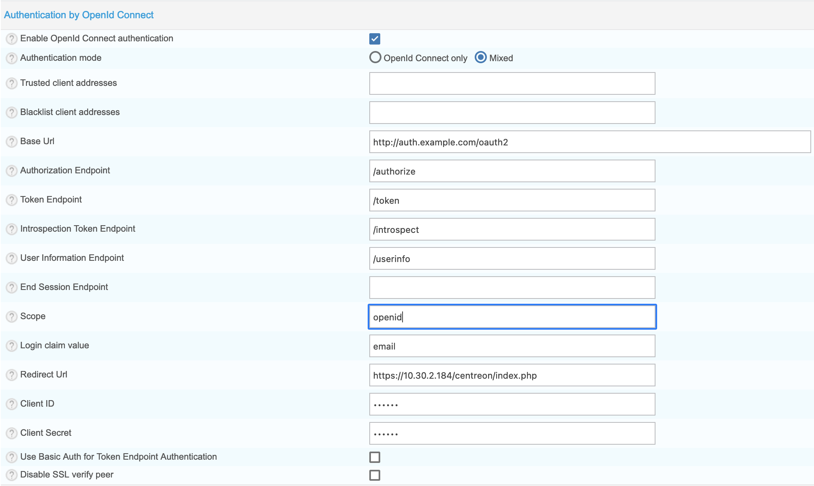

import Tabs from '@theme/Tabs';
import TabItem from '@theme/TabItem';


Centreon est compatible avec l'authentification OAuth 2.0 / OpenId Connect.

Il est possible d'utiliser un fournisseur d'identité (IdP) tel que Microsoft Azure AD, Okta, Keycloak, LemonLDAP::NG ou
tout autre IdP compatible avec le flux d'autorisation via un code (Authorization Code Grant).

## Configurer l'authentification OpenID Connect

### Activer l'authentification

L'authentification se paramètre à la page **Administration > Authentification > OpenId Connect Configuration**.

Activez d'abord l'authentification OpenID Connect:
- La case **Enable OpenId Connect authentication** permet d'activer ou de désactiver l'authentification OpenId Connect.
- Le champ **Authentication mode** indique si l'authentification doit avoir lieu uniquement par OpenId Connect ou en
  utilisant également l'authentification locale (mixte).

### Configurer les informations d'accès au fournisseur d'identité

Ensuite, configurez les informations du fournisseur d'identité:
- Le champ **Base Url** définit l'URL de base de l'IdP pour les points de terminaison OpenId Connect (obligatoire).
- Le champ **Authorization Endpoint** définit le point de terminaison d'autorisation, par exemple `/authorize` (obligatoire).
- Le champ **Token Endpoint** définit le point de terminaison du jeton, par exemple `/token` (obligatoire).
- Le champ **Introspection Token Endpoint** définit le point de terminaison du jeton d'introspection, par exemple `/introspect` (obligatoire).
- Le champ **User Information Endpoint** définit le point de terminaison des informations utilisateur, par exemple `/userinfo`.
- Le champ **End Session Endpoint** définit le point de terminaison de déconnexion, par exemple `/logout`.
- Le champ **Scope** définit la portée de l'IdP, par exemple «openid». Portée séparée par espace.
- Le champ **Login claim value** définit la variable qui est renvoyée par les points de terminaison **Introspection Token Endpoint**
  ou **User Information Endpoint** pour authentifier l'utilisateur. Par exemple `sub` ou `email`.
- **Client ID** défini l'ID client.
- **Client Secret** défini le secret client.
- La case **Use Basic Auth for Token Endpoint Authentication** oblige à utiliser la méthode `Authorization: Basic`.
- **Disable SSL verify peer** permet de désactiver la validation des pairs SSL, ne doit être utilisé que pour des tests



> Selon le fournisseur d'identité, il est nécessaire de saisir plusieurs portées (scope) afin de récupérer la valeur
> (claim) qui identifiera l'utilisateur. Ceci est indiqué dans la documentation de configuration du fournisseur.

> Il est possible de définir une URL complète pour les points de terminaison au cas où la base de l'URL est différente
> des autres.

> Vous pouvez activer **Authentification debug** via le menu `Administration > Parameters > Debug` pour comprendre les
> échecs d'authentification et améliorer votre configuration.

### Configurer les adresses des clients

Vous pouvez également configurer les adresses des clients:
- Le champ **Trusted client addresses** indique quelles sont les adresses IP des clients de confiance (correspond à
  l'adresse du reverse proxy). Chaque client de confiance est séparé par une virgule.
- Le champ **Blacklist client addresses** indique quelles sont les adresses IP des clients qui seront refusés.

### Exemples de configuration

<Tabs groupId="sync">
<TabItem value="Microsoft Azure AD" label="Microsoft Azure AD">

Voici un exemple de configuration pour Microsoft Azure Active Directory:

| Champs                       | Valeurs                                                   |
|------------------------------|-----------------------------------------------------------|
| Base Url                     | https://login.microsoftonline.com/${tenantId}/oauth2/v2.0 |
| Authorization Endpoint       | /authorize                                                |
| Token Endpoint               | /token                                                    |
| Introspection Token Endpoint | /introspect                                               |
| User Information Endpoint    | https://graph.microsoft.com/oidc/userinfo                 |
| End Session Endpoint         |                                                           |
| Scope                        | openid                                                    |
| Login claim value            | email                                                     |
| Client ID                    | ${clientId}                                               |
| Client Secret                | ${clientSecret}                                           |

> Veuillez remplacer `${tenantId}`, `${clientId}` et `${clientSecret}` par vos propres valeurs.

</TabItem>
<TabItem value="Okta" label="Okta">

Voici un exemple de configuration pour Okta:

| Champs                       | Valeurs                                  |
|------------------------------|------------------------------------------|
| Base Url                     | https://${theIdPdomain}/oauth2/v1        |
| Authorization Endpoint       | /authorize                               |
| Token Endpoint               | /token                                   |
| Introspection Token Endpoint | /introspect                              |
| User Information Endpoint    | /userinfo                                |
| End Session Endpoint         | /logout                                  |
| Scope                        | profile openid                           |
| Login claim value            | username                                 |
| Client ID                    | ${clientId}                              |
| Client Secret                | ${clientSecret}                          |

> Veuillez remplacer `${theIdPdomain}`, `${clientId}` et `${clientSecret}` par vos propres valeurs.

</TabItem>
<TabItem value="Keycloak" label="Keycloak">

Voici un exemple de configuration pour Keycloak:

| Champs                       | Valeurs                                                                 |
|------------------------------|-------------------------------------------------------------------------|
| Base Url                     | https://${theIdPdomain}:8080/auth/realms/master/protocol/openid-connect |
| Authorization Endpoint       | /auth                                                                   |
| Token Endpoint               | /token                                                                  |
| Introspection Token Endpoint | /token/introspect                                                       |
| User Information Endpoint    |                                                                         |
| End Session Endpoint         | /logout                                                                 |
| Scope                        | openid                                                                  |
| Login claim value            | email                                                                   |
| Client ID                    | ${resource}                                                             |
| Client Secret                | ${secret}                                                               |

> Veuillez remplacer `${theIdPdomain}`, `${resource}` et `${secret}` par vos propres valeurs.

</TabItem>
<TabItem value="LemonLDAP::NG" label="LemonLDAP::NG">

Voici un exemple de configuration pour LemonLDAP::NG:

| Champs                       | Valeurs                                  |
|------------------------------|------------------------------------------|
| Base Url                     | http://auth.example.com/oauth2           |
| Authorization Endpoint       | /authorize                               |
| Token Endpoint               | /token                                   |
| Introspection Token Endpoint | /introspect                              |
| User Information Endpoint    | /userinfo                                |
| End Session Endpoint         |                                          |
| Scope                        | openid                                   |
| Login claim value            | email                                    |
| Client ID                    | ${clientId}                              |
| Client Secret                | ${clientSecret}                          |

> Veuillez remplacer `auth.example.com`, `${clientId}` et `${clientSecret}` par vos propres valeurs.

</TabItem>
<TabItem value="Autres" label="Autres">

La plupart des fournisseurs de services en ont une URL présentant la configuration des paramètres de configuration telle que
définie par [le protocole](https://openid.net/specs/openid-connect-discovery-1_0#ProviderConfig).

```json
{
	"issuer": "https://server.example.com",
	"authorization_endpoint": "https://server.example.com/connect/authorize",
	"token_endpoint": "https://server.example.com/connect/token",
	"token_endpoint_auth_methods_supported": ["client_secret_basic", "private_key_jwt"],
	"token_endpoint_auth_signing_alg_values_supported": ["RS256", "ES256"],
	"userinfo_endpoint": "https://server.example.com/connect/userinfo",
	"check_session_iframe": "https://server.example.com/connect/check_session",
	"end_session_endpoint": "https://server.example.com/connect/end_session",
	"jwks_uri": "https://server.example.com/jwks.json",
	"registration_endpoint": "https://server.example.com/connect/register",
	"scopes_supported": ["openid", "profile", "email", "address", "phone", "offline_access"],
	"response_types_supported": ["code", "code id_token", "id_token", "token id_token"],
	"acr_values_supported": ["urn:mace:incommon:iap:silver", "urn:mace:incommon:iap:bronze"],
	"subject_types_supported": ["public", "pairwise"],
	"userinfo_signing_alg_values_supported": ["RS256", "ES256", "HS256"],
	"userinfo_encryption_alg_values_supported": ["RSA1_5", "A128KW"],
	"userinfo_encryption_enc_values_supported": ["A128CBC-HS256", "A128GCM"],
	"id_token_signing_alg_values_supported": ["RS256", "ES256", "HS256"],
	"id_token_encryption_alg_values_supported": ["RSA1_5", "A128KW"],
	"id_token_encryption_enc_values_supported": ["A128CBC-HS256", "A128GCM"],
	"request_object_signing_alg_values_supported": ["none", "RS256", "ES256"],
	"display_values_supported": ["page", "popup"],
	"claim_types_supported": ["normal", "distributed"],
	"claims_supported": ["sub", "iss", "auth_time", "acr",
		"name", "given_name", "family_name", "nickname",
		"profile", "picture", "website",
		"email", "email_verified", "locale", "zoneinfo",
		"http://example.info/claims/groups"
	],
	"claims_parameter_supported": true,
	"service_documentation": "http://server.example.com/connect/service_documentation",
	"ui_locales_supported": ["en-US", "en-GB", "en-CA", "fr-FR", "fr-CA"]
}
```

Récupérez les paramètres suivants pour configurer votre Centreon :
- issuer (Base Url)
- authorization_endpoint
- token_endpoint
- userinfo_endpoint
- end_session_endpoint
- scopes_supported
- claims_supported (Login claim value)

</TabItem>
</Tabs>
