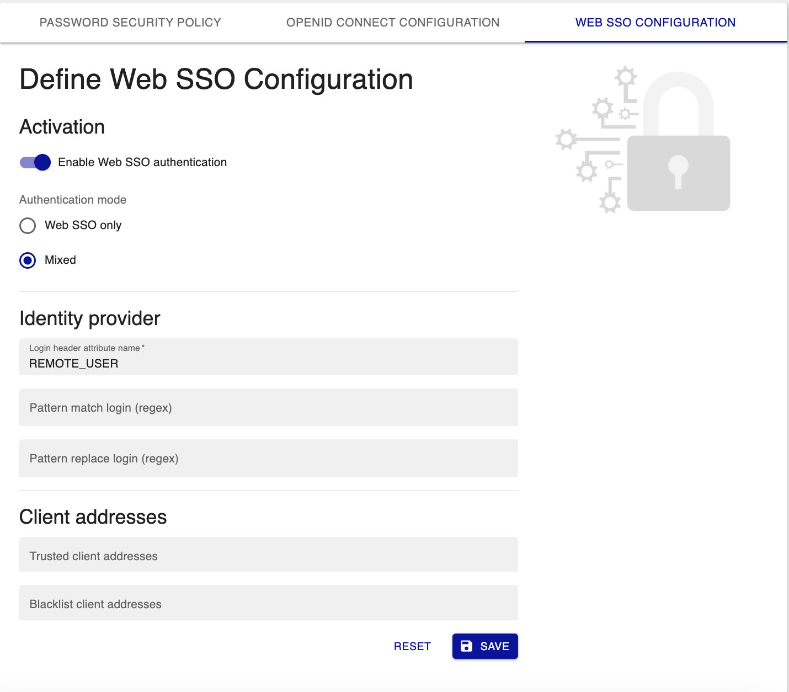

L'authentification Web SSO repose sur le serveur Web Apache. C'est Apache qui, selon sa configuration, se charge
d'authentifier l'utilisateur avant d'autoriser l'accès à l'interface web de Centreon.
De nombreux modules Apache permettent l'authentification via les protocoles OIDC, SAMLv2, TLS, Kerberos, etc.

> L'utilisateur doit être présent dans la configuration de Centreon pour accéder à l'interface.

## Configurer l'authentification Web SSO

L'authentification se paramètre à la page **Administration > Authentication > Web SSO Configuration** :



### Activer l'authentification

Activez d'abord l'authentification :
- **Enable Web SSO authentication** permet d'activer ou de désactiver l'authentification Web SSO.
- **Authentication mode** indique si l'authentification doit avoir lieu uniquement par OpenId Connect ou en
  utilisant également l'authentification locale (mixte).

### Configurer les informations d'accès au fournisseur d'identité

Ensuite, configurez les informations du fournisseur d'identité:
- **Login header attribute name**: Quelle variable des en-têtes doit être utilisée pour récupérer le login de
  l'utilisateur. Par exemple **REMOTE_USER**.
- **Pattern match login (regex)**: une expression régulière à rechercher dans l'identifiant. Par exemple, entrez
  **/@.\*/** pour trouver la fin de l'adresse email de votre identifiant.
- **Pattern replace login (regex)**: la chaîne par laquelle remplacer celle définie dans le champ
  **Pattern match login (regex)** pour l'authentification (login). Laissez le champ vide pour supprimer cette chaîne.

### Configurer les adresses des clients

Vous pouvez également configurer les adresses des clients:
- Le champ **Trusted client addresses** indique quelles sont les adresses IP des clients de confiance (correspond à
  l'adresse du reverse proxy). Chaque client de confiance est séparé par une virgule.
- Le champ **Blacklist client addresses** indique quelles sont les adresses IP des clients qui seront refusés.

### Configure Apache web server

Vous devez configurer le module Apache permettant l'authentification auprès du fournisseur d'identité.
Une fois cette configuration effectuée, vous devez modifier la configuration de Centreon pour Apache afin de
n'autoriser l'accès qu'aux utilisateurs authentifiés.

Editez le fichier **/etc/httpd/conf.d/10-centreon.conf** et recherchez le bloc suivant :
```apache
    Header set X-Frame-Options: "sameorigin"
    Header always edit Set-Cookie ^(.*)$ $1;HttpOnly;SameSite=Strict
    ServerSignature Off
    TraceEnable Off

    Alias ${base_uri}/api ${install_dir}
    Alias ${base_uri} ${install_dir}/www/
```

Le changer pour :
```apache
    Header set X-Frame-Options: "sameorigin"
    Header always edit Set-Cookie ^(.*)$ $1;HttpOnly;SameSite=Strict
    ServerSignature Off
    TraceEnable Off

    RequestHeader set X-Forwarded-Proto "http" early

    Alias ${base_uri}/api ${install_dir}
    Alias ${base_uri} ${install_dir}/www/

    <Location ${base_uri}>
        AuthType openid-connect
        Require valid-user
    </Location>
```

> Dans cet exemple, le module Apache utilisé était **mod_auth_openidc**. C'est pourquoi l'authentification est **openid-connect**.

Validez la configuration d'Apache à l'aide de la commande suivante :
```shell
/opt/rh/httpd24/root/usr/sbin/httpd -t
```

Redémarrez ensuite le serveur Web Apache :
```shell
systemctl restart httpd24-httpd
```

Pour conclure, reconstruisez le cache :
```shell
sudo -u apache /usr/share/centreon/bin/console cache:clear
```