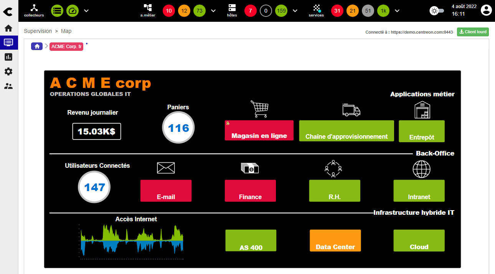
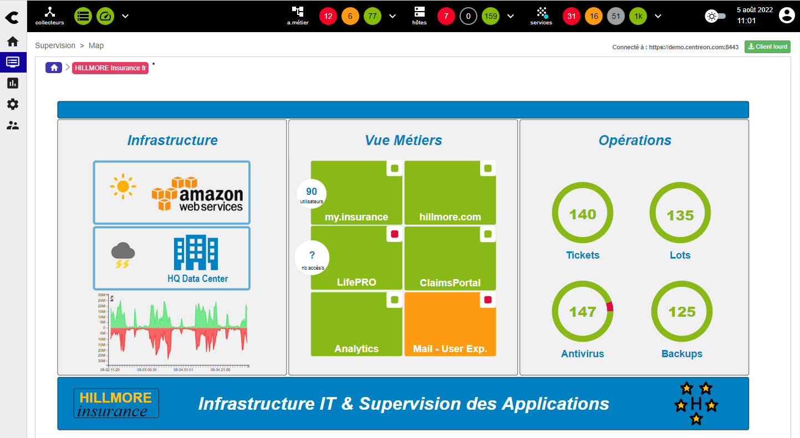
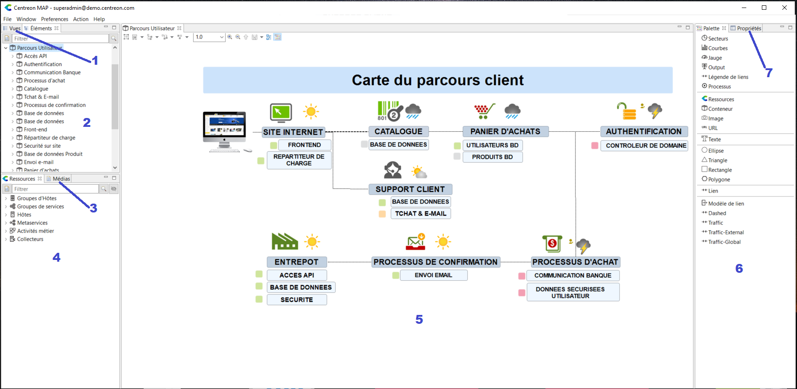
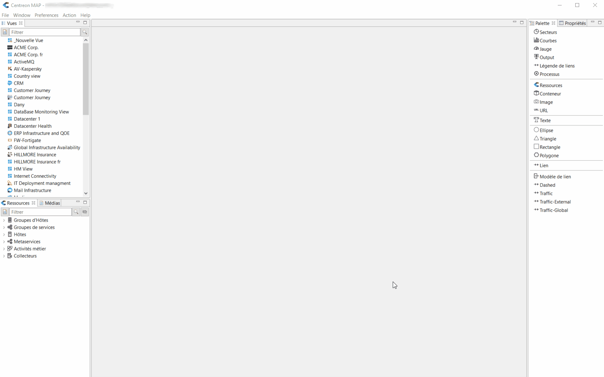
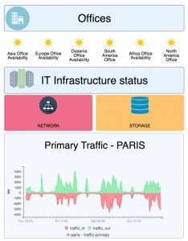
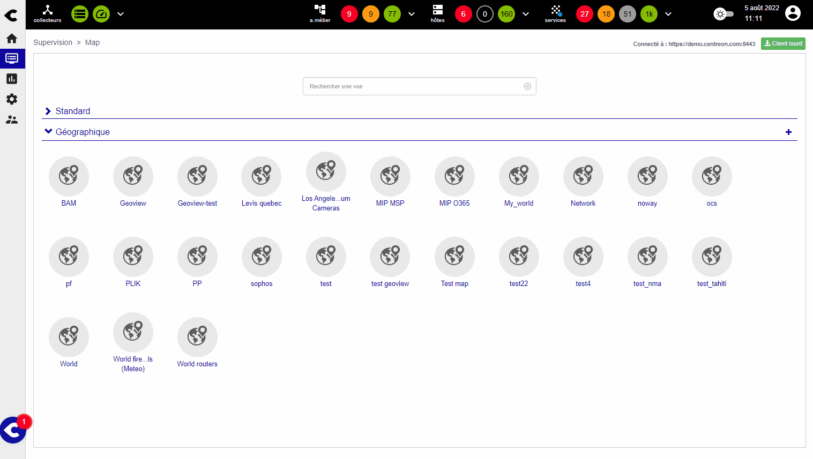

L'objectif de ce tutoriel est de vous aider à comprendre comment utiliser
l'extension de présentation de données Centreon MAP afin de fournir un aperçu des statuts
de votre infrastructure IT en temps réel à vos équipes ITOM et à vos utilisateurs opérationnels.

Avec Centreon MAP, vous pouvez de manière simple créer et partager des vues de supervision temps réel afin de
superviser les performances de votre infrastructure IT, de votre réseau, vos applications et vos services.

Exemple : Grâce à ces vues temps réel, les équipes ITOM et leurs managers peuvent visualiser instantanément la disponibilité
de services et d'applications métier critiques. Cela garantit un meilleur temps de réaction en cas de panne et optimise le
temps moyen de rétablissement du service (MTRS : Mean Time to Restore Service).

Dans ce tutoriel, nous montrerons comment créer des vues avec Centreon MAP.
Après avoir lu cet article, vous aurez découvert les fonctionnalités principales de Centreon MAP
et vous serez capable de créer des vues qui répondent aux besoins de vos utilisateurs techniques et métier.

> Centreon MAP est une **extension** Centreon qui demande une clé de licence valide. Pour en acheter une et récupérer les dépôts nécessaires, contactez [Centreon](mailto:sales@centreon.com).

## Créer une vue logique

### Avant de créer la vue : définir les objectifs

Définissez l'objectif principal de la vue : à quel besoin répond-elle, à qui s'adresse-t-elle ?
Voilà quelques questions à prendre en compte :

  - À qui s'adresse la vue ? (profils utilisateur)
  - De quel niveau d'information les utilisateurs ont-ils besoin ?
  - Toutes les ressources et tous les indicateurs dont j'ai besoin pour créer cette vue sont-ils bien en supervision ?
  - Quel type d'informations doit contenir la vue ? (ressources, indicateurs,
    graphiques, liens réseau, etc). Il peut être utile de schématiser la vue sur papier.

Maintenant que les objectifs de la vue sont définis, voyons comment la réaliser.

### L'espace de travail

Connectez-vous au serveur Centreon MAP grâce au client desktop : l'espace de travail suivant apparaît (vide).
Voici une illustration. Par défaut aucune vue n'est ouverte.

L'interface est organisée de la manière suivante :

1. **Vues** : Vues existantes auxquelles vous avez accès
2. **Éléments** : Objets utilisés dans les vues ouvertes
3. **Médias**: Images disponibles
4. **Ressources** : Objets Centreon pouvant être utilisés dans la vue (par glisser-déposer)
5. Contenu de la vue
6. **Palette** : Éléments graphiques pouvant être utilisés dans la vue
7. **Propriétés** : Propriétés de l'élément sélectionné

### Créer une nouvelle vue

Pour créer une nouvelle vue, faites un clic droit sur le panneau **Vues** puis cliquez sur **Ajouter**.

Positionnez des ressources, des widgets et autres éléments, en utilisant le glisser-déposer et les raccourcis.

Voici ci-dessous un exemple de vue sur le statut temps réel d'une infrastructure IT créée en moins de 4 minutes :

  <iframe width="560" height="315" src="https://www.youtube.com/embed/tsgYRpYqaAU" frameborder="0" allow="accelerometer; autoplay; encrypted-media; gyroscope; picture-in-picture" allowfullscreen></iframe>

## Créer une vue géographique

Que votre infrastructure IT soit répartie géographiquement sur une ville, un pays ou à travers le monde,
vous avez besoin de visualiser l'état de votre infrastrcture IT de la façon la plus appropriée.

Vous pouvez faire cela facilement en utilisant une **GeoView**. Le seul prérequis est d'avoir rempli le champ
**Coordonnées géographiques** pour vos hôtes (à la page **Configuration > Hôtes > Hôtes**, onglet **Informations détaillées de l'hôte**).

Pour créer une **GeoView**, allez à la page **Supervision \> Map** et cliquez sur le "+"
dans la section **Géographique**. (Si vous ne voyez pas le "+", cela signifie que vous n'avez pas les droits nécessaires.)

## Afficher et partager une vue

Grâce à un mécanisme de contrôle d'accès basé sur les objets ACL Centreon, vous pouvez facilement partager les vues que vous voulez avec les équipes désirées. Dès qu'une vue est partagée avec un utilisateur, elle est accessible pour lui à la page
**Supervision > Map**, ou même directement dans un tableau de bord en utilisant le widget Centreon Map (exemple ci-dessous).

Vous avez maintenant assez d'informations pour commencer à utiliser Centreon MAP.
