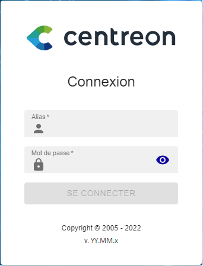
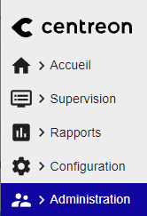
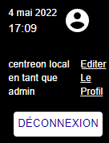
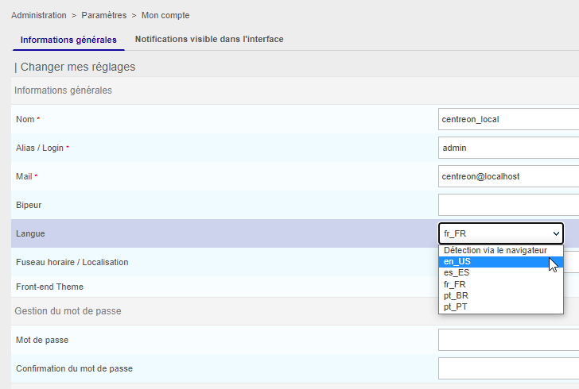
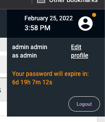
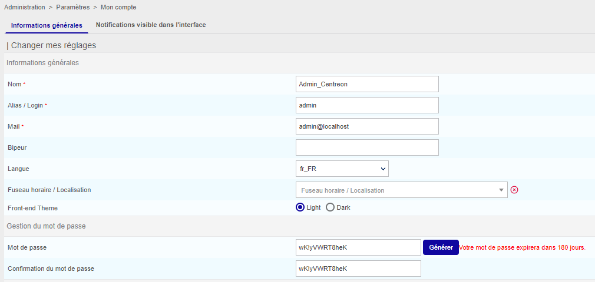
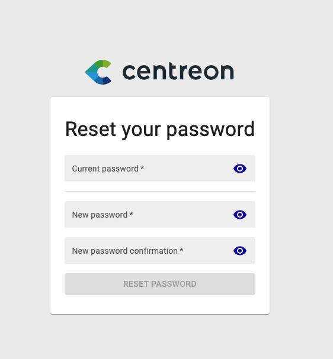

## Première connexion à l'interface

Pour vous connecter à l'interface web, rendez-vous à l'adresse : `http://ADRESSE_IP/centreon`.

> Remplacez **ADRESSE_IP** par l'adresse IP ou le FQDN du serveur web Centreon.

Renseignez le nom d'utilisateur et le mot de passe associé et cliquez sur le bouton **Connect** :

>Les identifiants par défaut sont : `admin`/`centreon`. 

Vous êtes maintenant connecté à l'interface web Centreon.

## Présentation rapide des menus

L'interface web de Centreon est composée de plusieurs menus, chaque menu a une fonction bien précise (cliquez sur le logo Centreon en haut à gauche de l'écran pour afficher les libellés) :

* Le menu **Accueil** affiche les [vues personnalisées](create-custom-view.md). Votre espace de travail peut être vide pour l'instant. Une fois que vous aurez configuré les widgets
  personnalisables, vous verrez les données et les graphiques en fonction de votre personnalisation.
* Le menu **Supervision** regroupe l'état de tous les éléments supervisés en temps réel et en différé au travers de la
  visualisation des logs.
* Le menu **Rapports** permet de visualiser de manière intuitive (via des diagrammes) l'évolution de la supervision sur
  une période donnée.
* Le menu **Configuration** permet de configurer l'ensemble des éléments supervisés ainsi que l'infrastructure de supervision.
* Le menu **Administration** permet de configurer la plateforme Centreon (authentification, proxy, extensions...) ainsi que de visualiser l'état général des serveurs.

## Langue de l'interface utilisateur

Dans le bandeau, cliquez sur l'icône profil, puis cliquez sur **Edit profile**:

Dans la liste de sélection des langues, sélectionnez la vôtre :

Puis cliquez sur **Save**. Votre interface est maintenant traduite dans votre
langue.

> Si votre langue n'apparaît pas dans la liste, vous pouvez aider la communauté Centreon à traduire l'interface web.
> Rendez-vous dans le chapitre [How to translate Centreon](../developer/developer-translate-centreon) pour plus d'informations.

## Réinitialisez votre mot de passe

### Réinitialisez votre mot de passe avant expiration

Lorsque votre mot de passe va expirer dans les 7 prochains jours, un point orange apparaît dans le
bandeau à droite à côté de l'icône de profil :

Cliquez sur **Modifier le profil**, puis modifiez votre mot de passe :

### Réinitialisez votre mot de passe après expiration

Si vous n'avez pas changé votre mot de passe avant son expiration, après connexion vous serez redirigé vers une page dédiée où vous pourrez le mettre à jour :

Entrez votre mot de passe actuel, définissez-en un nouveau puis cliquez sur **Réinitialiser le mot de passe**.
