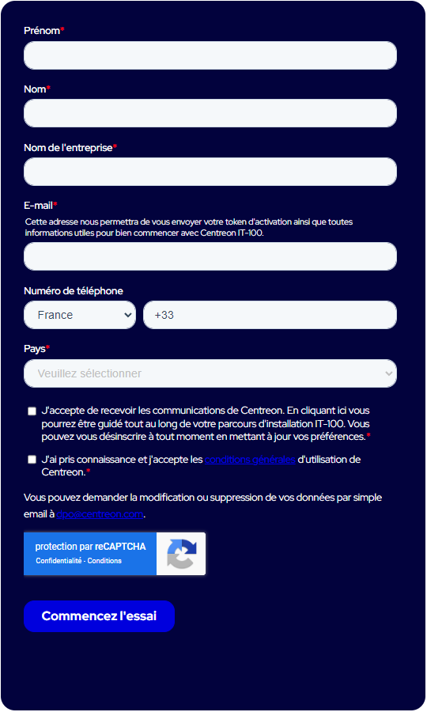

Centreon vous propose de tester gratuitement toutes les fonctionnalités de **Centreon IT Edition**, grâce à l'offre d'essai IT-100.

- Vous pourrez installer jusqu'à 3 serveurs centraux, et monitorer jusqu'à 100 hôtes. 
- Vous aurez accès à la fonctionnalité de [découverte automatique des hôtes et services](../monitoring/discovery/introduction.md), et à la totalité de la bibliothèque de [plugin packs Centreon](/pp/integrations/plugin-packs/introduction).

Votre plateforme Centreon doit être connectée à internet pour que la licence IT-100 puisse fonctionner.

Pour plus d'informations, consultez notre [FAQ sur Centreon IT-100](https://www.centreon.com/faq/faq-centreon-it-100/).

## Procédure

1. Pour demander votre licence d'essai gratuite, rendez-vous sur notre site internet à la page **[Essayez Centreon IT Edition](https://www.centreon.com/essai-gratuit/)**
et remplissez le formulaire suivant :

  

  Vous recevrez un email contenant votre jeton permettant d'essayer **Centreon IT Edition**.

2. Installez Centreon rapidement en utilisant une [machine virtuelle prête à l'emploi](../installation/installation-of-a-central-server/using-virtual-machines.md).

3. Connectez-vous à l'interface, à l'adresse : `http://ADRESSE_IP/centreon`. (Remplacez **ADRESSE_IP** par l'adresse IP ou le FQDN du serveur web Centreon.)
      
    > Les identifiants par défaut sont `admin`/`centreon`.

4. Ajoutez le jeton Centreon IT Edition que vous avez reçu par email.
    > Si nécessaire, appliquez la procédure de [configuration du proxy](../administration/parameters/centreon-ui.md#configuration-du-proxy) pour configurer et vérifier la connexion de votre serveur Centreon à Internet.

      1. Rendez-vous dans le menu **Administration > Extensions > Manager** et cliquez sur le bouton **Add Token** :

          

      2. Une fenêtre s'ouvre. Saisissez votre jeton et cliquez sur le bouton **Enregistrer** :

          

5. Votre plateforme est maintenant prête. Vous pouvez [superviser votre premier hôte](first-supervision.md).

## Troubleshooting

### Je n'ai pas reçu mon jeton par email

* Vérifiez que l'adresse email que vous avez entrée dans le formulaire d'inscription IT 100 est correcte.
* Vérifiez que l'email contenant votre jeton n'a pas été placé dans le dossier spam.

### Je n'arrive pas à enregistrer mon jeton

Si vous n'arrivez pas à enregistrer votre jeton lorsque vous cliquez sur **Ajouter token** à la page **Administration > Extensions > Gestionnaire** :

* Vérifiez que votre plateforme Centreon est autorisée à accéder à internet (pare-feu, passerelles, routes). Vérifiez que votre machine peut accéder à l'URL suivante : `https://api.imp.centreon.com/v2`.

* Vérifiez que le paramétrage de votre plateforme Centreon lui permet d'accéder à internet. Configurez le proxy à la page **Administration > Paramètres > Centreon web**, section **Paramètres du proxy internet** : cliquez sur **Tester la connexion internet**.

* Si vous utilisez la machine virtuelle fournie par Centreon, vérifiez que vous avez bien configuré une carte réseau. La procédure d'installation donne [à l'étape 2](../installation/installation-of-a-central-server/using-virtual-machines.md#étape-2--installer-la-machine-virtuelle) un exemple d'ajout d'interface réseau à la VM fraîchement importée dans VMWare ou VirtualBox.

* Si le proxy n’est pas nécessaire, ou correctement configuré et que l’enregistrement du token échoue, cela peut vouloir dire que les serveurs DNS ne sont pas configurés corrctement sur le serveur Centreon. Connectez-vous en SSH à votre serveur Centreon et exécutez la comande suivante :

  ```shell
  ping api.imp.centreon.com
  ```

  Une réponse de cette forme indique que les serveurs DNS sont correctement configurés :

  ```shell
  PING api.imp.centreon.com (176.34.167.94): 56 data bytes
  ```

* Vérifiez la présence de messages d'erreurs dans les logs (**/var/log/centreon/license-manager.log**) :

  * La plateforme ne peut pas accéder à l'API : `2022-03-02 10:26|0|0|[RestNotFoundException] https://api.imp.centreon.com/v2/license-manager/instance : Page not found`
  * Le format du jeton est valide mais le jeton n'est pas reconnu par l'API : `2022-03-02 10:22|0|0|[RestUnauthorizedException] https://api.imp.centreon.com/v2/license-manager/instance : {"message":"Authentication failed"}`

* Assurez-vous que le jeton d’accès IT-100 n'est pas déjà utilisé sur 3 autres plateformes Centreon. Un maximum de 3 plateformes Centreon peuvent enregistrer simultanément le même jeton. Au-delà de 3 plateformes, vous devez libérer un jeton d'une plateforme pour pouvoir l'utiliser à nouveau.
  * Allez dans **Administration > Extensions > Gestionnaire**. Cliquez **Voir la licence**, puis **Unlink your platform**.

  En cas de problème d’accès à vos plateformes, contactez [Centreon](mailto:sophie@centreon.com).

* Pour tester la connexion à notre service d'enregistrement, connectez-vous en SSH à votre serveur Centreon et exécutez la commande suivante :

  ```shell
  curl -s 'https://api.imp.centreon.com/v2/license-manager/instance/subscription'
  ```

  Si la réponse est la suivante, alors la connexion à notre service est correcte :

  ```shell
  {"message": "Authentication required"}
  ```

  Sinon, il y a eu un problème lors de la phase d’enregistrement de l’instance.
  Voir la section "[Toujours bloqué ?](#toujours-bloqué-)".

### "Your license is not valid"

Vérifiez si une licence est effectivement enregistrée sur le serveur. Si c'est le cas, le fichier suivant existe bien : **/etc/centreon/license.d/epp.license**.

### Je ne peux pas sélectionner de modèle d'hôte quand je crée ou modifie un hôte

* Les [plugin packs](../monitoring/pluginpacks.md) ne sont pas installés.
* Vous avez atteint le nombre maximum d'hôtes permis par votre licence. Il s'agit du nombre d'hôtes listés à la page **Configuration > Hôtes > Hôtes**, qu'ils aient été mis en supervision ou non. Pour vérifier votre nombre d'hôtes :

  * Allez à la page **Configuration > Hosts > Hosts** et vérifiez le nombre d'hôtes (la pagination peut vous fournir le nombre exact).
  * Connectez-vous en SSH à votre serveur Centreon et exécutez la commande suivante :

    ```shell
    mysql -u root centreon
    MariaDB [centreon]> SELECT COUNT(host_id) FROM host WHERE host_register = '1';
    ```

  Si le nombre maximum d'hôtes a été atteint, vous pouvez soit supprimer des hôtes, soit demander à passer à une licence supérieure.

### Tous les Plugin Packs sont grisés à la page Configuration > Packs de plugins

Voir ci-dessus, "[Je ne peux pas sélectionner de modèle d'hôte quand je crée ou modifie un hôte](#je-ne-peux-pas-sélectionner-de-modèle-dhôte-quand-je-crée-ou-modifie-un-hôte)".

### Je n'ai aucun fournisseur de découverte

Si vous ne voyez aucun fournisseur de découverte quand vous cliquez sur **Ajouter** à la page **Configuration > Hôtes > Découverte**,
installez les [Plugin Packs](../monitoring/pluginpacks.md) correspondant aux fournisseurs désirés.

### Toujours bloqué ?

Si vous rencontrez toujours des problèmes, envoyez-nous les informations suivantes :

* Le fichier **/var/log/centreon/license-manager.log**
* La version de Centreon que vous utilisez. Pour la connaître, utilisez la commande suivante :
  ```shell
  rpm -qa | grep centreon-web
  ```
* Le log d'erreur suivant :
  * **Centreon 22.04**: /var/log/php-fpm/centreon-error.log
  * **Centreon 21.10**: /var/log/php-fpm/centreon-error.log
  * **Centreon 21.04**: /var/opt/rh/rh-php73/log/php-fpm/centreon-error.log
  * **Centreon 20.10**: /var/opt/rh/rh-php72/log/php-fpm/centreon-error.log
* Le fichier **/etc/centreon/license.d/epp.license**
* Le résultat de la requête SQL suivante :
  ```shell
  mysql -u root centreon
  MariaDB [centreon]> SELECT * FROM options WHERE options.key LIKE "imp%";
  ```
