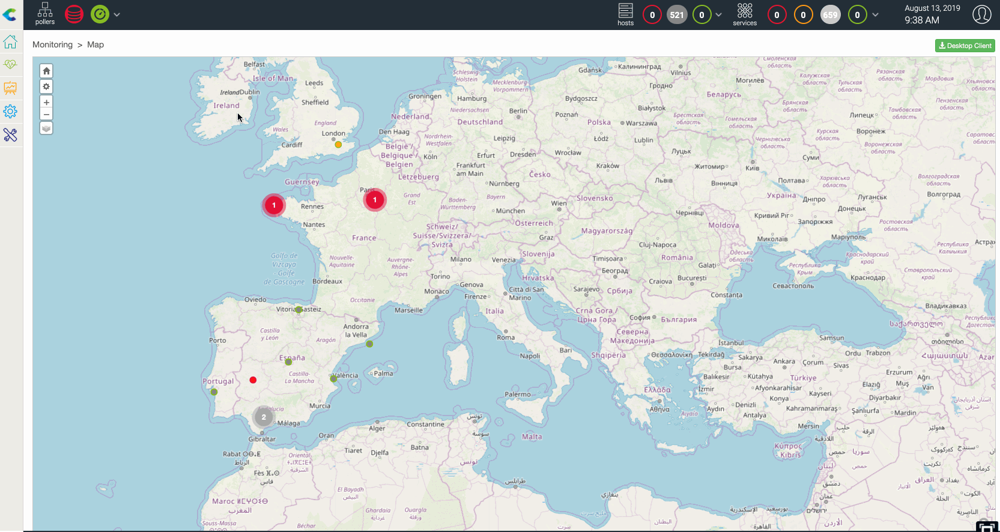

## Créer une vue géographique

Un utilisateur qui est un administrateur Centreon, ou un administrateur Centreon Map ou qui a le droit de créer une vue peut créer des vues géographiques en utilisant l'interface web :

1. Allez dans **Monitoring > Map** et cliquez sur le "+" de la section Geographic.
2. Il vous est demandé de donner un nom à la vue et ensuite de définir les ressources à afficher sur la vue.
3. Après avoir configuré ces paramètres, les ressources apparaîtront sur cette vue géographique

Les ressources suivantes peuvent être affichées sur un GeoView :

- Hôtes appartenant au(x) groupe(s) d'hôtes
- Activités Métiers appartenant à une (des) vue(s) d'affaires
- Un ou plusieurs groupes d'hôtes

Pré-requis : Définir les coordonnées lat/long dans le formulaire de configuration des ressources pour l'hôte, les groupes d'hôtes ou l'activité métier.

Exemple avec un hôte :

## Comment les limitations de contrôle d'accès (ACL) sont gérées

Dès que vous donnez accès à **Monitoring > Map** ou à une vue personnalisée contenant un widdget Map, les GeoViews sont accessibles à tout utilisateur de Centreon.
Un utilisateur ne verra que les ressources qu'il est autorisé à voir, en fonction de son profil ACL.

## Comment les ressources sont affichées

Lorsqu'une ressource (hôte, groupe d'hôtes ou activité métier) est positionnée sur une vue géographique, elle est affichée sous la forme d'un cercle dont la couleur est définie par les règles suivantes :

- Hôte : état le plus défavorable entre l'hôte et ses services.
- Groupes d'hôtes : état le plus défavorable des hôtes appartenant aux groupes d'hôtes.
- Activité métier : état actuel

*Ordre des pires états : Critique (rouge) \> Hors service (rouge) \> Avertissement (orange) \>
Inconnu (gris) \> Inaccessible (gris) \> Ok (vert) \> En service (vert) \> En attente (bleu)*

### Regroupement

Lorsque plusieurs ressources sont géographiquement proches et que vous êtes à un "certain" niveau de zoom, elles sont regroupées en un seul cercle affichant deux choses :

- L'état de l'objet le plus mauvais (affiché comme une couleur entre le vert, l'orange, le rouge et le gris).
- Le nombre de ressources dans cet état

*Ce comportement peut être désactivé dans les paramètres globaux de la carte Centreon*.

### Ressources clignotantes

Si une ressource est dans un état "not-ok", elle clignote.

*Ce comportement peut être désactivé dans les paramètres globaux de la carte Centreon.

## Couches de données sur Geoview

Centreon MAP vous donne la possibilité d'afficher des "couches de données" supplémentaires sur les cartes afin d'ajouter un contexte à l'état de votre infrastructure informatique en temps réel.

Vous devez d'abord ajouter des couches de données dans l'option Centreon Map, puis, si la couche de données est activée, vous pouvez la rendre visible ou non en cochant la couche concernée à l'aide de l'icône en haut à gauche.

**Exemples**

