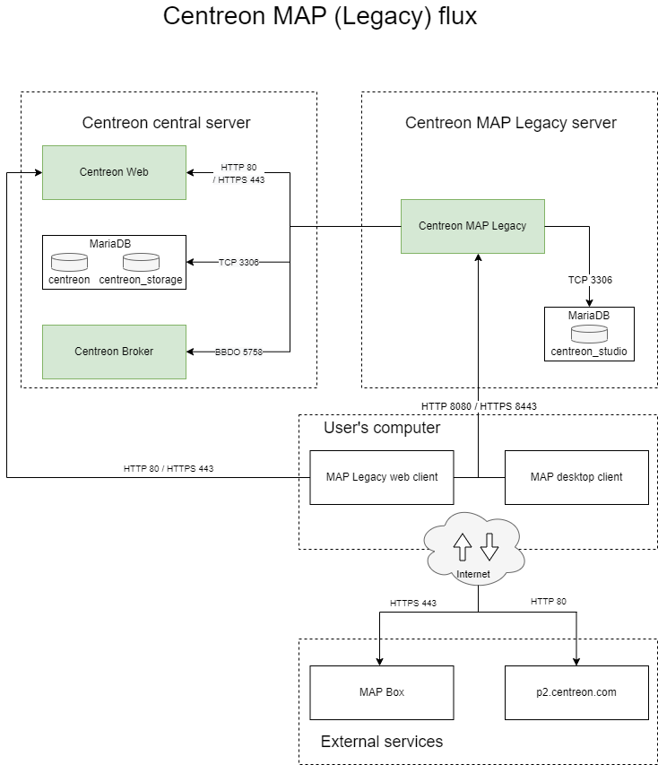
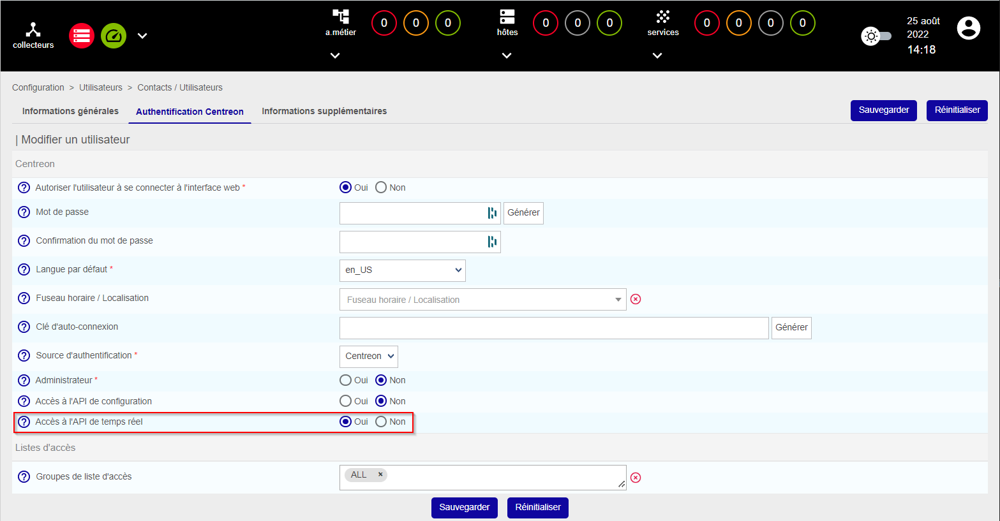
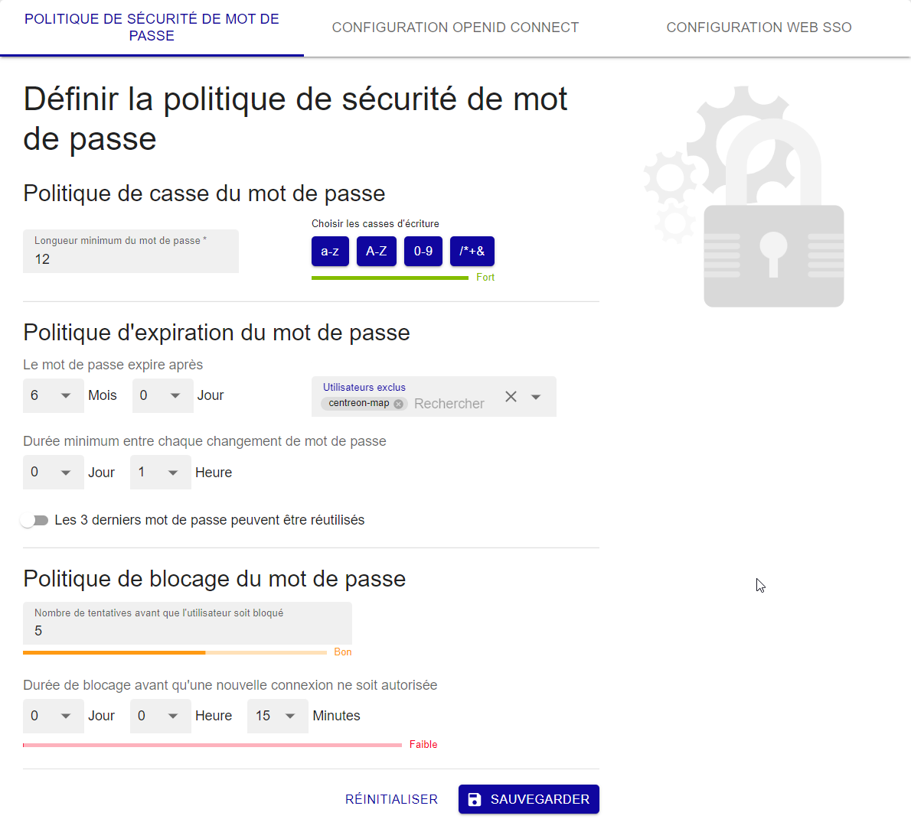
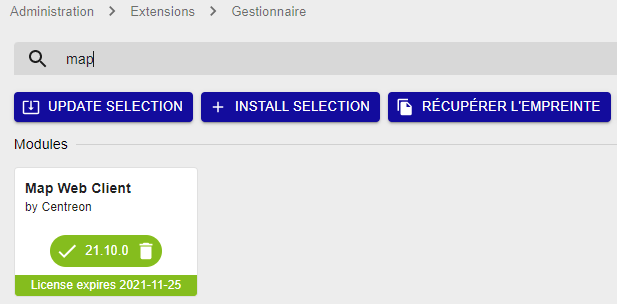
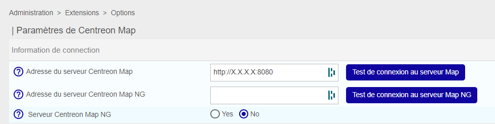
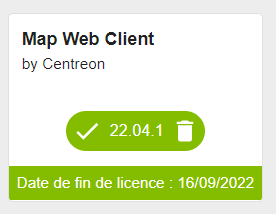
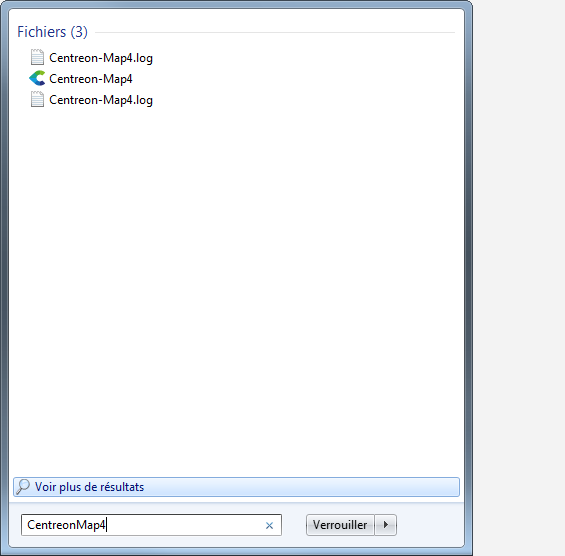

import Tabs from '@theme/Tabs';
import TabItem from '@theme/TabItem';


> Centreon MAP demande une licence valide. Pour en acheter une et récupérer les
> référentiels nécessaires, contactez [Centreon](mailto:sales@centreon.com).

Ce chapitre décrit comment installer Centreon MAP. Le serveur doit être
installé sur une machine dédiée pour permettre à Centreon MAP de fonctionner avec
sa propre base de données et d'éviter tout conflit potentiel avec le serveur central.

Avant l'installation, assurez-vous de consulter le chapitre sur les prérequis pour 
connaître la configuration requise (CPU et mémoire). Choisissez le 
type d'architecture qui répond le mieux à vos besoins.

## Architecture

Centreon MAP se compose de trois éléments :

- Centreon MAP Server, développé en Java, utilise SpringBoot, Hibernate et CXF
- l'interface web Centreon MAP, developpée en Javascript, et basée sur
  [Backbone.js](http://backbonejs.org/)
- le client Centreon MAP Desktop, developpé en Java, et basé sur [Eclipse RCP
  4](https://wiki.eclipse.org/Eclipse4/RCP).

Le schéma ci-dessous résume l'architecture :



**Tableau des flux réseaux**

| Application    | Source     | Destination               | Port      | Protocole  | Description                                                 |
|----------------|------------|---------------------------|-----------|------------|-------------------------------------------------------------|
| Map Server     | Map server | Centreon central broker   | 5758      | TCP        | Obtenir des mises à jour du statut en temps réel            |
| Map Server     | Map server | Centreon MariaDB database | 3306      | TCP        | Récupérer la configuration et d'autres données de Centreon  |
| Map Server     | Map server | Map server database       | 3306      | TCP        | Stocker toutes les vues et données relatives à Centreon MAP |
| Web + Desktop  | Map server | Centreon central          | 80/443    | HTTP/HTTPS | Authentification et récupération des données                |
| Web interface  | User       | Map server                | 8080/8443 | HTTP/HTTPS | Récupérer les vues et le contenu                            |
| Web interface  | User       | Internet\* (Mapbox)       | 443       | HTTPS      | Récupérer les données Mapbox                                |
| Desktop client | User       | Map server                | 8080/8443 | HTTP/HTTPS | Récupérer et créer des vues et du contenu                   |
| Desktop client | User       | Internet\* (Mapbox)       | 443       | HTTPS      | Récupérer les données Mapbox                                |
| Desktop client | User       | Internet\* (p2 repo)      | 80        | HTTP       | Récupérer la mise à jour automatique du client desktop    |

\* *Avec ou sans proxy*

## Prérequis

### Centreon

Le serveur central et Centreon MAP doivent être dans la même version majeure (c'est-à-dire tous les deux en 21.10.x).

### Centreon MAP Server

#### Licence

Le serveur exige que la licence soit disponible et valide sur le serveur central Centreon. Contactez le [support
Centreon](https://centreon.force.com/) pour obtenir et installer votre clé de licence.

#### Matériel

Les prérequis matériels pour votre serveur Centreon MAP sont les suivants :

| *Services supervisés*    | < 10 000                | < 20 000             | < 40 000             | > 40 000                      |
| ------------------------ | ----------------------- | -------------------- | -------------------- | ----------------------------- |
| *CPU*                    | 2 vCPU ( 3Ghz ) minimum | 4 CPU (3GHz) minimum | 4 CPU (3GHz) minimum | Contacter le support Centreon |
| *Memoire dédiée*         | 2GB                     | 4GB                  | 8GB                  | Contacter le support Centreon |
| *Partition data MariaDB* | 2GB                     | 5GB                  | 10GB                 | Contacter le support Centreon |

Pour mettre en œuvre correctement la mémoire dédiée, vous devez modifier le paramètre
*JAVA\_OPTS* dans le fichier de configuration de Centreon Map
`/etc/centreon-studio/centreon-map.conf` et redémarrer le service:

```text
JAVA_OPTS="-Xms512m -Xmx4G"
```

> La valeur Xmx dépend de la quantité de mémoire indiquée dans le tableau ci-dessus.

Puis redémarrez le service:

```shell
systemctl restart centreon-map
```

L'espace utilisé par le serveur MAP de Centreon est directement déterminé par le
nombre d'éléments que vous ajoutez dans vos vues. Un élément est tout objet graphique
dans Centreon MAP. La plupart des éléments (comme les hôtes, les groupes, etc.) possèdent des enfants
qui doivent être inclus dans le décompte.

> Ces valeurs sont appliquées après l'optimisation des tables MAP de Centreon.

#### Logiciel

- OS: CentOS or Redhat 7 / 8
- DBMS: MariaDB 10.5
>- Firewall: Désactivé
>- SELinux: Désactivé

#### Informations requises pendant l'installation

- Compte administrateur Centreon Web.

> Même avec un serveur correctement dimensionné, vous devez garder à l'esprit 
> les meilleures pratiques et recommandations lors de la création de vues 
> afin de ne pas rencontrer de problèmes de performance.

### Interface web Centreon MAP Web

#### Licence

L'interface web nécessite que la licence soit disponible et valide sur le serveur 
central de Centreon. Contactez l'[équipe support Centreon](https://centreon.force.com/) pour obtenir
et installer votre clé de licence.

#### Compatibilité

L'interface Web Centreon MAP est compatible avec les navigateurs web suivants :

* Google Chrome (dernière version au moment de la sortie du logiciel Centreon et suivantes).  Veuillez consulter la [FAQ Google Chrome](https://support.google.com/chrome/a/answer/188447?hl=en) pour une description de la politique de support de Chrome. 
* Mozilla Firefox (dernière version au moment de la sortie du logiciel Centreon et suivantes).  Veuillez consulter la [FAQ Mozilla](https://www.mozilla.org/en-US/firefox/organizations/faq/) pour obtenir une description de la politique de support de Firefox.
* Apple Safari (dernière version au moment de la sortie du logiciel Centreon et suivantes)
* Microsoft Edge Chromium (dernière version au moment de la sortie du logiciel Centreon et suivantes).

Si une mise à jour des navigateurs pris en charge devait entraîner une incompatibilité, Centreon s'efforcerait de la
résoudre dans les meilleurs délais (pour les versions Centreon prises en charge). Bien que d'autres navigateurs puissent
fonctionner, Centreon ne tentera pas de résoudre les problèmes liés aux navigateurs autres que ceux énumérés ci-dessus.

La résolution de votre écran doit être d'au moins 1280 x 768.

### Client Centreon MAP Desktop

- 4 GB de RAM minimum, 8 GB recommandé (obligatoire pour 10 000 services ou plus)
- **Java 64 bits version 8**
- Résolution d'écran d'au moins 1280 x 768.
- Debian 7,8 ou 9

> Le client Desktop n'est pas compatible avec Microsoft Windows Server. * Si une version de Java
> autre que 8 est installée, envisagez d'installer Java 8 et de modifier le fichier 
> Centreon-Map4.ini pour ajouter la ligne suivante `-vm $path_to_java8$` AVANT `-vmwargs`.

Pour optimiser le client Desktop, vous devez lui allouer plus de mémoire que la
valeur par défaut. Modifiez le fichier suivant:

<Tabs groupId="sync">
<TabItem value="Windows" label="Windows">

```shell
C:\Users\<YOUR_USERNAME>\AppData\Local\Centreon-Map4\Centreon-Map4.ini
```

</TabItem>
<TabItem value="Linux" label="Linux">

```shell
/opt/centreon-map4-desktop-client/Centreon-Map4.ini
```

</TabItem>
</Tabs>

Et ajoutez les lignes suivantes à la fin du fichier, sur une nouvelle ligne :

```text
-Xms512m
-Xmx4g
```

### Prérequis réseau

La machine Centreon MAP Server doit accéder à :

- Centreon Central broker, généralement sur la machine Centreon Central, en utilisant le port TCP
  5758
- Centreon Database, généralement sur la machine Centreon Central, en utilisant le port TCP 3306
- Centreon MAP database, généralement sur localhost, en utilisant le port TCP 3306.

Tous les ports ci-dessus sont des valeurs par défaut et peuvent être modifiés si nécessaire.

- Centreon Web Central, utilise le port HTTP 80 ou le port HTTPS 443

Les machines Centreon MAP Desktop Client doivent accéder à :

- Centreon MAP Server, en utilisant HTTP sur le port 8080 ou 8443 lorsque HTTPS/TLS est activé
- Internet avec ou sans proxy.

Les ports 8080 et 8443 sont des valeurs par défaut recommandées, mais d'autres
configurations sont possibles.

## Installation du serveur

### Interface Centreon Web

Vous devez fournir au serveur Centreon MAP un utilisateur dédié
**qui a accès à toutes les ressources** par le biais des [groupes de listes d'accès](../administration/access-control-lists.md) appropriés. 
Étant donné que le mot de passe sera stocké en clair dans un fichier 
de configuration, vous ne devez pas utiliser un compte utilisateur administrateur Centreon.

Donnez à cet utilisateur l'accès à l'API Centreon Web en temps réel :



Excluez l'utilisateur de la politique d'expiration des mots de passe à la page **Administration > Authentification** : le mot de passe de l'utilisateur n'expirera jamais.



### Serveur Centreon Central

Créez un utilisateur dans l'instance mysql hébergeant les bases de données "centreon" et "centreon_storage".

```sql
CREATE USER 'centreon_map'@'<IP_SERVER_MAP>' IDENTIFIED BY 'centreon_map';
GRANT SELECT ON centreon_storage.* TO 'centreon_map'@'<IP_SERVER_MAP>';
GRANT SELECT, INSERT ON centreon.* TO 'centreon_map'@'<IP_SERVER_MAP>';
```

Le privilège INSERT ne sera utilisé que pendant le processus d'installation afin de créer
une nouvelle sortie Centreon Broker. Il sera révoqué ultérieurement.

### Serveur Centreon MAP

Si vous avez installé votre serveur Centreon MAP à partir d'une nouvelle installation CentOS, vous devez installer le paquet `centreon-release`.

<Tabs groupId="sync">
<TabItem value="RHEL / CentOS / Oracle Linux 8" label="RHEL / CentOS / Oracle Linux 8">

```shell
dnf install https://yum.centreon.com/standard/21.10/el8/stable/noarch/RPMS/centreon-release-21.10-5.el8.noarch.rpm
```

</TabItem>
<TabItem value="CentOS 7" label="CentOS 7">

```shell
yum install https://yum.centreon.com/standard/21.10/el7/stable/noarch/RPMS/centreon-release-21.10-5.el7.centos.noarch.rpm
```

</TabItem>
</Tabs>

> Si l'URL ne fonctionne pas, vous pouvez trouver manuellement ce paquet dans le dossier.

Installez le dépôt MAP de Centreon, que vous trouverez sur
le [portail du support](https://support.centreon.com/s/repositories).

Ensuite, installez le serveur Centreon MAP à l'aide de la commande suivante :

<Tabs groupId="sync">
<TabItem value="RHEL / CentOS / Oracle Linux 8" label="RHEL / CentOS / Oracle Linux 8">

```shell
dnf install centreon-map-server
```

</TabItem>
<TabItem value="CentOS 7" label="CentOS 7">

```shell
yum install centreon-map-server
```

</TabItem>
</Tabs>

Lors de l'installation du serveur Centreon MAP, java (OpenJDK 11) sera automatiquement installé si nécessaire.

> Vous devez disposer d'une base de données MariaDB pour stocker les données MAP
> de Centreon, que ce soit sur localhost ou ailleurs.

### Configuration

Assurez-vous que la base de données qui stocke les données Centreon MAP est optimisée
(automatiquement ajoutée par le RPM dans `/etc/my.cnf.d/map.cnf`) :

```text
max_allowed_packet = 20M
innodb_log_file_size = 200M
```

Puis, redémarrez MariaDB:

```shell
systemctl restart mariadb
```

Exécutez le script de configuration du serveur MAP de Centreon. Deux modes sont disponibles :
interactive ou automatic.

- interactive *(aucune option/mode par défaut)* : Plusieurs questions seront posées pour
  remplir de manière interactive les variables de l'installation.
- automatic *(--automatic or -a)*: L'installation se fera automatiquement
  à partir des valeurs définies dans le fichier `/etc/centreon-studio/vars.sh`.

Si c'est votre première installation, nous vous conseillons d'utiliser le mode standard 
(interactive) et de choisir **Non** lorsqu'on vous propose le mode d'installation avancé :

```shell
/etc/centreon-studio/configure.sh
```

### Serveur Central

> Avant de redémarrer Broker, vous devez exporter la configuration à partir de
> l'interface web Centreon.

Redémarrez Centreon Broker sur le serveur central :

```shell
systemctl restart cbd
```

Supprimez le privilège INSERT de l'utilisateur centreon_map :

```sql
REVOKE INSERT ON centreon.* FROM 'centreon_map'@'<IP_SERVER_MAP>';
```

### Serveur Centreon MAP

Vérifiez votre configuration:

```shell
/etc/centreon-studio/diagnostic.sh
```

Si la configuration est correcte, le service centreon-map peut être démarré à partir du serveur Centreon MAP :

```shell
systemctl restart centreon-map
```

Permettez au service de démarrer automatiquement au démarrage du serveur :

```shell
systemctl enable centreon-map
```

Le serveur Centreon Map est maintenant démarré et activé : installons la partie interface de l'extension.

## Installation de l'interface web

### Serveur Central

Installez le dépôt MAP de Centreon. Vous pouvez le trouver sur le [portail du support](https://support.centreon.com/s/repositories).

Ensuite, exécutez la commande suivante :

<Tabs groupId="sync">
<TabItem value="RHEL / CentOS / Oracle Linux 8" label="RHEL / CentOS / Oracle Linux 8">

```shell
dnf install centreon-map-web-client
```

</TabItem>
<TabItem value="CentOS 7" label="CentOS 7">

```shell
yum install centreon-map-web-client
```

</TabItem>
</Tabs>

### Web

Allez à la page **Centreon > Administration > Extensions** et cliquez sur le bouton d'installation.

- License Manager (*si pas encore installé*)
- Map Web Client

Téléchargez la licence **map.license** fournie par l'équipe support. Rafraîchissez la page :
la bannière doit être verte avec la date de validité de la licence.



Cliquez sur **Retour** pour revenir à la page **Extensions**. Maintenant que le module est installé, nous allons le configurer.

### Configuration

Allez à la page **Administration > Extensions > Options**, et dans le menu Centreon MAP, mettez à jour le champ **Adresse du serveur Centreon MAP**.

> Utilisez l'adresse IP/le nom d'hôte réels de votre serveur Centreon MAP.



### Vérification de l'installation

L'interface web Centreon MAP est maintenant disponible à la page **Monitoring > MAP**.


>Si le contenu ne s'affiche pas, videz le cache de votre navigateur.

Vous pouvez voir à quelle IP le client est connecté.


### Widget Centreon MAP

En installant l'interface Web, vous ajoutez automatiquement le widget Centreon MAP,
mais vous devez effectuer une dernière tâche. Allez à la page **Administration > Extensions** 
et cliquez sur le bouton **Installer** du widget. Voici le résultat après l'installation :



## Client Desktop

### Exécutables

Le client Desktop est actuellement disponible uniquement pour Windows **64-bit**, Mac et Linux (Debian et Ubuntu).

Vous pouvez trouver les installateurs dans **Monitoring > Map > Desktop Client** ou
[ici](https://download.centreon.com/?action=product&product=centreon-map&version=21.10&secKey=9ae03a4457fa0ce578379a4e0c8b51f2).

> Pour des raisons de performance, nous recommandons fortement d'avoir moins de 5 à 10
> utilisateurs maximum connectés en même temps, manipulant des vues.

### Installation

#### Sur l'ordinateur de l'utilisateur

Le client Desktop nécessite **Java 8**. Vous pouvez télécharger et installer 
la dernière version de Java depuis [ici](https://java.com/fr/download/manual.jsp).

> Veillez à télécharger la version 64 bits. Les navigateurs sont généralement 32 bits
> et le site Web d'Oracle propose généralement Java 32 bits au lieu de la version 64 bits. 
> Si vous avez déjà installé Java, utilisez la commande "java -version" pour vérifier l'architecture. 
> Si l'option 64 bits n'apparaît pas, la version est 32 bits.

> Sur une plateforme Mac, notez que vous devez installer Oracle JDK au lieu du JRE habituellement requis.

Pour vérifier la version de Java, exécutez la commande :

```shell
java -version
```

<Tabs groupId="sync">
<TabItem value="Windows" label="Windows">

Exécutez **centreon-map4-desktop-client-xxxx.exe** :

> Vous n'avez pas besoin d'être administrateur de votre ordinateur pour effectuer l'installation.
> Tous les fichiers seront installés dans vos dossiers personnels.

Le répertoire d'installation par défaut est **C:\Users\$user$\AppData\LocalCentreon-Map4**.

Vous pouvez installer le logiciel à cet emplacement sans droits d'administrateur, mais vous pouvez
choisir comme destination **Program Files** si vous disposez des droits suffisants.

Utilisez le programme d'installation pour installer correctement le logiciel et
l'intégrer dans l'environnement Windows. Le programme d'installation peut également
être utilisé pour le désinstaller à partir de la page de configuration dédiée de Windows.


</TabItem>
<TabItem value="Debian" label="Debian">

Téléchargez le fichier DEB fourni et exécutez la commande suivante depuis le répertoire racine :

```shell
sudo dpkg -i centreon-map4-desktop-client*.deb
```

Vous pouvez également ouvrir le fichier DEB à l'aide du centre logiciel Ubuntu.

Vous devriez maintenant être en mesure d'exécuter Centreon-Map4.

```shell
centreon-map4
```

Vous le trouverez également dans la liste des applications installées.


</TabItem>
</Tabs>

### Mises à jour

Une fois installé, le Desktop Client est automatiquement maintenu à jour grâce à un système
de mise à jour en ligne. Lorsqu'il se connecte à un serveur Centreon MAP, il télécharge
et installe automatiquement la dernière version compatible avec le serveur.
La mise à jour automatique nécessite que votre ordinateur ait accès à internet.


## Sécurisez votre plateforme

N'oubliez pas de sécuriser votre plateforme Centreon en suivant nos [recommandations](secure-your-map-platform.md).
