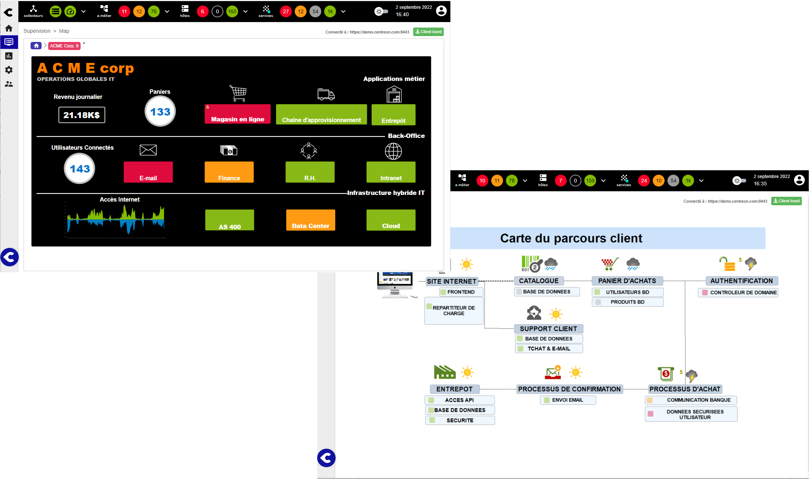

Les capacités de visualisation graphique de Centreon reposent sur l'extension **Centreon MAP**.

> Centreon MAP est une **extension** Centreon qui nécessite une [licence](../administration/licenses.md) valide.
> Pour en acquérir une et récupérer les dépôts nécessaires, contactez [Centreon](mailto:sales@centreon.com).

Centreon MAP est un outil de visualisation et de cartographie de données conçu pour les administrateurs et les développeurs de la gestion des opérations informatiques (ITOM).
Il est capable d'afficher des aperçus graphiques efficaces et de cartographier des données corrélées dans des vues personnalisées pertinentes pour l'utilisateur.

Créez des vues logiques à l'aide du client Desktop...

...et visualisez-les directement dans votre navigateur.

Vous pouvez également utiliser la vue géographique pour afficher les ressources de la manière dont votre informatique est répartie dans une ville, un pays ou le monde.

Les deux types de vues peuvent être affichés dans la même interface utilisateur web Centreon :

- Soit à partir de l'interface utilisateur dédiée Centreon MAP, qui comprend également une fonction de recherche.
- soit dans une vue personnalisée, à l'aide du widget Centreon MAP dédié.
