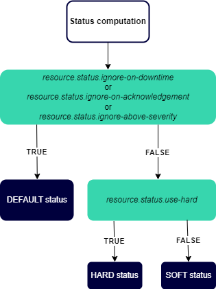

## Définir les paramètres de calcul du statut

Le serveur Centreon MAP vous offre la possibilité de personnaliser la façon dont le statut hérité est calculé et rendu dans les vues.
Vous pouvez utiliser les paramètres suivants pour adapter le comportement du calcul du statut hérité à votre cas d'utilisation.

### Qu'est-ce qu'un statut hérité ?

Un statut hérité est un statut personnalisé de Centreon MAP associé à certains objets, et qui est basé sur le pire statut de ses enfants. Voici les règles :

- Un hôte a deux statuts : son propre statut (disponible/indisponible/en attente) et un statut hérité qui est basé sur le pire statut de ses services.
- Un groupe d'hôtes n'a qu'un statut hérité correspondant au pire statut de ses enfants (hôtes, services).
- Un groupe de services n'a qu'un statut hérité : le pire statut de ses enfants (services).
- Un conteneur n'a qu'un statut hérité : le pire statut de ses enfants (hôtes, services, méta-services, groupes d'hôtes, groupes de services, BA, widgets).

### Paramètres de calcul du statut

| Paramètre                           | Valeur possible | Valeur par défaut | Description                                                                                                 |
| ----------------------------------- | --------------- | ----------------- | ----------------------------------------------------------------------------------------------------------- |
| resource.status.use-hard              | true or false   | false             | Utiliser uniquement la valeur du statut HARD pour la propagation du statut hérité                       |
|resource.status.ignore-on-downtime   | true or false   | false             | Ne pas propager l'état des ressources en maintenance et utiliser le statut par défaut                                                  |
| resource.status.ignore-on-acknowledgement | true or false   | false             | Ne pas propager l'état des ressources acquittées et utiliser le statut par défaut                            |
| resource.status.ignore-above-severity    | integer         | max value                 | Ne pas propager l'état des ressources dont la sévérité est supérieure à cette valeur et utiliser le statut par défaut        |

Si le paramètre (en maintenance, acquitté, sévérité) a la valeur suivante :
- **true** : la valeur du statut HARD (paramètre use-hard) n'est pas utilisée mais la valeur par défaut l'est.
- **false** : si le statut HARD est à true, le statut HARD est utilisé. Si le statut HARD est à false, c'est le statut SOFT qui est utilisé.

Le diagramme ci-dessous résume la manière dont le statut est calculé :

### Modifier les paramètres

- Vous pouvez configurer ces paramètres dans le fichier **/etc/centreon-map/map-config.properties**.

- Si vous ajoutez, supprimez ou mettez à jour un paramètre, veillez à redémarrer **centreon-map-engine**.
