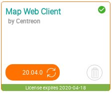

Ce chapitre décrit comment mettre à jour votre extension Centreon MAP. Pour ce faire, vous devez mettre à jour les trois principaux composants :

- le serveur Centreon MAP
- l'interface Web Centreon MAP et son widget
- le client de bureau (mis à jour automatiquement).

Avant de mettre à jour le serveur Centreon MAP, nous vous recommandons vivement d'effectuer une extraire (sauvegarde) de votre base de données `centreon_studio`.
Cela vous permettra de revenir facilement à l'état précédent si nécessaire.

N'oubliez pas de lire les notes de mise à jour pour une explication des fonctionnalités, des corrections et des procédures personnalisées.

## Serveur MAP de Centreon

Exécutez les commandes suivantes pour mettre à niveau votre serveur Centreon MAP :

``` shell
systemctl stop centreon-map
yum update centreon-map-server
systemctl start centreon-map
```

Ce point ne s'applique que si vous avez personnalisé votre fichier de configuration **centreon-map.conf**.
Lors de la mise à jour de votre module MAP, le fichier **/etc/centreon-studio/centreon-map.conf** n'est pas mis à niveau automatiquement : le nouveau fichier de configuration apporté par le rpm ne remplace pas l'ancien fichier.
Vous devez copier les modifications manuellement dans votre fichier de configuration personnalisé.

* L'ancien fichier de configuration est renommé **centreon-map.conf.rpmsave**.
* La mise à niveau installe un nouveau fichier **centreon-map.conf**.

Exécutez une comparaison entre l'ancien et le nouveau fichier de configuration :

```shell
diff -u /etc/centreon-studio/centreon-map.conf /etc/centreon-studio/centreon-map.conf.rpmsave
```

Pour chaque différence entre les fichiers, évaluez si vous devez la copier de **centreon-map.conf.rpmsave** vers **centreon-map.conf**.

## Interface Web de Centreon MAP

```shell
yum update centreon-map-web-client
```

Terminez la mise à niveau en allant dans **Administration > Extensions > Manager** (parties module et widget) :



## Centreon MAP Desktop client

Si l'ordinateur de l'utilisateur dispose d'une connexion en ligne, le client de bureau est automatiquement mis à jour à la dernière version correspondant au serveur.

Sinon, le client peut être téléchargé via le menu **Surveillance > Carte** et le bouton **Client de bureau**.
