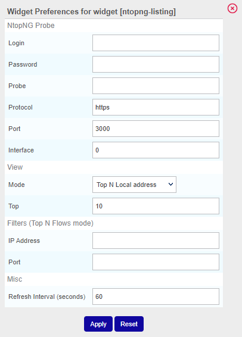
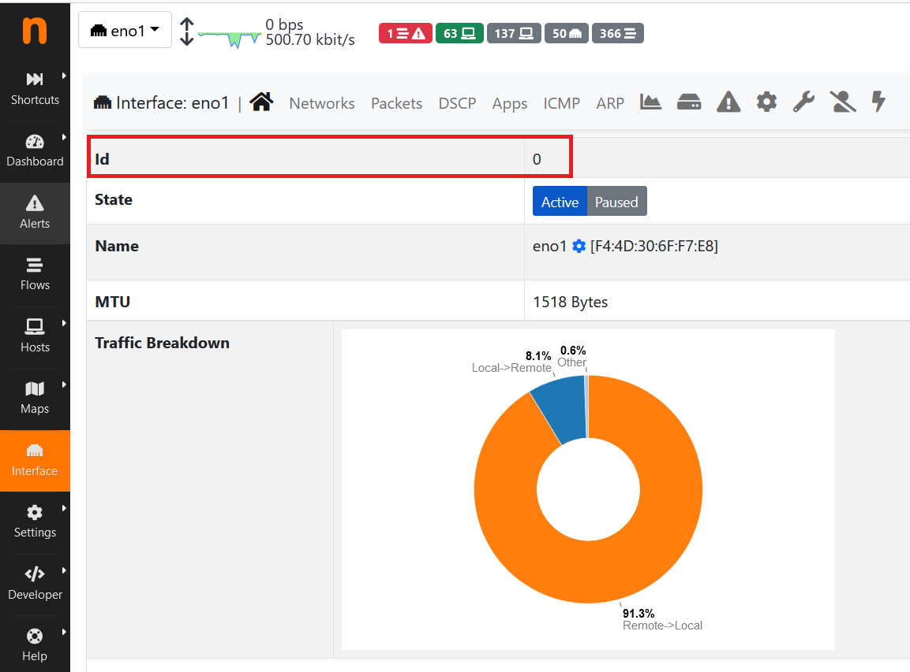
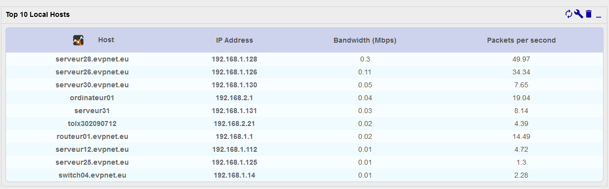
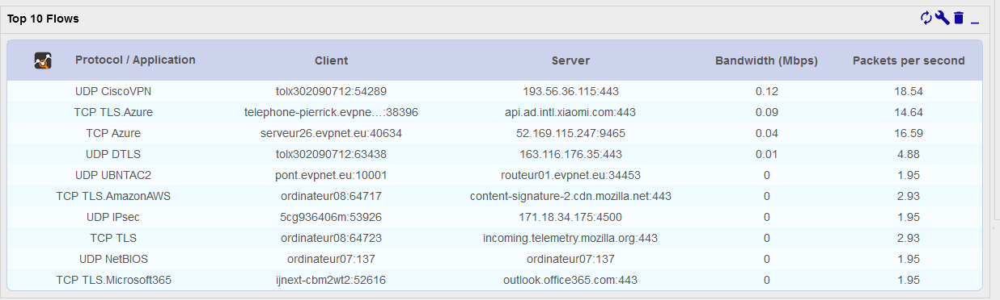
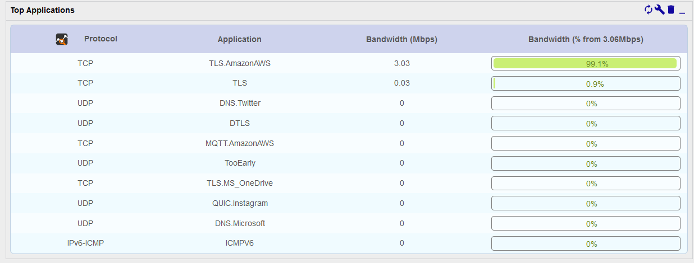

Utilisez le widget NtopNG dans des [vues personnalisées](../../alerts-notifications/custom-views.md) pour visualiser des données sur l'utilisation du réseau collectées par une instance NtopNG.

Le widget peut afficher les vues suivantes (voir [**Examples**](#exemples) ci-dessous) :

* **Top N Local address** : Affiche les n hôtes locaux qui reçoivent/émettent le plus de trafic
* **Top N Remote address** : Affiche les n hôtes distants qui reçoivent/émettent le plus de trafic
* **Top N Flows** : Affiche les flux réseaux les plus importants (client local vers distant)
* **Top N Applications** : Affiche les n application qui reçoivent/émettent le plus de trafic (les flux sont regroupés par application, protocolaire ou site Web comme Amazon/Google)

## Configurer le widget

Pour configurer le widget, cliquez sur l'icône molette dans son coin supérieur droit. Une fenêtre s'ouvre :

### NtopNG Probe

* **Login** : Compte qui se connectera à NtopNG (il est conseillé d'utiliser un compte non administrateur)
* **Password** : Mot de passe du compte
* **Probe** : Adresse IP du serveur NtopNG
* **Protocol** : Protocole de communication (https par défaut)
* **Port** : Port de connexion à l'interface (TCP/3000 par défaut)
* **Interface** : Identifiant de l'interface. Vous vouvez le voir dans l'interface NtopNG, à la page **Interface** (en sélectionnant l'interface concernée) :

### View

* Mode : Sélectionner les données que vous souhaitez afficher
* Top : Définir le nombre de lignes à afficher (nombre d'hôtes/applications etc.)

### Filters

Ces options ne concernent que la vue **Top N Flows**. Vous pouvez filtrer sur une adresse IP, sur un port, ou sur les deux à la fois.

* **IP Address** : N'afficher que le trafic concernant une adresse IP particulière (ne pas utiliser le nom d'hôte)
* **Port** : N'afficher que le trafic sur ce port

### Misc

* **Refresh interval (seconds)** : Définir à quelle fréquence les données doivent être rafraîchies

## Exemples

### Top N Local address

### Top N Remote address

### Top N Flows

Vue sans filtre :

Vue avec filtre sur une adresse IP :

Vue avec filtre sur un port et une adresse IP :

### Top N Applications

