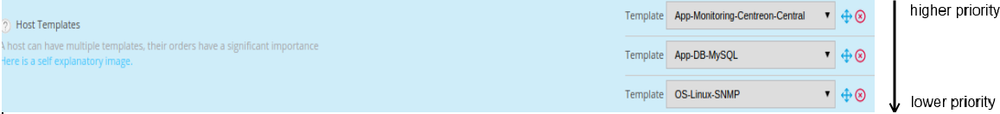
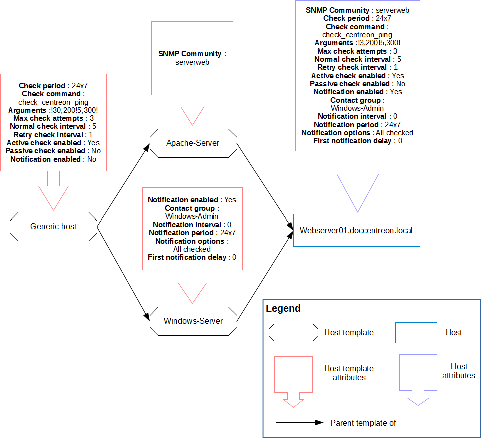

Un modèle est une pré-configuration de paramètres d’un objet qui pourra être
utilisé pour configurer ce dernier. Le principal avantage est de pouvoir définir
des valeurs par défaut pour certains objets afin d’accélérer la création
d’objets similaires.

Un modèle peut hériter des propriétés d’un autre modèle.

Les modèles issus de Plugin Packs permettent de mettre facilement un hôte en supervision
car ils fournissent les [commandes](commands.md) de vérification appropriées.

## Héritage

Un hôte ou un modèle d’hôte peut hériter d’un ou plusieurs modèles d’hôtes. Cet
héritage peut être :

  - de type associatif (addition de plusieurs modèles d’hôte)
  - de type père-fils

### Héritage de type Père-Fils

Il s’agit d’une prédéfinition de paramètres à “n” niveaux. L’objet hérite de son
modèle qui peut lui même hériter de son modèle. Si le fils redéfinit un
paramètre, ce dernier écrase celui défini dans les modèles de niveaux
supérieurs. Sinon, il vient compléter le paramétrage.

### Héritage de type associatif

Il s’agit d’additionner plusieurs modèles au sein d’un même objet afin
d’additionner l’ensemble des paramètres disponibles. Si un hôte hérite de
plusieurs modèles d’hôtes et si un même paramètre est défini sur plusieurs
modèles, alors le modèle d’hôte situé au-dessus des autres modèles est
prioritaire par rapport à ses ascendants.

Le schéma ci-dessous présente un hôte héritant de plusieurs modèles d’hôtes.

## Configuration

Pour créer un modèle d’hôtes :

1. Rendez-vous dans le menu **Configuration > Hôtes > Modèles** et cliquez sur
le bouton **Ajouter**.

> Rapportez-vous au chapitre de configuration des
> *[hôtes](hosts.md)* pour configurer un modèle car le
> formulaire est identique.

> Par défaut, les modèles d’hôte verrouillés sont masqués. Cocher la case
> “Eléments verrouillés” pour les afficher tous.

Lors de la création d’un modèle, seul le nom du modèle est obligatoire. Les
autres attributs sont optionnels.