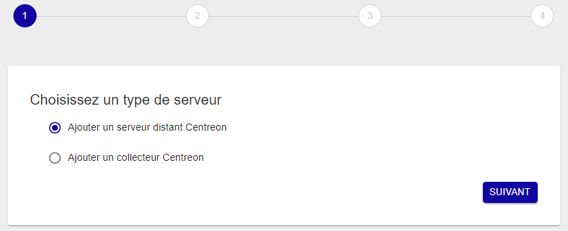
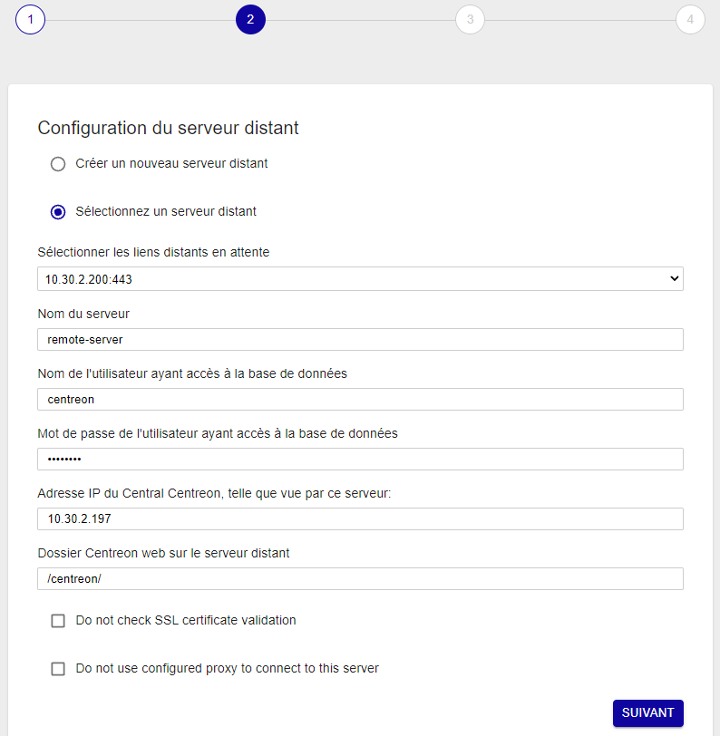
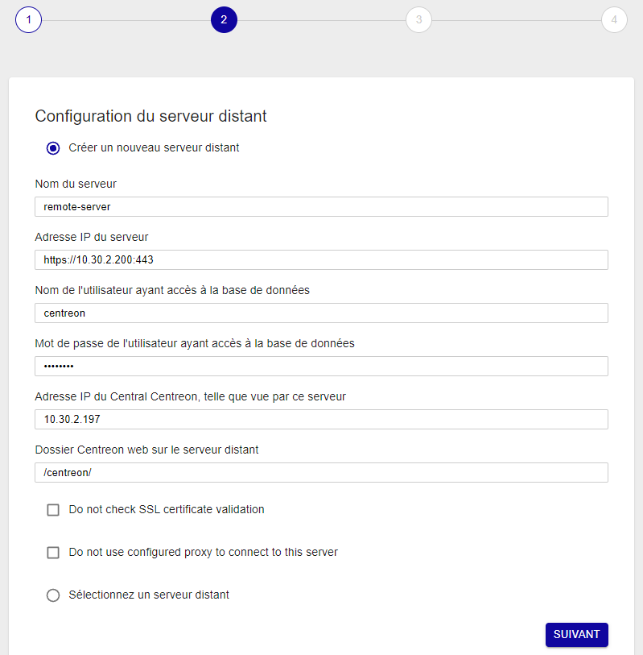
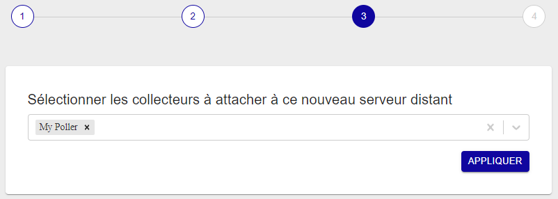
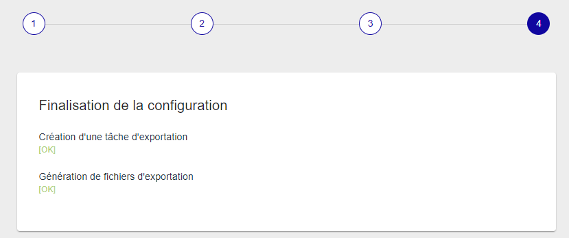
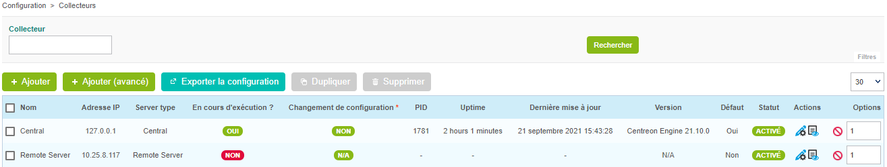
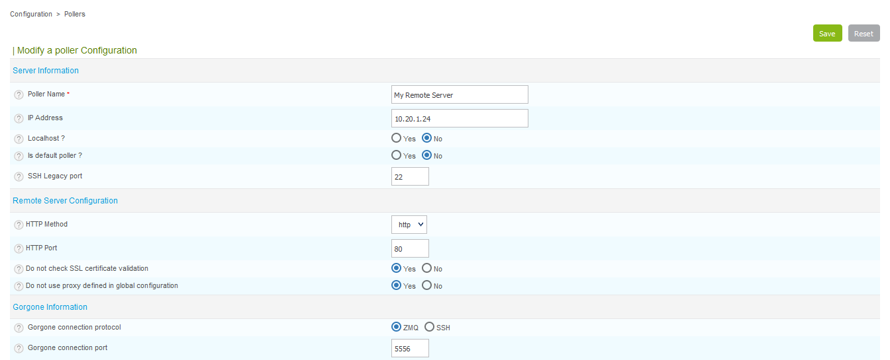
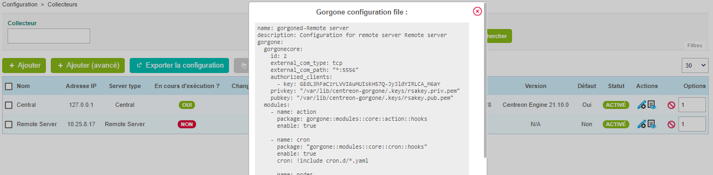
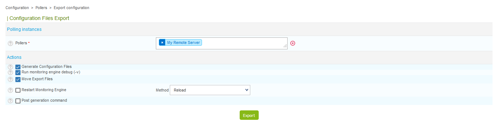
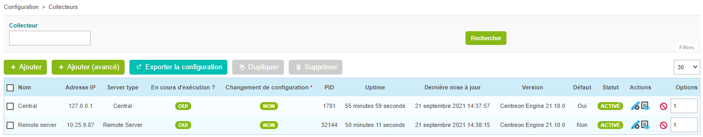

import Tabs from '@theme/Tabs';
import TabItem from '@theme/TabItem';


## Prérequis

Installez le serveur distant (soit [en utilisant l'ISO](../../installation/installation-of-a-remote-server/using-centreon-iso.md), soit [en utilisant les paquets](../../installation/installation-of-a-remote-server/using-packages.md)).

## Étape 1 : Configurer un nouveau Remote Server

Depuis la version 18.10, un nouvel assistant de configuration permet de créer
toutes les configurations nécessaires pour ajouter un Remote Server.

1. Rendez-vous dans le menu **Configuration > Collecteurs** et cliquez sur
**Ajouter** pour accéder à l'assistant de
configuration.

2. Sélectionnez **Ajouter un serveur distant Centreon** et cliquez sur
**Suivant** :

  

3. Sélectionnez l'option désirée :

  - Si vous avez activé votre serveur en suivant la documentation, sélectionnez
l'option **Sélectionnez un serveur distant**. Dans la liste déroulante
sélectionnez votre serveur, puis saisissez les informations demandées :

  

  - Sinon, sélectionnez l'option **Créer un nouveau serveur distant** et saisissez les informations demandées :

    

    Les champs **Nom de l'utilisateur ayant accès à la base de données** et **Mot de
      passe de l'utilisateur ayant accès à la base de données** sont les accès aux
      bases de données Centreon définis durant l'installation de votre serveur distant.

    Le champ **Adresse IP du serveur** est de la forme : [(http|https)://]@IP[:(port)].
      Si votre serveur distant est accessible en HTTPS, il est nécessaire de préciser
      la méthode d'accès et le port si celui-ci n'est pas par défaut.

    L'option **Do not check SSL certificate validation** permet de contacter le
      serveur distant si celui-ci possède un certificat SSL auto-signé.

      L'option **Do not use configured proxy to connect to this server** permet de
      contacter le serveur distant en n'utilisant pas la configuration du proxy
      configurée sur le serveur Central.

4. Cliquez sur **Suivant** :

5. Sélectionnez le(s) collecteur(s) à lier à ce serveur distant. Puis cliquez sur **Appliquer** :

    

    L'assistant va configurer votre nouveau serveur :

    

    Le serveur distant est maintenant configuré :

    

## Étape 2 : Activer la communication

La communication entre le serveur Central et un serveur distant est assurée par Gorgone et peut
être faite en utilisant ZMQ (avec un Gorgone s'exécutant sur le serveur distant,
recommandé) ou en utilisant le protocole SSH.

<Tabs groupId="sync">
<TabItem value="Avec ZMQ" label="Avec ZMQ">

1. Sélectionner le type de communication :

    Éditez la configuration du serveur distant fraîchement créé, et sélectionnez **ZMQ**
    comme **Protocole de connexion utilisé par Gorgone**. Définissez le **port**
    adéquat (le port **5556** est recommandé).

    

2. Cliquez sur **Sauvegarder**.

    > Notez que le *SSH Legacy port* n'est plus utilisé et sera supprimé.
    >
    > Si vous l'utilisiez dans des scripts personnalisés, pensez à changer pour
    > utiliser le système de communication de Gorgone.

2. Copier la configuration de Gorgone :

    Depuis la liste des collecteurs, cliquez sur l'icône d'action **Gorgone
    configuration** sur la ligne correspondant à votre serveur distant 

    Une pop-in affiche la configuration à copier dans le **terminal du serveur
    distant**.
    Cliquez sur **Copy to clipboard**.

    

    Collez le contenu du presse-papier directement dans le **terminal du serveur distant**
    car celui-ci créera le fichier de configuration attendu :

    ```shell
    cat <<EOF > /etc/centreon-gorgone/config.d/40-gorgoned.yaml
    name: gorgoned-My Remote Server
    description: Configuration for remote server My Remote Server
    gorgone:
      gorgonecore:
        id: 3
        external_com_type: tcp
        external_com_path: "*:5556"
        authorized_clients:
          - key: Np1wWwpbFD2I0MdeHWRlFx51FmlYkDRZy9JTFxkrDPI
        privkey: "/var/lib/centreon-gorgone/.keys/rsakey.priv.pem"
        pubkey: "/var/lib/centreon-gorgone/.keys/rsakey.pub.pem"
      modules:
        - name: action
          package: gorgone::modules::core::action::hooks
          enable: true

        - name: cron
          package: "gorgone::modules::core::cron::hooks"
          enable: true
          cron: !include cron.d/*.yaml

        - name: nodes
          package: gorgone::modules::centreon::nodes::hooks
          enable: true

        - name: proxy
          package: gorgone::modules::core::proxy::hooks
          enable: true

        - name: legacycmd
          package: gorgone::modules::centreon::legacycmd::hooks
          enable: true
          cmd_file: "/var/lib/centreon/centcore.cmd"
          cache_dir: "/var/cache/centreon/"
          cache_dir_trap: "/etc/snmp/centreon_traps/"
          remote_dir: "/var/cache/centreon/config/remote-data/"

        - name: engine
          package: gorgone::modules::centreon::engine::hooks
          enable: true
          command_file: "/var/lib/centreon-engine/rw/centengine.cmd"

        - name: statistics
          package: "gorgone::modules::centreon::statistics::hooks"
          enable: true
          broker_cache_dir: "/var/cache/centreon/broker-stats/"
          cron:
            - id: broker_stats
              timespec: "*/5 * * * *"
              action: BROKERSTATS
              parameters:
                timeout: 10
            - id: engine_stats
              timespec: "*/5 * * * *"
              action: ENGINESTATS
              parameters:
                timeout: 10

    EOF
    ```

    Appuyer sur la touche *Entrée* pour que la commande soit appliquée.

    > Vous pouvez copier la configuration en sélectionnant le contenu de la pop-in
    > pour la copier dans un fichier de configuration personnalisé.

3. Démarrer le daemon Gorgone :

  Depuis le serveur distant, exécutez la commande suivante pour redémarrer le
    service Gorgone :

  ```shell
  systemctl restart gorgoned
  ```

  Assurez-vous que le service est démarré en exécutant la commande suivante :

  ```shell
  systemctl status gorgoned
  ```

  Le résultat devrait être similaire :

  ```shell
  ● gorgoned.service - Centreon Gorgone
    Loaded: loaded (/etc/systemd/system/gorgoned.service; enabled; vendor preset: disabled)
    Active: active (running) since Wed 2020-03-24 19:45:00 CET; 6s ago
  Main PID: 30902 (perl)
    CGroup: /system.slice/gorgoned.service
            ├─30902 /usr/bin/perl /usr/bin/gorgoned --config=/etc/centreon-gorgone/config.yaml --logfile=/var/log/centreon-gorgone/gorgoned.log --severity=info
            ├─30916 gorgone-nodes
            ├─30917 gorgone-dbcleaner
            ├─30924 gorgone-proxy
            ├─30925 gorgone-proxy
            ├─30938 gorgone-proxy
            ├─30944 gorgone-proxy
            ├─30946 gorgone-proxy
            ├─30959 gorgone-engine
            ├─30966 gorgone-action
            └─30967 gorgone-legacycmd

  Mar 24 19:45:00 localhost.localdomain systemd[1]: Started Centreon Gorgone.
  ```

   4. **Pour forcer le Gorgone du Central à se connecter au serveur distant**,
redémarrez-le avec la commande suivante depuis le **serveur Central** :

  ```shell
  systemctl restart gorgoned
  ```

</TabItem>
<TabItem value="Avec SSH (Déprécié)" label="Avec SSH (Déprécié)">

> **Déprécié**
>
> Ce mode ne doit plus être utilisé car il n'autorise pas la
> synchronisation des données entre l'interface utilisateur du Central
> et du Remote Server.

</TabItem>
</Tabs>

## Étape 3 : Exporter la configuration

1. Depuis la liste des collecteurs, sélectionnez le serveur distant et cliquez sur
**Exporter la configuration**.

2. Cochez ensuite les trois premières cases et cliquez sur  **Exporter** :

    

3. Pour finir, depuis le serveur distant, démarrez/redémarrez les services de
collecte :

    ```shell
    systemctl restart cbd centengine
    ```

    Le moteur de supervision du Remote Server va alors démarrer et se connecter au
    Broker Central.

    

## Premiers pas

Rendez-vous dans le chapitre [Premiers pas](../../getting-started/installation-first-steps.md#start-to-monitor-your-first-host)
pour mettre en place votre première supervision.
