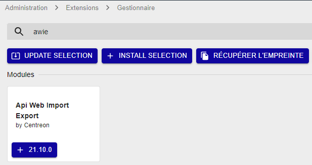
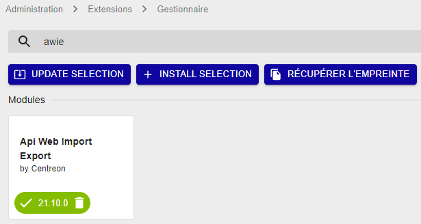
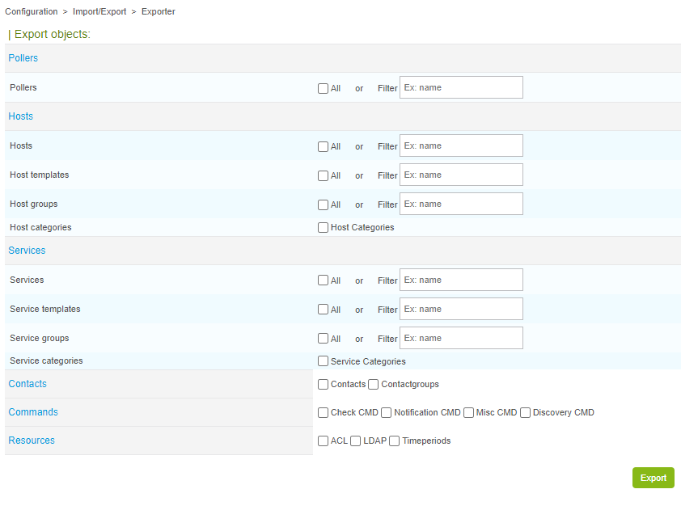
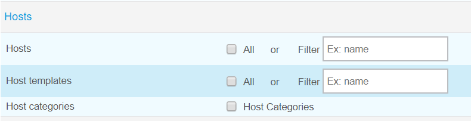
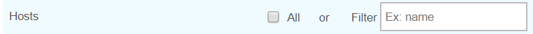
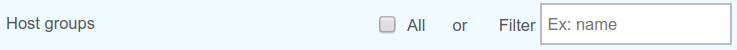
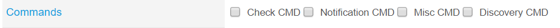
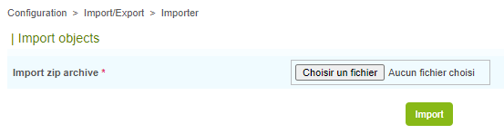

Le module Centreon API Web Import/Export (AWIE) a été conçu pour aider les utilisateurs à configurer plusieurs plateformes Centreon Web de manière plus rapide et plus facile, grâce à son mécanisme d'import/export.

À partir d'un environnement source correctement configuré, vous pouvez utiliser le module AWIE pour exporter des objets choisis vers un environnement cible. Ces objets seront répliqués.

Centreon AWIE est basé sur les commandes CLAPI mais sa valeur ajoutée est de permettre l'utilisation de l'interface Web Centreon au lieu des lignes de commande.

## Installation

### Installer les paquets

Exécutez les commandes suivantes en tant qu'utilisateur privilégié :

``` shell
yum install centreon-awie
```

### Installer dans l'interface

Allez à la page **Administration > Extensions > Manager** et recherchez **awie**. Cliquez sur
**Install selection** :



Le module est maintenant installé :



## Exporter la configuration

Lorsque vous avez correctement configuré tous les objets Centreon Web dont vous avez besoin (Collecteur, Hôtes, Services, Contacts, Périodes de temps, etc.), vous pouvez les exporter vers une autre plateforme Centreon Web en allant dans le menu **Configuration > Import/Export**.

La page par défaut est **Exporter**.



### Nom de l'archive exportée

Sachez que si vous modifiez le nom de l'archive créée, vous ne pourrez pas l'importer tant que le nom de l'archive ne sera pas identique au nom du fichier contenu dans l'archive.

### Exporter le collecteur


Si vous cochez la case **All** (non cochée par défaut), tous les collecteurs configurés seront exportés avec leurs fichiers de configuration (pour le moteur, le broker, etc.) après avoir cliqué sur le bouton **Export**.

Si vous souhaitez exporter un seul collecteur, saisissez son nom exact dans le champ **Filter** (une seule valeur est acceptée, ce champ ne propose pas de liste d'éléments).

### Exporter les hôtes



#### Hôtes



Il s'agit du même principe que l'export de collecteur, sauf que :

Si vous choisissez d'exporter tous les hôtes, les configurations d'hôtes, les modèles d'hôtes liés et les modèles de services liés seront exportés mais les hôtes seront créés dans l'environnement cible sans leurs services. Cependant, vous pourrez créer des services en sélectionnant la valeur **Yes** pour le bouton radio **Create Services linked to the Template too** dans la page **Configuration > Hosts**, pour chaque hôte. Sauvegardez la configuration de l'hôte et exportez la configuration.

Si vous exportez un hôte spécifique en utilisant le champ **Filter** (un seul hôte à la fois), l'hôte sera créé dans la nouvelle plateforme avec tous ses services.

#### Modèles d'hôtes


Cochez la case **Host templates** si vous voulez exporter tous les modèles d'hôtes.

Utilisez le champ **Filter** pour renseigner une seule valeur, si vous souhaitez exporter un modèle d'hôtes spécifique.

#### Groupes d'hôtes



Cochez la case **Host groups** si vous voulez exporter tous les groupes d'hôtes.

Utilisez le champ **Filter** pour renseigner une seule valeur, si vous souhaitez exporter un groupe d'hôtes spécifique.

#### Catégories d'hôtes


Cochez la case **Host categories** si vous voulez exporter toutes les catégories d'hôtes. Il n'y a pas de champ **Filter** pour cet objet.

### Exporter les services


#### Services


Il s'agit du même principe que l'export de collecteur, sauf que :

Si vous utilisez le champ **Filter** pour un service spécifique, le processus d'import/export
créera TOUS les services liés au premier hôte lié au service filtré.

#### Modèles de services


Cochez la case **Service templates** si vous voulez exporter tous les modèles de services.

Utilisez le champ **Filter** pour renseigner une seule valeur, si vous souhaitez exporter un modèle de services spécifique.

#### Groupes de services


Cochez la case **Service groups** si vous voulez exporter tous les groupes de services.

Utilisez le champ **Filter** pour renseigner une seule valeur, si vous souhaitez exporter un groupe de services spécifique.

#### Catégories de services


Cochez la case **Service categories** si vous voulez exporter toutes les catégories de services. Il n'y a pas de champ **Filter** pour cet objet.

### Exporter les contacts


Vous pouvez exporter tous les contacts (sans leurs groupes de contacts liés) ou tous les groupes de contacts (avec leurs utilisateurs liés). Il n'y a pas de champ **Filter** pour cet objet.

### Exporter les commandes



Cochez la case correspondant au type de commande que vous souhaitez exporter (**Check**, **Notification**, **Misc** ou **Discovery**). Il n'y a pas de champ **Filter** pour cet objet.

> Les commandes de notification de la ligne de commande ne sont pas entièrement exportées (ce problème est connu).

### Exporter les ressources


### ACL

Cochez la case **ACL** si vous souhaitez exporter tous les objets ACL (**Access groups**,
**Menus Access**, **Resource Access**, **Actions Access**). Il n'y a pas de champ **Filter** pour cet objet.

> Les relations entre les objets ACL sont exportées mais les liens entre ces différents objets ne sont pas créés une fois importés.

### LDAP

Cochez la case **LDAP** si vous souhaitez exporter les configurations LDAP. Il n'y a pas de champ **Filter** pour cet objet.

### Périodes de temps

Cochez la case **Timeperiods** si vous souhaitez exporter toutes les périodes de temps. Il n'y a pas de champ **Filter** pour cet objet.

## Importer la configuration

Dans la page **Exporter**, chaque fois que vous cliquez sur le bouton **Export**, un fichier d'archive ZIP est créé et téléchargé.

C'est ce fichier que vous chargerez dans la page **Importer** d'une autre plateforme Centreon Web.

Allez dans **Configuration > Import/Export > Import** :



Sélectionnez le fichier ZIP **centreon-clapi-export** souhaité et cliquez sur le bouton **Import** :


Le message **Import successful** doit normalement s'afficher :


Pour vérifier que les objets sont correctement importés, allez dans les pages **Configuration**.

> Il est nécessaire de générer, tester et exporter la configuration.
