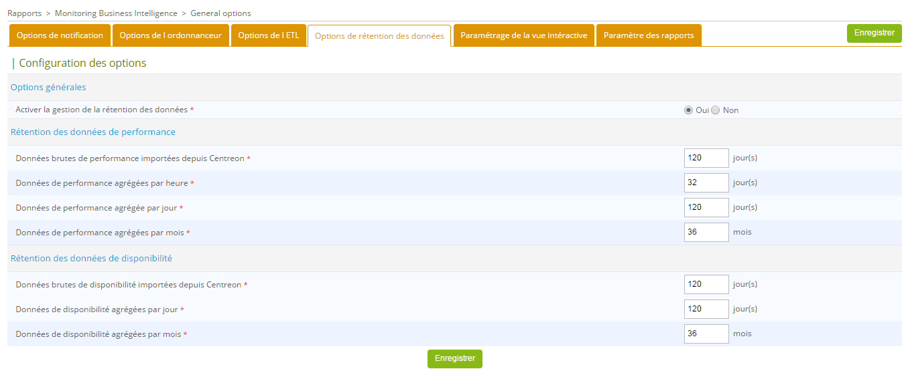

import Tabs from '@theme/Tabs';
import TabItem from '@theme/TabItem';

> Centreon MBI est une **extension** Centreon qui nécessite une clé de licence valide. Pour
> Pour en acheter une et récupérer les référentiels nécessaires, contactez
> Centreon](mailto:sales@centreon.com).

Quatre grandes étapes pour installer Centreon MBI :

- Vérifiez les prérequis du système.
- Installez l'interface Centreon MBI dans l'application Centreon (Centreon MBI Server).
- Installez le serveur de rapports (Centreon MBI Reporting Server).
- Configurer l'extraction, la transformation et le chargement (ETL) dans l'interface MBI Centreon.

## Architecture

Ce chapitre décrit l'architecture de la MBI de Centreon et fournit un
l'intégration de l'extension au logiciel de surveillance Centreon.
de Centreon.

Les informations sont destinées aux administrateurs qui installeront ou configureront Centreon MBI.
configurer Centreon MBI.

### Serveur de rapports dédié

Cette architecture et ces conditions préalables s'appliquent à :

- Environnements de test
- Environnements de pré-production
- Environnements de production.

Le schéma ci-dessous présente les principaux composants de Centreon MBI :


*La base de données de surveillance peut être installée sur un serveur autre que le serveur Centreon*.

- **ETL** : Processus qui extrait, transforme et charge les données dans la
  base de données de reporting.
- **CBIS** : Ordonnanceur qui gère l'exécution et la publication des tâches.
- **Base de données de reporting** : Base de données MariaDB qui contient les données de reporting
  et certaines données brutes extraites de la base de données de surveillance.

### Tableau des flux réseau

Le tableau ci-dessous présente les différents types de flux, par défaut,
entre le serveur BI dédié, le serveur Centreon et les bases de données :

|  **Application**  |  **Source**      |       Destination     |   Port |  Protocol |
|-------------------|------------------|-----------------------|--------|-----------|
|  ETL/CBIS         | Reporting server |  Centreon Database    | 3306   | TCP       |
|  SSH              | Reporting server |  Centreon             | 22     | TCP       |
|  CBIS             | Centreon         |  Reporting server     | 1234   | TCP       |
|  CBIS             | Reporting server |  Centreon             | 80     | HTTP\*    |
|  Widgets          | Centreon         |  Reporting server     | 3306   | TCP       |

\**Uniquement requis pour les rapports Host-Graph-v2 et Hostgroup-Graph-v2 qui utilisent l'API Centreon pour générer des graphiques*.

### Informations sur les paquets

L'installation de Centreon MBI nécessite deux paquets RPM :

- Centreon-bi-server : Installe l'interface MBI de Centreon intégrée au frontal de Centreon.
  front-end de Centreon et doit résider sur le serveur Web de Centreon.
- Centreon-bi-reporting-server : Contient tous les composants nécessaires à l'exécution du
  serveur de rapports (planificateur de rapports, ETL, rapports standard).
  et doit résider sur un serveur dédié aux processus de reporting.

Vous devez installer la base de données MariaDB en même temps. Nous recommandons fortement
d'installer la base de données sur le même serveur pour des raisons de performance et
considérations.

## Conditions préalables

### Serveur central Centreon

**Logiciels**

- Centreon 22.04
- Vérifiez que le paramètre `date.timezone` est correctement configuré dans le fichier php ini [ici](../installation/installation-of-a-central-server/using-packages#set-the-php-time-zone)
  (même fuseau horaire affiché avec la commande `timedatectl status`)
- Évitez l'utilisation des variables suivantes dans votre configuration de surveillance de MariaDB.
  Elles interrompent l'exécution de longues requêtes et peuvent arrêter les travaux d'ETL ou de génération de rapports :
  - wait_timeout
  - interactive_timeout

**Utilisateurs et groupes**

| User               | Group                        |
|--------------------|------------------------------|
|  centreonBI (new)  | apache, centreon, centreonBI |
|  apache (existing) | centreonBI                   |

**Description des utilisateurs, umask et répertoire personnel**

| User       | umask  | home             |
|------------|--------|------------------|
| centreonBI |  0002  | /home/centreonBI |

### Reporting du serveur dédié

**Hardware**

| Monitored services      | CPU                    | RAM           |
|-------------------------|------------------------|---------------|
|  < 4 000                | 2 CPU ( 3Ghz ) minimum | 12GB minimum  |
|  < 20 000               | 4 CPU (3GHz) minimum   | 16GB minimum  |
| >= 20 000 and < 40 000  | 4 CPU (3GHz) minimum   | 24GB minimum  |
| > 40 000 and < 100 000  | 8 CPU (3GHz) minimum   | 32GB minimum  |
| > 100 000               | > Contact Centreon     |               |

**Espace de stockage** : Utilisez le [fichier d'estimation de l'espace de stockage] suivant(../assets/reporting/installation/Centreon-MBI-QuickGuide-Storage-Sizing_FR.xlsx)

**Système de fichiers**

| File system                  | Size                                                                                      |
|------------------------------|-------------------------------------------------------------------------------------------|
| /                            | 5GB minimum                                                                               |
| /var (containing MariaDB data) | Utilisez le résultat de la simulation de l'espace disque ci-dessus (fichier de données MariaDB).                      |
| MariaDB temp folder          | Nous recommandons de le garder dans /var                                                           |
| Volume group\*               | 5 Go minimum d'espace libre sur le **groupe de volumes** hébergeant le SGBD MariaDB **données**. |

Pour vérifier l'espace libre, utilisez la commande ci-dessous, en remplaçant vg\_data par le fichier
nom du groupe de volume :

```shell
vgdisplay vg_data | grep -i free
```

**Les logiciels**

- OS : CentOS 7 / Redhat 7 ou 8 / Debian 11
- SGBD : MariaDB 10.5
- Pare-feu : Désactivé ([show here](../installation/installation-of-a-central-server/using-packages#configure-or-disable-the-firewall))
- SELinux : Disabled ([show here](../installation/installation-of-a-central-server/using-packages#disable-selinux-if-it-is-installed))

>Assurez-vous que le fuseau horaire du serveur de rapports est le même que celui du serveur central, sinon les publications de rapports échoueront (lien vers le téléchargement manquant).
>Le même fuseau horaire doit être affiché avec la commande `timedatectl`.
> vous pouvez changer le fuseau horaire avec cette commande :
>
>```shell
>timedatectl set-timezone Europe/Paris
>```

Nous vous conseillons de configurer votre serveur de base de données MariaDB sur votre serveur de rapports afin d'obtenir de meilleures performances.
afin d'obtenir de meilleures performances. Vous aurez besoin d'au moins 12GB sur votre
serveur de rapports pour exécuter le fichier de configuration fourni ci-dessous. Ajoutez le
[le fichier suivant](../assets/reporting/installation/centreon.cnf) sur votre
serveur de rapports dans /etc/my.cnf.d/.

Assurez-vous d'avoir un dossier *tmp* dans */var/lib/mysql*.

> Ne définissez pas ces optimisations MariaDB sur votre serveur de surveillance.

Utilisateurs et groupes :

| User       | Group      |
|------------|------------|
| centreonBI | centreonBI |

Description des utilisateurs, umask et répertoire de base :

| User       | umask      | home              |
|------------|------------|-------------------|
| centreonBI | 0002       |  /home/centreonBI |

## Installer l'extension sur Centreon Web

Les tâches expliquées dans ce chapitre doivent être effectuées sur le **serveur central Centreon**.

Installez le référentiel MBI de Centreon, vous pouvez le trouver sur le 
[portail de support] (https://support.centreon.com/s/repositories).

Exécutez ensuite la commande suivante :

<Tabs groupId="sync">
<TabItem value="Alma / RHEL / Oracle Linux 8" label="Alma / RHEL / Oracle Linux 8">

```shell
dnf install centreon-bi-server
```

</TabItem>
<TabItem value="CentOS 7" label="CentOS 7">

```shell
yum install centreon-bi-server
```

</TabItem>
<TabItem value="Debian 11" label="Debian 11">

```shell
apt update && apt install centreon-bi-server
```

</TabItem>
</Tabs>

### Activer l'extension

Le menu **Administration > Extension > Gestionnaire** de Centreon vous permet de
d'installer les différentes extensions détectées par Centreon. Cliquez sur la carte **Centreon MBI** pour l'installer.

Téléchargez la licence envoyée par l'équipe Centreon pour pouvoir commencer à configurer les options générales.

### Configurer les options générales

Configurez les paramètres suivants dans le menu Options générales `Reporting >
Monitoring Business Intelligence > General Options` :

| Tab                  | Option                                           | Value                                                       |
|----------------------|--------------------------------------------------|-------------------------------------------------------------|
| Scheduler  Options   | CBIS Host                                        | Reporting server IP Address                                 |
| ETL Options          | Reporting engine uses a dedicated MariaDB server | Yes                                                         |
| Reporting Widgets \* | Reporting MariaDB database                       | Reporting database IP Address (default = same as CBIS Host) |


\* *Le test de connexion ne fonctionne pas encore à ce stade du processus d'installation.*

### Accès aux bases de données centrales de Centreon

<Tabs groupId="sync">
<TabItem value="Local monitoring database on Central server" label="Local monitoring database on Central server">

La base de données de surveillance MariaDB est hébergée sur le serveur de surveillance central.

Lancez la commande ci-dessous pour autoriser le serveur de rapports à se connecter aux
aux bases de données du serveur de surveillance. Utilisez l'option suivante :

**@ROOTPWD@** : Mot de passe MariaDB racine de la base de données de surveillance
S'il n'y a pas de mot de passe pour l'utilisateur "root", ne spécifiez pas l'option **root-password**.
option **root-password**.

```shell
/usr/share/centreon/www/modules/centreon-bi-server/tools/centreonMysqlRights.pl --root-password=@ROOTPWD@
```

</TabItem>
<TabItem value="Remote monitoring database on Central server" label="Remote monitoring database on Central server">

La base de données de surveillance MariaDB est hébergée sur un serveur dédié.

Connectez-vous par SSH au serveur de la base de données, et exécutez les commandes suivantes :

```SQL
CREATE USER 'centreonbi'@'$BI_ENGINE_IP$' IDENTIFIED BY 'centreonbi';
GRANT ALL PRIVILEGES ON centreon.* TO 'centreonbi'@'$BI_ENGINE_IP$';
GRANT ALL PRIVILEGES ON centreon_storage.* TO 'centreonbi'@'$BI_ENGINE_IP$';
```

**$BI_ENGINE_IP$** : Adresse IP du serveur de rapports.

</TabItem>
</Tabs>

> Si vous utilisez la réplication MariaDB pour vos **bases de données de surveillance**,
> certaines vues sont créées lors de l'installation de Centreon MBI.
> Vous devez les exclure de la réplication en ajoutant la ligne suivante dans le
> fichier my.cnf du serveur esclave.
>
> ```shell
> replicate-wild-ignore-table=centreon.mod_bi_%v01,centreon.mod_bi_%V01
> ```
>
> Ensuite, créez les vues manuellement sur le serveur esclave en lançant la
> ligne de commande suivante :
>
> #mysql centreon < [view_creation.sql](../assets/reporting/installation/view_creation.sql)

>#### Configuration supplémentaire pour Debian 11
>
>MariaDB doit écouter toutes les interfaces au lieu de localhost/127.0.0.1, qui est la valeur par défaut.
>Editer le fichier suivant :
>
>```shell
>/etc/mysql/mariadb.conf.d/50-server.cnf
>```
>
>Définissez le paramètre **bind-address** à **0.0.0.0** et redémarrez mariadb.
>
>```shell
>systemctl restart mariadb
>```

### Accorder des droits à l'utilisateur cbis

Lorsque vous installez Centreon MBI, un [utilisateur](../monitoring/basic-objects/contacts.md) appelé **cbis** est automatiquement créé. Il permet au moteur de génération de rapports d'extraire des données de Centreon (en utilisant les API) afin de les placer dans le rapport. Cet utilisateur doit [avoir accès à toutes les ressources surveillées par Centreon](../administration/access-control-lists.md) pour pouvoir extraire des graphiques de performance pour les rapports suivants :

- Host-Graph-v2 

- Hostgroup-Graph-v2.

Pour tester la connexion du serveur de rapports MBI à l'API Centreon, utilisez la commande suivante pour télécharger un graphique. Remplacez les paramètres du graphique et les horodatages par ceux que vous souhaitez, et remplacez XXXXXXXXX par le jeton d'authentification de l'utilisateur **cbis** :

```
curl -XGET 'https://IP_CENTRAL/centreon/include/views/graphs/generateGraphs/generateImage.php?akey=XXXXXXXXX&username=CBIS&hostname=<host_name>&service=<service_description>&start=<start_date>&end=<end_date>' --output /tmp/image.png
```

Exemple:

```
curl -XGET 'https://10.1.1.1/centreon/include/views/graphs/generateGraphs/generateImage.php?akey=otmw3n1hu03bvt9e0caphuf50ph8sdthcsk8ofdk&username=CBIS&hostname=my-poller&service=Cpu&start=1623016800&end=1623621600' --output /tmp/image.png
```

La sortie devrait ressembler à ceci, et `/tmp/image.png` devrait être une image du graphique que vous vouliez :

```
  % Total    % Received % Xferd  Average Speed   Time    Time     Time  Current
                                 Dload  Upload   Total   Spent    Left  Speed
100 18311  100 18311    0     0  30569      0 --:--:-- --:--:-- --:--:-- 30569
```

### Installer le serveur de rapports dédié

### Installer les paquets

Vous devez disposer des informations suivantes avant de procéder au
processus d'installation :

- IP/DNS de la base de données de surveillance
- IP/DNS de l'interface web Centreon
- IP/DNS de la base de données de reporting (localhost fortement recommandé)
- Accès (utilisateur/mot de passe) à la base de données de reporting
- Connaissance du mot de passe SSH (après l'avoir défini) pour l'utilisateur Centreon
  BI sur le serveur central de surveillance (pour publier les rapports sur l'interface web).
  interface).

Pour commencer l'installation du serveur de reporting, installez le référentiel MBI, vous pouvez le trouver sur le 
[portail de support] (https://support.centreon.com/s/repositories).

Exécutez ensuite la commande suivante :

<Tabs groupId="sync">
<TabItem value="Alma / RHEL / Oracle Linux 8" label="Alma / RHEL / Oracle Linux 8">

```shell
dnf install centreon-bi-reporting-server MariaDB-server MariaDB-client
```

Si vous avez installé votre serveur de rapports à l'aide d'une nouvelle distribution, vous devez ajouter la clé GPG suivante
vous devez ajouter la clé GPG suivante :

```shell
cd /etc/pki/rpm-gpg/
wget https://yum-gpg.centreon.com/RPM-GPG-KEY-CES
```

</TabItem>
<TabItem value="CentOS 7" label="CentOS 7">

```shell
yum install centreon-bi-reporting-server MariaDB-server MariaDB-client
```

Si vous avez installé votre serveur de rapports à l'aide d'une nouvelle distribution, vous devez ajouter la clé GPG suivante
vous devez ajouter la clé GPG suivante :

```shell
cd /etc/pki/rpm-gpg/
wget https://yum-gpg.centreon.com/RPM-GPG-KEY-CES
```

</TabItem>
<TabItem value="Debian 11" label="Debian 11">

Installer les paquets de pré-requis

```shell
apt install lsb-release ca-certificates apt-transport-https software-properties-common wget gnupg2
```

Installer le dépôt Open Jdk

```shell
wget -qO - https://adoptopenjdk.jfrog.io/adoptopenjdk/api/gpg/key/public | apt-key add -
add-apt-repository --yes https://adoptopenjdk.jfrog.io/adoptopenjdk/deb/
```

et importer la clé GPG de centreon

```shell
wget -O- https://apt-key.centreon.com | gpg --dearmor | tee /etc/apt/trusted.gpg.d/centreon.gpg > /dev/null 2>&1
```

Vous pouvez maintenant installer le paquet MBI de Centreon et le serveur MariaDB.

```shell
apt update
apt install centreon-bi-reporting-server mariadb-server mariadb-client
```

</TabItem>
</Tabs>

Activez le service cbis :

```shell
systemctl enable cbis
```

### Configuration du serveur de rapports

#### Optimisation de MariaDB

Assurez-vous que vous avez installé le fichier de configuration MariaDB fourni dans
les pré-requis avant de démarrer le service MariaDB [fichier suivant](../assets/reporting/installation/centreon.cnf)

Pour l'installation, il est nécessaire de modifier la limitation **LimitNOFILE**.
Définir cette option dans /etc/my.cnf ne fonctionnera PAS.

```shell
mkdir -p  /etc/systemd/system/mariadb.service.d/
echo -ne "[Service]\nLimitNOFILE=32000\n" | tee /etc/systemd/system/mariadb.service.d/limits.conf
systemctl daemon-reload
systemctl restart mariadb
```

>#### Configuration supplémentaire pour Debian 11
>
>MariaDB doit écouter toutes les interfaces au lieu de localhost/127.0.0.1, qui est la valeur par défaut.
>Editer le fichier suivant :
>
>```shell
>/etc/mysql/mariadb.conf.d/50-server.cnf
>```
>
>Définissez le paramètre **bind-address** à **0.0.0.0** et redémarrez mariadb.
>
>```shell
>systemctl restart mariadb
>```

Si ce service ne peut pas démarrer, supprimez les fichiers
ib_log avant de redémarrer MariaDB (assurez-vous que MariaDB est arrêté) :

```shell
rm -f /var/lib/mysql/ib_logfile*
systemctl start mariadb
```

Si vous utilisez un fichier socket MariaDB personnalisé, modifiez le fichier `/etc/my.cnf`.
et dans la section [client], ajoutez la variable suivante :

```shell
socket=$PATH_TO_SOCKET$
```

### Sécuriser la base de données

Depuis MariaDB 10.5, il est obligatoire de sécuriser l'accès root de la base de données avant d'installer Centreon.
Si vous utilisez une base de données locale, exécutez la commande suivante sur le serveur central sinon sur le serveur de la base de données :

```shell
mysql_secure_installation
```

* Répondez **oui** à toutes les questions, sauf à "Disallow root login remotely ?
* Il est obligatoire de définir un mot de passe pour l'utilisateur **root** de la base de données. Vous aurez besoin de ce mot de passe pendant l'[installation web](../web-and-post-installation.md).

> Pour plus d'informations, veuillez consulter la [documentation officielle de MariaDB](https://mariadb.com/kb/en/mysql_secure_installation/).

### Commencer à configurer

Vérifiez d'abord que le système de reporting MariaDB fonctionne. Ensuite, lancez la
commande suivante, en répondant aux questions :

```shell
/usr/share/centreon-bi/config/install.sh
```

Le script gère la clé d'échange SSH entre le serveur de surveillance et le serveur de rapports.
et le serveur de rapports, et configure la règle de publication SFTP par défaut
afin de publier les rapports sur l'interface web Centreon. Enfin, il
active la sauvegarde et démarre le service CBIS.

Une fois l'installation terminée, passez au chapitre suivant pour configurer l'ETL.

#### Problème avec la clé d'échange SSH.
Dans quelques cas, la clé d'échange SSH a échoué.
Procédez manuellement comme suit :

**Sur le serveur de surveillance**. Pour commencer, passez à l'environnement `bash` de `centreonBI` :

```bash
su - centreonBI
```

Ensuite, générez une clé ssh pour préparer l'environnement :

```bash
ssh-keygen -t ed25519 -a 100
```

Ensuite, **sur le serveur de rapports**. Passez dans l'environnement `bash` de `centreonBI` :

```bash
su - centreonBI
```

Générer la clé ssh :

```bash
ssh-keygen -t ed25519 -a 100
cat ~/.ssh/id_ed25519.pub | tee ~/.ssh/authorized_keys
```

Après avoir exécuté ces commandes, copiez le contenu du fichier qui a été affiché par la commande `cat` et collez-le dans le fichier `~/.ssh/authorized_keys` **sur le serveur de surveillance** et appliquez ensuite les permissions correctes au fichier (toujours sous le nom de `centreon`) :

```bash
chmod 600 ~/.ssh/authorized_keys
```

L'échange de clés doit ensuite être validé par une première connexion qui acceptera la signature du serveur SSH (toujours sous le nom de `centreonBI`) **du serveur de rapports** :

```bash
ssh centreonBI@@MONITORING_SERVER@
```

Ensuite, quittez la session `centreonBI` avec `exit` ou `Ctrl-D` des deux serveurs.

Pour continuer, relancez le script d'installation (`/usr/share/centreon-bi/config/install.sh`) comme ci-dessus et répondez **Oui** lorsqu'on vous demande de procéder à l'échange de clé SSH.
Vous aurez une erreur lors de la création de l'USER car il existe déjà. Ce n'est pas une étape bloquante.

### ETL : Configuration

Centreon MBI intègre ses propres capacités d'extraction, de transformation, de chargement (ETL) pour
pour :

- Synchroniser les données brutes de surveillance avec le serveur de reporting.
- Calculer les statistiques de disponibilité et de performance sur le serveur
  serveur de reporting.
- Gérer la rétention des données sur le serveur de rapports.

Avant de suivre les étapes suivantes, vous devez avoir lu
[les parties sur les meilleures pratiques](installation.md#best-practices-for-monitoring) pour
vous assurer que les objets Centreon (par exemple, les groupes et les catégories) sont configurés
conformément aux exigences de la MBI de Centreon.

Dans le menu *Reporting > Business Intelligence > Options générales > Options ETL
du serveur Centreon, spécifiez les options suivantes :

| **Options**                                                                            | **Values**                                                                                                                                                                                                                            |
|----------------------------------------------------------------------------------------|---------------------------------------------------------------------------------------------------------------------------------------------------------------------------------------------------------------------------------------|
| **General options**                                                                    |                                                                                                                                                                                                                                       |
| Reporting engine uses a dedicated dedicated MariaDB server                             | Yes. Vous **devez** utiliser un serveur de rapports                                                                                                                                                                                              |
| Temporary file storage directory on reporting server                                   | Dossier où les dumps seront stockés sur le reporting server                                                                                                                                                                             |
| Type of statistics to build                                                            | Sélectionnez "Disponibilité uniquement" si vous n'utilisez que des rapports de disponibilité. Sélectionnez "Performance et capacité uniquement" si vous souhaitez utiliser uniquement les rapports de capacité et de performance. Sélectionnez "Tous" pour calculer les statistiques des deux types de rapports. |
| Use large memory tweaks (store MariaDB temporary tables in memory)                     | Activé uniquement si votre configuration MariaDB et la mémoire physique allouée sur le serveur le permettent.                                                                                                                                      |
| **Reporting perimeter selection**                                                      |                                                                                                                                                                                                                                       |
| Hostgroups                                                                             | Sélectionnez uniquement les groupes d'hôtes pour lesquels vous souhaitez agréger les données.                                                                                                                                                                         |
| Hostcategories                                                                         | Sélectionnez uniquement les catégories d'hôtes pour lesquelles vous souhaitez agréger les données.                                                                                                                                                                     |
| Service categories                                                                     | Sélectionnez uniquement les catégories de services pour lesquelles vous souhaitez agréger les données.                                                                                                                                                                  |
| **Availability statistic calculation**                                                 |                                                                                                                                                                                                                                       |
| Live services for availability statistics calculation                                  | Sélectionnez les périodes de temps requises.                                                                                                                                                                                                         |
| **Performance and capacity statistic calculation**                                     |                                                                                                                                                                                                                                       |
| Granularity required for performance data statistics                                   | Sélectionnez le niveau de granularité requis pour exécuter les rapports de performance souhaités (1).                                                                                                                                                      |
| Live services for performance data statistics calculation                              | Sélectionnez les périodes de temps requises.                                                                                                                                                                                                         |
| **Capacity statistic aggregated by month**                                             |                                                                                                                                                                                                                                       |
| Live services for capacity statistics calculation                                      | Sélectionnez la période "24x7".                                                                                                                                                                                                        |
| Service categories related to capacity data monitoring                                 | Sélectionnez les catégories de services qui ont été associées aux services de type capacité.                                                                                                                                                  |
| Exclude metrics from service categories that do not return capacity USAGE information  | Concerne les métriques liées aux services qui renvoient des données de capacité. Sélectionnez les métriques qui ne renvoient pas d'informations sur l'utilisation de la capacité. mais une valeur maximale ou totale. (par exemple, la métrique "taille").                                        |
| **Centile parameters**                                                                 |                                                                                                                                                                                                                                       |
| Calculating centile aggregation by                                                     | Sélectionnez le niveau d'agrégation souhaité. Le rapport standard sur les percentiles fourni avec BI 2.1 utilise les données des mois.                                                                                                                            |
| Select service categories to aggregate centile on                                      | Filtrez sur les catégories de service pertinentes pour les statistiques centiles (par exemple, le trafic).                                                                                                                                                         |
| First day of the week                                                                  | Sélectionnez le premier jour de la semaine pour l'agrégation Semaine.                                                                                                                                                                                |
| Centile / Timeperiod combination                                                       | Créez une nouvelle combinaison centile/période sur laquelle effectuer le calcul.                                                                                                                                                      |

**(1)** Les rapports nécessitant une valeur précise par heure de données de performance
sont énumérés ci-dessous. Si vous n'utilisez pas les rapports suivants, désactivez la fonction de
calcul des statistiques par heure :

- Hostgroup-Host-details-1
- Host-detail-v2
- Hostgroup-traffic-Average-Usage-By-Interface
- Hostgroup-traffic-by-Interface-And-Bandwith-Ranges.

### ETL : Conservation des données

Le serveur de rapports contient des tables de statistiques spécifiques à Centreon MBI
dans la base de données "centreon_storage". L'espace de stockage utilisé par ces
tables augmente chaque jour. Il est possible de contrôler la taille de ces tables
tableaux en définissant des règles de conservation des données.

Sous *Reporting > Monitoring Business Intelligence > General options > Data retention*,
la rétention des données peut être gérée par :

- Le type de données (disponibilité, performance).
- La précision des données (données brutes, valeurs horaires, quotidiennes ou mensuelles).

> Avant d'activer les options de rétention de données, vérifiez que le moteur de **Reporting
> utilise un serveur MariaDB dédié** est correctement définie sur
> "Oui" dans le menu *Reporting > Business Intelligence > Options générales Options ETL*.

Activez la gestion de la rétention des données en sélectionnant "Oui", puis définissez les options de la configuration (exemple ci-dessous).
options dans la configuration (exemple ci-dessous).



Pour activer la purge automatique des anciennes données, modifiez le fichier cron
`/etc/cron.d/centreon-bi-purge` sur le serveur de rapport, puis décommentez la ligne suivante :

```shell
#0 20 * * * root @CENTREON_BI_HOME@/*etl*/dataRetentionManager.pl >> @CENTREON_BI_LOG@/dataRetentionManager.log 2>&1
```

Éviter les périodes prévues pour les calculs statistiques avec Centreon MBI
ETL et les générations de rapports.

Vous pouvez exécuter ce cron quotidiennement ou hebdomadairement, en fonction du temps d'exécution du batch et de la charge générée sur le serveur.

Redémarrez ensuite le service cron :

<Tabs groupId="sync">
<TabItem value="Alma / RHEL / Oracle Linux 8" label="Alma / RHEL / Oracle Linux 8">

```shell
systemctl restart crond
```

</TabItem>
<TabItem value="CentOS 7" label="CentOS 7">

```shell
systemctl restart crond
```

</TabItem>
<TabItem value="Debian 11" label="Debian 11">

```shell
systemctl restart cron
```

</TabItem>
</Tabs>

**MEILLEURE PRATIQUE** : Sélectionnez différentes périodes de conservation en fonction de la
granularité des données statistiques :

- Les valeurs agrégées par heure sont utilisées pour analyser une métrique sur une courte période, elles prennent un
  beaucoup d'espace sur le disque. Vous n'aurez peut-être pas besoin de conserver ces statistiques plus de deux ou trois mois.
- Au-delà de cinq ou six mois, vous n'aurez peut-être besoin de visualiser la tendance que pour les
  statistiques de disponibilité ou de performance. Vous pourriez alors conserver les
  données agrégées quotidiennes pendant un maximum de six mois, par exemple, et
  configurer la conservation des données agrégées mensuelles pour une période de
  plusieurs dizaines de mois.

Veuillez passer au chapitre suivant pour continuer l'installation.

### ETL : Exécution

> Avant de continuer, assurez-vous que vous avez installé le fichier de configuration MariaDB
> comme indiqué ci-dessus dans les prérequis. Configurez
> et activez la rétention des données afin que seules les données requises soient importées et calculées.
> et calculées.

#### Reconstruction des statistiques à partir des données historiques

Exécutez la commande suivante sur le serveur *REPORTING*, elle va :

- Supprimer toutes les données existantes du serveur de rapports.
- Importer les données de surveillance brutes du serveur de surveillance vers le serveur de rapports (en fonction des paramètres de rétention).
  serveur de rapports (en fonction des paramètres de rétention).
- Remplir les tables contenant les statistiques de disponibilité des hôtes et des services.
  et les services.
- Remplir les tables contenant les statistiques de performance et de capacité
  performances et de la capacité.

```shell
/usr/share/centreon-bi/bin/centreonBIETL -r
```

#### Activation de l'exécution quotidienne (du script)

Une fois le processus de reconstruction terminé, vous pouvez activer le calcul des
calcul des statistiques. Sur le serveur de rapports, éditez le fichier
*/etc/cron.d/centreon-bi-engine* et décommentez la ligne suivante :

```shell
#30 4 * * * root /usr/share/centreon-bi/bin/centreonBIETL -d >> /var/log/centreon-bi/centreonBIETL.log 2>&1
```

Redémarrez le service cron :

<Tabs groupId="sync">
<TabItem value="Alma / RHEL / Oracle Linux 8" label="Alma / RHEL / Oracle Linux 8">

```shell
systemctl restart crond
```

</TabItem>
<TabItem value="CentOS 7" label="CentOS 7">

```shell
systemctl restart crond
```

</TabItem>
<TabItem value="Debian 11" label="Debian 11">

```shell
systemctl restart cron
```

</TabItem>
</Tabs>

> Assurez-vous que le lot *centreonBIETL* ne démarre qu'une fois que le lot
*eventReportBuilder* est terminé sur le serveur de surveillance (consultez le fichier cron
> cron \* /etc/cron.d/centreon\* sur le serveur de surveillance).

L'installation de Centreon MBI est maintenant terminée, consultez [le tutoriel] (../getting-started/analyze-resources-availability.md).
