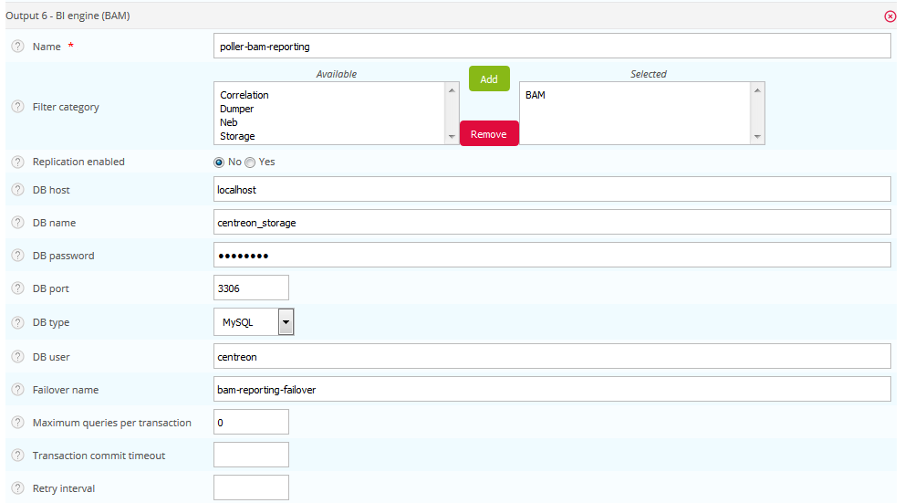

L'installation de l'extension Centreon BAM sur un serveur distant Centreon doit être réalisée de la même manière que celle du serveur central Centreon et nécessite des actions supplémentaires.

> Après avoir installé l'extension Centreon BAM en utilisant la documentation d'installation standard, veuillez effectuer les étapes supplémentaires décrites ci-dessous.

## Configurer Centreon Broker

La configuration de l'extension **Centreon BAM** sur un serveur
distant consiste à créer la configuration de Centreon Broker à partir du
serveur central pour la gestion des calculs de Centreon BAM par le
serveur distant Centreon. Cette configuration sera automatiquement
envoyée vers le serveur distant concerné lors du déploiement des activités métiers, depuis le serveur central.

Pour ce faire, vous devez modifier la configuration de Centreon Broker Master du collecteur distant Centreon. Allez dans le menu **Configuration > Collecteurs > Configuration de Centreon Broker** et modifiez la configuration du **serveur distant**.

### Output de supervision

Dans l'onglet **Output**, sélectionnez une configuration de
type **BAM - Monitoring engine (BAM)** et cliquez sur le bouton
**Ajouter** :

Le tableau ci-dessous présente les champs à saisir :

| Champs                          | Valeurs                                                       |
|---------------------------------|---------------------------------------------------------------|
| Name                            | remote-server-bam-monitoring                                  |
| Filter category                 | *Aucune*                                                      |
| Storage DB Name                 | centreon\_storage                                             |
| Cache                           | Yes                                                           |
| Replication enabled             | No                                                            |
| Command file path               | /var/lib/centreon-engine/rw/centengine.cmd                    |
| DB host                         | localhost                                                     |
| DB name                         | centreon                                                      |
| DB password                     | *À récupérer dans /etc/centreon/conf.pm sur le Remote Server* |
| DB port                         | 3306                                                          |
| DB type                         | MySQL                                                         |
| DB user                         | *À récupérer dans /etc/centreon/conf.pm sur le Remote Server* |
| Maximum queries per transaction | 0                                                             |
| Transaction commit timeout      | 5                                                             |
| Retry interval                  | 5                                                             |

### Output de reporting

Ajoutez un nouvel output et sélectionnez une configuration de type **BAM - BI engine (BAM)**. Puis cliquez sur le bouton **Ajouter**.

Le tableau ci-dessous présente les champs à saisir :

| Champs                          | Valeurs                                                       |
|---------------------------------|---------------------------------------------------------------|
| Name                            | remote-server-bam-reporting                                   |
| Filter category                 | BAM                                                           |
| Replication enabled             | No                                                            |
| DB host                         | localhost                                                     |
| DB name                         | centreon\_storage                                             |
| DB password                     | *À récupérer dans /etc/centreon/conf.pm sur le Remote Server* |
| DB port                         | 3306                                                          |
| DB type                         | MySQL                                                         |
| DB user                         | *À récupérer dans /etc/centreon/conf.pm sur le Remote Server* |
| Maximum queries per transaction | 0                                                             |
| Transaction commit timeout      | 5                                                             |
| Retry interval                  | 5                                                             |

Pour finir l'installation, générez et déployez la configuration du serveur distant Centreon en sélectionnant le mode **Redémarrer**.
