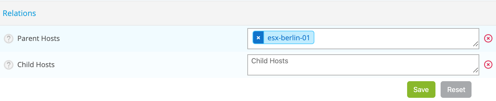
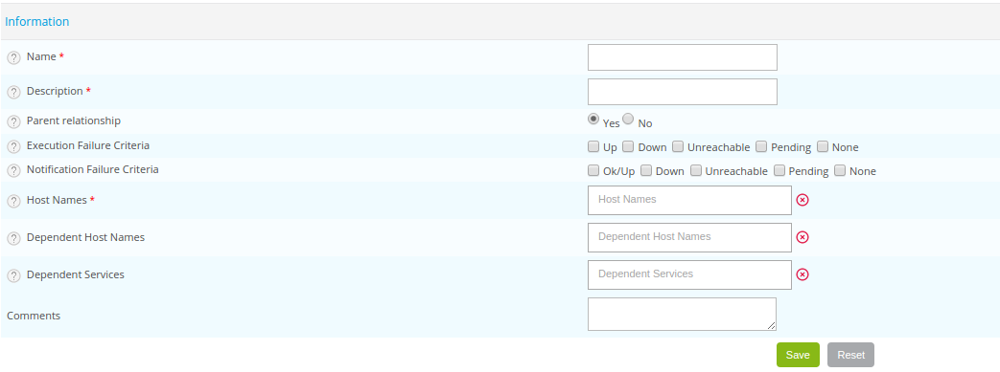
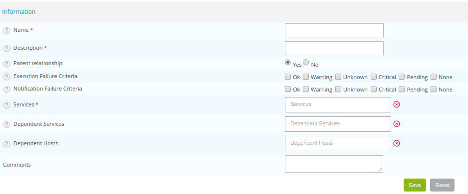
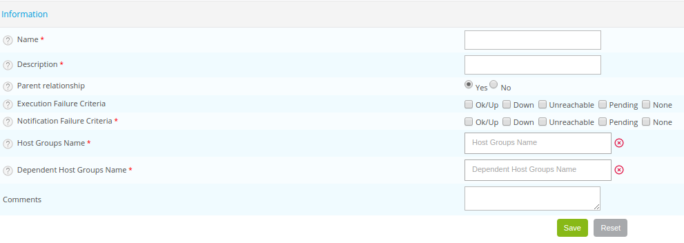
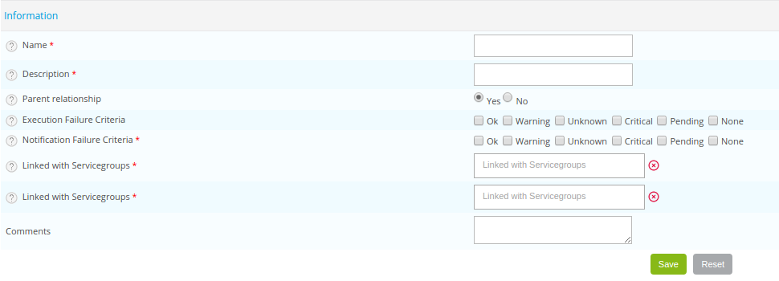
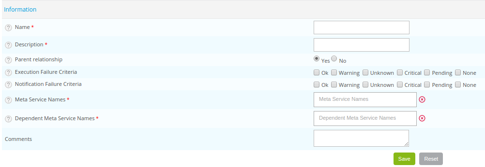

## Principe

Les dépendances sont utilisées afin de répondre à deux principaux besoins :

-   Limiter l'envoi de notifications
-   Cibler les alertes

Les dépendances d'objets sont de deux types :

-   Dépendance **physique** entre objet : un switch de répartition est
    situé en amont d'un ensemble de serveurs et en aval d'un routeur
-   Dépendance **logique** entre objet : l'accès à un site web avec
    authentification LDAP dépend de l'état de l'annuaire LDAP lui-même

## Les dépendances physiques

Les dépendances physiques consistent à prendre en compte les liens
physiques entre les équipements. Ce lien ne peut être défini que pour
les objets de type **Host**.

La configuration d'une dépendance physique se déroule au sein de
l'onglet **Relations** d'une fiche de configuration d'un hôte via le
menu `Configuration > Hosts > Hosts`.

Il est possible de définir deux paramètres :

-   **Parent Hosts**: signifie que les hôtes sélectionnés sont parents
    de cet hôte (situé en amont). Si tous les hôtes parents sélectionnés
    deviennent indisponibles ou injoignables alors l'hôte sera considéré
    par l'ordonnanceur comme injoignable lui-même.
-   **Child Hosts**: signifie que l'hôte devient parent de tous les
    hôtes enfants sélectionnés.

> Il n'est pas possible d'établir des liens de parentés entre hôtes
> supervisés par des collecteurs différents.

> Tous les parents d'un hôte doivent être dans un état non-OK pour que
> l'hôte lui-même soit considéré comme injoignable. A partir du moment
> où au moins un chemin d'accès (liaison de dépendance physique) est
> toujours joignable alors l'ordonnanceur continuera de surveiller cet
> hôte.

## Les dépendances logiques

Les dépendances logiques consistent à mettre en place des liens logiques
entre plusieurs objets de différents types ou non.

Par exemple : Un service est chargé de superviser l'accès à une page web
requérant une authentification basée sur un annuaire LDAP. Il est
logique que si le serveur LDAP est en panne, l'accès à la page web sera
limité voire impossible. Dans cette situation, la notification émise ne
doit l'être que pour l'annuaire LDAP et non le site web.

### Les hôtes

Pour configurer une dépendance logique, rendez-vous dans le menu
`Configuration > Notifications > Dependencies > Hosts` et cliquez sur
**Add**.

Dans ce cas, nous avons deux types d'hôtes qui entrent en jeu : un ou des
hôtes (appelé hôtes maîtres) dont le statut contrôle l'exécution et les
notifications d'autres hôtes (appelés hôtes dépendants). Si vous
utilisez Centreon Broker, il est également possible à partir des hôtes
maîtres de contrôler l'exécution et les notifications de services
(appelés services dépendants).

-   Les champs **Name** et **Description** indiquent le nom et la
    description de la dépendance
-   Le champ **Parent relationship** est à ignorer si vous utilisez
    Centreon Engine. S'il est activé, alors si les liens de dépendances
    de l'hôte maître deviennent indisponibles, la dépendance en cours de
    création n'est plus prise en compte.
-   Le champ **Execution Failure Criteria** indique quels sont les
    statuts du ou des hôtes maîtres qui empêcheront la vérification des
    hôtes ou des services dépendants
-   Le champ **Notification Failure Criteria** indique quels sont les
    statuts du ou des hôtes maîtres qui empêcheront l'envoi de
    notifications pour les hôtes ou les services dépendants
-   La liste **Hostnames** défini le ou les hôtes maîtres
-   LLa liste **Dependent Host Names** défini les hôtes dépendants
-   La liste **Dependent Services** défini les services dépendants
-   Le champ **Comments** permet de commenter la dépendance

### Les services

Pour ajouter une dépendance au niveau des services, rendez-vous dans le
menu `Configuration > Notifications > Dependencies > Services` et
cliquez sur **Add**.

Dans ce cas, nous avons deux entités qui entrent en jeu : les services
(dits maîtres) qui contrôlent l'exécution et les notifications d'autres
services (dits dépendants). Si vous utilisez Centreon Broker, il est
également possible de contrôler l'exécution et les notifications
d'autres hôtes.

-   Les champs **Name** et **Description** indiquent le nom et la
    description de la dépendance
-   Le champ **Parent relationship** est à ignorer si vous utilisez
    Centreon Engine. S'il est activé, alors si les liens de dépendances
    du service maître deviennent indisponibles la dépendance en cours de
    création n'est plus prise en compte.
-   Le champ **Execution Failure Criteria** indique quels sont les
    statuts du (ou des) service(s) maître(s) qui empêchera(ront) la
    vérification des hôtes ou des services dépendants
-   Le champ **Notification Failure Criteria** indique quels sont les
    statuts du (ou des) service(s) maître(s) qui empêchera(ront) l'envoi
    de notifications pour les hôtes ou les services dépendants
-   La liste **Services** définie le ou les services maîtres
-   La liste **Dependent services** définie les services dépendants
-   La liste **Dependent hosts** définie les hôtes dépendants
-   Le champ **Comments** permet de commenter la dépendance

### Les groupes d'hôtes

Pour configurer une dépendance logique, rendez-vous dans le menu
`Configuration > Notifications > Dependencies > Host Groups` et cliquez
sur **Add**.

Deux types de groupes d'hôtes : Un groupe d'hôtes est dit maître s'il
contrôle l'exécution et la notification d'autres groupes d'hôtes (dit
dépendants).

-   Les champs **Name** et **Description** indiquent le nom et la
    description de la dépendance
-   Le champ **Parent relationship** est à ignorer si vous utilisez
    Centreon Engine. S'il est activé, alors si les liens de dépendances
    du groupe d'hôte maître deviennent indisponibles la dépendance en
    cours de création n'est plus prise en compte.
-   Le champ **Execution Failure Criteria** indique quels sont les
    statuts du ou des groupes d'hôtes maîtres qui empêcheront la
    vérification des groupes d'hôtes dépendants
-   Le champ **Notification Failure Criteria** indique quels sont les
    statuts du ou des hôtes maîtres qui empêcheront l'envoi de
    notifications pour des groupes d'hôtes dépendants
-   La liste **Host groups name** définie le ou les groupes d'hôtes
    maîtres
-   La liste **Dependent host group name** définie le ou les groupes
    d'hôtes dépendants
-   Le champ **Comments** permet de commenter la dépendance

### Les groupes de services

Pour configurer une dépendance logique, rendez-vous dans le menu
`Configuration > Notifications > Dependencies > Service Groups` et
cliquez sur **Add**.

Deux types de groupes de services : Un groupe de services est dit maître
s'il contrôle l'exécution et la notification d'autres groupes de
services (dit dépendants).

-   Les champs **Name** et **Description** indiquent le nom et la
    description de la dépendance
-   Le champ **Parent relationship** est à ignorer si vous utilisez
    Centreon Engine. S'il est activé, alors si les liens de dépendances
    du groupe de service maître deviennent indisponibles la dépendance
    en cours de création n'est plus prise en compte.
-   Le champ **Execution Failure Criteria** indique quels sont les
    statuts du ou des groupes de services maîtres qui empêcheront la
    vérification des groupes de services dépendants
-   Le champ **Notification Failure Criteria** indique quels sont les
    statuts du ou des hôtes maîtres qui empêcheront l'envoi de
    notifications pour des groupes de services dépendants
-   La liste **Service group names** définie le ou les groupes de
    services maîtres
-   La liste **Dependent service group names** définie le ou les groupes
    de services dépendants
-   Le champ **Comments** permet de commenter la dépendance

### Meta-services

Pour configurer une dépendance logique, rendez-vous dans le menu
`Configuration > Notifications > Dependencies > Meta Services` et
cliquez sur **Add**.

Deux types de méta-services : Un méta-service est dit maître s'il
contrôle l'exécution et la notification d'autres méta-services (dit
dépendants).

-   Les champs **Name** et **Description** indiquent le nom et la
    description de la dépendance
-   Le champ **Parent relationship** est à ignorer si vous utilisez
    Centreon Engine. S'il est activé, alors si les liens de dépendances
    du méta-service maître deviennent indisponibles la dépendance en
    cours de création n'est plus prise en compte.
-   Le champ **Execution Failure Criteria** indique quels sont les
    statuts du ou des méta-services maîtres qui empêcheront la
    vérification des méta-services dépendants
-   Le champ **Notification Failure Criteria** indique quels sont les
    statuts du ou des méta-services qui empêcheront l'envoi de
    notifications pour des méta-services dépendants
-   La liste **Meta-service name** définie le (ou les) méta-service(s)
    maître(s)
-   La liste **Dependent meta-service** définie le (ou les)
    méta-service(s) dépendant(s)
-   Le champ **Comments** permet de commenter la dépendance

## Exemples

Ce sous-chapitre illustre l'utilisation de ces dépendances via quelques
cas réels.

> Les dépendances sont basées sur des critères d'échec qui sont «ne pas
> faire si». Ne notifiez pas si le service est dans un état critique.
> N'effectuez pas la vérification si le service est dans un état
> Critical, Warning, Unknown…

### Dépendance d'un service

Un service est vérifié en utilisant un scénario Sélénium. Ce scénario se
connecte à une interface web avec un identifiant et un mot de passe. Ces
informations de connexions sont stockées dans une base de données
MariaDB.

Par conséquent, si jamais le serveur de base de données ne répond plus,
alors le scénario Sélénium ne peut aboutir. Il parait évident qu'il est
nécessaire de créer un lien de dépendance logique entre le service qui
utilise le scénario Sélénium et le service qui est chargé de vérifier le
statut du serveur MariaDB.

De plus, étant donné que le scénario Sélénium ne peut pas s'exécuter
correctement, aucune donnée de performances ne peut être stockée en base
de données. Il faut donc arrêter non seulement la notification pour le
service utilisant le scénario Sélénium mais aussi la vérification.

Afin de créer cette dépendance, rendez-vous dans le menu
`Configuration > Notifications > Dependencies > Services` et cliquez sur
**Add**.

1.  Entrez le nom et la description de la dépendance
2.  Pour les champs **Execution Failure Criteria** et **Notification
    Failure Criteria**, cochez Alerte, Critique, Inconnu et En attente
3.  Dans la liste **Services**, sélectionnez le service qui est chargé
    de vérifier le statut du serveur MariaDB
4.  Dans la liste **Dependent Services**, sélectionnez le service qui
    utilise le scénario Sélénium
5.  Sauvegardez

A partir de ce moment, si le service chargé de vérifier le statut du
serveur MariaDB a un statut "Warning", "Critical", "Unknown" ou
"Pendinge", alors le service chargé d'exécuter le scénario Sélénium ne
sera plus exécuté jusqu'à ce que le service maître redevienne OK.

### Dépendance d'un hôte

Prenons le cas de deux hôtes qui fonctionnent en cluster. Trois hôtes
sont créés afin de pouvoir superviser ce cluster : un hôte A, un hôte B
(tous les deux membres du cluster) et un hôte C (qui centralise les
informations du cluster).

Si jamais, l'hôte A ou l'hôte B a un statut non-OK, alors les services
de l'hôte C sera automatiquement considéré comme non-OK. Il est donc
nécessaire d'ajouter une dépendance qui empêche l'envoi de notifications
si jamais l'hôte A ou l'hôte B devient défaillant. Cependant, la
remontée des données de performances doit toujours être fonctionnelle,
c'est pourquoi il est nécessaire de continuer la supervision de l'hôte
C.

Afin de créer cette dépendance, rendez-vous dans le menu
`Configuration > Notifications > Dependencies > Hosts` et cliquez sur
**Add**.

1.  Entrez le nom et la description de la dépendance
2.  Pour le champ **Notification Failure Criteria**, cochez Alerte,
    Critique, Inconnu et En attente
3.  Dans la liste **Host Names**, sélectionnez l'hôte A
4.  Dans la liste **Dependent Host Names**, sélectionnez l'hôte C
5.  Sauvegardez

Répétez cette opération pour l'hôte B.

### Dépendance d'un groupe de service

Prenons l'exemple d'un ensemble de services Oracle sur lequel se base
l'application ERP. Il faut deux groupes de services :

-   Le groupe Application Oracle
-   Le groupe Application ERP

Si les services Oracle deviennent critiques, alors les services de
l'application ERP sont automatiquement critiques. Il est nécessaire de
créer un lien de dépendance afin d'empêcher la vérification et la
notification des services de l'application ERP si l'application Oracle
est non-OK.

Afin de créer cette dépendance, rendez-vous dans le menu
`Configuration > Notifications > Dependencies > Service Groups` et
cliquez sur **Add**.

1.  Entrez le nom et la description de la dépendance
2.  Pour le champ **Execution Failure Criteria** et **Notification
    Failure Criteria**, cochez Critique et En attente
3.  Dans la liste **Service Group Names**, sélectionnez le groupe de
    services **Application Oracle**
4.  Dans la liste **Dependent Service Group Names**, sélectionnez le
    groupe de services **Application ERP**
5.  Sauvegardez
