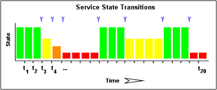
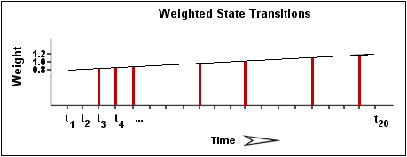
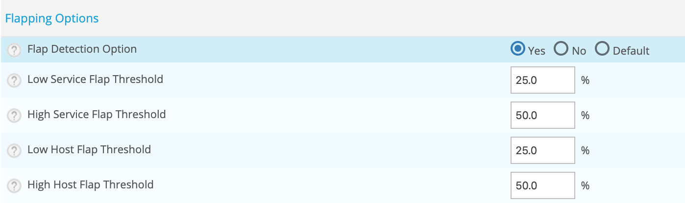
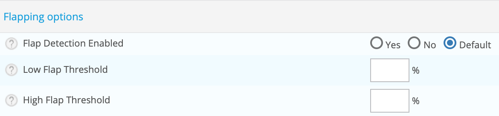

## Introduction

Centreon Engine prend en charge la détection des hôtes et des services
bagoter. Le bagotement se produit lorsqu'un service ou un hôte change
d'état trop fréquemment, ce qui entraîne une tempête de notifications de
problèmes et de récupération. Le battement peut indiquer des problèmes
de configuration (c'est-à-dire des seuils trop bas), des services
gênants ou de vrais problèmes de réseau.

## Fonctionnement de la détection de bagotement

Chaque fois que Centreon Engine vérifie l'état d'un hôte ou d'un
service, il vérifie s'il l'état de bagotement en :

-   Enregistrant les résultats des 21 dernières vérifications de l'hôte
    ou du service
-   Analysant les résultats de l'historique de la vérification et
    déterminant où se produisent les changements / transitions de
    statuts
-   Utilisant les transitions de statuts pour déterminer un pourcentage
    de changement pour l'hôte ou le service
-   Comparant la valeur de changement de statuts en pourcentage aux
    seuils déterminés

Un hôte ou un service est déterminé en état bagotant (flapping) lorsque
son pourcentage de changement de statuts dépasse pour la première fois
le seuil haut.

Un hôte ou un service redevient en état régulier lorsque son pourcentage
de changement de statuts passe en dessous du seuil bas.

## Exemple

Décrivons plus en détail le fonctionnement de la détection de
bagotements avec les services...

L'image ci-dessous montre un historique chronologique pour un service
des états des 21 derniers contrôles. Les états OK sont affichés en vert,
les états WARNING en jaune, les états CRITICAL en rouge et les états
UNKNOWN en orange.

L'historique des résultats de la vérification du service sont examinés
pour déterminer où se produisent les changements / transitions de
statuts. Les changements de statut se produisent lorsqu'un état archivé
est différent de l'état archivé qui le précède immédiatement
chronologiquement. Étant donné que nous conservons les résultats des 21
dernières vérifications du service, il est possible d'avoir au plus 20
changements de statuts. Dans cet exemple, il y a 7 changements de
statuts, indiqués par des flèches bleues dans l'image ci-dessus.

La logique de détection des bagotement utilise les changements de
statuts pour déterminer un pourcentage global de changement de statuts
pour le service. Il s'agit d'une mesure de la volatilité / du changement
pour le service. Les services qui ne changent jamais de statuts auront
une valeur de changement de statuts de 0%, tandis que les services qui
changent de statuts chaque fois qu'ils sont vérifiés auront un
changement de statuts de 100%. La plupart des services auront un
changement de statuts en pourcentage quelque part entre les deux.

Lors du calcul du pourcentage de changement de statuts pour le service,
l'algorithme de détection des bagotements donnera plus de poids aux
nouveaux changements par rapport aux anciens. Plus précisément, les
routines de détection des bagotements sont conçues pour que le
changement de statut le plus récent ait 50% de poids en plus que le
changement le plus ancien. L'image ci-dessous montre comment les
changements récents ont plus de poids que les changements plus anciens
lors du calcul du changement de statut global ou total en pourcentage
pour un service particulier.

À l'aide des images ci-dessus, calculons le pourcentage de changement de
statut pour le service. Vous remarquerez qu'il y a un total de 7
changements de statuts (à t\_3, t\_4, t\_5, t\_9, t\_12, t\_16 et
t\_19). Sans aucune pondération des changements au fil du temps, cela
nous donnerait un changement d'état total de 35%:

(7 changements observés / 20 possible changements) \* 100 = 35 %

Étant donné que la logique de détection des bagotements donnera aux
changements d'état plus récents un taux plus élevé que les changements
plus anciens, le pourcentage réel de changement calculé sera légèrement
inférieur à 35% dans cet exemple. Disons que le pourcentage pondéré du
changement d'état s'est avéré être de 31%.

Le pourcentage de changement de statut calculé pour le service (31%)
sera ensuite comparé aux seuils de bagotements pour voir ce qui devrait
se produire:

-   Si le service était en état régulier auparavant, et que 31% est égal
    ou supérieur au seuil de bagotement haut, le moteur Centeron
    considère que le service vient de commencer à bagoter.
-   Si le service était en état de bagotement précédemment et que 31%
    est inférieur au seuil de bagotement bas, le moteur Centreon
    considère que le service redevient dans un état régulier.

Si aucune de ces deux conditions n'est remplie, la logique de détection
des bagotement ne fera rien d'autre avec le service, car soit le service
est en état de bagotement, soit en étt régulier.

## Configuration

### Activation de la détection des bagotements

Rendez-vous dans le menu
`Configuration > Pollers > Engine configuration` et sélectionner un
moteur (Centreon Engine). Dans l'onglet **Check Options** ativer la
détection de bagotements :

Vous pouvez modifier les seuils ou conserver ceux préconfigurés.

### Détection de bagotement pour les services

Si vous activez la détection de bagotement pour un moteur (Centreon
Engine), le processus sera appliqué à toutes les ressources surveillé
par ce dernier.

Vous pouvez désactiver / activer la détection de bagotement pour un hôte
via le menu de configuratio.

Rendez-vous dans le menu `Configuration > Hosts > Hosts`, sélectionnez
un hôte et accédez à l'onglet **Data Processing** :

Vous pouvez également adapter les seuils de bagotements pour cette ressource.

> Utilisez des modèles pour faciliter la configuration.

### Détection de bagotement pour les hôtes

Si vous activez la détection de bagotement pour un moteur (Centreon
Engine), le processus sera appliqué à toutes les ressources surveillé
par ce dernier.

Vous pouvez désactiver / activer la détection de bagotement pour un
service via le menu de configuratio.

REndez-vous dans le menu `Configuration > Services > Services by Host`,
sélectionnez un service et accédez à l'onglet **Data Processing** :

Vous pouvez également adapter les seuils de bagotements pour cette ressource.

> Utilisez des modèles pour faciliter la configuration.
