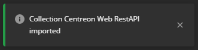
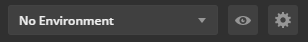
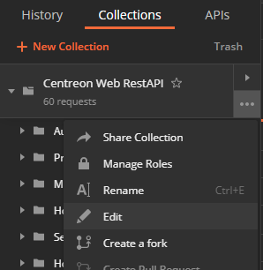
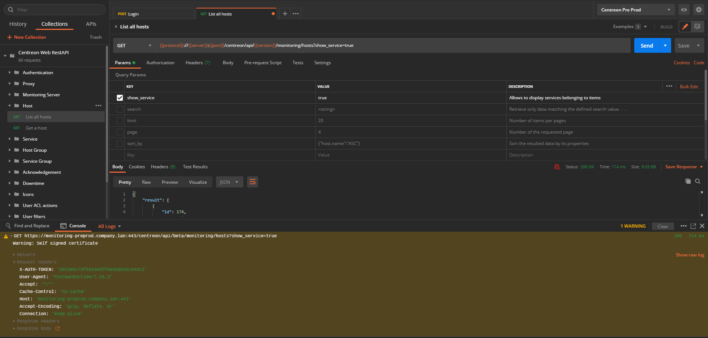

## Aperçu

Centreon Web Rest API v2 a pour objectif de remplacer la première version.

Pour commencer à l'utiliser, référez-vous à la [page
dédiée](https://docs-api.centreon.com/api/centreon-web/22.10/).

## Créer une collection Postman depuis la définition OpenAPI

Afin de manipuler l'API plus efficacement ou seulement pour comprendre comment
elle fonctionne, il n'y a rien de plus pratique qu'une collection
[Postman](https://learning.postman.com/docs/getting-started/introduction/).

### Importer la définition OpenAPI

Depuis l'espace de travail, cliquer sur le bouton **Import**.


Aller dans l'onglet **Link** et entrer l'URL vers la définition OpenAPI de
GitHub :

```text
https://raw.githubusercontent.com/centreon/centreon/22.10.x/centreon/doc/API/centreon-api-v22.10.yaml
```


Cliquer sur **Continue** et modifier quelques paramètres par défaut :

- Sélectionner seulement *Collection* comme méthode d'import,
- Sélectionner *Example* pour le champ *Request parameter generation* car cela
  amène plus de contexte aux variables d'URL ou aux paramètres de requête,
- Sélectionner *Tags* pour le champ *Folder organization* car cela permet
  d'arranger la collection comme dans la documentation.

Cliquer ensuite sur **Import** et attendre quelques secondes que le processus
aboutisse.



### Ajouter un environnement

Pour pouvoir communiquer avec vote plateforme, la collection va utiliser des
variables d'environnement pour déinir les informations d'accès ainsi que les
identifiants.

Depuis l'espace de travail, cliquer sur l'icone **Manage Environments**.



Cliquer sur **Add** et definir les variables comme suit avec les informations
de la plateforme :


Cliquer ensuite sur **Add**, et sélectionner l'environnement dans la liste des
environnements.

> La version de l'API n'est pas défini dans les variables d'environnement. Il
> s'agit d'avantage d'une variable de la collection. Elle peut être changée
> directement dans la collection en l'éditant.
>
> 
>
> Dans l'onglet **Variables**, changer la valeur de *version* par une valeur
> parmi "beta", "latest" or "v2".
>
> 
>
> Les autres variables seront surchargées par les variables d'environnement.

### Éditer la requête d'authentification

Pour faire en sorte que la requête d'authentification utilise les identifiants
précedemment définis, et qu'elle récupère le *token* dans la réponse, il faut
l'éditer.

Depuis la collection, sélectionner la requête *Login* du répertoire
*Authentication*.

Dans l'onglet **Body**, changer les valeurs des paramètres *login* et *password*
par les variables d'environnement `{{username}}` et `{{password}}` comme suit :


Dans l'onglet **Tests**, ajouter le code suivante :

```javascript
pm.test("Status code is 200", function () { pm.response.to.have.status(200); });

const responseJson = pm.response.json();

pm.test("The response has all properties", () => {
  pm.expect(responseJson).to.be.an("object");
  pm.expect(responseJson.contact.alias).to.eql(pm.environment.get("username"));
  pm.expect(responseJson.security.token).to.be.a('string');
});

pm.environment.set("token", responseJson.security.token);
```


Cliquer ensuite sur **Save** ou utiliser le raccourci *Ctrl+S*.

### Utiliser le token

Une fois sauvegardée, exécuter la requête d'authentification en cliquant sur
**Send**.


Si réussie, cela va ajouter une nouvelle variable d'environnement *token* avec
la valeur récupérée dans la réponse.


Pour l'utiliser dans toutes les requêtes, il faut éditer la collection.


Dans l'onglet **Authorization**, choisir le type *API Key* et remplir le champ
*Key* avec `X-AUTH-TOKEN` et le champ *Value* avec `{{token}}`.


S'assurer de sélectionner *Header*.

Cliquer ensuite sur **Update**.

### Exécuter des requêtes

Maintenant qu'un *token* valide est stocké, vous pouvez exécuter des requêtes
sur les autres *endpoints*.

Désélectionner les paramètres de requête non utilisés ou les remplir avec des
valeurs, et cliquer sur **Send**.



Vous remarquerez le *token* ajouté dans les *headers*.

Si le *token* expire, ré-exécuter la requête d'authentification pour en avoir un
nouveau.
