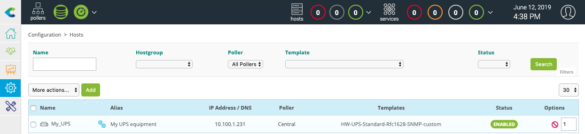
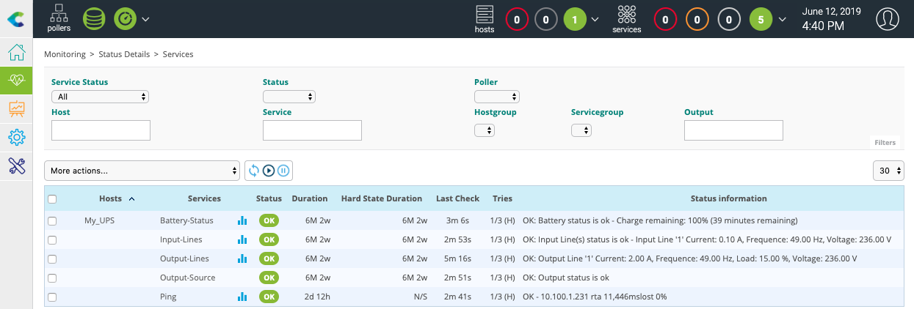

Ce topic vous propose d'installer les modèles de supervision fournis gratuitement avec la solution Centreon, puis de les implémenter afin de mettre votre premier équipement en supervision.

> Si vous disposez d'une licence adéquate, vous pouvez utiliser notre [module d'autodécouverte](../monitoring/discovery/introduction.md) afin de trouver et de configurer vos hôtes facilement. Voir aussi notre tutoriel [sur la détection d'instances AWS EC2](autodisco-aws.md).

### Installation des modèles de supervision de base

Rendez-vous dans le menu **Configuration > Packs de plugins**.

> Avant toute chose, appliquez la procédure de [configuration du proxy](../administration/parameters/centreon-ui.md#configuration-du-proxy)
> pour configurer et vérifier la connexion de votre serveur Centreon à internet.

Commencez par installer le Plugin Pack **Base Pack** (s'il n'est pas déjà installé) en déplaçant votre curseur sur ce dernier et en cliquant sur
l'icône **+** (il s'agit d'un pré-requis à l'installation de tout autre Plugin Pack) :

Vous pouvez aussi cliquer sur le Plugin Pack afin d'en connaître son contenu avant de l'installer :

Installez ensuite les Plugin Packs inclus gratuitement avec la solution, par exemple **Linux SNMP** et **Windows SNMP** :

Vous disposez maintenant des modèles de base pour configurer votre supervision !

## Superviser votre premier hôte

### Superviser une imprimante en SNMP

Rendez-vous dans le menu **Configuration > Packs de plugins** et installez le Plugin Pack **Printer Standard** :

Rendez-vous maintenant dans le menu **Configuration > Hôtes > Hôtes** et cliquez sur le bouton **Ajouter** :

Renseignez les informations suivantes :

* Le nom de votre serveur
* Une description de votre serveur
* Son adresse IP
* La communauté et la version SNMP

Cliquez sur le bouton **+ Ajouter une nouvelle entrée** pour le champ **Modèles** puis
sélectionnez le modèle **HW-Printer-standard-rfc3805-custom**.

Cliquez sur le bouton **Sauvegarder**.

Votre équipement a été ajouté à la configuration de la supervision :

Rendez-vous dans le menu **Configuration > Services > Services par hôte**. Un ensemble d'indicateurs a été déployé
automatiquement :

Il est maintenant temps de [déployer la supervision](#déployer-une-configuration).

Rendez-vous ensuite dans le menu **Supervision > Détails des statuts > Regroupement par hôte** et sélectionnez la valeur **Tous** pour le
filtre **Afficher les détails**. Après quelques minutes, les premiers résultats de la supervision apparaissent :

### Superviser un onduleur en SNMP

Rendez-vous dans le menu **Configuration > Packs de plugins** et installez le Plugin Pack **UPS Standard** :

Rendez-vous maintenant dans le menu **Configuration > Hôtes > Hôtes** et cliquez sur le bouton **Ajouter** :

Renseignez les informations suivantes :

* Le nom de votre serveur
* Une description de votre serveur
* Son adresse IP
* La communauté et la version SNMP

Cliquez sur le bouton **+ Ajouter une nouvelle entrée** pour le champ **Modèles** puis sélectionnez le modèle
**HW-UPS-Standard-Rfc1628-SNMP-custom**.

Cliquez sur le bouton **Sauvegarder**.

Votre équipement a été ajouté à la configuration de la supervision :

Rendez-vous dans le menu **Configuration > Services > Services par hôte**. Un ensemble d'indicateurs a été déployé
automatiquement :

Il est maintenant temps de [déployer la supervision](#déployer-une-configuration).

Rendez-vous ensuite dans le menu **Supervision > Détails des statuts > Regroupement par hôte** et sélectionnez la valeur **Tous** pour le
filtre **Afficher les détails**. Après quelques minutes, les premiers résultats de la supervision apparaissent :

## Déployer une configuration

Lors de la création/suppression/modification des objets via l'interface de configuration, les changements effectués ne
sont pas appliqués de manière automatique aux serveurs de supervision. Afin de pouvoir appliquer les modifications
effectuées, il est nécessaire de suivre la procédure ci-dessous.

1. Rendez-vous dans le menu **Configuration > Collecteurs > Collecteurs**.
2. Choisissez les collecteurs sur lesquels exporter la configuration.
3. Cliquez sur **Exporter la configuration**.

    

4. Cochez les cases suivantes :
  - **Générer les fichiers de configuration**
  - **Lancer le débogage du moteur de supervision (-v)**
  - **Déplacer les fichiers générés**
  - **Redémarrer l'ordonnanceur**.

5. Cliquez sur **Exporter**.

    

6. Vérifiez qu'aucune erreur n'apparaît lors de la génération.
