## Première connexion à l'interface

Pour vous connecter à l'interface web, rendez-vous à l'adresse : `http://ADRESSE_IP/centreon`.

> Remplacez **ADRESSE_IP** par l'adresse IP ou le FQDN du serveur web Centreon.

Renseignez le nom d'utilisateur et le mot de passe associé et cliquez sur le bouton **Se connecter** :

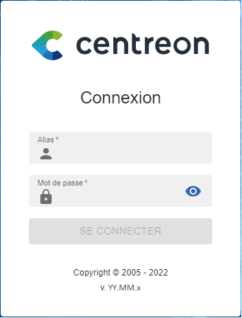

>Si vous avez installé Centreon depuis une [VM](../installation/installation-of-a-central-server/using-virtual-machines.md), les identifiants par défaut sont **admin/Centreon!2021**.
Si ce n'est pas le cas, l'identifiant par défaut est **admin** et le mot de passe est celui que vous avez défini à [l'étape 5 de l'installation web](../installation/web-and-post-installation.md).

Vous êtes maintenant connecté à l'interface web Centreon.

## Menus

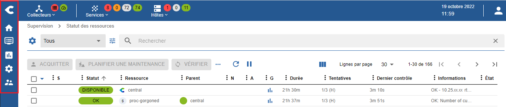

L'interface web de Centreon est composée de plusieurs menus, chaque menu a une fonction bien précise (cliquez sur le logo Centreon en haut à gauche de l'écran pour afficher les libellés) :

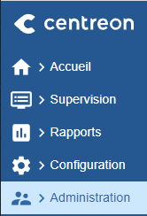

* Le menu **Accueil** affiche les [vues personnalisées](create-custom-view.md). Votre espace de travail peut être vide pour l'instant. Une fois que vous aurez configuré les widgets
  personnalisables, vous verrez les données et les graphiques en fonction de votre personnalisation.
* Le menu **Supervision** regroupe l'état de tous les éléments supervisés en temps réel et en différé au travers de la
  visualisation des logs.
* Le menu **Rapports** permet de visualiser de manière intuitive (via des diagrammes) l'évolution de la supervision sur
  une période donnée.
* Le menu **Configuration** permet de configurer l'ensemble des éléments supervisés ainsi que l'infrastructure de supervision.
* Le menu **Administration** permet de configurer la plateforme Centreon (authentification, proxy, extensions...) ainsi que de visualiser l'état général des serveurs.

## Bandeau supérieur

### Section Collecteurs

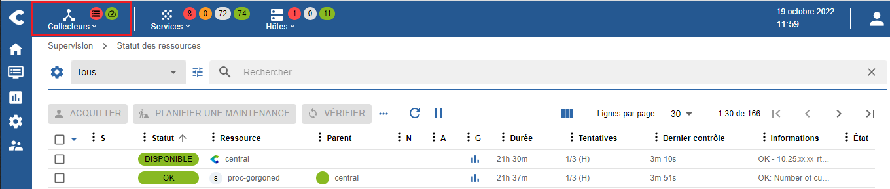

La partie gauche du bandeau supérieur montre la santé de votre plateforme en temps réel :

* si tous les collecteurs sont en cours d'exécution ou non : l'icône devient rouge lorsqu'un collecteur n'a pas envoyé de données au serveur central depuis au moins 15 minutes
* si les contrôles sont en retard ou non. Si l'icône est orange ou rouge, cela peut indiquer que vos collecteurs supervisent de trop nombreuse ressources.

Cliquez sur l'icône **collecteurs** pour développer le menu. Dans le menu, cliquez sur **Configurer les collecteurs** pour accéder à la page **Configuration > Collecteurs > Collecteurs**.

### Section hôtes et services ("top counters")

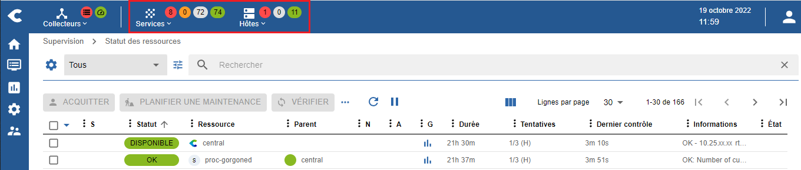

Dans la partie de droite du bandeau supérieur, des statistiques indiquent le nombre de ressources supervisées, avec un statut spécifique :

* Pour les hôtes : le nombre d'hôtes avec le statut **INDISPONIBLE**, **INJOIGNABLE** et **DISPONIBLE**.
* Pour les services: le nombre de services avec le statut **CRITIQUE**, **ALERTE**, **INCONNU** et **OK**.

Ces nombres incluent les alertes non confirmées (SOFT), mais n'incluent pas les ressources acquittées ou en maintenance. Les ressources en attente sont indiquées par une pastille bleue sur les icônes **hôtes** ou **services**.

Cliquez sur un cercle représentant un statut :

* La page **Supervision > Statut des ressources** s'ouvre.
* La page est filtrée selon le type de ressource et le statut correspondant.

Cliquez sur les icônes **hôtes** ou **services** pour développer le menu et afficher le détail des hôtes et services.

### Passer en mode sombre

Lors de votre première connexion, l'interface Centreon s'affiche en mode clair par défaut.

Dans le bandeau supérieur, utilisez le bouton pour activer le mode sombre. Lorsque vous vous reconnecterez, le mode que vous avez sélectionné précédemment restera activé.

* Mode clair
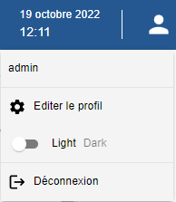

* Mode sombre
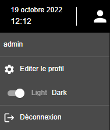

Vous pouvez aussi passer en mode sombre en modifiant le thème de l'interface dans les paramètres du compte.

Allez dans **Administration > Paramètres > Mon compte** et sélectionnez l'onglet **Informations générales**. 
Sélectionnez **Light** ou **Dark** dans le champ **Front-end Theme**.

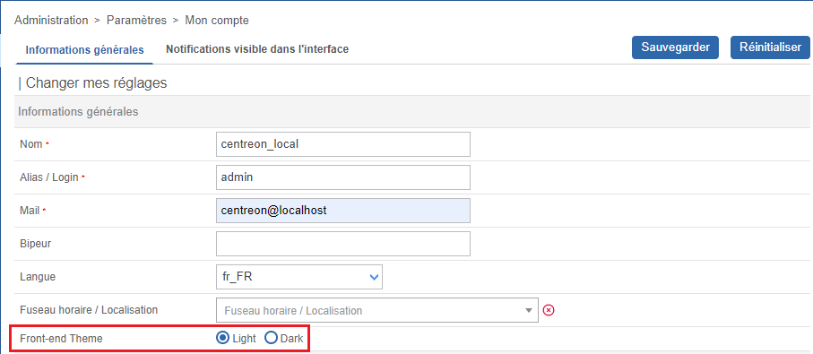

Puis cliquez sur **Sauvegarder**. Le thème de l'interface est maintenant dans le mode que vous avez choisi.

### Langue de l'interface utilisateur

Dans le bandeau, cliquez sur l'icône profil, puis cliquez sur **Editer Le Profil**:

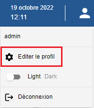

Dans la liste de sélection des langues, sélectionnez la vôtre :

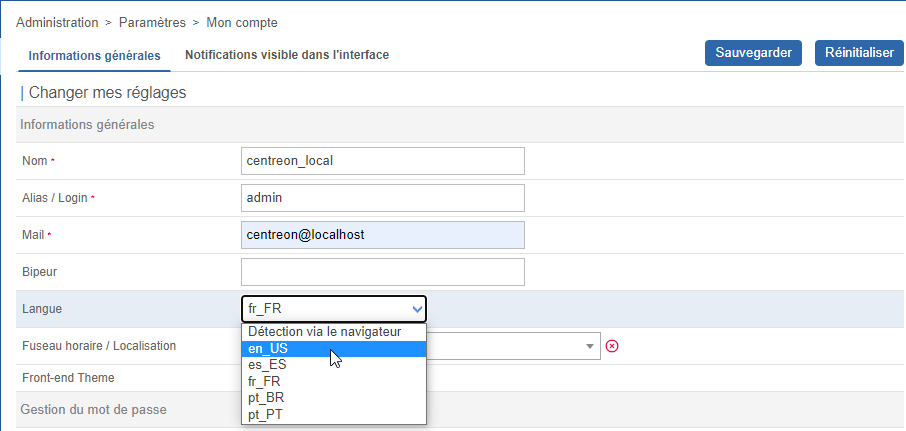

Puis cliquez sur **Sauvegarder**. Votre interface est maintenant traduite dans votre
langue.

> Si votre langue n'apparaît pas dans la liste, vous pouvez aider la communauté Centreon à traduire l'interface web.
> Rendez-vous dans le chapitre [How to translate Centreon](../developer/developer-translate-centreon) pour plus d'informations.

## Réinitialisez votre mot de passe

### Réinitialisez votre mot de passe avant expiration

Lorsque votre mot de passe va expirer dans les 7 prochains jours, un point orange apparaît dans le
bandeau à droite à côté de l'icône de profil :

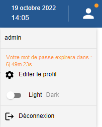

Cliquez sur **Modifier le profil**, puis modifiez votre mot de passe :

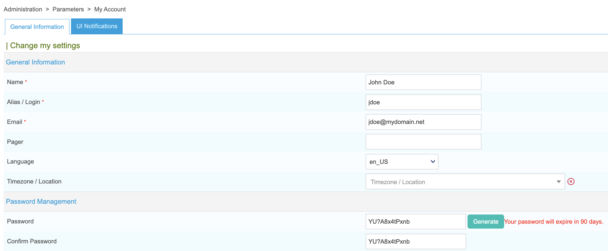

### Réinitialisez votre mot de passe après expiration

Si vous n'avez pas changé votre mot de passe avant son expiration, après connexion vous serez redirigé vers une page dédiée où vous pourrez le mettre à jour :

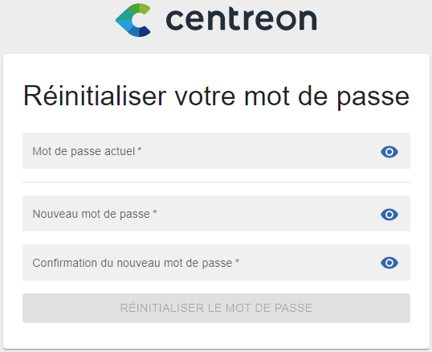

Entrez votre mot de passe actuel, définissez-en un nouveau puis cliquez sur **Réinitialiser le mot de passe**.
