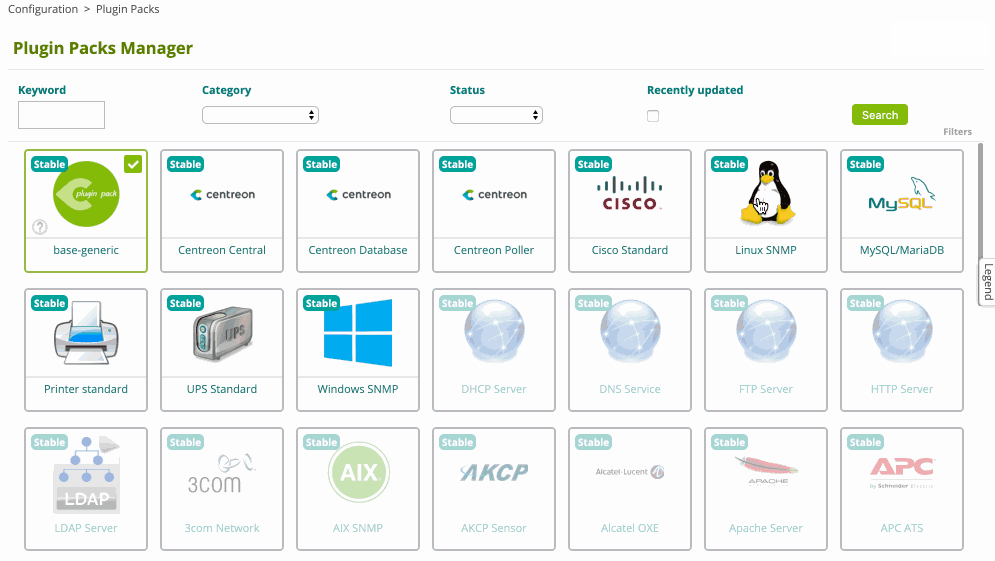
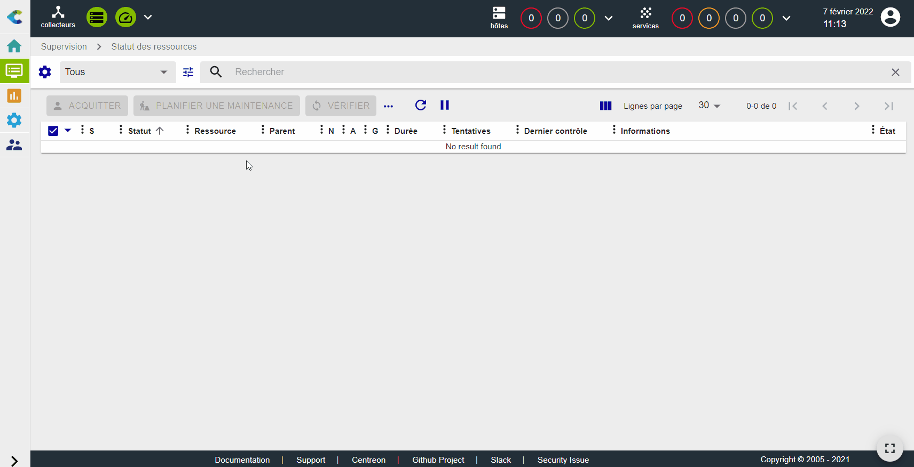
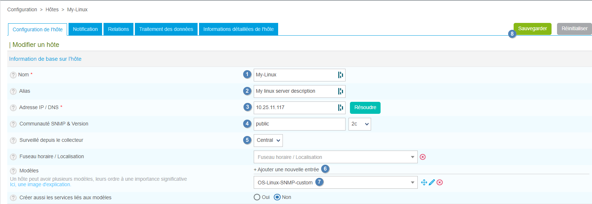
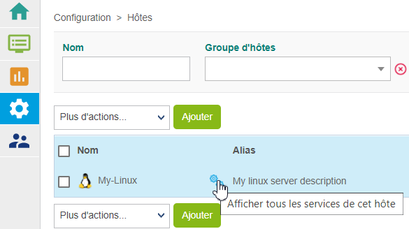

## Superviser un serveur Linux avec SNMP

Dans ce tutoriel, nous partons du principe que votre plate-forme Centreon est installée et fonctionne correctement, et que vous disposez au moins d'une édition [Centreon IT 100](it100.md) qui fournit les Plugin Packs Centreon (votre [licence](../administration/licenses.md) est déjà en place).

Votre serveur sera supervisé à l'aide du Plugin Pack [Linux SNMP](/pp/integrations/plugin-packs/procedures/operatingsystems-linux-snmp). (Plus d'informations sur les Plugin Packs [ici](../monitoring/pluginpacks.md)).

## Prérequis

### Sur le serveur Linux que vous souhaitez superviser

La première étape consiste à activer et à configurer l'agent SNMP sur l'hôte à superviser.
Veuillez vous référer à la documentation de votre distribution Linux pour savoir comment configurer l'agent SNMP.

Voici ci-dessous un fichier de configuration snmpd.conf/net-snmp minimaliste :

- remplacez la ligne **agentaddress** par l'adresse IP de l'interface sur laquelle snmpd doit écouter
- remplacez **my-snmp-community** par la valeur correspondant à votre environnement.
- Ajoutez la ligne **view centreon included .1.3.6.1** pour avoir accès à toutes les informations de la MIB requises par le plugin

```shell
agentaddress 0.0.0.0,[::]
#       sec.name  source          community
com2sec notConfigUser  default       my-snmp-community
####
# Second, map the security name into a group name:
#       groupName      securityModel securityName
group   notConfigGroup v1           notConfigUser
group   notConfigGroup v2c           notConfigUser
####
# Third, create a view for us to let the group have rights to:
# Make at least  snmpwalk -v 1 localhost -c public system fast again.
#       name           incl/excl     subtree         mask(optional)
view centreon included .1.3.6.1
view    systemview    included   .1.3.6.1.2.1.1
view    systemview    included   .1.3.6.1.2.1.25.1.1
####
# Finally, grant the group read-only access to the systemview view.
#       group          context sec.model sec.level prefix read   write  notif
access notConfigGroup "" any noauth exact centreon none none
access  notConfigGroup ""      any       noauth    exact  systemview none none
```

L'agent SNMP doit être redémarré à chaque fois que la configuration est modifiée. Assurez-vous également que l'agent SNMP est configuré pour démarrer automatiquement au démarrage. Utilisez les commandes suivantes pour les distributions récentes :

```shell
systemctl restart snmpd
systemctl enable snmpd
```

> Le serveur cible doit être accessible depuis le collecteur Centreon sur le port SNMP UDP/161.

### Sur le collecteur

Connectez-vous à votre collecteur en SSH et installez le plugin SNMP Linux (voir la [procédure de surveillance pour le Plugin Pack **Linux SNMP**](/pp/integrations/plugin-packs/procedures/operatingsystems-linux-snmp) pour plus d'informations) :

```shell
yum install centreon-plugin-Operatingsystems-Linux-Snmp
```

### Sur le serveur central

Dans l'interface web, allez à la page **Configuration > Plugin Packs** et installez le Plugin Pack **Linux SNMP** :



## Configurer l'hôte et déployer la configuration

1. Allez à la page **Configuration > Hôtes > Hôtes** et cliquez sur **Ajouter** :

   

2. Remplissez les informations suivantes :

   * Le nom du serveur (1)
   * Une description de celui-ci (2)
   * L'adresse IP du serveur (3)
   * La communauté SNMP et sa version (4)
   * Sélectionnez le collecteur désiré (laissez "Central" si vous n'avez pas d'autre collecteur) (5)

3. Cliquez sur **+ Ajouter une nouvelle entrée** dans le champ **Modèles** (6), puis sélectionnez le modèle **OS-Linux-SNMP-custom** (7) dans la liste :

   

4. Cliquez sur **Sauvegarder** (8). Votre équipement a été ajouté à la liste des hôtes :

   

5. Allez à la page **Configuration > Services > Services par hôte**. Un ensemble d'indicateurs a été créé automatiquement.

   

   Vous pouvez également utiliser le raccourci situé à côté du nom de l'hôte pour accéder directement à la page **Configuration > Services > Services par hôte**. La liste sera filtrée par le nom de l'hôte :

   

   

6. [Déployez la configuration](first-supervision.md#deployer-une-configuration).

7. Allez à la page **Surveillance > Statut des ressources** et sélectionnez **Toutes** dans le filtre **Statut des ressources**. Dans un premier temps, les ressources apparaissent avec le statut **En attente**, ce qui signifie qu'aucun contrôle n'a encore été exécuté :

   

   Après quelques minutes, les premiers résultats du contrôle apparaissent :

   

   Si tous les services ne sont pas dans un état OK, vérifiez la cause de l'erreur et corrigez le problème.
