import Tabs from '@theme/Tabs';
import TabItem from '@theme/TabItem';

## Superviser un serveur Windows en SNMP

Dans ce tutoriel, nous supposons que votre plateforme Centreon est installée et fonctionnelle. Une [licence](../administration/licenses.md) est nécessaire pour accéder au catalogue complet des Plugin Packs. Nous supposons que vous avez au moins une licence [Centreon IT 100 Edition](it100.md).

La supervision d'un serveur Windows en SNMP se fait via le [Plugin Pack Windows SNMP](/pp/integrations/plugin-packs/procedures/operatingsystems-windows-snmp). (Vous pouvez obtenir plus d'informations sur les Plugin Packs [ici](../monitoring/pluginpacks.md)).

## Prérequis

### Sur le serveur Windows que vous souhaitez superviser

La première étape consiste à installer et à configurer le service SNMP sur l'hôte Windows.
Veuillez vous référer à la documentation de votre distribution Windows pour savoir comment configurer le service SNMP.

Retrouvez ci-dessous quelques étapes pour installer et configurer SNMP sur Windows 10.

#### Installation de SNMP sur Windows 10

Vous avez deux options : installer SNMP en mode graphique ou installer SNMP via PowerShell.

<Tabs groupId="sync">
<TabItem value="En accédant aux Paramètres Windows" label="En accédant aux Paramètres Windows">

1. Rendez-vous dans le menu **Paramètres > Applications et fonctionnalités > Fonctionnalités facultatives**.

2. Cliquez sur le bouton **Ajouter une fonctionnalité** et recherchez **SNMP** :

  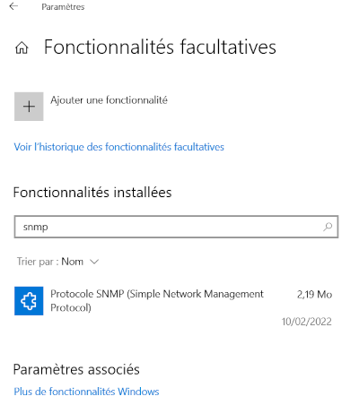

3. Sélectionnez **Protocole SNMP (Simple Network Management Protocol)** et cliquez sur **Installer**.

</TabItem>
<TabItem value=" Avec Windows PowerShell" label=" Avec Windows PowerShell">

Dans la barre de recherche, tapez **PowerShell** et choisissez **Exécuter en tant qu'administrateur**.

1. Vérifiez si le service SNMP est installé:

  ```shell
  Get-WindowsCapability  -Online -Name "SNMP*"
  ```

  

2. Pour installer le service SNMP à partir des serveurs de Microsoft, exécutez la commande suivante:

  ```shell
  Add-WindowsCapability  -Online -Name "SNMP.Client~~~~0.0.1.0"
  ```

  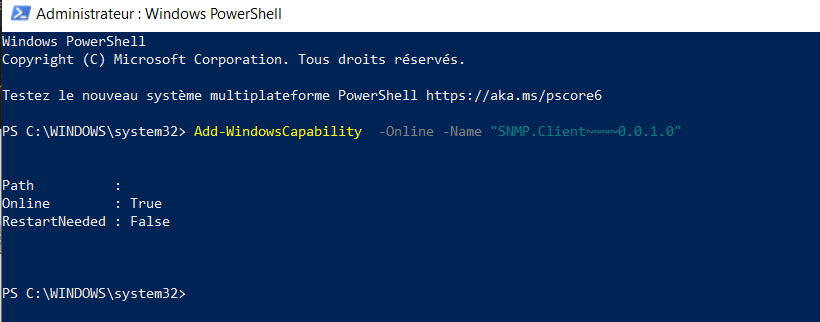

3. Vérifiez si le service SNMP a été installé avec succès :

  ```shell
  Get-WindowsCapability  -Online -Name "SNMP*"
  ```

  

</TabItem>
</Tabs>

#### Configuration de SNMP sur Windows 10

Après l'installation de SNMP, vous devez procéder à sa configuration.

1. Dans la barre de recherche, tapez **services.msc** et appuyez sur **Entrée** pour lancer le panneau **Services**.

2. Recherchez le service SNMP dans la liste.

  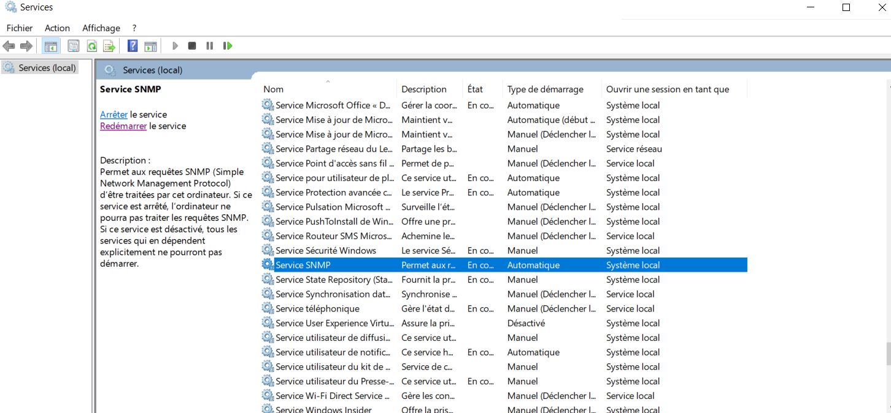

3. Dans l'onglet **Agent**, renseignez les paramètres **Contact** et **Emplacement**. Puis dans la rubrique **Service**, cochez les cases des services dont vous souhaitez collecter les données pour les transmettre au serveur Centreon qui supervisera l'hôte.

  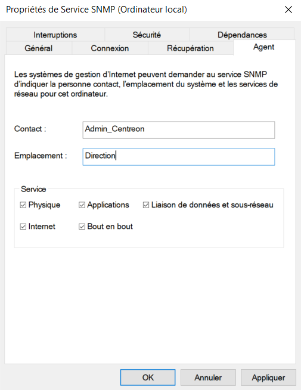

4. Dans l'onglet **Sécurité**, renseignez la communauté SNMP dans la section **Noms de communauté acceptés** et choisissez l'option **LECTURE SEULE**.
Sélectionnez ensuite **Accepter les paquets SNMP de ces hôtes** et ajoutez l'adresse IP du serveur Centreon.

  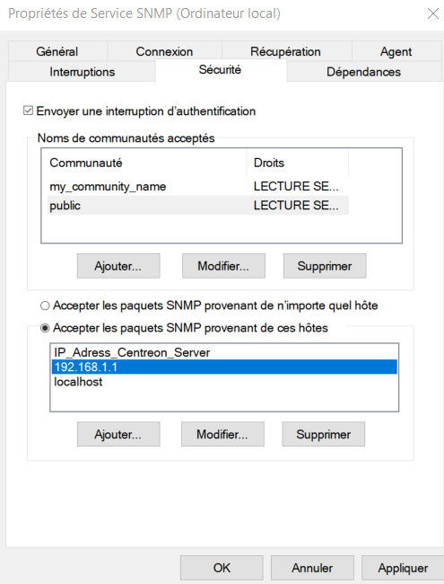

5. Redémarrez le service SNMP:

  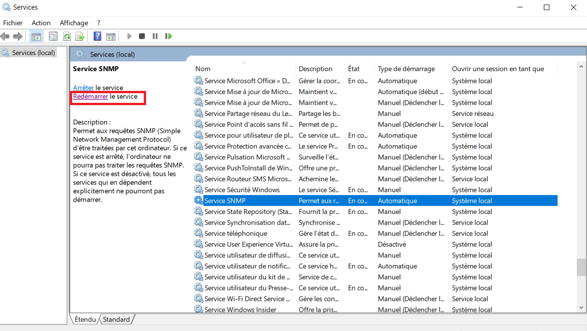

### Sur le serveur Centreon (collecteur)

Connectez-vous à votre collecteur en SSH et installez le plugin Windows SNMP (voir la [procédure de supervision du Plugin Pack **Windows SNMP**](/pp/integrations/plugin-packs/procedures/operatingsystems-windows-snmp) pour plus d'informations):

```shell
yum install centreon-plugin-Operatingsystems-Windows-Snmp
```

### Sur le serveur central

Dans l'interface Web, accédez à **Configuration > Plugin Packs** et installez le Plugin Pack **Windows SNMP** :

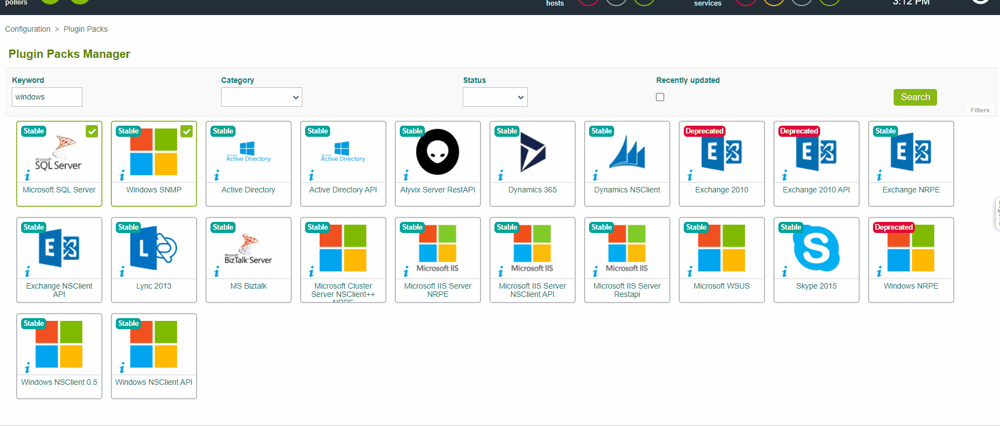

## Configurer l'hôte et déployer la configuration

1. Rendez-vous dans le menu **Configuration > Hôtes > Hôtes** et cliquez sur **Ajouter** :

  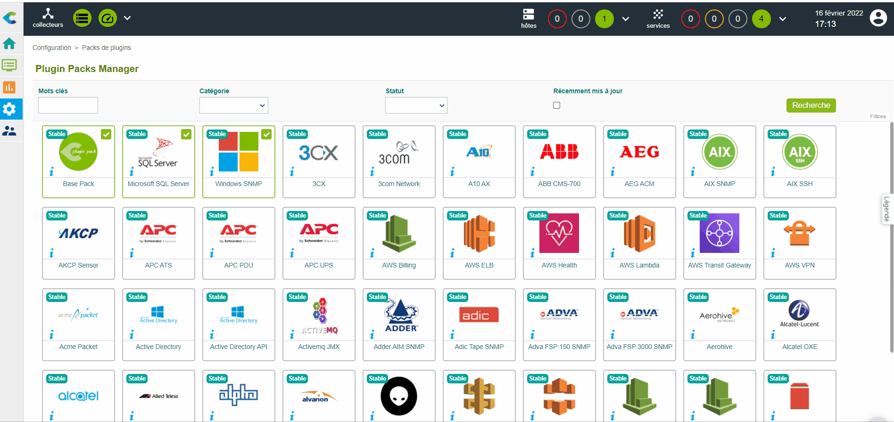

2. Remplissez les informations suivantes:

   * Le nom du serveur (1)
   * Une description du serveur (2)
   * L'adresse IP du serveur (3)
   * La communauté SNMP et sa version (4)
   * Sélectionnez le collecteur qui supervisera le serveur Windows (gardez "Central" si vous n'avez pas d'autres collecteur) (5)

3. Cliquez sur **+ Ajouter une nouvelle entrée** dans le champ **Modèles** (6), puis sélectionnez le modèle **OS-Windows-SNMP-custom** (7) et enregistrez en cliquant sur **Sauvegarder**.

  

4. Votre équipement a été ajouté à la lite des hôtes :

  

5. Rendez-vous dans le menu **Configuration > Services > Services par hôte**. Un ensemble d'indicateurs a été déployé automatiquement :

   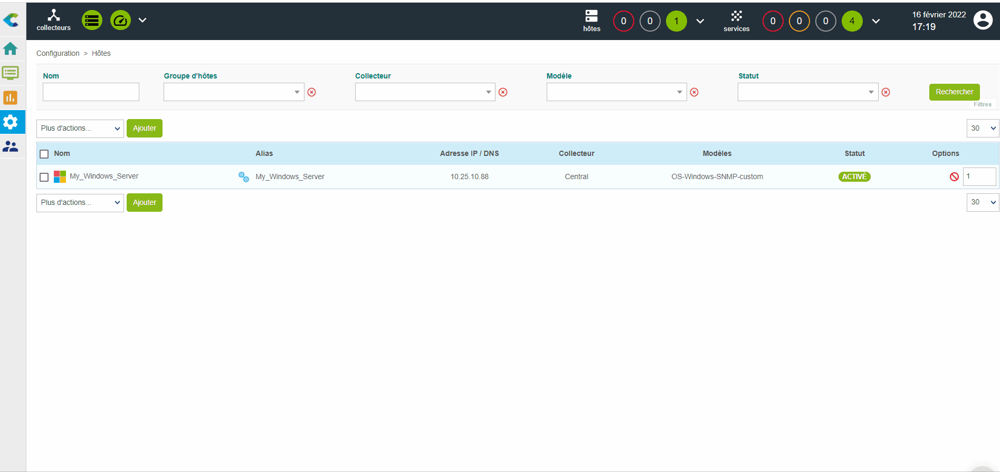

6. [Déployez la configuration](../monitoring/monitoring-servers/deploying-a-configuration.md).

7. Rendez-vous dans le menu **Monitoring > Status des Resources** et positionnez le filtre sur **Tous** pour récupérer tous les indicateurs quel que soit leur état :

	

   Les premiers résultats de la supervision apparaissent avec le statut **En attente**, ce qui signifie que le moteur de supervision n'a pas encore vérifié leur statut :

   

   Après quelques minutes, les premiers résultats de la supervision apparaissent :

   

   Si tous les services ne sont pas dans un état **OK**, dépannez et [corrigez le problème](/pp/integrations/plugin-packs/getting-started/how-to-guides/troubleshooting-plugins/)

### Pour aller plus loin

Le Plugin Pack **Windows SNMP** apporte de nombreux modèles de supervision. Rendez-vous dans le menu  **Configuration > Services > Modèles** et trouvez la liste complète:

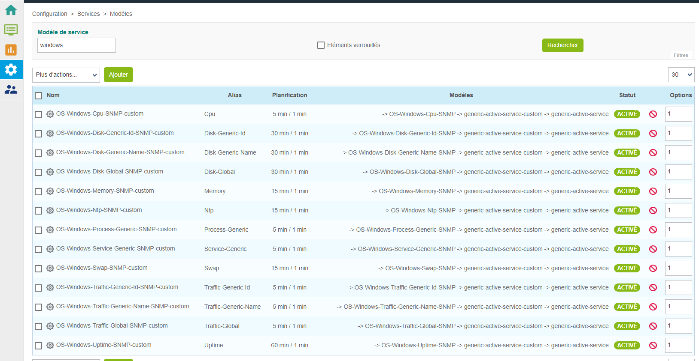

Avec **Centreon IT Edition**, vous pouvez ajouter très rapidement et très simplement la supervision de vos cartes réseau, partitions, processus et services en utilisant la fonctionnalité de [découverte des services](../monitoring/discovery/services-discovery.md).

1. Rendez-vous dans le menu **Configuration > Services > Manuelle**. Commencez à saisir le nom de l’hôte sur lequel réaliser la découverte et l’interface vous proposera de compléter automatiquement ce dernier :

  

2. Sélectionnez ensuite la commande de découverte à exécuter dans la liste déroulante qui vient d’apparaître en dessous du champ **Rule**. Cliquez sur le bouton **Scan** et patientez durant l’analyse des éléments disponibles. Le résultat s’affiche. Sélectionnez les éléments à intégrer à la supervision et cliquez sur le bouton **Save** :

  

  Les éléments ont été ajoutés. Vous pouvez sélectionner une autre commande de découverte et répéter le processus.

3. Les services ont été ajoutés et peuvent être affichés dans le menu **Configuration > Services > Services par hôte** :

  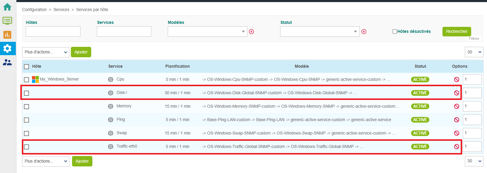

4. [Déployez la configuration](../monitoring/monitoring-servers/deploying-a-configuration.md).
