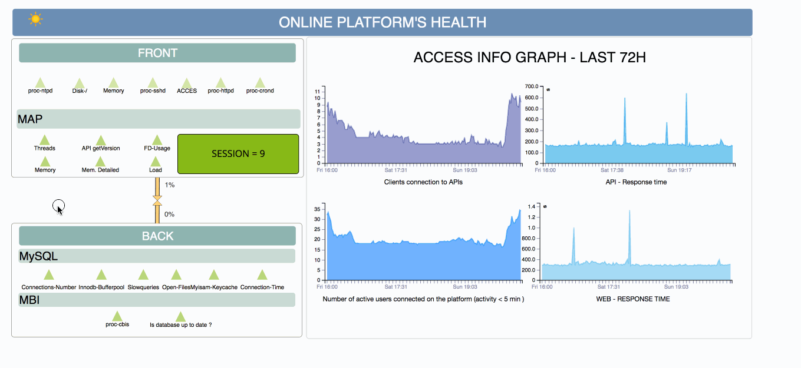
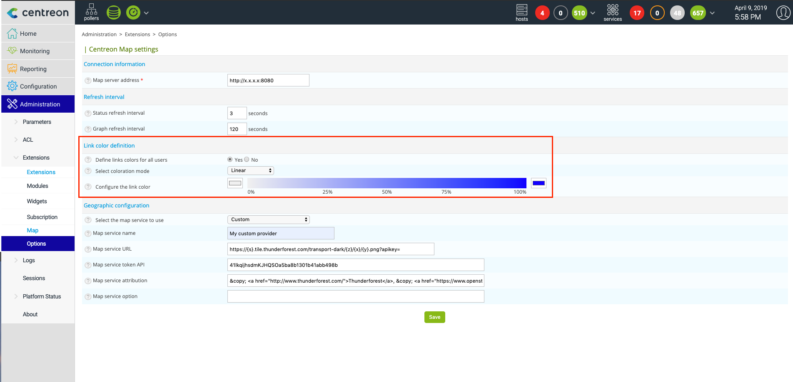
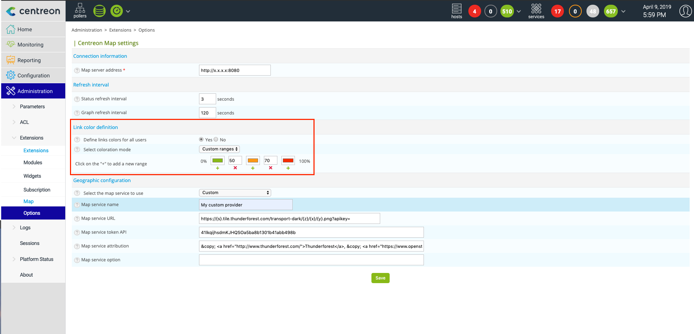
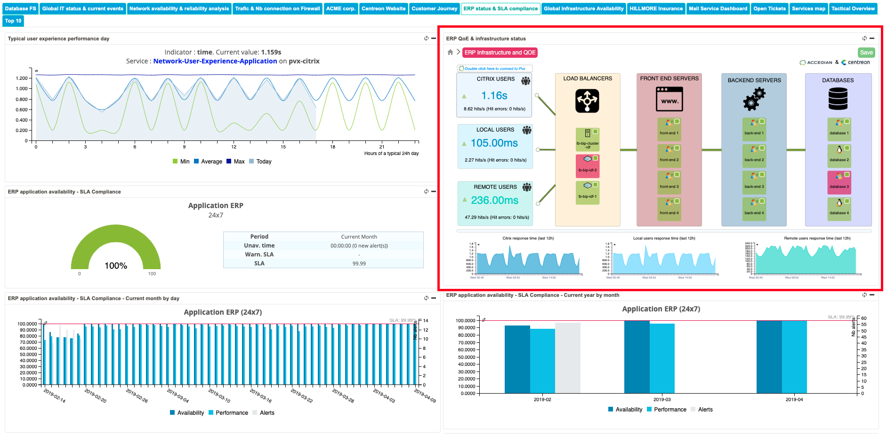

Les vues standard et géographiques existantes sont accessibles à partir de l'interface utilisateur web de Centreon, si vous avez les droits d'accès correspondants.
Vous pouvez les afficher en utilisant le menu **Monitoring > Map** ou en utilisant le widget Centreon MAP dédié.

Vous trouverez ci-dessous les fonctions dédiées de l'interface web Centreon MAP qui facilitent l'utilisation et les interactions avec les vues.

## Comprendre les infobulles

Sur l'interface web, il existe des fenêtres d'information appelées tooltips.
Elles apparaissent lorsque vous passez la souris sur certains types d'objets dans une vue : les liens (liens d'état et liens métriques), les services, les métaservices, les hôtes, les groupes d'hôtes et les groupes de services.
Cette fenêtre reste ouverte tant que votre curseur est au dessus de l'info-bulle.

Selon le type d'objet GUI qui se trouve sous votre souris, différentes informations seront affichées.
Par exemple, un lien (liens d'état et liens métriques, services et métaservice) affichera :

- Informations sur l'acquittement (si présent)
- Informations sur les temps d'arrêt (si elles sont présentes)
- Durée.
- Sortie.

Dans le cas des hôtes, des groupes d'hôtes et des objets de service, ces informations récapitulatives "au passage de la souris" comprennent une liste des cinq ressources les plus récemment utilisées dans le sous-niveau qui ont actuellement un impact sur l'hôte/groupe d'hôtes ou le groupe de service.

Les règles suivantes s'appliquent :

- Si un hôte est indisponible, les services rattachés ne sont jamais affichés dans une infobulle.
- Pour un hôte : les services affichés correspondent au statut hérité de l'hôte.
  Par exemple, si un hôte est "rouge", alors seuls les services critiques seront affichés.
- Pour un groupe de services : les services affichés correspondent à l'état hérité du groupe de services.
- Pour un groupe d'hôtes : les hôtes ayant le même statut que le groupe d'hôtes sont affichés dans une infobulle ; et les services (si leur hôte est OK) ayant le même statut hérité que leur groupe d'hôtes sont affichés.

> Dans le widget des vues personnalisées, par défaut, les infobulles ne sont pas affichées. Il est possible de les activer par une case à cocher dans les paramètres du widget.

## Gérer la couleur des liens

Dans la version précédente de Centreon MAP, la couleur des liens était définie au niveau de l'utilisateur et chaque utilisateur devait configurer sa propre couleur en utilisant le client lourd.
Nous avons modifié ce mécanisme afin que vous puissiez définir une méthode de coloration des liens pour **tous les utilisateurs** à la fois.
Pour ce faire :

1. Allez dans **Administration > Extension > Map | Options**.
2. Dans la section "Définition de la couleur du lien", sélectionnez la méthode et le paramètre de coloration que vous souhaitez appliquer.

Exemple : coloration linéaire du gris au bleu

Autre exemple : gamme de couleurs

## Utiliser le widget

Centreon MAP est livré avec un widget que vous pouvez utiliser dans les vues personnalisées Centreon. Pour ce faire, ajoutez un nouveau widget sur la vue personnalisée et recherchez "MAP".

Lorsque vous ajoutez le widget, vous pouvez sélectionner une vue et enregistrer la position et le zoom à n'importe quel niveau.

