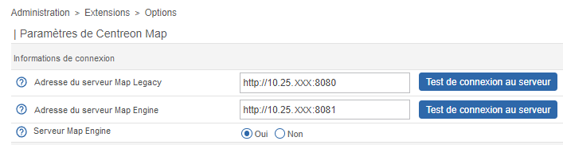

This topic describes how to move from Centreon MAP (Legacy) to Centreon MAP and how to import your legacy maps into your MAP module.

> Centreon MAP must be installed on your environment. See the [MAP installation](map-web-install.md) procedure if needed.

## Passer de Legacy à MAP

1. Log in to Centreon web interface.

2. Go to the **Administration > Extensions > Map > Options** page.

3. In the **Connection information** section, set the **Map Engine server** to **Yes**. Then click **Save**.

  

## Importer les cartes Legacy dans MAP

> Lorsque vous importez vos anciennes cartes, tout le contenu créé dans MAP est supprimé.

### Étape 1 : Migrer les images

Si vous avez importé des images dans le client lourd (dans des dossiers personnalisés en dehors du dossier Centreon), et que vous les avez utilisées dans vos cartes, vous devez d'abord les migrer vers votre serveur central.

1. Dans le client de lourd MAP (Legacy), dans le panneau **Media**, sélectionnez toutes les images que vous souhaitez migrer depuis vos dossiers personnalisés, faites un clic-droit et sélectionnez **Exporter**.

2. Sauvegardez les images sur votre machine.

3. Sur le serveur central, allez dans **Administration > Paramètres > Images**, puis téléchargez toutes les images de votre ordinateur dans le répertoire **centreon-map**. Veillez à ne pas changer le nom de vos images au cours de ce processus.

### Étape 2 : Mettre à jour MAP (Legacy)

Pour que les icônes s'affichent correctement après avoir migré vos cartes, vous devez mettre à jour votre MAP (legacy) en exécutant les commandes suivantes :

```shell
yum stop centreon-map
yum update centreon-map-server --enablerepo=centreon-beta-stable
systemctl daemon-reload
systemctl start centreon-map
```

### Étape 3 : Migrer les cartes

1. Pour importer vos anciennes cartes dans MAP, allez à la page **Supervision > Map**, puis cliquez sur le bouton **Migrer**. La fenêtre suivante apparaît :

  

2. Cliquer sur **Migrer**.
 
  

3. Lorsque la migration a réussi, vous pouvez fermer la fenêtre.

Vos anciennes cartes sont maintenant affichées dans la page **Map**. 
