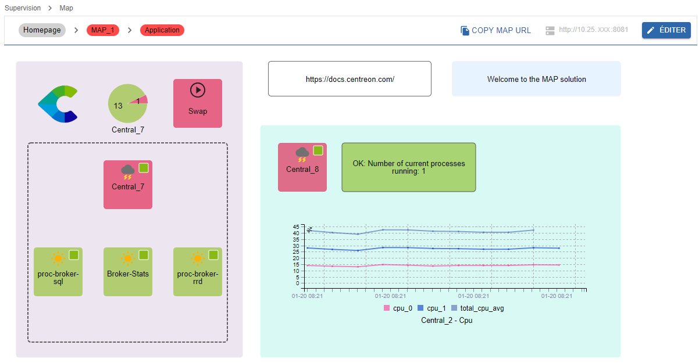

Centreon MAP est une solution intégralement disponible dans l'interface web Centreon tout en vous proposant la meilleure expérience possible pour créer, visualiser et partager des représentations graphiques de votre infrastructure supervisée.

Contrairement à la version MAP (Legacy), MAP vous fournit un outil d'édition entièrement intégré à l'interface web Centreon. Vous n'avez pas besoin d'installer quoi que ce soit sur votre machine. Vous pouvez également naviguer facilement entre le mode édition et le mode de visualisation.

> Si vous êtes déjà utilisateur de MAP (Legacy), notez que vous pouvez facilement [importer vos anciennes cartes](import-into-map-web.md) dans l'interface MAP.

> Consultez la procédure de gestion des vues à l'aide de l'API REST de Centreon MAP [ici](https://docs-api.centreon.com/api/centreon-map/).

## Aperçu de l'interface

Créez, personnalisez et visualisez vos cartes au sein d'une unique interface web.

Vous devez d'abord créer vos vues logiques à l'aide de l'éditeur MAP :

Vous pouvez ensuite visualiser votre carte directement dans le mode de visualisation :

## Procédures

Les procédures suivantes permettent de gérer et d'utiliser Centreon MAP.

### Gérer MAP
  - [Installer MAP](map-web-install.md) describes prerequisites and procedures to install MAP.
  - [Installer MAP sur un serveur distant](map-web-install-remote.md) explains how to install MAP on a remote server.
  - [Mettre à jour MAP](map-web-update.md) describes the update process of MAP.
  - [Importer des cartes legacy dans MAP](import-into-map-web.md) explains how to migrate your legacy maps into the MAP interface.
  - [Installer sur un serveur distant](remote-server.md) explains how to install MAP on a remote server.
  - [Gérer les droits d'accès dans MAP](map-web-manage.md) describes the different rights and permissions on maps.
  - [Problèmes connus dans MAP](map-web-known-issues.md) is a list of issues you may encounter using MAP.
  - [Dépannage de MAP](map-web-troubleshooting.md) helps you to solve some issues occuring in MAP.

### Utiliser MAP
  - [Gérer les cartes dans MAP](map-web-manage.md) gives you information about how to create and manage maps from the Centreon MAP interface.
  - [Utiliser l'éditeur MAP](map-web-editor.md) explains how to build maps using the editor tool.
