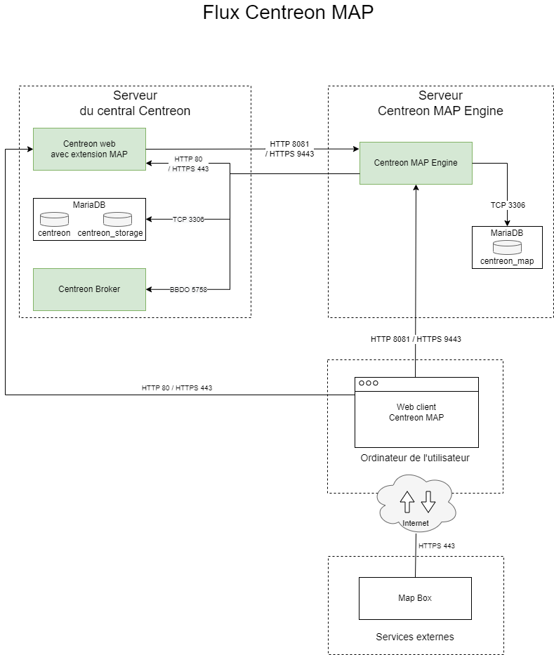
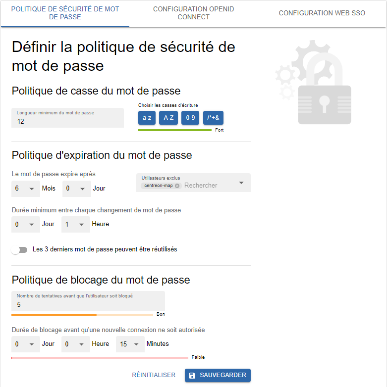

import Tabs from '@theme/Tabs';
import TabItem from '@theme/TabItem';

Cette page décrit comment installer Centreon MAP. Il est recommandé d'installer MAP sur le serveur central. Toutefois, si vous disposez de gros volumes de données, vous pouvez l'installer sur votre ancien serveur MAP (Legacy). Le module MAP n'utilise pas la base de données **centreon_studio**.

## Licence

Si vous avez besoin d'une [licence](../administration/licenses.md) supplémentaire pour Centreon MAP, veuillez contacter l'[équipe de support de Centreon](https://support.centreon.com/) pour obtenir et installer votre clé de licence.

## Architecture

Le schéma ci-dessous décrit l'architecture de MAP :



**Tableau des flux du réseau**


| Application    | Source     | Destination               | Port      | Protocole  | Objet                                                       |
|----------------|------------|---------------------------|-----------|------------|------------------------------------------------------------ |
| MAP Server     | MAP server | Centreon central broker   | 5758      | TCP        | Obtenez des mises à jour du statut en temps réel            |
| MAP Server     | MAP server | Centreon MariaDB database | 3306      | TCP        | Récupérer la configuration et d'autres données de Centreon  |
| MAP Server     | MAP server | MAP server database       | 3306      | TCP        | Stocker toutes les vues et données relatives à Centreon MAP |
| Web            | MAP server | Centreon central          | 80/443    | HTTP/HTTPS | Authentification et récupération des données                |
| Web interface  | User       | MAP server                | 8081/9443 | HTTP/HTTPS | Récupérer les vues et le contenu                            |
| Web interface  | User       | Internet\* (Mapbox)       | 443       | HTTPS      | Récupérer les données Mapbox                                |

\**Avec ou sans proxy*

## Prérequis

### Serveur Centreon MAP Engine

#### Licence

Le serveur nécessite que la licence soit disponible et valide sur le serveur central de Centreon. Pour ce faire, vous devez contacter le [support Centreon](https://support.centreon.com/) pour obtenir et installer votre clé de licence.

#### Logiciel

- OS : CentOS 7 ou Redhat 7 / 8
- DBMS : MariaDB 10.5
- Pare-feu : Désactivé
- SELinux : Désactivé

#### Informations requises lors de la configuration

- Connexion à Centreon Web avec des droits d'administrateur.

> Même avec un serveur correctement dimensionné, vous devez garder à l'esprit les meilleures pratiques et recommandations lors de la création de vues afin de ne pas rencontrer de problèmes de performance.

### Interface web de Centreon MAP

#### Licence

Le serveur nécessite que la licence soit disponible et valide sur le serveur central de Centreon. Pour ce faire, vous devez contacter le [support Centreon](https://support.centreon.com/) pour obtenir et installer votre clé de licence.

#### Compatibilité

L'interface web MAP de Centreon est compatible avec les navigateurs web suivants :

* Google Chrome (dernière version au moment de la sortie du logiciel Centreon et supérieure).
  Veuillez consulter la [FAQ Google Chrome](https://support.google.com/chrome/a/answer/188447?hl=en) pour une description de la politique de support de Chrome. 
* Mozilla Firefox (dernière version au moment de la sortie du logiciel Centreon et supérieure).
  Veuillez consulter la [FAQ Mozilla](https://www.mozilla.org/en-US/firefox/organizations/faq/) pour obtenir une description de la politique d'assistance de Firefox.
* Apple Safari (dernière version au moment de la sortie du logiciel Centreon et supérieure).
* Microsoft Edge Chromium (dernière version au moment de la sortie du logiciel Centreon et supérieure).

Si une mise à jour de ces navigateurs pris en charge devait entraîner une incompatibilité, Centreon travaillerait sur un correctif dans les plus brefs délais (pour les versions de Centreon supportées). Bien que d'autres navigateurs puissent fonctionner, Centreon ne tentera pas de résoudre les problèmes liés aux navigateurs autres que ceux énumérés ci-dessus.

La résolution de votre écran doit être d'au moins 1280 x 768.

### Configuration réseau

Le serveur Centreon MAP Engine doit accéder :

- au Broker du serveur central, généralement sur la machine Centreon central, en utilisant le port TCP 5758,
- à la base de données Centreon, généralement sur la machine Centreon central, en utilisant le port TCP 3306,
- à la base de données MAP Centreon, généralement sur l'hôte local, en utilisant le port TCP.

Tous les ports ci-dessus sont des valeurs par défaut et peuvent être modifiés si nécessaire.

- Centreon Web Central, en utilisant le port HTTP 80 ou le port HTTPS 443.

Les ports 8081 et 9443 sont des valeurs par défaut recommandées, mais d'autres configurations sont possibles.

## Installation du serveur

### Interface web de Centreon

Vous devez fournir au serveur Centreon MAP Engine un utilisateur dédié **qui a accès à toutes les ressources** par le biais des [groupes de listes d'accès](../administration/access-control-lists.md).
Étant donné que le mot de passe sera stocké sous une forme lisible par l'homme dans un fichier de configuration, vous ne devez pas utiliser un compte utilisateur Centreon admin.

- Allez dans **Configuration > Utilisateurs > Contacts/Utilisateurs**. Puis cliquez sur l'onglet **Authentification Centreon**.
- Définir le paramètre **Accès à l'API de temps réel** sur **Oui**.


Excluez l'utilisateur de la politique d'expiration du mot de passe sur la page **Administration > Authentification** : son mot de passe n'expirera jamais.



### Serveur central Centreon

Créez un utilisateur dans l'instance mysql hébergeant les bases de données **centreon** et **centreon_storage** :

```sql
CREATE USER 'centreon_map'@'<IP_SERVER_MAP>' IDENTIFIED BY 'centreon_map';
GRANT SELECT ON centreon_storage.* TO 'centreon_map'@'<IP_SERVER_MAP>';
GRANT SELECT, INSERT ON centreon.* TO 'centreon_map'@'<IP_SERVER_MAP>';
```

Le privilège INSERT ne sera utilisé que pendant le processus d'installation afin de créer une nouvelle sortie Centreon Broker. Il sera révoqué ultérieurement.

### Serveur MAP Engine Centreon

Si vous avez installé votre serveur Centreon MAP à partir d'une "installation CentOS fraîche", vous devez installer le paquet **centreon-release** :

<Tabs groupId="sync">
<TabItem value="Alma / RHEL / Oracle Linux 8" label="Alma / RHEL / Oracle Linux 8">

First you need to install an EPEL repository:

```shell
dnf install -y https://dl.fedoraproject.org/pub/epel/epel-release-latest-8.noarch.rpm
```

The command should return results as follows:

```shell
Installed:
  epel-release-8-17.el8.noarch

Complete!
```

Then install the **centreon-release** package:

```shell
dnf install -y https://yum.centreon.com/standard/22.04/el8/stable/noarch/RPMS/centreon-release-22.10.el8.noarch.rpm
```

</TabItem>
<TabItem value="CentOS 7" label="CentOS 7">

#### Prérequis de la version Java
  > Assurez-vous qu'une version de Java 17 ou ultérieure est installée avant de commencer la procédure.
  
  - Pour vérifier quelle version de Java est installée, entrez la commande suivante :
  
  ```shell
  java -version
  ```
  
  - Pour une mise à jour de Java en version 17 (ou ultérieure), allez sur la [page officielle de téléchargement d'Oracle](https://www.oracle.com/java/technologies/javase/jdk17-archive-downloads.html).

  - Si plusieurs versions de Java sont installées, vous devez activer la bonne version. Affichez les versions installées avec la commande suivante puis sélectionnez la version 17 (ou ultérieure) :
  ```shell
  sudo update-alternatives --config java
  ```

  - Si vous souhaitez configurer votre plateforme en HTTPS, vous aurez besoin de générer un fichier keystore pour la version 17 de Java ([voir procédure](./secure-your-map-platform.md#configuration-httpstls-avec-une-clé-auto-signée)).
  
Vous pouvez maintenant procéder à l'installation du paquet **centreon-release** :

```shell
yum install -y https://yum.centreon.com/standard/22.10/el7/stable/noarch/RPMS/centreon-release-22.10-1.el7.centos.noarch.rpm
```

</TabItem>
<TabItem value="Debian 11" label="Debian 11">

Installez les dépendances suivantes :

```shell
apt update && apt install lsb-release ca-certificates apt-transport-https software-properties-common wget gnupg2
```

Pour installer le dépôt Centreon, exécutez la commande suivante :

```shell
echo "deb https://apt.centreon.com/repository/22.04/ $(lsb_release -sc) main" | tee /etc/apt/sources.list.d/centreon.list
```

Ensuite, importez la clé du dépôt :

```shell
wget -O- https://apt-key.centreon.com | gpg --dearmor | tee /etc/apt/trusted.gpg.d/centreon.gpg > /dev/null 2>&1
```

</TabItem>
</Tabs>

> Si l'URL ne fonctionne pas, vous pouvez trouver manuellement ce paquet dans le dossier.

Installez le dépôt Centreon MAP, vous pouvez le trouver sur le [portail du support](https://support.centreon.com/s/repositories).

Installez ensuite le serveur Centreon MAP Engine à l'aide de la commande suivante :

<Tabs groupId="sync">
<TabItem value="Alma / RHEL / Oracle Linux 8" label="Alma / RHEL / Oracle Linux 8">

```shell
dnf install centreon-map-engine
```

</TabItem>
<TabItem value="CentOS 7" label="CentOS 7">

```shell
yum install centreon-map-engine
```

</TabItem>
<TabItem value="Debian 11" label="Debian 11">

```shell
apt update
apt install centreon-map-engine
```

</TabItem>
</Tabs>

Lors de l'installation du serveur Centreon MAP Engine, java (OpenJDK 11) sera automatiquement installé, si nécessaire.

> Vous devez disposer d'une base de données MariaDB pour stocker les données de Centreon MAP, qu'elle soit sur localhost ou ailleurs.

Pour installer MariaDB, exécutez la commande suivante :

<Tabs groupId="sync">
<TabItem value="Alma / RHEL / Oracle Linux 8" label="Alma / RHEL / Oracle Linux 8">

```shell
dnf install mariadb-client mariadb-server
```

</TabItem>
<TabItem value="CentOS 7" label="CentOS 7">

```shell
yum install mariadb-client mariadb-server
```

</TabItem>
<TabItem value="Debian 11" label="Debian 11">

```shell
apt install mariadb-client mariadb-server
```

</TabItem>
</Tabs>

### Configuration

Assurez-vous que la base de données qui stocke les données MAP de Centreon est optimisée (automatiquement ajoutée par le RPM dans `/etc/my.cnf.d/map.cnf`) :

```text
max_allowed_packet = 20M
innodb_log_file_size = 200M
```

Ensuite, redémarrez MariaDB :

```shell
systemctl restart mariadb
```

#### Sécuriser la base de données

Depuis MariaDB 10.5, il est obligatoire de sécuriser l'accès root de la base de données avant d'installer Centreon. Si vous utilisez une base de données locale, exécutez la commande suivante sur le serveur central :

```shell
mysql_secure_installation
```
``

* Répondez **oui** à toutes les questions, sauf à "Disallow root login remotely ?
* Il est obligatoire de définir un mot de passe pour l'utilisateur **root** de la base de données. Vous aurez besoin de ce mot de passe pendant l'[installation web](../installation/web-and-post-installation.md).

> Pour plus d'informations, veuillez consulter la [documentation officielle de MariaDB](https://mariadb.com/kb/en/mysql_secure_installation/).

#### Script Configure.sh

Exécutez le script de configuration du serveur MAP de Centreon. Deux modes sont disponibles : interactif ou automatique.

- interactif *(aucune option/mode par défaut)* : Plusieurs questions seront posées pour remplir de manière interactive les variables d'installation.
- automatique *(--automatic ou -a)* : L'installation se fera automatiquement à partir des valeurs définies dans le fichier `/etc/centreon-studio/vars.sh`.

Si c'est votre première installation, nous vous conseillons d'utiliser le mode standard (interactif) et de choisir **Non** lorsqu'on vous demande le mode d'installation avancé :

```shell
/etc/centreon-studio/configure.sh
```

Si vous venez d'installer Centreon 22.10, sachez que la plate-forme utilise désormais le nouveau protocole BBDO v3.
Pour que MAP fonctionne correctement, modifiez le fichier suivant : **/etc/centreon-studio/studio-config.properties**.

```text
broker.pb.message.enabled=true
```

Puis redémarrez le service **centreon-map** :

```shell
systemctl restart centreon-map
```

### Serveur central

> Avant de redémarrer Broker, vous devez exporter la configuration à partir de l'interface web de Centreon.

Redémarrez Centreon Broker sur le serveur central :

```shell
systemctl restart cbd
```

Supprimer le privilège INSERT de l'utilisateur **centreon_map** :

```sql
REVOKE INSERT ON centreon.* FROM 'centreon_map'@'<IP_SERVER_MAP>';
```

### Serveur Centreon MAP Engine

Vérifiez votre configuration :

```shell
/etc/centreon-studio/diagnostic.sh
```

Si la configuration est correcte, le service **centreon-map** peut être lancé à partir du serveur Centreon MAP (Legacy) :

```shell
systemctl restart centreon-map
```

Permettez au service de démarrer automatiquement au démarrage du serveur :

```shell
systemctl enable centreon-map
```

Le serveur Centreon MAP est maintenant démarré et activé : installons la partie interface de l'extension.

## Installation

### Étape 1 : Installer le dépôt Business

Installez le dépôt Centreon MAP : vous pouvez le trouver sur le [portail du support](https://support.centreon.com/s/repositories).

Ensuite, exécutez la commande suivante :

<Tabs groupId="sync">
<TabItem value="Alma / RHEL / Oracle Linux 8" label="Alma / RHEL / Oracle Linux 8">

    ```shell
    sudo dnf install https://yum.centreon.com/centreon-business/1a97ff9985262bf3daf7a0919f9c59a6/21.10/el8/stable/noarch/RPMS/centreon-business-release-21.10-5.el8.noarch.rpm
    ```

</TabItem>
<TabItem value="CentOS 7" label="CentOS 7">

    ```shell
    sudo yum install https://yum.centreon.com/centreon-business/1a97ff9985262bf3daf7a0919f9c59a6/21.10/el7/stable/noarch/RPMS/centreon-business-release-21.10-5.el7.centos.noarch.rpm
    ```

</TabItem>
</Tabs>

### Étape 2 : Installer le module MAP

1. Depuis votre terminal, entrez la commande suivante :

  <Tabs groupId="sync">
  <TabItem value="Alma / RHEL / Oracle Linux 8" label="Alma / RHEL / Oracle Linux 8">

  ```shell
  sudo dnf install centreon-map-web-client
  ```

  </TabItem>
  <TabItem value="CentOS 7" label="CentOS 7">

  ```shell
  sudo yum install centreon-map-web-client
  ```

  </TabItem>
  </Tabs>

2. Vous devez ensuite vous connecter à l'interface web Centreon.

3. Allez dans **Administration > Extensions > Gestionnaire** et installez le module **Map Web Client**.

4. Retournez dans le terminal et créez un utilisateur **centreon_map** dans une instance MySQL hébergeant les bases de données **centreon** et **centreon_storage**.

  ```shell
  mysql -u root -p
  CREATE USER 'centreon_map'@'<IP_MAP_SERVER_NG>' IDENTIFIED BY 'centreon_map';
  GRANT SELECT ON centreon_storage.* TO 'centreon_map'@'<IP_MAP_SERVER_NG>';
  GRANT SELECT, INSERT ON centreon.* TO 'centreon_map'@'<IP_MAP_SERVER_NG>';
  exit
  ```

### Étape 3: Installer le serveur centreon-map-engine

1. Installez le serveur **centreon-map-engine** en entrant la commande suivante :

  <Tabs groupId="sync">
  <TabItem value="Alma / RHEL / Oracle Linux 8" label="Alma / RHEL / Oracle Linux 8">

  ```shell
  sudo dnf install centreon-map-engine --enablerepo=centreon-beta-stable
  ```

  </TabItem>
  <TabItem value="CentOS 7" label="CentOS 7">

  ```shell
  sudo yum install centreon-map-engine --enablerepo=centreon-beta-stable
  ```

  </TabItem>
  </Tabs>

2. Définissez la configuration avec cette commande :

  ```shell
  /etc/centreon-map/configure.sh
  ```

3. Assurez-vous de remplacer les valeurs par défaut par celles qui correspondent à votre environnement. Par exemple, lorsque vous devez fournir l'identifiant et le mot de passe d'un compte qui a accès à toutes les ressources et actions, remplacez **admin/centreon** par les informations d'identification adaptées à votre plateforme.

4. Si vous n'utilisez pas le module BAM (service mapping) sur votre plateforme, allez dans **Configuration > Collecteurs > Configuration de Centreon Broker**, cliquez sur **central-broker-master**, puis sur **Sauvegarder**. Il s'agit d'une solution de contournement pour un problème qui sera corrigé dans une prochaine version de Centreon broker.

5. [Déployez la configuration](../monitoring/monitoring-servers/deploying-a-configuration.md) du serveur central (en utilisant la méthode **Recharger**).

6. Redémarrez le service cbd :

  ```shell
  systemctl restart cbd
  ```

7. Lancez l'outil de diagnostic Centreon :

  ```shell
  cd /etc/centreon-map
  ./diagnostic.sh
  ```

  > En cas d'erreur, consultez la section **Lancement de l'outil de diagnostic** à la page [Dépannage de MAP](map-web-troubleshooting.md#run-our-diagnostic-tool).

8. Maintenant que la configuration est correcte, vous pouvez démarrer le serveur en exécutant cette commande :

  ```shell
  systemctl start centreon-map-engine
  ```

9. Activez ensuite le service pour qu'il soit lancé automatiquement au démarrage du serveur :

  ```shell
  systemctl enable centreon-map-engine
  ```

10. Exécutez la commande suivante pour vérifier que le service **centreon-map-engine** est correctement démarré :

  ```shell
  systemctl status centreon-map-engine
  ● centreon-map-ng.service - Centreon Studio map server
     Loaded: loaded (/usr/lib/systemd/system/ccentreon-map-engine.service; enabled; vendor preset: disabled)
     Active: active (running) since Tue 2022-09-06 09:29:02 UTC; 15s ago
   Main PID: 19560 (centreon-map-ng)
      Tasks: 23 (limit: 24448)
     Memory: 314.8M
     CGroup: /system.slice/centreon-map-engine.service
             ├─19560 /bin/bash /usr/share/centreon-map-server/bin/centreon-map-engine
             └─19576 /usr/bin/java -Dsun.misc.URLClassPath.disableJarChecking=true -XX:+HeapDumpOnOutOfMemoryError -XX:HeapDumpPath=/var/log/centreon-map -Dcentreon-map.signing-key=NeEmPqd1512l467yKcYkYQsU6XQ1oDZHkBglDH6nmnTWDRz5hIImTollDTZFOhtOB -Dcentreon-map.access-tok>
  ```

### Étape 4: Activer le module MAP

Par défaut, le module MAP n'est pas activé. Suivez cette procédure pour l'activer.

1. Connectez-vous à l'interface Centreon et allez à la page **Administration > Extensions > Map > Options**.

2. Dans la section **Informations de connexion**, définissez **Serveur Centreon Map** sur **Oui**.

3. Saisissez l'adresse IP de votre serveur MAP dans le champ **Adresse du serveur Centreon Map**. Si vous avez installé MAP sur le serveur central, il s'agit de l'adresse IP du serveur central. Utilisez son adresse IP complète, et non l'adresse locale (localhost). Le port par défaut est 8081. Par exemple : ``http://10.10.10.10:8081``.

4. Cliquez sur le bouton **Test de connexion au serveur Map** pour tester la connexion. Ce test doit retourner le message **Test de connexion réussi**.

5. Cliquez sur **Sauvegarder**.

Vous pouvez maintenant utiliser le module MAP en accédant à la page **Supervision > Map**.
