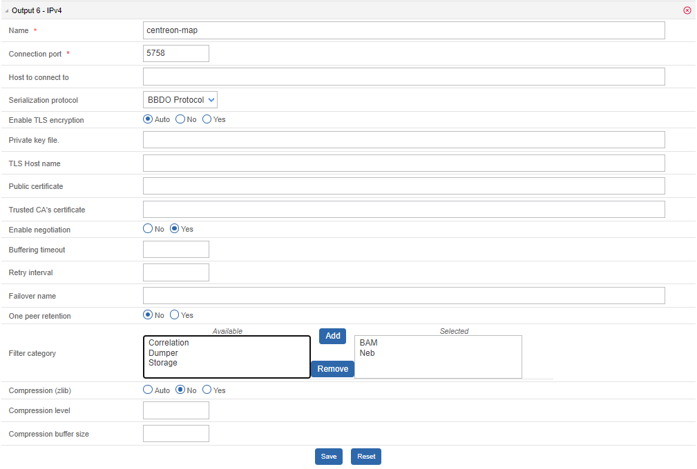

## Installation de Centreon MAP pour un Centreon Remote Server

L'installation de l'extension **Centreon MAP** sur un **Centreon Remote Server** doit se faire exactement comme l'installation sur un serveur central, seules la configuration et la désinstallation sont différentes.

Si votre Centreon Remote Server n'a pas encore été installé, veuillez vous référer à la [documentation](https://documentation.centreon.com/docs/centreon/en/latest/administration_guide/poller/install_remote_server) suivante.

Reportez-vous ensuite à la [procédure d'installation](install.md) pour installer les 2 composants principaux :

- L'interface web
- Le serveur

Après cela, vous devrez effectuer des étapes supplémentaires, expliquées ci-dessous, pour terminer l'installation de Centreon Map pour votre Centreon Remote Server.

## Synchronisation des images

Ajouter l'accès à la page de synchronisation des images **Administration > Paramètres > Images**.

```shell
[root@remote ~]# mysql centreon
MariaDB [centreon]> update topology SET topology_show='1' where topology_name='Images' ;
```

## Configuration de Centreon Broker

La configuration de **Centreon MAP** pour un serveur distant Centreon consiste à créer la configuration pour le Broker Centreon du serveur distant Centreon **à partir** du serveur central afin que, avec une sortie dédiée au Broker Centreon sur le serveur distant Centreon, Centreon Map puisse recevoir des données en temps réel directement de son serveur distant Centreon.

Pour ce faire, vous devez modifier la configuration du **Centreon Broker Master** du **Centeon Remote poller**.
Allez dans le menu `Configuration > Pollers > Broker configuration` et modifiez la configuration du remote poller.

Dans l'onglet Sortie, créez une nouvelle sortie avec les paramètres suivants :



Pour terminer l'installation, générer, exporter la configuration et **redémarrer** Centreon Broker manuellement.

## Désinstallation de Centreon MAP

Sur un poller distant, vous pouvez désinstaller le module **Centreon MAP** de la même manière que sur le serveur central Centreon.
Toutes les configurations de **Centreon Broker** pour le serveur distant Centreon liées au module **Centreon MAP** doivent être supprimées manuellement.
Consultez le chapitre ci-dessus pour savoir quelles sorties vous devez supprimer pour votre ou vos serveurs distants Centreon.
