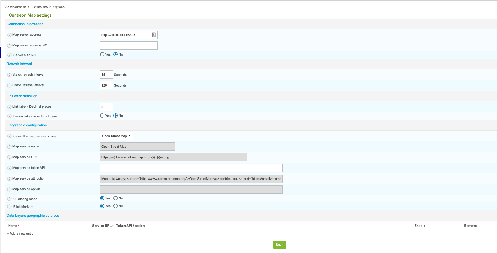
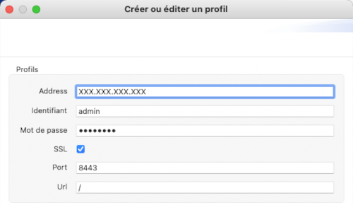
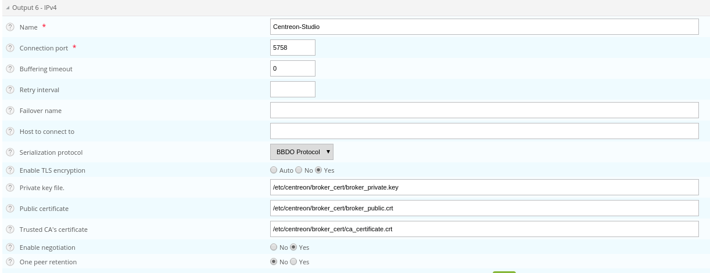

import Tabs from '@theme/Tabs';
import TabItem from '@theme/TabItem';

Ce chapitre décrit les procédures avancées permettant de sécuriser votre plateforme MAP et MAP (Legacy).

> Si vous souhaitez utiliser MAP et MAP (Legacy) en HTTPS, vous devez sécuriser à la fois votre plateforme Centreon et MAP (ou MAP Legacy). Suivez cette [procédure](../administration/secure-platform.md) pour sécuriser votre plateforme Centreon.

> Les erreurs de modification des fichiers de configuration peuvent entraîner des dysfonctionnements du logiciel. Nous vous recommandons de faire une sauvegarde du fichier avant de le modifier et de ne changer que les paramètres conseillés par Centreon.

## Configurer HTTPS/TLS sur le serveur MAP (ou MAP Legacy)

### Configurer HTTPS/TLS avec une clé reconnue

> Cette section décrit comment ajouter une **clé reconnue** au serveur MAP (ou MAP Legacy).
>
> Si vous souhaitez créer une clé auto-signée et l'ajouter à votre serveur, veuillez vous référer à la [section suivante](#configuration-httpstls-avec-une-clé-auto-signée).

Vous aurez besoin de :

- Un fichier de clé, appelé **key.key**.
- Un fichier de certificat, appelé **certificate.crt**.

Accédez au serveur Centreon MAP par SSH.

Créez un fichier PKCS12 avec la ligne de commande suivante :

```shell
openssl pkcs12 -inkey key.key -in certificate.crt -export -out keys.pkcs12
```

Ensuite, importez ce fichier dans un nouveau keystore (un dépôt Java de certificats de sécurité) :

```shell
keytool -importkeystore -srckeystore keys.pkcs12 -srcstoretype pkcs12 -destkeystore studio.jks
```

Placez le fichier keystore ci-dessus (studio.jks) dans le dossier **/etc/centreon-map/**, et définissez les paramètres ci-dessous dans **/etc/centreon-map/map-config.properties** :

```text
centreon-map.keystore=/etc/centreon-map/studio.jks
centreon-map.keystore-pass=xxx
```

> Remplacez la valeur "xxx" de keystore-pass par le mot de passe que vous avez utilisé pour le keystore et adaptez le chemin vers le keystore (s'il a été modifié).

### Configuration HTTPS/TLS avec une clé auto-signée

> L'activation du mode TLS avec une clé auto-signée obligera chaque utilisateur à ajouter une exception pour le certificat avant d'utiliser l'interface web.
>
> Ne l'activez que si votre Centreon utilise également ce protocole.
>
> Les utilisateurs devront ouvrir l'URL :
>
> - MAP :
> ```shell
> https://<MAP_IP>:9443/centreon-studio/api/beta/actuator/health.
> ```
>
> - MAP (Legacy) :
> ```shell
> https://<MAP_IP>:8443/centreon-studio/api/beta/actuator/health.
> ```
>
> *La solution que nous recommandons est d'utiliser une méthode de clé reconnue, comme expliqué ci-dessus.*

Sur le serveur Centreon MAP, créez un keystore.

Allez dans le dossier où Java est installé :

```shell
cd $JAVA_HOME/bin
```

Ensuite, générez un fichier keystore avec la commande suivante :

```shell
keytool -genkey -alias studio -keyalg RSA -keystore /etc/centreon-studio/studio.jks
```

La valeur de l'alias "studio" et le chemin du fichier keystore **/etc/centreon-studio/studio.jks** peuvent être modifiés, mais à moins d'une raison spécifique, nous conseillons de conserver les valeurs par défaut.

Fournissez les informations nécessaires lors de la création du keystore.

À la fin du formulaire, lorsque le "mot de passe de la clé" est demandé, utilisez le même mot de passe que celui utilisé pour le keystore lui-même en appuyant sur la touche **Entrée**.

Placez le fichier keystore ci-dessus (**studio.jks**) dans le dossier **/etc/centreon-map/**, et définissez les paramètres ci-dessous dans **/etc/centreon-map/map-config.properties** :

```text
centreon-map.keystore=/etc/centreon-map/studio.jks
centreon-map.keystore-pass=xxx
```

> Remplacez la valeur keystore-pass "xxx" par le mot de passe que vous avez utilisé pour le keystore et adaptez le chemin (s'il a été modifié dans le keystore).

### Activer le profil TLS du service Centreon MAP

<Tabs groupId="sync">
<TabItem value="MAP" label="MAP">

1. Arrêtez le service Centreon MAP :

    ```shell
    systemctl stop centreon-map-engine
    ```

2. Modifiez le fichier `/etc/centreon-map/centreon-map.conf`, en ajoutant ",tls" après le profil "prod" :

    ```text
    RUN_ARGS="--spring.profiles.active=prod,tls"
    ```

3. Redémarrez le service Centreon MAP :

    ```shell
    systemctl start centreon-map-engine
    ```

</TabItem>
<TabItem value="MAP (Legacy)" label="MAP (Legacy)">

1. Arrêtez le service Centreon MAP :

    ```shell
    systemctl stop centreon-map
    ```

2. Modifiez le fichier `/etc/centreon-studio/centreon-map.conf`, en ajoutant ",tls" après le profil "prod" :

    ```text
    RUN_ARGS="--spring.profiles.active=prod,tls"
    ```

3. Redémarrez le service Centreon MAP :

    ```shell
    systemctl start centreon-map
    ```

</TabItem>
</Tabs>

Le serveur MAP est maintenant configuré pour répondre aux demandes provenant de HTTPS :
- sur le port 9443 pour MAP,
- sur le port 8443 pour MAP (Legacy).

Pour modifier le port par défaut, reportez-vous à la [procédure dédiée](advanced-configuration.md#changer-le-port-du-serveur-centreon-map).

> N'oubliez pas de modifier l'URL côté Centreon dans le champ **Adresse du serveur Centreon MAP** du menu **Administration > Extensions > Map > Options**.



> N'oubliez pas de mettre à jour votre profil de connexion dans le client lourd en cochant la case SSL.



## Configurer TLS sur la connexion Broker

Une sortie Broker supplémentaire pour Centreon Central (centreon-broker-master) a été créée pendant l'installation.

Vous pouvez la vérifier dans votre interface web Centreon, à la page **Configuration > Collecteurs > Configuration de Centreon Broker**, en éditant la configuration **centreon-broker-master**.

La configuration éditée doit ressembler à ceci :


### Configuration de Broker

Vous pouvez activer la sortie TLS et configurer la clé privée et le certificat public de Broker comme décrit ci-dessous :



Pour créer un certificat auto-signé, vous pouvez utiliser les commandes suivantes :

```text
openssl req -new -newkey rsa:2048 -nodes -keyout broker_private.key -out broker.csr
openssl x509 -req -in broker.csr -CA ca.crt -CAkey ca.key -CAcreateserial -out broker_public.crt -days 365 -sha256
```

Et ensuite, copiez la clé privée et le certificat dans le répertoire **/etc/centreon/broker_cert/** :

```text
mv broker_private.key /etc/centreon/broker_cert/
mv broker_public.crt /etc/centreon/broker_cert/
```

> Le champ "Trusted CA's certificate" est facultatif. Si vous activez l'authentification client de Broker en définissant ce "ca\_certificate.crt", vous devez alors configurer un [keystore pour le serveur MAP](#configurer-httpstls-sur-le-serveur-map)
>
> Vous devez pousser la nouvelle configuration du broker et redémarrer le broker après la configuration.

### Configuration du serveur MAP

Tout d'abord, vous devez [activer HTTPS/TLS sur le serveur web](../administration/secure-platform.md#activer-le-mode-https-sur-le-serveur-web)

Ensuite, définissez les paramètres suivants dans la configuration du serveur MAP dans :

<Tabs groupId="sync">
<TabItem value="MAP" label="MAP">

**/etc/centreon-map/centreon-map.conf**

</TabItem>
<TabItem value="MAP (Legacy)" label="MAP (Legacy)">

**/etc/centreon-studio/studio-config.properties**

</TabItem>
</Tabs>

Définissez le protocole de communication avec le serveur Centreon comme étant HTTPS :

```shell
centreon.url=https://<server-address>
```

Pour activer la connexion par socket TLS avec le Broker :

```text
broker.tls=true
```

#### Configuration avec un certificat auto-signé

Si le certificat public de Broker est auto-signé, vous devez créer un trust store contenant le certificat donné ou son certificat CA avec la ligne de commande suivante :

```shell
keytool -import -alias centreon-broker -file broker_public.crt -keystore truststore.jks
```

- "broker\_public.crt" est le certificat public de Broker ou son certificat CA au format PEM,
- "truststore.jks" est le trust store généré au format JKS,
- un mot de passe du trust store est requis pendant la génération.

Ensuite, mettez le fichier de sortie généré **truststore.jks** dans **/etc/centreon-studio** de l'hôte du serveur MAP.

Et ajoutez les paramètres de trust store dans **/etc/centreon-studio/studio-config.properties** :

```text
centreon-map.truststore=/etc/centreon-studio/truststore.jks
centreon-map.truststore-pass=XXXX
```

> Remplacez la valeur "xxx" de trustStorePassword par le mot de passe que vous avez utilisé pour générer le trust store.

En attendant, vous devez activer le profil "tls_broker" du service Centreon MAP.

Editez le fichier **/etc/centreon-studio/centreon-map.conf**, et remplacez ",tls" par ",tls_broker" après le profil "prod" :

```text
RUN_ARGS="--spring.profiles.active=prod,tls_broker"
```

> Le profil "tls_broker" implique le profil "tls". Ainsi, le service Centreon MAP sert nécessairement HTTPS.

Une fois que vous avez ajouté un truststore, Centreon MAP l'utilisera pour valider les certificats auto-signés.
Cela signifie que si vous utilisez un certificat auto-signé pour le serveur central, vous devez l'ajouter au truststore.
Si vous ne le faites pas, la page **Supervision > Map** sera vide, et les journaux (**/var/log/centreon-map/centreon-map.log**) afficheront l'erreur suivante : `unable to find valid certification path to requested target`.

1. Copiez le certificat **.crt** du serveur central sur le serveur MAP.

2. Ajoutez le certificat au truststore :

    ```shell
    keytool -import -alias centreon-broker -file central_public.crt -keystore truststore.jks
    ```

#### Configuration avec un certificat CA reconnu

Si le certificat public de Broker est signé par une autorité de certification reconnue, le truststore par défaut de la JVM "cacerts **/etc/pki/java/cacerts**" sera utilisé. Il n'y a rien à configurer pour le service Centreon MAP.