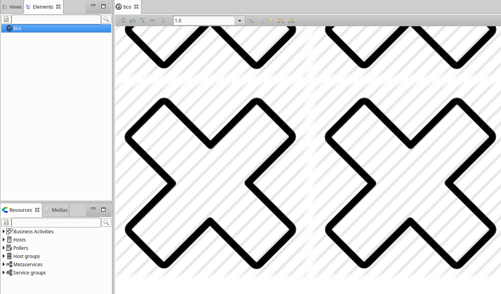

import Tabs from '@theme/Tabs';
import TabItem from '@theme/TabItem';


Ce chapitre décrit les erreurs courantes que vous pouvez rencontrer lors de l'utilisation de Centreon MAP. Veuillez lire les questions et réponses ci-dessous avant de contacter notre équipe support.

Nous continuerons à mettre à jour cette section en fonction de vos commentaires.

## Général

### Comment puis-je vérifier si mon serveur Centreon MAP fonctionne correctement ?

Il y a deux façons principales de vérifier si votre serveur Centreon MAP est opérationnel.

Tout d'abord, vérifiez que le service Centreon MAP fonctionne. Pour ce faire, connectez-vous par SSH au serveur hébergeant Centreon MAP et exécutez la commande suivante :

```shell
systemctl status centreon-map
```

Vous devriez obtenir le résultat suivant :

```shell
centreon-map - Centreon Studio map server
Loaded: loaded (/usr/lib/systemd/system/centreon-map; disabled; vendor preset: disabled)
Active: active (running) since ...
```

Si votre service Centreon MAP est arrêté, le message sera le suivant :

```shell
centreon-map - Centreon Studio map server
Loaded: loaded (/usr/lib/systemd/system/centreon-map; disabled; vendor preset: disabled)
Active: inactive (dead)
```

Dans ce cas, démarrez le service Centreon MAP :

```shell
sudo systemctl start centreon-map
```

Une fois que vous êtes sûr que votre serveur fonctionne, essayez d'accéder à son API via votre navigateur web. Vérifiez l'API REST utilisée par l'interface web comme suit :

<Tabs groupId="sync">
<TabItem value="HTTP" label="HTTP">

```shell
http://<MAP_IP>:8080/centreon-studio/api/beta/actuator/health
```

</TabItem>
<TabItem value="HTTPS" label="HTTPS">

```shell
https://<MAP_IP>:8443/centreon-studio/api/beta/actuator/health
```

</TabItem>
</Tabs>

Vous pouvez également vérifier l'API SOAP utilisée par le client lourd :

<Tabs groupId="sync">
<TabItem value="HTTP" label="HTTP">

```shell
http://<MAP_IP>:8080/centreon-studio/services
```

</TabItem>
<TabItem value="HTTPS" label="HTTPS">

```shell
https://<MAP_IP>:8443/centreon-studio/services
```

</TabItem>
</Tabs>


### Mon service Centreon MAP est en cours d'exécution mais je ne peux pas accéder aux pages de l'API Centreon MAP (/actuator/health)

Vous pouvez vérifier si le serveur contenant Centreon MAP est doté d'un pare-feu qui l'empêche de fonctionner correctement. Exécutez la commande suivante :

```shell
systemctl status iptables
```

Si vous voyez ce message...

```shell
iptables: Firewall is not running.
```

...alors le problème est ailleurs.

Si vous avez ce message...

``` shell
Table: filter
Chain INPUT (policy ACCEPT)
num  target     prot opt source               destination
1    ACCEPT     all  --  0.0.0.0/0            0.0.0.0/0           state RELATED,ESTABLISHED
2    ACCEPT     icmp --  0.0.0.0/0            0.0.0.0/0
3    ACCEPT     all  --  0.0.0.0/0            0.0.0.0/0
4    ACCEPT     tcp  --  0.0.0.0/0            0.0.0.0/0           state NEW tcp dpt:22
5    REJECT     all  --  0.0.0.0/0            0.0.0.0/0           reject-with icmp-host-prohibited

Chain FORWARD (policy ACCEPT)
num  target     prot opt source               destination
1    REJECT     all  --  0.0.0.0/0            0.0.0.0/0           reject-with icmp-host-prohibited

Chain OUTPUT (policy ACCEPT)
num  target     prot opt source               destination
```

alors votre pare-feu est en cours d'exécution, empêchant toute connexion depuis et vers votre serveur Centreon MAP. Vous devez soit ajouter des règles d'entrée et de sortie pour Centreon MAP, soit désactiver votre pare-feu.

Pour ouvrir les ports appropriés :

```shell
/sbin/iptables -A OUTPUT -p tcp --dport <PORT> -j ACCEPT
/sbin/iptables -A INPUT -p tcp --dport <PORT> -j ACCEPT
```

> Remplacez <PORT\> par le port que votre serveur Centreon MAP utilise (le plus souvent 8080, ou 8443 si vous l'avez configuré en SSL).

Pour désactiver votre pare-feu, exécutez :

```shell
systemctl stop iptables
```

### Mes images de Centreon Web ne s'affichent pas dans Centreon MAP

Centreon MAP importe automatiquement toutes les images de Centreon web dans sa propre base de données.
Sur votre client lourd, vous devriez voir tous vos fichiers provenant de Centreon web dans l'onglet **Médias** du panneau en bas à gauche, dans le dossier **Centreon**.
Si ce n'est pas le cas, vous pouvez vérifier ce qui suit :

Sur votre serveur Centreon MAP, ouvrez le fichier **/etc/my.cnf** et vérifiez si la ligne suivante est présente :

```text
max_allowed_packet = 20M
```

Ensuite, rechargez votre base de données MariaDB :

```shell
sudo systemctl reload mysqld
```

Attendez quelques minutes pour que le serveur Centreon MAP synchronise les ressources Centreon web.
Les images de Centreon web devraient alors apparaître sur votre client lourd dans l'onglet **Médias** du panneau en bas à gauche, dans le dossier **Centreon**.


Si vous ne voyez toujours pas la liste des images, vérifiez votre fichier de configuration Centreon MAP.

> Les erreurs de modification des fichiers de configuration peuvent entraîner des dysfonctionnements du logiciel. Nous vous recommandons de faire une sauvegarde du fichier avant de le modifier et de ne changer que les paramètres conseillés par Centreon.

Connectez-vous par SSH à votre serveur Centreon MAP. Ouvrez le fichier **studio-config.properties** :

```shell
vim /etc/centreon-studio/studio-config.properties
```

Pour la variable **centreon.url**, vérifiez qu'il existe un chemin d'accès complet à votre interface web Centreon :

```shell
centreon.url=http://<CENTRAL_IP_ADDRESS>
```

> N'oubliez pas de remplacer "http" par "https" si votre interface web Centreon utilise HTTPS.

Attendez quelques minutes pour que le serveur Centreon MAP synchronise les ressources Centreon web.
Les images de Centreon web devraient alors apparaître sur votre client lourd, dans le dossier **Centreon**.

## Client lourd Centreon MAP

### Le client lourd ne peut pas démarrer : "Java was started but returned exit code = 13".

Le client lourd ne démarre pas et un message d'erreur "code d'erreur = 13" s'affiche.

Installez une JVM 64 bits.

#### Impossible de créer une nouvelle vue

Sur le client lourd, si vous voulez créer une nouvelle vue mais que le bouton est désactivé, c'est que vous n'avez pas les droits d'accès.


Un administrateur Centreon MAP doit vous autoriser à créer, mettre à jour ou supprimer des vues.
Lorsque vous installez votre serveur MAP de Centreon pour la première fois, seuls les administrateurs de Centreon sont des administrateurs MAP.
C'est à eux d'accorder des privilèges d'administration aux autres utilisateurs Centreon "normaux".

### Impossible d'importer des médias

Lorsque vous faites un clic droit sur le panneau **Médias**, le bouton **Importer** est désactivé.

Il y a deux choses que vous devez savoir sur les médias :

- Le dossier Centreon, qui est créé automatiquement, contient toutes les images de Centreon web :

  - Vous ne pouvez pas ajouter ou supprimer une image de ce dossier,
  - Toutes les images sont au même niveau (pas de sous-dossiers).

- Vous ne pouvez pas importer d'images à la racine du panneau **Médias**.

La solution consiste à créer un nouveau dossier (par exemple, **Icons**).

Ensuite, faites un clic droit sur ce dossier et sélectionnez **Importer**.

#### Je ne vois pas le "menu d'importation MAP 3".

Vous souhaitez importer des vues de MAP 3 vers Centreon MAP \>= 4.x mais le menu correspondant est absent.

Veuillez vérifier les prérequis suivants :

- Votre licence MAP 3 est toujours valide.
- La version de votre client lourd Centreon est au moins v4.0.8 (vous pouvez la vérifier directement à partir de l'interface de votre client lourd, dans le menu Help \> About).
- S'il existe un proxy entre votre ordinateur et votre interface web Centreon, vous devez le définir dans le menu **Configurer**.

   > Le proxy doit être configuré avec la case à cocher **Utiliser pour internet**.

- Dans le fichier de configuration du serveur Centreon MAP (**/etc/centreon-studio/studio-config.properties**), vous avez saisi l'IP de votre serveur central.

Cette IP est également utilisée par votre client lourd pour accéder à l'API MAP 3.
Si cette adresse IP n'est pas accessible par votre client lourd (parce que votre serveur MAP Centreon et votre serveur Central Centreon sont tous deux situés dans une zone démilitarisée), vous devez en indiquer une nouvelle à votre client lourd.
Pour ce faire, modifiez le fichier :

<Tabs groupId="sync">
<TabItem value="Windows" label="Windows">

```shell
C:\Users\<YOUR_USERNAME>\AppData\Local\Centreon-Map4\Centreon-Map4.ini
```

</TabItem>
<TabItem value="Linux" label="Linux">

```shell
/opt/centreon-map4-desktop-client/Centreon-Map4.ini
```

</TabItem>
</Tabs>

Ajoutez la ligne suivante à la fin du fichier sur une nouvelle ligne, où `<CENTRAL_IP_ADDRESS>` est l'URL avec laquelle vous accédez à l'interface web de Centreon web depuis votre ordinateur :

```shell
-Dcentreon.url=<CENTRAL_IP_ADDRESS>
```

### Une erreur s'est produite lorsque j'ai ouvert une vue géographique

Si vous ouvrez une vue géographique ou un conteneur et que votre arrière-plan est composé de gris avec des X et le message pop-up suivant...

"Error while retreiving Mapbox tiles. Please check your Mapbox configuration."



... vous devez alors vérifier les points suivants :

- Assurez-vous que vos informations d'identification Mapbox sont valides. Pour configurer vos informations d'identification Mapbox. Votre clé secrète Mapbox a peut-être changé.
  Comme vous ne pouvez pas voir les clés précédemment créées, vous pouvez en créer une nouvelle et l'ajouter dans le fichier de configuration de votre serveur Centreon MAP.
- Si votre ordinateur se trouve derrière un proxy pour accéder à internet, veuillez configurer ce proxy dans le client lourd Centreon MAP.
- Le style Mapbox que vous avez utilisé sur votre vue a peut-être été supprimé.

Essayez de modifier votre vue/conteneur et changez le style Mapbox :


Si vous ne pouvez sélectionner aucun style, le problème vient probablement de l'un des éléments ci-dessus (c'est-à-dire des informations d'identification, un proxy ou un style supprimé).

### Erreur avec les caractères spéciaux

Si vous essayez d'utiliser des caractères dans des étiquettes qui n'utilisent pas l'encodage latin1 et que vous obtenez une erreur contextuelle affichant "Could not execute statement" sur votre client lourd, votre base de données est probablement en latin1.
Pour passer la base de données en encodage UTF-8, vous devez accéder à votre serveur Centreon MAP en SSH et exécuter les commandes suivantes :

```shell
# systemctl stop centreon-map
# mysqldump -uusername -p -h \<HOST\> centreon\_studio \> dump.sql
# cp dump.sql dump-fixed.sql
# vim dump-fixed.sql
:%s/DEFAULT CHARACTER SET latin1/DEFAULT CHARACTER SET utf8 COLLATE
utf8\_general\_ci/
:%s/DEFAULT CHARSET=latin1/DEFAULT CHARSET=utf8/
:wq
# mysql -uusername -ppassword -h \<HOST\> \< dump-fixed.sql
# systemctl start centreon-map
```

### Mon client lourd est lent et je suis souvent déconnecté.

Selon le périmètre de supervision de votre serveur Centreon (le nombre de services en cours d'exécution) et la configuration matérielle de l'ordinateur, votre client lourd peut avoir besoin de plus de RAM qu'il n'en utilise par défaut.
Il peut commencer à se figer et essayer de libérer plus de mémoire. Vous pouvez vérifier ce comportement en ouvrant votre gestionnaire de tâches (Ctrl + Maj + Esc) et en contrôlant la consommation de mémoire.
Si elle augmente et semble atteindre une limite alors que votre CPU travaille dur, votre client lourd a besoin de plus de mémoire.

Pour augmenter la mémoire, modifiez le fichier .ini :

<Tabs groupId="sync">
<TabItem value="Windows" label="Windows">

```shell
C:\Users\<YOUR_USERNAME>\AppData\Local\Centreon-Map4\Centreon-Map4.ini
```

</TabItem>
<TabItem value="Linux" label="Linux">

```shell
/opt/centreon-map4-desktop-client/Centreon-Map4.ini
```

</TabItem>
</Tabs>

Et ajoutez la ligne suivante à la fin du fichier, sur une nouvelle ligne :

```text
-Xmx4g
```

Le "4g" signifie 4 Go (par défaut, il ne peut utiliser que 2 Go). Vous pouvez modifier ce nombre en fonction de votre matériel (par exemple, en définissant "3g").

Redémarrez ensuite votre client lourd.

### J'obtiens l'erreur "Cannot authenticate user" sur la page de connexion

Pour Centreon Web >= 2.8.6, vérifiez que votre utilisateur a coché l'option **Accès à l'API de temps réel**.


### J'utilise Windows Remote Desktop (RDP) et j'ai de nombreuses erreurs

Si vous utilisez le client lourd Centreon MAP via une conneion à distance (par exemple avec RDP), il se peut que vous rencontriez une erreur affichant un certain nombre de pop-ups de type "128" ou "512", rendant votre client lourd inexploitable.

Pour remédier au problème, changez un paramètre dans votre application RDP :

Allez à la page **Advance > Display** et sélectionnez "Highest quality (32bit)". Vous pouvez accéder à votre ordinateur à distance et l'erreur n'apparaîtra plus.


> Pour les utilisateurs Linux ou Mac de l'application **rdesktop**, ajoutez cet argument à votre ligne de commande : \[-a 32\]

> Cette erreur peut se produire si vous utilisez le thème "Windows server" sur votre ordinateur. Allez dans vos paramètres Windows et modifiez les paramètres de couleur pour utiliser des couleurs 32 bits.

## Interface web Centreon MAP

### Erreur « Echec d'authentification » lors de la connexion à la page d'accueil MAP

#### Symptôme

Une erreur « Echec d'authentification » se produit à la page d'accueil de MAP lors de la tentative de connexion au service Centreon MAP Legacy.

#### Problème

Les informations d'identification utilisées par l'utilisateur **Web interface** (définies lors de l'installation) pour se connecter au module MAP Legacy ne sont plus valides car elles ont été modifiées, probablement suite à l'expiration du mot de passe.

#### Solution

Vous pouvez mettre à jour le mot de passe en accédant à ce fichier : **/etc/centreon-studio/studio-config.properties**.

### Les graphiques sont tous déplacés vers la droite après la mise à niveau de Centreon MAP 4.4 à Centreon MAP 18.10

Un bug affectant l'interface web déplaçait tous les graphiques vers la gauche par rapport à leur position dans le client lourd.
Ce problème a été corrigé dans la version 18.10 de Centreon MAP.
Si vous avez manuellement déplacé les graphiques vers la droite pour compenser dans l'interface web, tous vos graphiques seront surdéplacés vers la droite après la mise à niveau.

Nous avons fourni un script qui décale automatiquement tous les graphiques vers la gauche.
N'utilisez pas ce script si vous savez que la plupart de vos graphiques ont été correctement positionnés après la mise à jour : vous devrez décaler manuellement les autres.

Voici le script SQL qui corrige le décalage créé manuellement par un utilisateur pour un alignement correct dans l'interface web.

Pour l'exécuter :

- Faites une sauvegarde de votre base de données **centreon\_studio**.
- Allez dans le répertoire **/etc/centreon-studio/utils/**.
- Exécutez le script :

  ```shell
  mysql centreon_studio < update-position-graph.sql
  ```

- Redémarrez le service Centreon Map :

  ```shell
  systemctl restart centreon-map
  ```

### Mon interface Web affiche "Erreur d'authentification"

L'erreur suivante peut apparaître sur votre interface web :


Tout d'abord, vérifiez si vous avez accès aux API du serveur Centreon MAP.

Dans **Administration > Extensions > MAP > Options**, vérifiez la configuration de votre interface web Centreon MAP :

L'URL définie dans **Adresse du serveur MAP** doit inclure le protocole (HTTP ou HTTPS) et le port utilisé par votre serveur Centreon MAP (généralement 8080 pour une connexion normale ou 8443 pour une connexion sécurisée).


### Mon interface web affiche une page vide

Votre interface web est configurée mais elle affiche une page vide :


Soit aucune vue n'est créée sur le serveur, soit vous n'y avez pas accès.

Si vous êtes un administrateur de Centreon MAP, vous pouvez voir toutes les vues. Dans ce cas, aucune vue n'a été créée. Voici des [instructions de démarrage rapide](create-standard-view.md) pour en créer une.

Sinon, contactez l'administrateur Centreon MAP ou créez vos propres vues si vous disposez des privilèges suffisants.

## HTTPS

### Erreur : Impossible de se connecter au gestionnaire de licences distant {} dans centreon-map.log

Vous pouvez rencontrer une erreur comme celle-ci dans **centreon-map.log** :

```shell
[2021-11-09 13:40:49.178] [ERROR] [c.c.s.m.s.b.l.LicenseVerificationService] [main] : Cannot connect to remote License Manager {}
java.util.concurrent.ExecutionException: org.springframework.web.client.ResourceAccessException: I/O error on GET request for "https://10.25.5.178/centreon/api/index.php": Certificate for <10.25.5.178> doesn't match any of the subject alternative names: [www.company.net, company.com, company.net]; nested exception is javax.net.ssl.SSLPeerUnverifiedException: Certificate for <10.25.5.178> doesn't match any of the subject alternative names: [www.company.net, company.com, company.net]
        at java.base/java.util.concurrent.FutureTask.report(FutureTask.java:122)
        at java.base/java.util.concurrent.FutureTask.get(FutureTask.java:205)
        at com.centreon.studio.map.server.business.license.LicenseVerificationService.refreshLicense(LicenseVerificationService.java:145)
        at com.centreon.studio.map.server.business.license.LicenseVerificationService.verifyLicenseTask(LicenseVerificationService.java:96)
        at com.centreon.studio.map.server.business.license.LicenseVerificationService.onApplicationEvent(LicenseVerificationService.java:83)
        at com.centreon.studio.map.server.business.license.LicenseVerificationService.onApplicationEvent(LicenseVerificationService.java:36)
        at org.springframework.context.event.SimpleApplicationEventMulticaster.doInvokeListener(SimpleApplicationEventMulticaster.java:172)
        at org.springframework.context.event.SimpleApplicationEventMulticaster.invokeListener(SimpleApplicationEventMulticaster.java:165)
        at org.springframework.context.event.SimpleApplicationEventMulticaster.multicastEvent(SimpleApplicationEventMulticaster.java:139)
        at org.springframework.context.support.AbstractApplicationContext.publishEvent(AbstractApplicationContext.java:403)
        at org.springframework.context.support.AbstractApplicationContext.publishEvent(AbstractApplicationContext.java:360)
        at org.springframework.context.support.AbstractApplicationContext.finishRefresh(AbstractApplicationContext.java:897)
        at org.springframework.context.support.AbstractApplicationContext.refresh(AbstractApplicationContext.java:553)
        at org.springframework.boot.web.servlet.context.ServletWebServerApplicationContext.refresh(ServletWebServerApplicationContext.java:143)
        at org.springframework.boot.SpringApplication.refresh(SpringApplication.java:758)
        at org.springframework.boot.SpringApplication.refresh(SpringApplication.java:750)
        at org.springframework.boot.SpringApplication.refreshContext(SpringApplication.java:397)
        at org.springframework.boot.SpringApplication.run(SpringApplication.java:315)
        at org.springframework.boot.SpringApplication.run(SpringApplication.java:1237)
        at org.springframework.boot.SpringApplication.run(SpringApplication.java:1226)
        at com.centreon.studio.map.server.CentreonMapServerApp.main(CentreonMapServerApp.java:15)
        at java.base/jdk.internal.reflect.NativeMethodAccessorImpl.invoke0(Native Method)
        at java.base/jdk.internal.reflect.NativeMethodAccessorImpl.invoke(NativeMethodAccessorImpl.java:62)
        at java.base/jdk.internal.reflect.DelegatingMethodAccessorImpl.invoke(DelegatingMethodAccessorImpl.java:43)
        at java.base/java.lang.reflect.Method.invoke(Method.java:566)
        at org.springframework.boot.loader.MainMethodRunner.run(MainMethodRunner.java:49)
        at org.springframework.boot.loader.Launcher.launch(Launcher.java:108)
        at org.springframework.boot.loader.Launcher.launch(Launcher.java:58)
        at org.springframework.boot.loader.JarLauncher.main(JarLauncher.java:88)
Caused by: org.springframework.web.client.ResourceAccessException: I/O error on GET request for "https://10.25.5.178/centreon/api/index.php": Certificate for <10.25.5.178> doesn't match any of the subject alternative names: [www.company.net, company.com, company.net]; nested exception is javax.net.ssl.SSLPeerUnverifiedException: Certificate for <10.25.5.178> doesn't match any of the subject alternative names: [www.company.net, company.com, company.net]
        at org.springframework.web.client.RestTemplate.doExecute(RestTemplate.java:748)
        at org.springframework.web.client.RestTemplate.execute(RestTemplate.java:674)
        at org.springframework.web.client.RestTemplate.exchange(RestTemplate.java:583)
        at com.centreon.studio.map.server.business.license.LicenseVerificationService.lambda$refreshLicense$0(LicenseVerificationService.java:138)
        at java.base/java.util.concurrent.FutureTask.run(FutureTask.java:264)
        at java.base/java.util.concurrent.ScheduledThreadPoolExecutor$ScheduledFutureTask.run(ScheduledThreadPoolExecutor.java:304)
        at java.base/java.util.concurrent.ThreadPoolExecutor.runWorker(ThreadPoolExecutor.java:1128)
        at java.base/java.util.concurrent.ThreadPoolExecutor$Worker.run(ThreadPoolExecutor.java:628)
...
```

Modifiez le fichier de configuration suivant :

```shell
vi /etc/centreon-studio/studio-config.properties
```

Le paramètre **centreon.url** doit utiliser l'un des noms alternatifs du certificat Centreon, et non son adresse IP. Exemple :

```shell
centreon.url=https://company.com
```

et non :

```shell
centreon.url=https://10.25.5.178
```