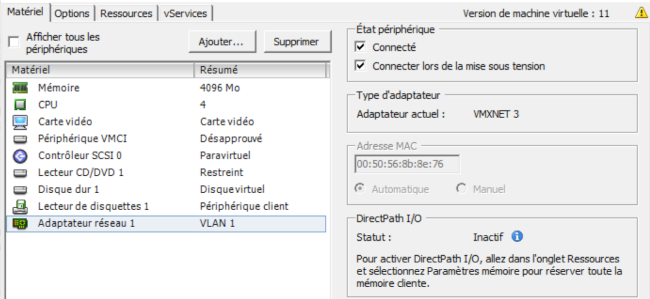
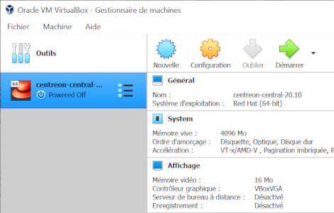

import Tabs from '@theme/Tabs';
import TabItem from '@theme/TabItem';

Sur sa [page de téléchargement](https://download.centreon.com), Centreon fournit une machine virtuelle prête à l’emploi. Cette machine virtuelle est disponible au format OVA pour les environnements
VMware et pour l'outil Oracle VirtualBox.
Elle est basée sur le système d'exploitation **Linux CentOS 7** et inclut
une installation de Centreon permettant de démarrer en toute simplicité votre première supervision.

La VM est configurée en **Thin Provision** pour économiser autant d'espace libre que possible sur le disque (meilleure pratique).

**Prérequis**

La machine hôte doit avoir les caractéristiques suivantes :

- Processeur : Tout processeur Intel ou AMD récent avec au moins 2vCPU.
- Mémoire : Selon vos systèmes d'exploitation, vous aurez besoin d'au moins 1 Go
  de RAM. Pour profiter pleinement de l'expérience, vous avez besoin d'au moins
  2 Go de mémoire libre.
- Espace disque : La machine virtuelle nécessite au moins 6,5 Go d'espace libre
  sur votre disque dur. Cependant, si vous souhaitez continuer à utiliser Centreon,
  il est recommandé d'avoir au moins 10 Go car sa taille augmentera avec le temps.

## Étape 1 : Télécharger la machine virtuelle

1. Vérifiez que votre solution de virtualisation (VirtualBox ou VMWare) est installée sur votre machine et à jour.

2. Allez sur la [page de téléchargement](https://download.centreon.com) de Centreon. Dans la section 1, **Appliances** est sélectionné par défaut.

3. Dans la section 2, sélectionnez la version de Centreon désirée.

4. Dans la section 3, **Download your image**, cliquez sur le bouton **Download** à côté de **VMWare Virtual Machine (OVA)**. Une nouvelle page apparaît.

   * Si vous souhaitez être contacté par Centreon, entrez vos informations de contact, puis
cliquez sur **Download**.

   * Dans le cas contraire, cliquez sur **Direct download**.

5. Le fichier téléchargé est une archive compressée : extrayez son contenu dans le répertoire désiré.

## Étape 2 : Installer la machine virtuelle

<Tabs groupId="sync">
<TabItem value="Environnement VMware" label="Environnement VMware">

1. Importez le fichier **centreon-central.ova** dans VMWare. Un terminal s’ouvre : attendez que le serveur démarre. Lorsque celui-ci est prêt, le terminal affiche le message suivant :
    
    

2. Selon la structure de votre réseau, dans la configuration de votre machine virtuelle, ajoutez un adaptateur réseau et sélectionnez le réseau via lequel la machine pourra communiquer avec les ressources qu'elle devra superviser.

    Voici un exemple de configuration dans VSphere 6 :

    

</TabItem>
<TabItem value="Oracle VirtualBox" label="Oracle VirtualBox">

1. Importez le fichier **centreon-central.ova** dans VirtualBox. La VM apparaît dans votre liste de VMs dans VirtualBox.

    

2. Dans le panneau de droite, cliquez sur **Configuration**. La boîte **Paramètres** s’ouvre.

3. Dans l'onglet **Système**, cochez la case
**Horloge interne en UTC**.

4. Selon la configuration de votre réseau, ajoutez un adaptateur réseau et sélectionnez le réseau via lequel la machine pourra communiquer avec les ressources qu'elle devra superviser. Par exemple :
  
    1. Dans l’onglet **Réseau**, cochez **Activer l’interface réseau**.

    2. Dans la liste **Mode d’accès réseau**, sélectionnez **Accès par pont**.

    3. Dans la liste **Nom**, sélectionnez la carte réseau désirée.

5. Cliquez sur **OK**.

6. Dans le panneau de droite, cliquez sur **Démarrer** pour démarrer la VM. Un terminal s’ouvre : attendez que le serveur démarre. Lorsque celui-ci est prêt, le terminal affiche le message suivant :

    

</TabItem>
</Tabs>

## Étape 3 : Terminer la configuration

1. Connectez-vous au serveur Centreon avec les informations suivantes : login: `root`, password: `centreon`.

2. Pour connaître l’adresse IP de votre serveur, tapez `ip addr`. (Par défaut, le clavier est en qwerty : si vous avez un clavier azerty, tapez `ip qddr`.) La VM est configurée pour obtenir une adresse IP automatiquement du serveur DHCP.

    

3. Connectez-vous en `root` au serveur depuis une autre machine avec le terminal de votre choix, à l'aide de l'adresse IP obtenue précédemment.

4. À votre première connexion au serveur, des instructions s’affichent pour vous aider à terminer la
configuration.

   Définissez les paramètres suivants :

- Le fuseau horaire (timezone) du serveur Centreon. Par défaut, celui-ci est UTC. Cela définira l'heure des différents logs de Centreon.

    Utilisez la commande suivante :
    
    ```shell
    timedatectl set-timezone votre_timezone
    ```

    Par exemple, pour définir le fuseau horaire Europe/London, tapez :

    ```shell
    timedatectl set-timezone Europe/London
    ```

    Vous pouvez obtenir une liste de tous les fuseaux horaires possibles en utilisant la commande suivante :

    ```shell
    timedatectl list-timezones
    ```

- Le fuseau horaire du serveur php. Pour éviter les erreurs, celui-ci doit être identique au fuseau horaire du serveur. Par défaut, le fuseau horaire php est Europe/London.
    1. Ouvrez le fichier suivant :

        ```shell
        /etc/php.d/50-centreon.ini
        ```

    2. Après date.timezone, entrez le fuseau horaire désiré.

    3. Redémarrez le serveur php :

        ```shell
        systemctl restart php-fpm
        ```

- Le hostname de votre serveur (facultatif). Le nom par défaut du serveur est centreon-central. Pour le
changer, utilisez la commande suivante :

  ```shell
  hostnamectl set-hostname votre-hostname
  ```

  Par exemple, si vous voulez renommer la machine `supervision`,
entrez:


  ```shell
  hostnamectl set-hostname supervision
  ```

5. Ajoutez une partition pour la table MariaDB : cette étape est obligatoire. Votre serveur ne
fonctionnera pas si vous ne l’exécutez pas.

   1. Connectez-vous en tant que l’utilisateur `centreon` :

     ```shell
     su - centreon
     ```

   2. Entrez la commande suivante :

        ```shell
        /bin/php /usr/share/centreon/cron/centreon-partitioning.php
        ```

        La partition est créée :

        

   3. Connectez-vous à nouveau en tant que l'utilisateur `root` :

        ```shell
        exit
        ```

   4. Redémarrez le processus Centreon broker pour que les changements soient appliqués :

        ```shell
        systemctl restart cbd centengine gorgoned
        ```

        Votre serveur Centreon est maintenant prêt à l’emploi.

        >Une fois les opérations de configuration effectuées, vous pouvez faire en sorte que le message qui les décrit dans le terminal n'apparaisse plus. Supprimez le fichier suivant :
        >
        >`/etc/profile.d/centreon.sh`

6. Connectez-vous à l’interface web : dans votre navigateur, entrez l’adresse du serveur au format
`http://addresse_ip/centreon` ou `http://FQDN/centreon`. (Par exemple, une URL valide serait
`http://192.168.1.44/centreon`.)

7. Connectez-vous en utilisant les informations suivantes : Login: `admin`, password: `Centreon!123`. Par défaut, votre serveur offre une configuration prédéfinie qui permet de le superviser lui-même.

8. Selon votre édition de Centreon, vous pouvez avoir à [ajouter une licence](../../administration/licenses.md).

9. [Mettez à jour](../../update/update-centreon-platform.md) votre plateforme Centreon.

10. [Sécurisez votre serveur](../../administration/secure-platform.md). Il est notamment recommandé de changer les mots de passe des comptes `root` et `admin`. Il est obligatoire de définir un mot de passe pour la base MariaDB.

11. Vous pouvez maintenant [superviser votre premier hôte](../../getting-started/first-supervision.md).

## Identifiants par défaut

- Pour vous connecter à l'interface Web Centreon, l'identifiant par défaut est : `admin`/`Centreon!123`.
- Le compte d'administration du serveur (via SSH) est: `root`/`centreon`.
- Le mot de passe root du SGBD n'est pas initialisé.

> Pour des raisons de sécurité, nous vous recommandons fortement de modifier ces mots de passe après l'installation.

