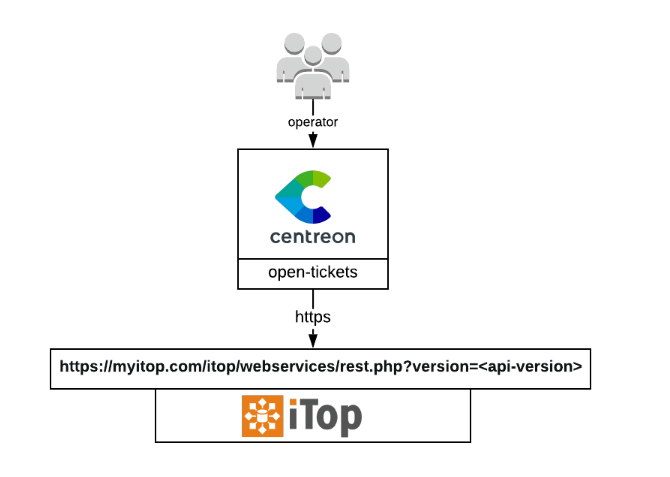

## How it works

The Itop provider connects to your Itop server and retrieve data through the
itop REST API. The data is refreshed dynamically depending on your choices.
Since it gathers a lot of configurations objects from Itop, it puts them in
cache. Loging out or waiting 10 hours will flush the cache.

## Compatibility

This integration is (at least) compatible with the following Itop versions:

  - 1.4
  - 1.3

## Requirements

Before going any further, make sure that you correctly setup
[centreon-open-ticket](../../alerts-notifications/ticketing.md#configuration-avancée)
into your Centreon instance.

Our provider requires the following parameters:

| Parameter   | Example of value    |
| ----------- | ------------------- |
| Address     | 10.30.2.22/itop/web |
| API version | 1.4                 |
| Username    | admin               |
| Password    | itop                |
| Protocol    | https               |
| Timeout     | 60                  |

## Possibilities

As of now, the provider is able to retrieve the following objects from Itop:

  - Organizations
  - Callers
  - Services
  - Service subcategories
  - Origin

It will also fill the following parameters from a predefined list in Centreon.
You can extend those lists inside the provider configuration since they are
[custom lists](../../alerts-notifications/ticketing.md#configuration-avancée).

  - Impact
  - Urgency
