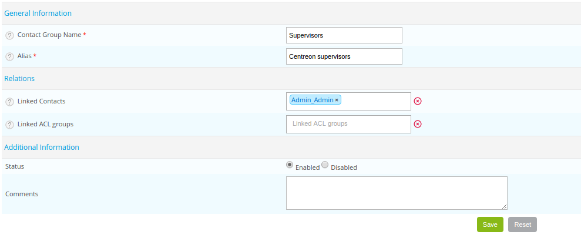

### Les groupes de contacts

Les groupes de contacts sont utilisés pour pouvoir notifier des contacts :

* Lors de la définition d’un hôte ou d’un service
* Lors de la définition d’une escalade de notifications

De plus, les groupes de contacts sont également utilisés lors de la définition d’un [groupe d’accès](../../administration/access-control-lists.md#créer-un-groupe-daccès).

Par conséquent, il est nécessaire de regrouper les contacts d’une manière logique. La plupart du temps, ils sont regroupés
suivant leurs rôles au sein du système d’information. Exemple : DSI, Administrateurs Windows, Administrateurs Linux,
Responsable de l’application de gestion de la paie...

## Créer un groupe de contacts

Rendez-vous dans le menu **Configuration > Users > Contact Groups** et cliquez sur **Add**.

* Les champs **Contact Group Name** et **Alias** définissent le nom et la description du groupe de contacts.
* La liste **Linked Contacts** permet d’ajouter les contacts au groupe de contacts.
* Les champs **Status** et **Comment** permettent d’activer ou de désactiver le groupe de contacts et de commenter
  celui-ci.
