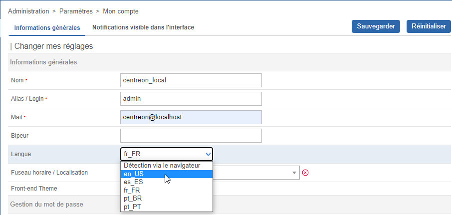
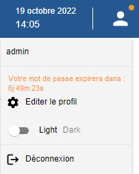
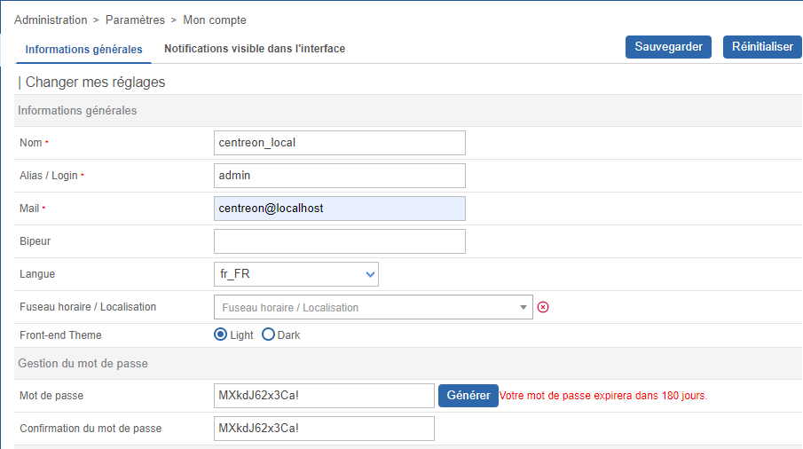
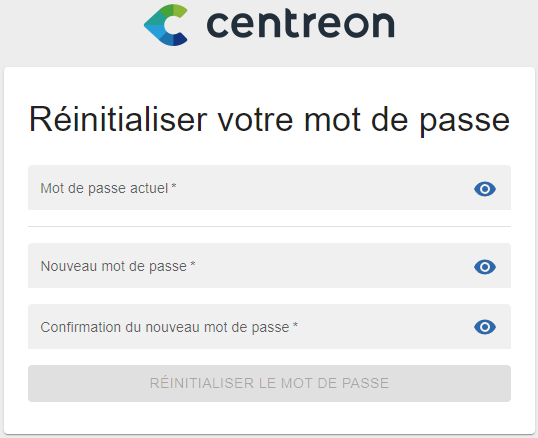

Vous pouvez optimiser votre utilisation de Centreon en profitant des fonctionnalités de personnalisation suivantes :

## Passer en mode sombre

Lors de votre première connexion, l'interface Centreon s'affiche en mode clair par défaut.

Dans le bandeau supérieur, cliquez sur l'icône profil et utilisez le bouton pour activer le mode sombre. Lorsque vous vous reconnecterez, le mode que vous avez sélectionné précédemment restera activé.

- Mode clair :

- Mode sombre :

## Changer la langue de l'interface utilisateur

Dans le bandeau, cliquez sur l'icône profil, puis cliquez sur **Editer Le Profil**:

Dans la liste de sélection des langues, sélectionnez la vôtre :

Puis cliquez sur **Sauvegarder**. Votre interface est maintenant traduite dans votre
langue.

> Si votre langue n'apparaît pas dans la liste, vous pouvez aider la communauté Centreon à traduire l'interface web.
> Rendez-vous dans le chapitre [Comment traduire Centreon](../../developer/developer-translate-centreon.md) pour plus d'informations.

## Réinitialiser le mot de passe

### Réinitialiser votre mot de passe avant expiration

Lorsque votre mot de passe va expirer dans les 7 prochains jours, un point orange apparaît dans le
bandeau à droite à côté de l'icône de profil :

Cliquez sur **Editer le profil**, puis modifiez votre mot de passe :

### Réinitialiser votre mot de passe après expiration

Si vous n'avez pas changé votre mot de passe avant son expiration, après connexion vous serez redirigé vers une page dédiée où vous pourrez le mettre à jour :

Entrez votre mot de passe actuel, définissez-en un nouveau puis cliquez sur **Réinitialiser le mot de passe**.
