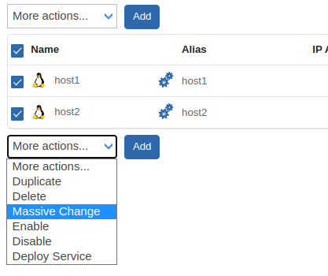
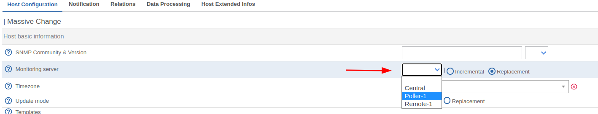

## Modification pour un hôte

Si vous souhaitez que votre hôte soit supervisé par une autre poller que celui qui le supervise actuellement, vous devez modifier la configuration de votre hôte, puis exporter la configuration vers le nouveau poller **ainsi que vers celui dont il provient** :

1. Modifier la configuration sur l'hôte :

2. [Déployer](../monitoring-servers/deploying-a-configuration.md) les configurations vers les pollers :

## Modification pour plusieurs hôtes

Vous pouvez utiliser les [changements massifs](../generic-actions.md#changement-massif) afin de changer le poller pour plusieurs hôtes :

1. Sélectionner les hôtes, puis utiliser "Changement massif" depuis le menu déroulant" :

2. Modifier la configuration :

3. [Déployer](../monitoring-servers/deploying-a-configuration.md) la configuration vers les pollers :

