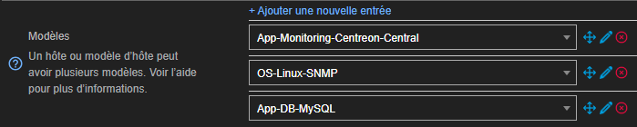

Pour créer un hôte manuellement :

1. Allez à la page **Configuration > Hôtes > Hôtes**, puis cliquez sur **Ajouter**.
2. Remplissez les différents champs (voir [ci-dessous](#onglet-configuration-de-lhôte)), puis cliquez sur **Sauvegarder**.
3. [Déployez la configuration](../monitoring-servers/deploying-a-configuration.md).

## Onglet Configuration de l’hôte

### Information de base sur l'hôte

* **Nom** : nom d’hôte utilisé par le moteur de supervision. Les caractères suivants ne sont pas autorisés : `~!$%^&|'"<>?,()=*{}`. De plus, les espaces seront remplacés par des `_`.
* **Alias** : un autre nom pour l'hôte. Les espaces et caractères interdits dans le nom peuvent être employés ici. L'alias peut être utilisé dans la **Barre de recherche** de la page **Statut des ressources** avec la syntaxe `alias:` pour retrouver un hôte.
* **Adresse** : adresse IP ou nom DNS de l’hôte. Le bouton **Résoudre** permet de tester le nom du domaine en interrogeant le serveur DNS configuré dans le serveur central. Dans le cas où un nom DNS est utilisé pour remplir le champ, le bouton **Résoudre** le remplacera également par l'adresse IP correspondante.
* **Communauté SNMP & Version** : nom de la communauté attribuée à l'équipement et sa version. S'il s'agit de la version 1 ou 2c, remplissez le premier champ. S'il s'agit de la version 3, laissez le premier champ vide et remplissez la macro personnalisée [`snmpextraoptions`](/pp/integrations/plugin-packs/getting-started/how-to-guides/troubleshooting-plugins/#snmpv3-options-mapping) qui sera automatiquement ajoutée dans la section **Options de contrôle de l'hôte** lorsque vous sélectionnerez un modèle SNMP.
* **Serveur de supervision** : détermine quel serveur Centreon (central, poller ou distant) sera chargé de superviser cet hôte.
* **Fuseau horaire** : localisation de l'hôte. Attention, c'est le fuseau horaire défini ici qui détermine à quel moment sont réalisés les contrôles sur cet hôte, et non le fuseau horaire du serveur qui supervise l'hôte.
* **Modèles** : permet d’associer un ou plusieurs [modèles](../templates.md) à cet objet.

Si plusieurs modèles tentaient de modifier le même champ, les caractéristiques du modèle placé au-dessus des autres seraient appliquées.

   Voici un exemple d’hôte avec 3 modèles appliqués.

   

   * **App-DB-MySQL** applique une première configuration.

   * Si **OS-Linux-SNMP** apporte une autre valeur pour les mêmes champs, alors ces nouvelles valeurs écraseront celles définies dans **App-DB-MySQL**. Si aucune valeur n'était définie pour un champ par **App-DB-MySQL** et que **OS-Linux-SNMP** apporte de nouvelles valeurs pour ce champ, alors celles-ci sont appliquées.

   * **App-Monitoring-Centreon-Central** fait la même chose avec **OS-Linux-SNMP**.

   Changer l’ordre des templates modifie automatiquement les configurations selon ce nouvel ordre le cas échéant.

- Ce bouton  nous permet de changer l'ordre des modèles d'hôtes.
- Ce bouton  sert à supprimer le modèle d'hôte.

* Si la case **Oui** est cochée pour **Créer aussi les services liés aux modèles**, Centreon génère automatiquement les
  services en se basant sur les [modèles](../templates.md) de services liés aux modèles d’hôtes définis au-dessus.

### Groupes d'accès (option pour les utilisateurs non-administrateurs)

* **ACL Resource Groups** : ([listes de contrôles d'accès](../../administration/access-control-lists.md) en français) permet de lier l’hôte
  à un groupe d’ACL. Cette action est exclusive aux non-administrateurs.

### Options de contrôle de l'hôte

* **Commande de vérification** : commande utilisée pour vérifier la disponibilité de l’hôte. Vous pouvez l'utiliser si vous n'avez pas appliqué de [modèles](../templates.md) à votre hôte, ou bien pour surcharger la commande définie dans le modèle.
* **Arguments** : arguments donnés à la commande de vérification (chaque argument commence avec un ”!”).

* **Macros personnalisées** : les macros apparaissent automatiquement si vous ajoutez des modèles, mais vous pouvez également ajouter vos [macros personnalisées](../macros/#custom-macros). Pour chaque macro, renseignez la valeur correspondant à votre équipement.

   * Les champs **Nom** et **Valeur** établissent le nom et la valeur de la macro.
   * Cocher la case **Mot de passe** cache la valeur de la macro.

   Pour réinitialiser la macro avec sa valeur par défaut définie par le modèle cliquez sur 

   Pour afficher la description de la macro, cliquez sur 

   Pour supprimer la macro, cliquez sur 

   Pour changer l’ordre des macros, cliquez sur 

### Options d’ordonnancement

* **Période de contrôle** : définit la période temporelle durant laquelle l’ordonnanceur vérifie activement le statut de l’objet.
* **Nombre de contrôles avant validation de l'état** : définit le nombre de contrôles à effectuer avant de confirmer le statut de l’hôte comme non-OK.
  lorsque le statut est validé, le processus de notification est enclenché.
* **Intervalle normal de contrôle** : exprimé en minutes. Il définit l’intervalle entre chaque contrôle lorsque
  le statut de l’hôte est OK.
* **Intervalle non-régulier de contrôle** : exprimé en minutes, désigne l'intervalle de temps entre chaque contrôle réalisé afin de confirmer l'état non-OK de l'hôte. Une fois le nombre de contrôles de validation réalisé, l'intervalle entre deux contrôles revient à son rythme normal.
* **Contrôle actif activé** et **Contrôle passif activé** activent / désactivent les contrôles actifs et passifs. [Les contrôles passifs](../../monitoring/passive-monitoring/enable-snmp-traps.md) sont les informations que la ressource supervisée envoie au moteur de supervision sans que celles-ci aient été activement demandées.

## Onglet Notification
Jetez un oeil à notre documentation sur les [notifications](../../alerts-notifications/notif-concept.md) et les [contacts](contacts.md) pour en savoir plus sur ces sujets.

* **Notification activée** : activer ou désactiver les notifications concernant l’objet.
* **Contacts liés** : contacts qui recevront les notifications. Ces contacts doivent être d'abord configurés à la page **Configuration > Utilisateurs**.
* **Groupes de contacts liés** : tous les contacts appartenant aux groupes de contacts définis recevront les
  notifications. Les groupes doivent d'abord être configurés à la page **Configuration > Utilisateurs**.
  
  **Vertical inheritance only** : établit les contacts et/ou groupes de contacts à notifier. Elle se trouve dans l'onglet **Administration > Paramètres > Centreon web**. Une fois activée, deux cases supplémentaires apparaissent :

    * Cocher **Contacts hérités additionnels** n'écrase pas la configuration du parent modèle d'hôte
  mais ajoute les contacts en plus des contacts définis dans le modèle parent.
    * Cocher **Groupes de contacts hérités additionnels** n'écrase pas la configuration du parent modèle d'hôte
  mais ajoute les contacts en plus des groupes de contacts définis dans le modèle parent.

* **Options de notifications** : définit les statuts pour lesquels une notification sera envoyée. Si aucune case n'est cochée, vous serez notifié pour tous les statuts listés.
* **Intervalle de notification** : exprimé en minutes. Il indique la durée entre chaque envoi de notification
  lorsque le statut est non-OK. Si la valeur est définie à 0, Centreon envoie une seule notification par changement de statut.
* **Période de notification** : indique la période temporelle durant laquelle les notifications seront activées. Aucune notification de changement de status ne sera envoyée en-dehors de cette période.
* **Délai de première notification** : exprimé en minutes. Il fait référence au délai à respecter avant l’envoi
  de la première notification lorsqu’un statut non-OK est confirmé. Si la valeur est 0, la notification est envoyée immédiatement.
* **Délai de première notification de recouvrement** : est le temps qui doit s'écouler avant qu'une notification de type **Récupération** soit envoyée (lorsque l'hôte revient à un état DISPONIBLE). Si la valeur est 0, la notification est envoyée immédiatement.

## Onglet Relations

* **Groupes d'hôtes** : les [groupes d’hôtes](../groups.md) auxquels l’hôte appartient. Les groupes vous permettent de faire des changements sur plusieurs hôtes en même temps.
* **Catégories d'hôte** : les [catégories](../categories.md) auxquelles l’hôte appartient.
* **Hôtes parents** : établit un objet en tant que [parent](../../alerts-notifications/notif-dependencies.md) de cet hôte. Le parent d'un hôte est l'objet entre l'hôte et son superviseur qui est également le plus proche de l'objet supervisé. On considère qu'un hôte n'a pas de parent s'il se trouve sur le même segment du réseau que l'hôte qui le supervise ssans aucun intermédiaire. Laissez ce champs libre dans ce cas-là.
* **Hôtes enfants** : définir l'hôte actuel en tant que parent d'un autre hôte.

## Onglet Traitement des données

* **Durée maximale d'un acquittement** : spécifie une durée maximale en minutes pour l'[acquittement](../../alerts-notifications/acknowledge.md) de l'hôte. Si le statut de l'hôte est toujours non-OK lorsque ce temps s'est écoulé, l'envoi des notifications reprend son cours.  Laissez ce champ vide pour que l'acquittement n'ait pas de durée maximale.
* **Contrôler la fraicheur du résultat** : effectue un contrôle actif lorsque la quantité de temps définie dans **Seuil de fraicheur du résultat** s'est écoulée depuis le dernier [contrôle passif](../../monitoring/passive-monitoring/enable-snmp-traps.md) de l'objet.
* **Seuil de fraicheur du résultat** : exprimé en secondes. Si durant cette période aucune demande de changement de
  statut de l’hôte (commande passive) n’a été reçue alors la commande de vérification active est exécutée. Si le contrôle est activé mais que le champ est laissé vide, un seuil sera déterminé automatiquement.
* **Détection de bagotage des statuts** : active ou désactive la détection du [bagotage](../../alerts-notifications/notif-flapping.md) (ou instabilité) des statuts (statut
  changeant trop fréquemment de valeur sur une période donnée).
* **Seuil bas de détection de bagotage des statuts** et **Seuil haut de détection de bagotage des statuts** : les seuils hauts et bas pour la détection du
  bagotage en pourcentage de changement de statuts.
* **Retain Status Information** et **Retain Non Status Information** : indiquent si les informations concernant
  ou non le statut sont sauvegardées après chaque relance de la commande de vérification.
* **Stalking Options** : options à enregistrer si la **Rétention** est activée.
* **Event Handler Enabled** : activer ou désactiver le [gestionnaire d'évènements](../event-handler.md).
* **Event Handler** : commande à exécuter lors d'un changement de statut de l'hôte.
* **Args** : arguments de la commande du gestionnaire d'évènements.

## Onglet Informations détaillées de l’hôte

### Moteur de supervision

* **URL de la note** : URL cliquable qui apparaitra dans la colonne **Notes** de la page **Statut des Ressources** (la colonne **Notes** doit être visible pour cette fonction).
* **Note** : notes optionnelles concernant l’hôte qui seront visibles dans la page **Statut des Ressources** (la colonne **Notes** doit être visible pour cette fonction).
* **URL d'action** : URL habituellement utilisée pour accéder à une procédure de résolution d'incidents pour la ressource.
  (maintenance...).
* **Icône** : icône à afficher à divers endroits, tels que la page **Statut des Ressources**. Un format de 40x40 pixels est recommandé.
* **Icône alternative** : texte optionnel apparaissant lorsque l'icône ne peut être affichée.
* **Criticité d'hôte** : niveau de [criticité](../categories.md#criticité) de l’hôte. Il s'agit d'un type de catégorie spéciale que vous pouvez utiliser pour organiser la page **Statut des Ressources** par niveau de criticité.
* **Coordonnées géographiques** : coordonnées géographiques utilisées par le module [Centreon MAP](../../graph-views/introduction-map.md) pour positionner
  l'élément sur la carte. Définissez "Latitude, Longitude", par exemple pour le jeu de coordonnées de Paris "48.51,2.20"

### Informations supplémentaires

* **Activer/désactiver la ressource** : détermine si l'hôte doit être supervisé ou non. Si l'hôte est désactivé, il figurera toujours dans la liste des hôtes, mais n'apparaîtra pas à la page **Statut des Ressources**. Attention, les hôtes désactivés sont inclus dans le total des hôtes de la plateforme dans l'évaluation de votre licence.
* **Commentaires** : ajouter un commentaire concernant l’hôte.

> N'oubliez pas de [déployer la configuration](../monitoring-servers/deploying-a-configuration.md) pour que les changements réalisés soient pris en compte.

