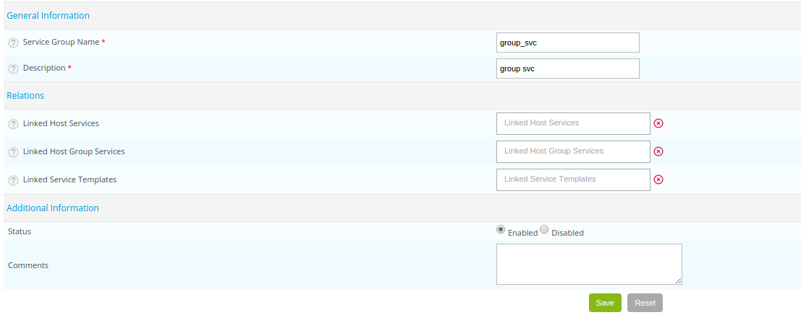
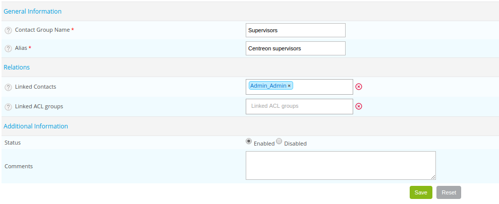
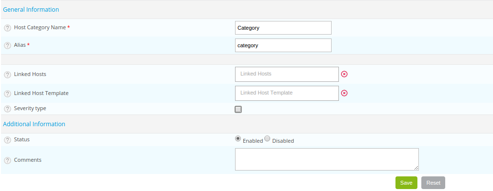

## Description

Au sein de Centreon, il est possible de regrouper un ou plusieurs objets au sein de différents groupes :

* *[Les groupes d'hôtes](#les-groupes-dhôtes)*
* *[Les groupes de services](#les-groupes-de-services)*
* *[Les groupes de contacts](#les-groupes-de-contacts-1)*

Il est également possible de créer des catégorie *[d'hôtes](#les-catégories-dhôtes)* ou de *[services](#les-catégories-de-services)*.

### Les groupes

D’une manière générale, les groupes sont des containeurs permettant de regrouper un ensemble d’objet possédant une
propriété commune :

* Même identité matérielle (serveurs Dell, HP, IBM, ...), identité logique (équipements réseau) ou identité géographique
  (Europe, Asie, Afrique, Amérique du nord, ...)
* Appartenance à une même application (application CMS, ...) ou à un même secteur d’activité (Gestion de la paie, ...)

#### Les groupes d’hôtes et de services

Les groupes d’hôtes et de services permettent de regrouper des objets par entités logiques. Ils sont utilisés pour :

* La configuration des ACLs afin de lier un ensemble de ressources à un type de profil
* Permettre de visualiser les rapports de disponibilité par groupe. Générer un rapport de disponibilité des ressources
  "Agence Paris".
* Permettre de visualiser le statut d’un ensemble d’objets en sélectionnant dans les filtres de recherche un groupe d’objets
* Rechercher rapidement un à plusieurs graphiques de performances en parcourant l’arbre des objets par groupes puis par ressource
* D’une manière générale, on cherche à regrouper les hôtes par niveau fonctionnel. Exemple : Hôtes DELL, HP ou encore
  Hôtes Linux, Windows... On cherche également à regrouper les services par applications métiers. Exemple : Application de
  gestion de la paie, Application ERP, ...

> Pour les hôtes appartenant à un groupe d’hôtes, la rétention des fichiers RRD peut être définie au sein du groupe
> d’hôtes auquel il appartient. Cette définition vient surcharger la définition globale. Dans le cas où un même hôte
> appartient à plusieurs groupes possédant chacun une définition de rétention, la valeur la plus élevée sera
> sélectionnée pour l’hôte.

#### Les groupes de contacts

Les groupes de contacts sont utilisés pour pouvoir notifier des contacts :

* Lors de la définition d’un hôte ou d’un service
* Lors de la définition d’une escalade de notifications

De plus, les groupes de contacts sont également utilisés lors de la définition d’un groupe d’accès.

Par conséquent, il est nécessaire de regrouper les contacts d’une manière logique. La plupart du temps, ils sont regroupés
suivant leurs rôles au sein du système d’informations. Exemple : DSI, Administrateurs Windows, Administrateurs Linux,
Responsable de l’application de Gestion de la paie, ...

### Les catégories

D’une manière générale, les catégories servent soit à définir un niveau de criticité pour un hôte ou un service, soit à
regrouper techniquement un ensemble d’objets (services liés à une exécution de requête sur un SGBD MariaDB, ...). La
bonne pratique demande à ce qu’on regroupe des hôtes ou des services au sein de catégories pour pouvoir faciliter le
filtrage de ces objets au sein d’ACL. Les catégories sont également utilisées pour définir des types d’objets au sein
du module Centreon MAP ou pour classer les objets au sein de sous-groupes dans le module Centreon BI.

## Configuration

### Les groupes d’hôtes

Rendez-vous dans le menu **Configuration > Hosts > Host Groups** et cliquez sur **Add**

* Les champs **Host Group Name** et **Alias** regroupent le nom et l’alias du groupe d’hôtes.
* La liste **Linked Hosts** permet d’ajouter des hôtes au sein du nouveau groupe d’hôtes.
* Le champ **Notes** permet d’ajouter des notes optionnelles concernant le groupe d’hôtes.
* Le champ **Notes URL** définit une URL qui peut être utilisée pour donner davantage d’informations sur le groupe d’hôtes.
* Le champ **Action URL** définit une URL habituellement utilisée pour donner des informations d’actions sur le groupe
  d’hôtes (maintenance...).
* Le champ **Icon** indique l’icône à utiliser pour le groupe d’hôtes.
* Le champ **Map Icon** est l’icône utilisée pour la cartographie.
* Le champ **RRD retention** est exprimé en jours, il permet de définir la durée de rétention des services appartenant
  à ce groupe d’hôtes au sein de la base de données RRD. Si cette valeur est vide, la valeur sera celle par défaut
  définie dans le menu **Administration > Options > CentStorage**.
* Les champs **Status** et **Comments** permettent d’activer ou de désactiver le groupe d’hôtes et de commenter celui-ci.

### Les groupes de services

Rendez-vous dans le menu **Configuration > Services > Service Groups** et cliquez sur **Add**

* Les champ **Service Group Name** et **Description** regroupent le nom et la description du groupe de services.
* La liste **Linked Host Services** permet de choisir les différents services qui feront partie de ce groupe.
* La liste **Linked Host Group Services** permet de choisir les services liés à un groupe d’hôtes qui feront partie de
  ce groupe.
* Si un modèle de service appartient à la liste  **Linked Service Templates** alors tous les services qui héritent de
  ce modèle appartiennent à ce groupe.
* Les champs  **Status** et **Comments** permettent d’activer ou de désactiver le groupe de services et de commenter
  celui-ci.

### Les groupes de contacts

Rendez-vous dans le menu **Configuration > Users > Contact Groups** et cliquez sur **Add**

* Les champs **Contact Group Name** et **Alias** éfinissent le nom et la description du groupe de contacts.
* La liste **Linked Contacts** permet d’ajouter les contacts au groupe de contacts.
* Les champs **Status** et **Comment** permettent d’activer ou de désactiver le groupe de contacts et de commenter
  celui-ci.

### Les catégories d’hôtes

Rendez-vous dans le menu **Configuration > Hosts > Categories** et cliquez sur **Add**

* Les champs **Host Category Name** et **Alias** contiennent respectivement le nom et l’alias de la catégorie d’hôte.
* La liste **Linked hosts** permet d’ajouter des hôtes à la catégorie.
* Si un modèle d’hôte est ajouté à **Linked host template** alors tous les hôtes qui héritent de ce modèle appartiennent
  à cette catégorie.
* La case  **Severity type** signifie que la catégorie d’hôtes à un niveau de criticité.
* Les champs **Level** et **Icon** définissent respectivement un niveau de criticité et une icône associée.
* Les champs **Status** et **Comment** permettent d’activer ou de désactiver la catégorie d’hôte et de commenter celle-ci.

### Les catégories de services

Rendez-vous dans le menu **Configuration > Services > Categories** et cliquez sur **Add**

* Les champs **Name** et **Description** définissent le nom et la description de la catégorie de service.
* Si un modèle de service appartient à **Service Template Descriptions** alors tous les services appartenant à ce modèle
  de services font partie de cette catégorie.
* La case **Severity type** ignifie que la catégorie de service à un niveau de criticité.
* Les champs **Level** et **Icon** définissent respectivement un niveau de criticité et une icône associée.
* Le champ **Status** permet d’activer ou de désactiver la catégorie de services.
