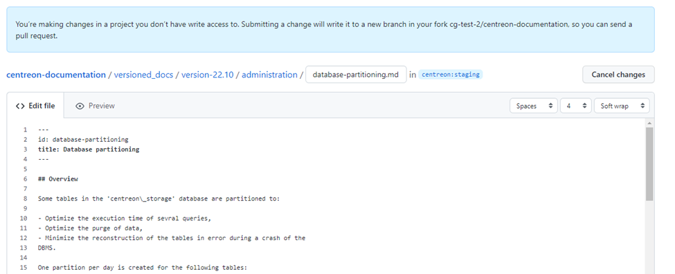
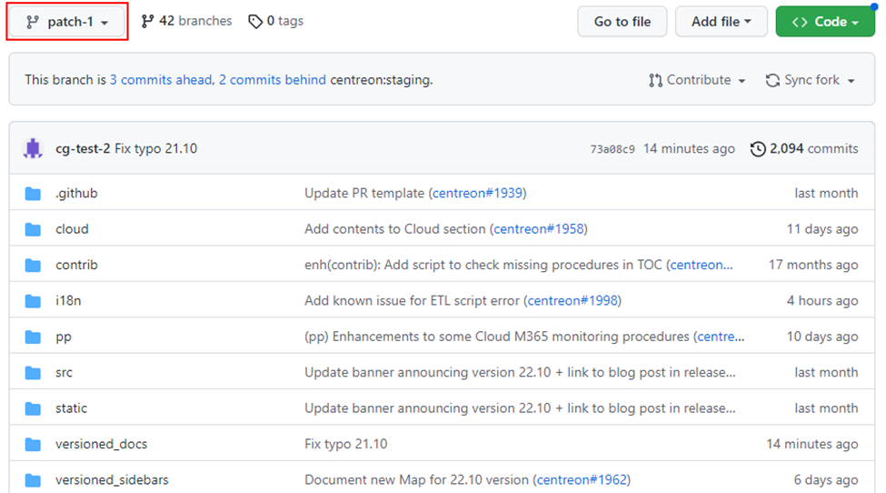

Vous pouvez contribuer à la documentation Centreon en soumettant des pull requests sur [notre dépôt GitHub](https://github.com/centreon/centreon-documentation). En tant que contributeur externe vous ne pouvez pas commiter directement sur le dépôt : un fork sera créé automatiquement quand vous commiterez.

Cette page détaille uniquement la procédure pour demander des modifications dans la documentation :
* Si vous avez une question générale concernant la configuration ou l'utilisation de Centreon, ou la documentation, posez-la plutôt sur [Slack](https://centreon.github.io/register-slack/), ou sur notre plateforme communautaire [The Watch](https://thewatch.centreon.com/).

* Si vous avez une idée de nouvelle fonctionnalité merci de la soumettre dans la section [Ideas](https://thewatch.centreon.com/ideas) de The Watch.
* Si vous avez trouvé un bug, ouvrez une "issue" dans le dépôt du code du projet  correspondant. Utilisez le [guide de contribution](https://github.com/centreon/.github/blob/master/CONTRIBUTING.md).

## Recommandations pour vos pull requests

Aidez-nous à relire vos PRs plus rapidement en suivant ces recommandations :

* Essayez de ne pas toucher à un trop grand nombre de fichiers à la fois en une seule PR, si possible.

* Ne changez pas les blancs ou les fins de ligne dans les parties du fichier que vous n'éditez pas. Vérifiez que votre éditeur de texte n'est pas configuré pour reformater automatiquement tout le fichier à l'enregistrement.

* Si vous parlez français, appliquez vos changements aux versions anglaises et françaises de la documentation. La version française est située dans le dossier **i18n**.

## Éditer une seule page de documentation

1. La façon la plus simple de suggérer un changement est d'utiliser le lien **Éditer cette page** en bas de chaque page de documentation. Cette méthode est adaptée lorsque vous souhaitez éditer uniquement un fichier à la fois.

   

   (Vous pouvez aussi naviguer jusqu'à la page désirée sur [GitHub](https://github.com/centreon/centreon-documentation) et cliquer sur le bouton **Edit**.)

2. Le fichier peut maintenant être édité :

   

3. Faites vos modifications, puis rendez-vous en bas de la page :

   

4. Dans le premier champ, entrez une courte description de vos modifications (par exemple “Fix typo”) : cette description deviendra le titre de votre commit. Vous pouvez ajouter plus d'informations dans le second champ.
5. Cliquez sur **Propose changes**. Une branche est créée dans un fork du dépôt Centreon, et un commit est pushé dans cette branche. La page montre maintenant vos modifications :

   

6. Cliquez sur **Create pull request** et remplissez les champs :

   * Entrez un titre indiquant clairement le sujet de la pull request.
   * Cochez les cases correspondant aux versions/sections que vous avez corrigées (et uniquement celles-ci).

    

7. La pull request est créée. Notez que le nom de votre branche apparaît ici (format : `<nom_du_fork>:<nom_de_la_branche>`) :

    

La PR est faite ! L'équipe documentation de Centreon :

* S'assurera que votre pull request soit validée : quelqu'un vérifiera que toutes les modifications de la PR sont factuellement correctes. Il se peut que nous vous demandions d'apporter des changements à votre PR. Dans ce cas, vous recevrez une notification de GitHub.
* S'assurera que votre PR soit mergée et publiée.

## J'ai créé une pull request mais je veux faire d'autres modifications. Que faire ?

1. Pour éditer un autre fichier, rendez-vous dans votre fork de notre dépôt de documentation sur GitHub (**Your profile** > cliquez sur le fork) puis sélectionnez votre branche en utilisant la liste déroulante en haut à gauche de l'écran.

   

2. Naviguez jusqu'au fichier désiré, faites vos modifications, puis rendez-vous au bas de la page :

   

3. Cliquez sur **Commit changes**. Vos modifications sont commitées, pushées et ajoutées à la liste des commits pour cette pull request.

## Éditer plusieurs pages à la fois

Si vous souhaitez apporter des changements à un certain nombre de fichiers (ou si vous préférez cette méthode), vous pouvez cloner le dépôt, créer une nouvelle branche et faire les modifications sur votre disque.

Votre branche doit être basée sur la branche **staging**. Depuis cette branche, vous pouvez proposer des modifications à des documentations qui sont déjà publiées et toujours supportées :

* pour Centreon OnPrem, [voir le tableau des versions supportées](../installation/prerequisites.md#système-dexploitation),
* les sections “Centreon Cloud” et “Plugin Packs”.

### Procédure

1. Clonez le dépôt de documentation sur votre disque :

   ```shell
   git clone https://github.com/centreon/centreon-documentation.git
   ```

2. Rendez-vous dans le dossier **centreon-documentation**. Vous êtes sur la branche **staging**.
3. Créez une nouvelle branche basée sur **staging**: donnez-lui un nom parlant. Pour créer une branche et vous positionner dessus :

   ```shell
   git checkout -b <name_of_the_branch>
   ```

   Par exemple, la commande `git checkout -b username-mypr` créera une branche nommée **username-mypr** et se positionnera dessus automatiquement.

4. Effectuez vos modifications :

   * [buildez la documentation localement](#comment-prévisualiser-ma-pr) pour vérifier que tout s'affiche correctement,
   * n'oubliez pas de faire `git add` sur tous les fichiers nécessaires (particulièrement les images).
5. Commitez vos modifications et pushez-les.
6. Allez sur [GitHub](https://github.com/centreon/centreon-documentation). Vous devriez voir un message tel que celui-ci :
   

7. Cliquez sur **Compare & pull request**.
   

   * Éditez le nom de la PR et ajoutez des informations complémentaires si besoin.
   * Sélectionnez les versions dans lesquelles vous avez fait des modifications.
8. Cliquez sur **Create pull request**. La pull request est créée.

Une fois la PR faite, l'équipe documentation de Centreon :

* S'assurera que votre pull request soit validée : quelqu'un vérifiera que toutes les modifications de la PR sont factuellement correctes. Il se peut que nous vous demandions d'apporter des changements à votre PR. Dans ce cas, vous recevrez une notification de GitHub.
* S'assurera que votre PR soit mergée et publiée.

### Modifier le même fichier dans différentes versions

Si vous voulez faire la même modification à un fichier dans différentes versions, vous devez reporter la modification dans chaque version manuellement (pas de cherrypicking).

### Comment prévisualiser ma PR?

Lorsque vous créez une PR complexe en clonant le dépôt, vous voudrez peut-être vérifier que tout est affiché correctement. (Regarder la PR dans GitHub n'est pas suffisant.)

Pour faire cela, vous devez builder la documentation localement.

#### Procédure

1. Sur votre disque, rendez-vous dans le dossier **centreon-documentation** de votre branche.
2. Installez [Yarn](https://classic.yarnpkg.com/lang/en/docs/install/#windows-stable).
3. Installez [Node.js](https://nodejs.org/en/download/).
4. Installez les dépendances :

   ```shell
   yarn
   ```

5. Buildez la version EN ou FR du site (plus rapide qu'un build complet) :
   * EN : `yarn start`
   * FR : `yarn start --locale=fr`

   Le site de documentation s'ouvre dans votre navigateur à l'adresse suivante : `http://localhost:3000/`.
   La plupart des changements sont pris en compte immédiatement sans avoir à redémarrer le serveur.
6. Si vous avez vraiment besoin de builder le site complet, utilisez la commande suivante (attention, le build prend un certain temps) :

   ```shell
   yarn build
   ```

   Puis utilisez la commande `npm run serve` pour afficher le site de documentation dans votre navigateur. Ce site reflète l'état des fichiers au moment du build, les changements ultérieurs ne sont pas pris en compte.

#### Et si le build échoue ?

Dans certains cas, le build local peut échouer. Vérifiez le message d'erreur dans le log. Il se peut que :

* une image manque,
* un lien ait un format incorrect,
* des backticks (caractères ``` autour des blocs de code) ne soit pas fermés correctement, ou bien qu'il y ait un espace en trop avant les backticks,
* un fichier n'ait pas exactement le même nom en français et en anglais.
