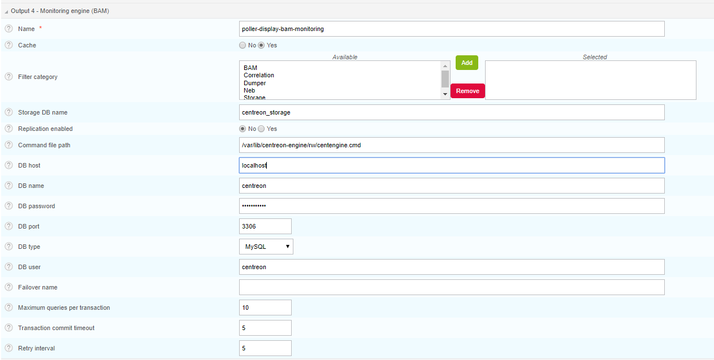
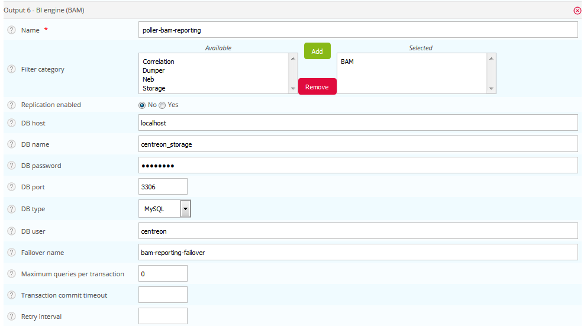

L'installation du module **Centreon BAM** sur un *Centreon Remote
Server* doit être réalisée de la même manière que celle du serveur
Centreon central puis des actions supplémentaires sont à exécuter

1.  Installez Centreon BAM sur votre Centreon Remote Server en utilisant
    la documentation d'installation de l'extension
2.  Effectuez les dernières étapes décrites ci-dessous

## Configuration du composant Centreon Broker à partir du Central

La configuration de l'extension **Centreon BAM** sur un collecteur
distant consiste à créer la configuration de Centreon Broker à partir du
serveur Central pour la gestion des calculs de Centreon BAM par le
*Centreon Remote Server*. Cette configuration sera automatiquement
envoyée vers le *Centreon Remote Server* concerné lors de la génération
et publication de la configuration à partir du serveur Central.

Se rendre dans le menu `Configuration > Collecteur > Configuration`` de
Centreon Broker et éditer la configuration de l'instance Centreon
Broker Master du *Centreon Remote Server* concerné.

### Output de supervision

Se rendre dans l'onglet "Output", sélectionner une configuration de
type **BAM - Monitoring engine (BAM)** et cliquer sur le bouton
**Ajouter**

Le tableau ci-dessous présente les champs à saisir :

| Champs                          | Valeurs                                                       |
|---------------------------------|---------------------------------------------------------------|
| Name                            | remote-server-bam-monitoring                                  |
| Filter category                 | *Aucune*                                                      |
| Storage DB Name                 | centreon\_storage                                             |
| Cache                           | Yes                                                           |
| Replication enabled             | No                                                            |
| Command file path               | /var/lib/centreon-engine/rw/centengine.cmd                    |
| DB host                         | localhost                                                     |
| DB name                         | centreon                                                      |
| DB password                     | *À récupérer dans /etc/centreon/conf.pm sur le Remote Server* |
| DB port                         | 3306                                                          |
| DB type                         | MySQL                                                         |
| DB user                         | *À récupérer dans /etc/centreon/conf.pm sur le Remote Server* |
| Maximum queries per transaction | 0                                                             |
| Transaction commit timeout      | 5                                                             |
| Retry interval                  | 5                                                             |

### Output de reporting

Ajouter un nouvel output et sélectionner une configuration de type **BAM
- BI engine (BAM)** et cliquer sur le bouton **Add**

Le tableau ci-dessous présente les champs à saisir :

| Champs                          | Valeurs                                                       |
|---------------------------------|---------------------------------------------------------------|
| Name                            | remote-server-bam-reporting                                   |
| Filter category                 | BAM                                                           |
| Replication enabled             | No                                                            |
| DB host                         | localhost                                                     |
| DB name                         | centreon\_storage                                             |
| DB password                     | *À récupérer dans /etc/centreon/conf.pm sur le Remote Server* |
| DB port                         | 3306                                                          |
| DB type                         | MySQL                                                         |
| DB user                         | *À récupérer dans /etc/centreon/conf.pm sur le Remote Server* |
| Maximum queries per transaction | 0                                                             |
| Transaction commit timeout      | 5                                                             |
| Retry interval                  | 5                                                             |

Pour finir l'installation, générer et envoyer la configuration du
*Centreon Remote Server* en sélectionnant le mode **Redémarrer**.
