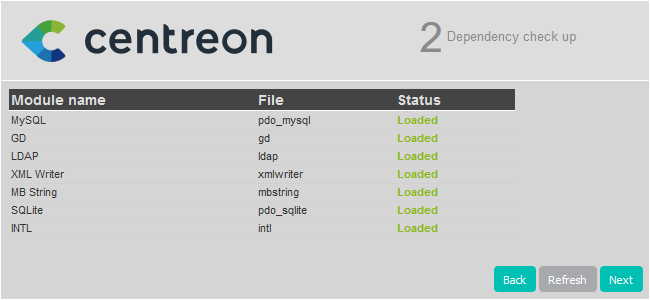

import Tabs from '@theme/Tabs';
import TabItem from '@theme/TabItem';

Ce chapitre décrit la procédure de montée de version de votre plateforme
Centreon depuis la version 22.04 vers la version 22.10.

> Lorsque vous effectuez la montée de version de votre serveur central, assurez-vous d'également mettre à jour tous vos serveurs distants et vos collecteurs. Dans votre architecture, tous les serveurs doivent avoir la même version de Centreon. De plus, tous les serveurs doivent utiliser la même [version du protocole BBDO](../developer/developer-broker-bbdo.md#changement-de-version-de-bbdo).

> Si vous souhaitez migrer votre serveur Centreon vers Oracle Linux
> / RHEL 8, vous devez suivre la [procédure de migration](../migrate/introduction.md).

## Prérequis

### Sauvegarde

Avant toute chose, il est préférable de s’assurer de l’état et de la consistance
des sauvegardes de l’ensemble des serveurs centraux de votre plate-forme :

- Serveur Centreon Central,
- Serveur de gestion de base de données.

## Montée de version du serveur Centreon Central

### Mise à jour des dépôts

Il est nécessaire de mettre à jour le dépôt Centreon.

Exécutez la commande suivante :

<Tabs groupId="sync">
<TabItem value="Alma / RHEL / Oracle Linux 8" label="Alma / RHEL / Oracle Linux 8">

```shell
dnf install -y https://yum.centreon.com/standard/22.10/el8/stable/noarch/RPMS/centreon-release-22.10-1.el8.noarch.rpm
```

</TabItem>
<TabItem value="CentOS 7" label="CentOS 7">

```shell
yum install -y https://yum.centreon.com/standard/22.10/el7/stable/noarch/RPMS/centreon-release-22.10-1.el7.centos.noarch.rpm
```

</TabItem>
<TabItem value="Debian 11" label="Debian 11">

```shell
sed -i -E 's|[0-9]{2}\.[0-9]{2}|22.10|g' /etc/apt/sources.list.d/centreon.list
apt update
```

</TabItem>
</Tabs>

> Si vous avez une licence offline, installez le dépôt correspondant pour les plugin packs.
> Si vous avez une édition Business, installez également le dépôt Business.
> Vous pouvez en trouver l'adresse sur le [portail support Centreon](https://support.centreon.com/hc/fr/categories/10341239833105-D%C3%A9p%C3%B4ts).

### Installer le dépôt MariaDB

<Tabs groupId="sync">
<TabItem value="Alma / RHEL / Oracle Linux 8" label="Alma / RHEL / Oracle Linux 8">

```shell
curl -LsS https://r.mariadb.com/downloads/mariadb_repo_setup | sudo bash -s -- --os-type=rhel --os-version=8 --mariadb-server-version="mariadb-10.5"
```

</TabItem>
<TabItem value="CentOS 7" label="CentOS 7">

```shell
curl -LsS https://r.mariadb.com/downloads/mariadb_repo_setup | sudo bash -s -- --os-type=rhel --os-version=7 --mariadb-server-version="mariadb-10.5"
```

</TabItem>
<TabItem value="Debian 11" label="Debian 11">

```shell
curl -LsS https://r.mariadb.com/downloads/mariadb_repo_setup | sudo bash -s -- --os-type=debian --os-version=11 --mariadb-server-version="mariadb-10.5"
```

</TabItem>
</Tabs>

### Montée de version de PHP

Centreon 22.10 utilise PHP en version 8.1.

<Tabs groupId="sync">
<TabItem value="RHEL 8" label="RHEL 8">

Vous devez changer le flux PHP de la version 8.0 à 8.1 en exécutant les commandes suivantes et en répondant **y**
pour confirmer :

```shell
dnf module reset php
```

```shell
dnf module install php:remi-8.1
```

</TabItem>
<TabItem value="Alma / Oracle Linux 8" label="Alma / Oracle Linux 8">

Vous devez changer le flux PHP de la version 8.0 à 8.1 en exécutant les commandes suivantes et en répondant **y**
pour confirmer :

```shell
dnf module reset php
```

```shell
dnf module install php:remi-8.1
```

</TabItem>
<TabItem value="CentOS 7" label="CentOS 7">

Vous devez activer le dépôt php 8.1
```shell
yum-config-manager --enable remi-php81
```

</TabItem>
<TabItem value="Debian 11" label="Debian 11">

```shell
systemctl stop php8.0-fpm
```

</TabItem>
</Tabs>

### Montée de version de la solution Centreon

> Assurez-vous que tous les utilisateurs sont déconnectés avant de commencer
> la procédure de mise à jour.

Si vous avez des extensions Business installées, mettez à jour le dépôt business en 22.10.
Rendez-vous sur le [portail du support](https://support.centreon.com/hc/fr/categories/10341239833105-D%C3%A9p%C3%B4ts) pour en récupérer l'adresse.

Si votre OS est Debian 11 et que vous avez une configuration Apache personnalisée, faites une sauvegarde de votre fichier de configuration (**/etc/apache2/sites-available/centreon.conf**).

Arrêtez le processus Centreon Broker :
```shell
systemctl stop cbd
```

Supprimez les fichiers de rétention présents :
```shell
rm /var/lib/centreon-broker/* -f
```

Videz le cache :

<Tabs groupId="sync">
<TabItem value="Alma / RHEL / Oracle Linux 8" label="Alma / RHEL / Oracle Linux 8">

```shell
dnf clean all --enablerepo=*
```

</TabItem>
<TabItem value="CentOS 7" label="CentOS 7">

```shell
yum clean all --enablerepo=*
```

</TabItem>
<TabItem value="Debian 11" label="Debian 11">

```shell
apt clean all
apt update
```

</TabItem>
</Tabs>

Mettez à jour l'ensemble des composants :

<Tabs groupId="sync">
<TabItem value="Alma / RHEL / Oracle Linux 8" label="Alma / RHEL / Oracle Linux 8">

```shell
dnf update centreon\* php-pecl-gnupg
```

</TabItem>
<TabItem value="CentOS 7" label="CentOS 7">

```shell
yum update centreon\* php-pecl-gnupg
```

</TabItem>
<TabItem value="Debian 11" label="Debian 11">

```shell
apt upgrade centreon
```

</TabItem>
</Tabs>

> Acceptez les nouvelles clés GPG des dépôts si nécessaire.

### Mettre à jour une configuration Apache personnalisée

Cette section s'applique uniquement si vous avez personnalisé votre configuration Apache.

<Tabs groupId="sync">
<TabItem value="Alma / RHEL / Oracle Linux 8" label="Alma / RHEL / Oracle Linux 8">

Lors de la montée de version, le fichier de configuration Apache n'est pas mis à jour automatiquement : le nouveau fichier de configuration amené par le rpm ne remplace pas l'ancien. Vous devez reporter les changements manuellement dans votre fichier de configuration personnalisée.

Faites un diff entre l'ancien et le nouveau fichier de configuration Apache :

```
diff -u /etc/httpd/conf.d/10-centreon.conf /etc/httpd/conf.d/10-centreon.conf.rpmnew
```

* **10-centreon.conf** (post montée de version) : ce fichier contient la configuration personnalisée. Il ne contient pas les nouveautés apportées par la montée de version.
* **10-centreon.conf.rpmnew** (post montée de version) : ce fichier est fourni par le rpm; il ne contient pas la configuration personnalisée.

Pour chaque différence entre les fichiers, évaluez si celle-ci doit être reportée du fichier **10-centreon.conf.rpmnew** au fichier **10-centreon.conf**.

Vérifiez qu'Apache est bien configuré, en exécutant la commande suivante :

```shell
apachectl configtest
```

Le résultat attendu est le suivant :

```shell
Syntax OK
```

Redémarrez Apache pour appliquer les modifications :

```shell
systemctl restart php-fpm httpd
```

Puis vérifiez le statut :

```shell
systemctl status httpd
```

Si tout est correct, vous devriez avoir quelque chose comme :

```shell
● httpd.service - The Apache HTTP Server
   Loaded: loaded (/usr/lib/systemd/system/httpd.service; enabled; vendor preset: disabled)
  Drop-In: /usr/lib/systemd/system/httpd.service.d
           └─php-fpm.conf
   Active: active (running) since Tue 2020-10-27 12:49:42 GMT; 2h 35min ago
     Docs: man:httpd.service(8)
 Main PID: 1483 (httpd)
   Status: "Total requests: 446; Idle/Busy workers 100/0;Requests/sec: 0.0479; Bytes served/sec: 443 B/sec"
    Tasks: 278 (limit: 5032)
   Memory: 39.6M
   CGroup: /system.slice/httpd.service
           ├─1483 /usr/sbin/httpd -DFOREGROUND
           ├─1484 /usr/sbin/httpd -DFOREGROUND
           ├─1485 /usr/sbin/httpd -DFOREGROUND
           ├─1486 /usr/sbin/httpd -DFOREGROUND
           ├─1487 /usr/sbin/httpd -DFOREGROUND
           └─1887 /usr/sbin/httpd -DFOREGROUND

```

</TabItem>
<TabItem value="CentOS 7" label="CentOS 7">

Lors de la montée de version, le fichier de configuration Apache n'est pas mis à jour automatiquement : le nouveau fichier de configuration amené par le rpm ne remplace pas l'ancien. Vous devez reporter les changements manuellement dans votre fichier de configuration personnalisée.

Faites un diff entre l'ancien et le nouveau fichier de configuration Apache :

```
diff -u /opt/rh/httpd24/root/etc/httpd/conf.d/10-centreon.conf /opt/rh/httpd24/root/etc/httpd/conf.d/10-centreon.conf.rpmnew
```

* **10-centreon.conf** (post montée de version) : ce fichier contient la configuration personnalisée. Il ne contient pas les nouveautés apportées par la montée de version.
* **10-centreon.conf.rpmnew** (post montée de version) : ce fichier est fourni par le rpm; il ne contient pas la configuration personnalisée.

Pour chaque différence entre les fichiers, évaluez si celle-ci doit être reportée du fichier **10-centreon.conf.rpmnew** au fichier **10-centreon.conf**.

Vérifiez qu'Apache est bien configuré, en exécutant la commande suivante :

```shell
/opt/rh/httpd24/root/usr/sbin/apachectl configtest
```

Le résultat attendu est le suivant :

```shell
Syntax OK
```

Redémarrez Apache pour appliquer les modifications :

```shell
systemctl restart php-fpm httpd24-httpd
```

Puis vérifiez le statut :

```shell
systemctl status httpd24-httpd
```

Si tout est correct, vous devriez avoir quelque chose comme :

```shell
● httpd24-httpd.service - The Apache HTTP Server
   Loaded: loaded (/usr/lib/systemd/system/httpd24-httpd.service; enabled; vendor preset: disabled)
   Active: active (running) since mar. 2020-05-12 15:39:58 CEST; 25min ago
  Process: 31762 ExecStop=/opt/rh/httpd24/root/usr/sbin/httpd-scl-wrapper $OPTIONS -k graceful-stop (code=exited, status=0/SUCCESS)
 Main PID: 31786 (httpd)
   Status: "Total requests: 850; Idle/Busy workers 50/50;Requests/sec: 0.547; Bytes served/sec: 5.1KB/sec"
   CGroup: /system.slice/httpd24-httpd.service
           ├─ 1219 /opt/rh/httpd24/root/usr/sbin/httpd -DFOREGROUND
           ├─31786 /opt/rh/httpd24/root/usr/sbin/httpd -DFOREGROUND
           ├─31788 /opt/rh/httpd24/root/usr/sbin/httpd -DFOREGROUND
           ├─31789 /opt/rh/httpd24/root/usr/sbin/httpd -DFOREGROUND
           ├─31790 /opt/rh/httpd24/root/usr/sbin/httpd -DFOREGROUND
           ├─31802 /opt/rh/httpd24/root/usr/sbin/httpd -DFOREGROUND
           ├─31865 /opt/rh/httpd24/root/usr/sbin/httpd -DFOREGROUND
           ├─31866 /opt/rh/httpd24/root/usr/sbin/httpd -DFOREGROUND
           ├─31882 /opt/rh/httpd24/root/usr/sbin/httpd -DFOREGROUND
           ├─31903 /opt/rh/httpd24/root/usr/sbin/httpd -DFOREGROUND
           └─32050 /opt/rh/httpd24/root/usr/sbin/httpd -DFOREGROUND
```

</TabItem>
<TabItem value="Debian 11" label="Debian 11">

Utilisez la sauvegarde que vous avez effectuée à l'étape précédente pour reporter vos personnalisations dans le fichier **/etc/apache2/sites-available/centreon.conf**.

Vérifiez qu'Apache est bien configuré, en exécutant la commande suivante :

```shell
apache2ctl configtest
```

Le résultat attendu est le suivant :

```shell
Syntax OK
```

Redémarrez Apache pour appliquer les modifications :

```shell
systemctl restart php8.1-fpm apache2
```

Puis vérifiez le statut :

```shell
systemctl status apache2
```

Si tout est correct, vous devriez avoir quelque chose comme :

```shell
● apache2.service - The Apache HTTP Server
    Loaded: loaded (/lib/systemd/system/apache2.service; enabled; vendor pres>
     Active: active (running) since Tue 2022-08-09 05:01:36 UTC; 3h 56min ago
       Docs: https://httpd.apache.org/docs/2.4/
   Main PID: 518 (apache2)
      Tasks: 11 (limit: 2356)
     Memory: 18.1M
        CPU: 1.491s
     CGroup: /system.slice/apache2.service
             ├─ 518 /usr/sbin/apache2 -k start
             ├─1252 /usr/sbin/apache2 -k start
             ├─1254 /usr/sbin/apache2 -k start
             ├─1472 /usr/sbin/apache2 -k start
             ├─3857 /usr/sbin/apache2 -k start
             ├─3858 /usr/sbin/apache2 -k start
             ├─3859 /usr/sbin/apache2 -k start
             ├─3860 /usr/sbin/apache2 -k start
             ├─3876 /usr/sbin/apache2 -k start
             ├─6261 /usr/sbin/apache2 -k start
             └─6509 /usr/sbin/apache2 -k start
```

</TabItem>
</Tabs>

#### Configuration Apache personnalisée : activer la compression du texte

Pour améliorer le temps de chargement des pages, vous pouvez activer la compression du texte sur le serveur Apache. Le paquet **brotli** est nécessaire. Cette configuration est optionnelle mais vous fournira une meilleure expérience utilisateur.

Ajoutez le code suivant à votre fichier de configuration Apache, dans les éléments `<VirtualHost *:80>` et `<VirtualHost *:443>` :

```shell
<IfModule mod_brotli.c>
    AddOutputFilterByType BROTLI_COMPRESS text/html text/plain text/xml text/css text/javascript application/javascript application/json
</IfModule>
AddOutputFilterByType DEFLATE text/html text/plain text/xml text/css text/javascript application/javascript application/json
```

### Finalisation de la mise à jour

Avant de démarrer la montée de version via l'interface web, rechargez le serveur Apache avec les commandes suivantes :

<Tabs groupId="sync">
<TabItem value="Alma / RHEL / Oracle Linux 8" label="Alma / RHEL / Oracle Linux 8">

```shell
systemctl reload php-fpm httpd
```

</TabItem>
<TabItem value="CentOS 7" label="CentOS 7">

```shell
systemctl reload php-fpm httpd24-httpd
```

</TabItem>
<TabItem value="Debian 11" label="Debian 11">

```shell
apt autoremove
systemctl daemon-reload
systemctl stop php8.0-fpm.service
systemctl enable php8.1-fpm
systemctl start php8.1-fpm
systemctl restart apache2
```

</TabItem>
</Tabs>

Vous devez ensuite finaliser le processus de mise à jour :

  <Tabs groupId="sync">
  <TabItem value="Avec l'assistant d'interface" label="Avec l'assistant d'interface">

1. Connectez-vous à l'interface web Centreon, l'assistant d'interface s'affiche. Cliquez sur **Next** :

  

2. Cliquez sur **Next** :

  

3. La note de version présente les principaux changements, cliquez sur **Next** :

  

4. Le processus réalise les différentes mises à jour, cliquez sur **Next** :

  

5. Votre serveur Centreon est maintenant à jour, cliquez sur **Finish** pour
accéder à la page de connexion :

  
  
</TabItem>
<TabItem value="Avec une API dédiée" label="Avec une API dédiée">

1. Connectez-vous au serveur Central via le terminal pour poursuivre le processus de
mise à jour.

  > Vous avez besoin d'un token d'authentification pour accéder à l'endpoint de l'API. Suivez la procédure ci-dessous pour obtenir un token.

  Dans notre cas, nous avons la configuration décrite ci-dessous (vous devez adapter la procédure à votre configuration).

   - adresse : 10.25.XX.XX
   - port : 80
   - version : 22.10
   - identifiant : Admin
   - mot de passe : xxxxx

2. Entrez la requête suivante :

  ```shell
  curl --location --request POST '10.25.XX.XX:80/centreon/api/v22.10/login' \
  --header 'Content-Type: application/json' \
  --header 'Accept: application/json' \
  --data '{
    "security": {
      "credentials": {
        "login": "Admin",
        "password": "xxxxx"
      }
    }
  }'
  ```

  Voici à quoi ressemble le résultat :

  ```shell
  {"contact":{"id":1,"name":"Admin Centreon","alias":"admin","email":"admin@localhost",  "is_admin":true},"security":{"token":"hwwE7w/ukiiMce2lwhNi2mcFxLNYPhB9bYSKVP3xeTRUeN8FuGQms3RhpLreDX/S"}}
  ```

3. Récupérez le numéro du token pour l'utiliser lors de la prochaine requête.

4. Entrez ensuite cette requête :

  ```shell
  curl --location --request PATCH 'http://10.25.XX.XX:80/centreon/api/latest/platform/updates' \
  --header 'X-AUTH-TOKEN: hwwE7w/ukiiMce2lwhNi2mcFxLNYPhB9bYSKVP3xeTRUeN8FuGQms3RhpLreDX/S' \
  --header 'Content-Type: application/json' \
  --data '{
      "components": [
          {
              "name": "centreon-web"
          }
      ]
  }'
  ```

5. Cette requête ne renvoie aucun résultat. Pour vérifier que la mise à jour a bien été appliquée, consultez le numéro de version affiché sur la page de connexion à l'interface web Centreon.

</TabItem>
</Tabs>

Enfin, redémarrez Broker, Engine et Gorgone sur le serveur Central en exécutant la commande suivante :

  ```shell
  systemctl restart cbd centengine gorgoned
  ```

> La présentation de l'interface ayant été modifiée dans la version 22.10, vous devez vider le cache de votre navigateur pour afficher le nouveau thème.

Si le module Centreon BAM est installé, référez-vous à la [documentation
associée](../service-mapping/upgrade.md) pour le mettre à jour.

### Actions post montée de version

1. Montée de version des extensions :

   Depuis le menu **Administration > Extensions > Gestionnaire**, mettez à jour
   toutes les extensions, en commençant par les suivantes :

   - License Manager,
   - Plugin Packs Manager,
   - Auto Discovery.

    Vous pouvez alors mettre à jour toutes les autres extensions commerciales.

2. [Déployez la configuration](../monitoring/monitoring-servers/deploying-a-configuration.md).

3. Redémarrez les processus Centreon :

    ```shell
    systemctl restart cbd centengine centreontrapd gorgoned
    ```

## Montée de version des Remote Servers

Cette procédure est identique à la montée de version d'un serveur Centreon
Central.

> En fin de mise à jour, la configuration doit être déployée depuis le serveur Central.

## Montée de version des collecteurs

### Mise à jour des dépôts

Exécutez la commande suivante :

<Tabs groupId="sync">
<TabItem value="Alma / RHEL / Oracle Linux 8" label="Alma / RHEL / Oracle Linux 8">

```shell
dnf install -y https://yum.centreon.com/standard/22.10/el8/stable/noarch/RPMS/centreon-release-22.10-1.el8.noarch.rpm
```

</TabItem>
<TabItem value="CentOS 7" label="CentOS 7">

```shell
yum install -y https://yum.centreon.com/standard/22.10/el7/stable/noarch/RPMS/centreon-release-22.10-1.el7.centos.noarch.rpm
```

</TabItem>
<TabItem value="Debian 11" label="Debian 11">

```shell
sed -i -E 's|[0-9]{2}\.[0-9]{2}|22.10|g' /etc/apt/sources.list.d/centreon.list
apt update
```

</TabItem>
</Tabs>

### Montée de version de la solution Centreon

Videz le cache :

<Tabs groupId="sync">
<TabItem value="Alma / RHEL / Oracle Linux 8" label="Alma / RHEL / Oracle Linux 8">

```shell
dnf clean all --enablerepo=*
```

</TabItem>
<TabItem value="CentOS 7" label="CentOS 7">

```shell
yum clean all --enablerepo=*
```

</TabItem>
<TabItem value="Debian 11" label="Debian 11">

```shell
apt clean all
apt update
```

</TabItem>
</Tabs>

Mettez à jour l'ensemble des composants :

<Tabs groupId="sync">

<TabItem value="Alma / RHEL / Oracle Linux 8" label="Alma / RHEL / Oracle Linux 8">

```shell
yum update centreon\*
```

</TabItem>
<TabItem value="CentOS 7" label="CentOS 7">

```shell
yum update centreon\*
```

</TabItem>
<TabItem value="Debian 11" label="Debian 11">

```shell
apt upgrade centreon-poller
```

</TabItem>

</Tabs>

> Acceptez les nouvelles clés GPG des dépôts si nécessaire.

Redémarrez **centreon** :

```shell
systemctl restart centreon
```
