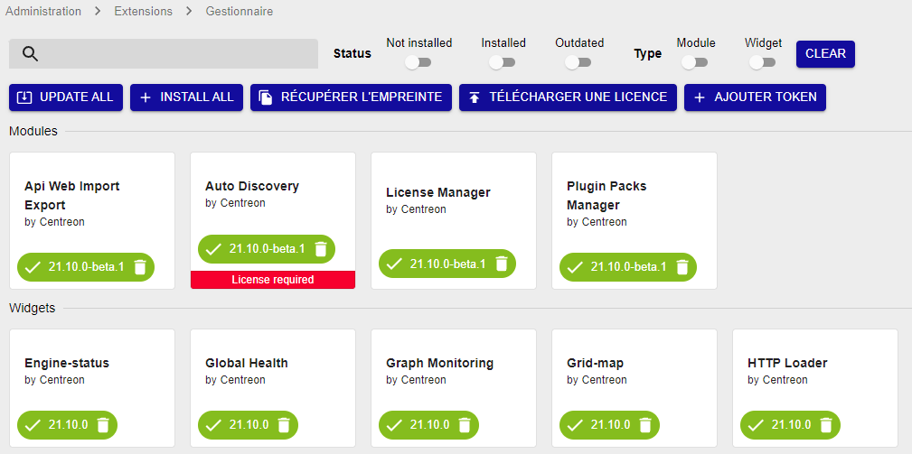
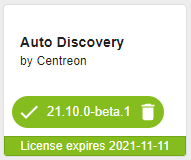
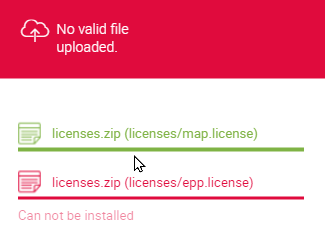

import Tabs from '@theme/Tabs';
import TabItem from '@theme/TabItem';


## Comment obtenir une licence?

* Vous pouvez demander votre jeton pour [l'édition gratuite IT-100](../getting-started/it100.md) sur notre site web.
* Si vous avez acheté une licence, demandez vos fichiers de licence à notre équipe [support](https://support.centreon.com).

## Types de licences

Selon votre [édition Centreon](https://www.centreon.com/editions/), votre licence peut être :
- en ligne : gérée avec un jeton. Votre plateforme Centreon doit être connectée à internet.
- hors ligne : gérée avec des fichiers de licence

## Quels modules demandent une licence?

Les modules suivants doivent être installés séparément et nécessitent une licence valide.

- [connecteurs de supervision](../monitoring/pluginpacks.md#installation)
- [Auto Discovery](../monitoring/discovery/installation.md)
- [Anomaly Detection](../monitoring/anomaly-detection.md)
- [Service mapping (BAM)](../service-mapping/install.md)
- [Vues graphiques (MAP)](../graph-views/introduction-map.md)
- [Reporting (MBI)](../reporting/installation.md)

## Voir les modules soumis à licence

Allez à la page **Administration > Extensions > Gestionnaire**. Tous les modules installés sur votre plateforme ont un bouton vert avec une coche blanche dedans. Les modules nécessitant une licence ont un bandeau coloré en bas (rouge si vous n'avez pas de licence valide, vert si vous en avez une).



## Ajouter une licence

<Tabs groupId="sync">
<TabItem value="Licences en ligne" label="Licences en ligne">

> Consultez les [tableaux des flux réseau](../installation/technical.md#tableaux-des-flux-réseau) pour l'intégration de votre plateforme de supervision.

Pour utiliser une licence en ligne, votre plateforme Centreon doit être connectée à internet.

#### Vérifier la connexion à internet

Assurez-vous que votre plateforme Centreon est autorisée à accéder à internet :

- Vérifier que la machine peut accéder à cette URL : https://api.imp.centreon.com

- Ajouter un serveur proxy si besoin :
  - Allez à la page **Administration > Paramètres > Centreon UI**, puis **Options de proxy**.
  - Cliquez sur **Tester la connexion Internet**. Le message "Connexion réussie" doit apparaître.

1. Munissez-vous de votre jeton de licence (fourni par notre équipe support).

2. Allez à la page **Administration > Extensions > Gestionnaire**.

3. Cliquez sur **Ajouter Token**. Une fenêtre popup s'ouvre.

4. Collez votre jeton dans la fenêtre popup, puis cliquez sur **Ajouter**. 

    - Si votre jeton contient une seule licence, un message de confirmation apparaît.

    - Si votre jeton contient plusieurs licences, choisissez la licence désirée puis cliquez sur **Choisir**.

    Appuyez sur **Esc** pour fermer la popup. La licence est appliquée et la date de validité de la licence est indiquée dans l'encadré de chaque module.

    

    Le bouton **Ajouter Token** devient un bouton **Voir la licence**.

</TabItem>
<TabItem value="Licences hors ligne" label="Licences hors ligne">

1. Pour demander votre licence:

    1. Allez à la page **Administration > Extensions > Gestionnaire**.

    2. Cliquez sur **Récupérer l'empreinte**.

    3. Collez l'empreinte dans un email à notre équipe [support](mailto:support@centreon.com) pour demander votre licence.

2. Une fois votre licence reçue, à la page **Administration > Extensions > Gestionnaire**, cliquez sur **Télécharger une licence**.

5. Naviguez jusqu'au fichier de licence, puis cliquez sur **OK**. La licence est appliquée et la date de validité de la licence est indiquée dans l'encadré de chaque module.

    

6. Si vous avez plusieurs licences à ajouter (par exemple pour BAM, MBI...), répétez les étapes précédentes jusqu'à ce que vous ayez téléchargé tous les fichiers de licence.

</TabItem>
</Tabs>

## Licence gratuite IT-100

La licence IT-100 est une licence en ligne. Voir le chapitre [Mettre en place sa solution gratuite IT-100](../getting-started/it100.md).

## Dépanner les erreurs sur les licences

### "No valid file uploaded"



Vérifiez le contenu du dossier suivant :

```shell
ls  -lah /etc/centreon/license.d/
```
Si le dossier contient déjà des licences avec des droits autres que apache/apache, supprimez-les ou changez-en les droits pour qu'elles puissent être écrasées par les nouvelles :

```shell
chown apache:apache /etc/centreon/license.d/*
chmod 640 /etc/centreon/license.d/*
```

### "Your EPP license is not valid"

* Vérifiez que l'empreinte du serveur central (récupérable à la page **Administration > Extensions > Gestionnaire**) correspond à celui renseigné dans la licence.

    ```shell
    less /etc/centreon/license.d/epp.license
    ```

* Vérifiez que le nombre d'hôtes enregistrés est inférieur à celui prévu par votre licence. Utilisez la commande suivante :

  ```sql
  SELECT COUNT(*) FROM centreon.host WHERE host_register='1';
  ```
