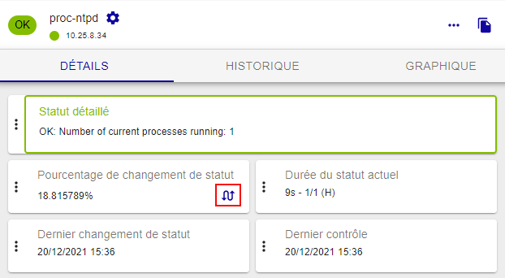

Les statuts indiquent la disponibilité d'un hôte, et la disponibilité ou la performance d'un service. Chaque
statut a une signification bien précise pour la ressource.
* Les statuts et états d'une ressource sont affichés à la page 
[Statut des ressources](resources-status.md). Vous pouvez filtrer cette page en fonction des statuts et de certains états.
* Certains statuts sont déterminés par des seuils définis par l'utilisateur. 
<!--* À chaque statut correspond un code généré par la sonde de supervision.-->

## Statut des hôtes

Le tableau ci-dessous résume l'ensemble des statuts possibles pour un hôte.

| Status                                               | Description                        |
|------------------------------------------------------|------------------------------------|
| DISPONIBLE    | L'hôte est disponible et joignable |
| INDISPONIBLE  | L'hôte est indisponible            |
| INJOIGNABLE   | L'hôte est injoignable : il [dépend](notif-dependencies.md) d'un hôte dont le statut est **INDISPONIBLE** |
| EN ATTENTE    | L'hôte vient d'être créé mais n'a pas encore été contrôlé par le moteur de supervision |

## Statut des services

Le tableau ci-dessous résume l'ensemble des statuts possibles pour un service.

| Status                                             | Description                                                            |
|----------------------------------------------------|------------------------------------------------------------------------|
| OK          | Le service ne présente aucun problème                                  |
| ALERTE      | Le service a dépassé le seuil d'alerte                                 |
| CRITIQUE    | Le service a dépassé le seuil critique                                 |
| INCONNU     | Le statut du service ne peut être vérifié (exemple : agent SNMP DOWN…) |
| EN ATTENTE  |  Le service vient d'être créé mais n'a pas encore été contrôlé par le moteur de supervision |

## États

En plus de leur statut, les ressources peuvent avoir différents états :

- [Acquitté](acknowledge.md) : indique que l'incident sur le service ou l'hôte est pris en
    compte par un utilisateur. Les ressources acquittées ont un fond jaune.
- [En maintenance](downtimes.md) : indique que les notifications sont temporairement suspendues pour cette ressource. Une plage de maintenance peut être [planifiée à l'avance](downtimes.md#les-temps-darrêt-récurrents) pour éviter de recevoir des alertes pendant une opération de maintenance. Elle peut également être définie suite à un incident. Les ressources en maintenance ont un fond violet.

- [Flapping](notif-flapping.md) (bagotement) : le pourcentage de
changement de statut de la ressource est très élevé. Ce pourcentage est
obtenu à partir de calculs effectués par le moteur de supervision. Les ressources dans un état de bagotement affichent l'icône suivante dans leur panneau **Détails** :
    

## Types de statuts

Le statut d'une ressource peut avoir deux types :

-   SOFT : Signifie qu'un incident vient d'être détecté et que ce
    dernier doit être confirmé.
-   HARD : Signifie que le statut de l'incident est confirmé. Lorsque le
    statut est confirmé, le processus de notification est enclenché
    (envoi d'un mail, SMS, …).

Vous pouvez filtrer la page [Resources Status](resources-status.md) suivant le type de statut.

### Explication

Un incident (statut non-OK) est confirmé à partir du moment où le nombre
d'essais de validation est arrivé à son terme. La configuration d'un
objet (hôte ou service) implique un intervalle de contrôle régulier, un
nombre d'essais pour valider un état non-OK ainsi qu'un intervalle
non-régulier de contrôle. Dès la détection du premier incident, le
statut est dans un état “SOFT” jusqu'à sa validation en état “HARD”
déclenchant le processus de notification.

Exemple :

| Temps | Nombre de vérifications | Statut   | Type de statut | Changement d'état | Commentaire                                                                                                                                                                                                                                                                    |
|-------|-------------------------|----------|------|-------------------|--------------------------------------------------------------------------------------------------------------------------------------------------------------------------------------------------------------------------------------------------------------------------------|
| t+0   | 1/3                     | OK       | HARD | No                | État initial du service                                                                                                                                                                                                                                                        |
| t+5   | 1/3                     | CRITICAL | SOFT | Yes               | Première détection d'un état non-OK. Le gestionnaire d'événements s'exécute (event handlers).                                                                                                                                                                                  |
| t+6   | 2/3                     | WARNING  | SOFT | Yes               | Le service continue à être dans un statut non-OK. Le gestionnaire d'événements s'exécute.                                                                                                                                                                                      |
| t+7   | 3/3                     | CRITICAL | HARD | Yes               | Le nombre maximal de tentatives de vérification a été atteint, le service passe donc à l'état HARD. Le gestionnaire d'événements s'exécute et une notification de problème est envoyée. Le contrôle # est remis à 1 immédiatement après que cela se produit.                   |
| t+12  | 3/3                     | WARNING  | HARD | Yes               | Le service passe à un état HARD WARNING. Le gestionnaire d'événements s'exécute et une notification de problème est envoyée.                                                                                                                                                   |
| t+17  | 3/3                     | WARNING  | HARD | No                | Le service se stabilise dans un état de problème HARD. En fonction de l'intervalle de notification pour le service, une autre notification peut être envoyée.                                                                                                                  |
| t+22  | 1/3                     | OK       | HARD | Yes               | Le service revient à un statut OK HARD. Le gestionnaire d'événements s'exécute et une notification de récupération est envoyée.                                                                                                                                                |
| t+27  | 1/3                     | OK       | HARD | No                | Le service est toujours OK.                                                                                                                                                                                                                                                    |
| t+28  | 1/3                     | UNKNOWN  | SOFT | Yes               | Le service passe à un état SOFT non-OK. Le gestionnaire d'événements s'exécute.                                                                                                                                                                                                |
| t+29  | 2/3                     | OK       | SOFT | Yes               | Le service revient à un état OK SOFT. Le gestionnaire d'événements s'exécutent, mais les notifications ne sont pas envoyées, car ce n'était pas un problème "réel". Le type d'état est défini sur HARD et le contrôle # est remis à 1 immédiatement après que cela se produit. |
| t+30  | 1/3                     | OK       | HARD | No                | Le service se stabilise dans un état OK HARD.                                                                                                                                                                                                                                  |