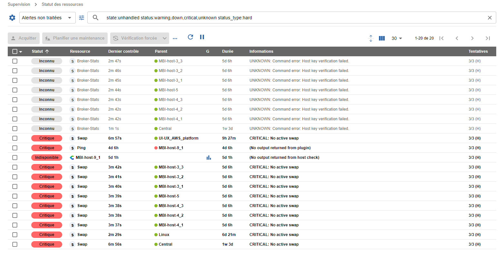
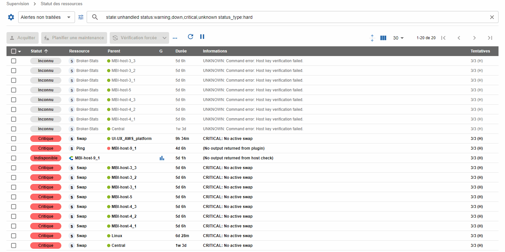
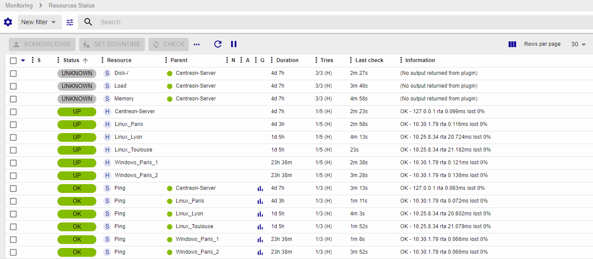
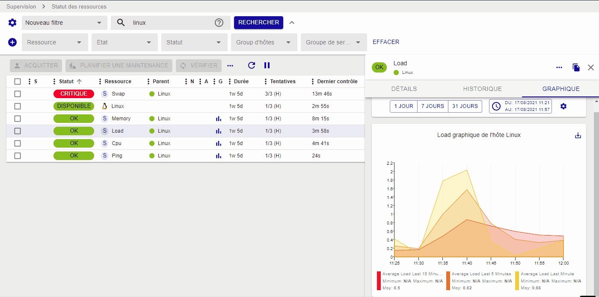
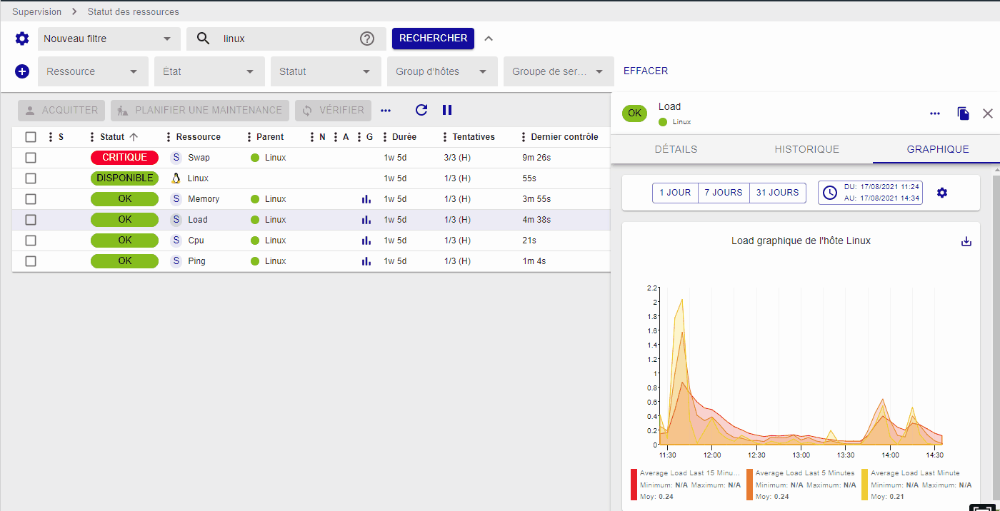
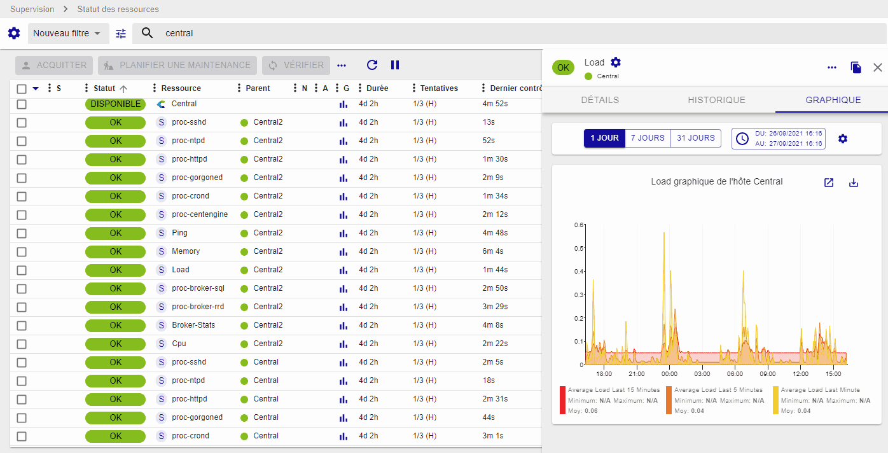

La vue **Supervision > Statut des ressources** est votre vue principale
pour connaître les évènements en cours et être en mesure de les comprendre,
les prendre en compte et les traiter rapidement.

Cette vue rassemble à la fois les hôtes et les services afin de proposer
une interface unique et unifiée de gestion des évènements.

## Lister les évènements

Le listing des évènements permet d'avoir une vue condensée des alertes en
cours ou plus largement de l'état de toutes les ressources supervisées par
la plateforme Centreon.

Il est possible d'ajouter ou de masquer des colonnes, ainsi que de choisir la colonne de tri afin d'ordonner le listing, par
exemple par statut ou encore par sévérité.

### Vue compacte ou étendue

Vous pouvez afficher la vue dans le mode qui vous convient le mieux, en modifiant la présentation visuelle des lignes dans les tableaux.

Cliquez sur le bouton dédié pour faciliter la lecture des informations contenues dans les tableaux :
- Mode vue "compact" 
- Mode vue "extended" 

## Exécuter des actions sur les évènements

### Prendre en compte un évènement

Lorsqu'une ou plusieurs alertes apparaissent, il est possible de les [acquitter](acknowledge.md) afin de montrer à votre équipe que le problème est bien
pris en compte, et ce de deux manières:

- En acquittant la ressource directement via le bouton qui s'affiche au survol de la ligne
- En sélectionnant une ou plusieurs lignes et en cliquant sur le bouton **Acquitter** au-dessus du tableau. Vous pouvez utiliser la touche **Majuscule** pour sélectionner plusieurs lignes contiguës.

Seules les ressources en statut "Non-OK" peuvent être acquittées.
Seule une ressource non acquittée peut être acquittée.

Lorsqu'une ressource est acquittée :

- l'alerte disparaît de la vue **Alertes non traitées**
- les [notifications](notif-configuration.md) partant de la ressource sont stoppées
- L'arrière-plan de la ligne d'une ressource acquittée passe en jaune.

L'acquittement peut aussi être supprimé pour reverser l'évènement dans la liste
des évènements non pris en compte ainsi que pour relancer les notifications. Cliquez
sur **Désacquitter** dans le menu **Plus d'actions**.

### Planifier une plage de maintenance

Il est possible de [planifier une plage de maintenance](downtimes.md) :

- En définissant directement une plage de maintenance via le bouton qui s'affiche au survol de la ligne
- En sélectionnant une ou plusieurs lignes et en cliquant sur le bouton **Planifier une maintenance** au-dessus du tableau.

La mise en maintenance d'une ressource a pour effet de masquer l'alerte
de la vue **Alertes non traitées** et de stopper les notifications partant
de la ressource. L'arrière-plan des lignes des ressources en maintenance est mauve.

### Relancer un contrôle

Dans de nombreuses situations, il est nécessaire de pouvoir rafraîchir
le statut d'une ou plusieurs ressources en lançant un contrôle manuellement via
l'interface.

Deux types d'actions de contrôle sont disponibles :
- L'action **Vérifier** : un contrôle que vous effectuez uniquement durant la période de vérification configurée.
- L'action **Vérification forcée** : un contrôle que vous pouvez effectuer à tout moment (pendant ou en dehors de la période de vérification configurée).

Vous pouvez contrôler vos ressources et rafraîchir leur statut de deux manières :

- En lançant le contrôle directement via le bouton qui s'affiche au survol de la ligne (**Vérification forcée** uniquement).
- En sélectionnant une ou plusieurs lignes et en cliquant sur le bouton **Vérifier** au-dessus du tableau.

### Soumettre un statut

Dans certains cas, notamment avec les services dit "passifs", il peut
être utile de soumettre un résultat, c'est à dire un statut, un message
de sortie et des métriques, afin de remettre à zéro l'évènement.
Pour cela, sélectionnez un service passif puis cliquez sur **Soumettre un statut**
dans le menu **Plus d'actions**.

## Filtrer les évènements

Les différents filtres s'ajoutent selon un critère ET : les résultats correspondront à tous les critères saisis.

### Filtres prédéfinis

Lorsque vous arrivez sur la vue d'évènements, par défaut le filtre est
positionné sur **Alertes non traitées** : ce filtre permet de visualiser
rapidement tous les problèmes n'ayant pas encore été pris en compte ou
associés à une plage de maintenance. Il est possible de choisir parmi 2
autres filtres : **Toutes les alertes** & **Tous**.

Signification des filtres :

- **Alertes non traitées** : Le statut de la ressource est **Alerte** ou
    **Critique** ou **Inconnu** ou **Indisponible** ET la ressource n'est ni acquittée ni en
    plage de maintenance planifiée
- **Toutes les alertes**: Le statut de la ressource est **Alerte** ou
    **Critique** ou **Inconnu** ou **Indisponible** (que la ressource ait été acquittée/mise en maintenance ou non)
- **Tous** : toutes les ressources.

### Critères de recherche

Vous pouvez filtrer la liste des ressources selon un certain nombre de critères prédéfinis.

1. Cliquez sur l'icône **Options de recherche** :

    Une pop-in apparaît, listant les critères suivants :

    - **Type** : afficher uniquement les hôtes, les services, ou les métaservices. Vous pouvez également filtrer sur les services de type [Anomaly Detection](../monitoring/anomaly-detection.md) si le module est installé.
    - **État** : y a-t'il une action en cours sur le service ou l'équipement ? (acquittement, plage de maintenance planifiée)
    - [**Statut**](concepts.md) : **OK**, **Disponible**, **Alerte**, **Indisponible**, **Critique**, **Injoignable**, **Inconnu**, **En attente**
    - [**Type de statut**](concepts.md#types-de-statuts): SOFT ou HARD
    - **Groupes d'hôtes**
    - **Groupe de services**
    - **Serveur de supervision** : ressources supervisées par un serveur (ou collecteur) particulier.
    - [**Catégorie d'hôte**](../monitoring/categories.md)
    - [**Catégorie de service**](../monitoring/categories.md)
    - [**Criticité d'hôte**](../monitoring/categories.md): nom de la criticité de l'hôte
    - **Niveau de criticité d'hôte**
    - [**Criticité du service**](../monitoring/categories.md): nom de la criticité du service
    - **Niveau de criticité du service**
  
2. Cliquez sur un critère de recherche : une liste de toutes les valeurs possibles s'affiche.

3. Sélectionnez les valeurs désirées. La barre de recherche affiche le texte correspondant au filtre appliqué, et un chiffre indique à gauche du critère le nombre de valeurs sélectionnées.
Si besoin, cliquez sur le 'x' à droite d'un critère pour désélectionner toutes les valeurs.

4. Cliquez sur **Rechercher**, ou cliquez en dehors de la pop-up. La liste des ressources est filtrée.

### Barre de recherche

Si vous entrez du texte dans la barre de recherche, par défaut la recherche se fait sur tous les champs suivants :

- Nom de l'hôte
- Alias de l'hôte
- Adresse ou FQDN de l'hôte
- Nom du service

Par exemple, si vous entrez "rta", toutes les ressources contenant un "rta" dans l'un des champs ci-dessus seront affichées (par exemple, un métaservice nommé **Ping-RTA-Average**).

Cependant, vous pouvez faire une recherche beaucoup plus fine en utilisant le [Centreon Query Language](#critères-cql). Celui-ci vous permet de rechercher uniquement dans un ou plusieurs champs.

#### Critères CQL

- **alias** : rechercher des hôtes selon leur alias
- **fqdn** : rechercher des hôtes selon leur adresse IP ou FQDN
- **host_group** : rechercher les hôtes rattachés à un groupe d'hôtes
- **host_category**: rechercher les hôtes appartenant à une catégorie
- **host_severity**: rechercher des hôtes selon le nom de la criticité associée
- **host_severity_level**: rechercher des hôtes selon le niveau de la criticité associée
- **h.name** : rechercher des ressources selon le nom d'hôte affiché dans la colonne **Resource** pour les hôtes, et **Parent** pour les services
- **h.alias** : rechercher uniquement sur l'alias de l'hôte
- **h.address** : rechercher des ressources selon le FQDN/l'adresse IP de l'hôte ou du parent du services
- **information** : rechercher uniquement dans la colonne **Information**
- **monitoring_server** : rechercher toutes les ressources supervisées par le collecteur indiqué
- **name** : rechercher des hôtes uniquement sur le nom d'hôte, affiché dans la colonne **Resource**
- **parent_name** : rechercher des services, selon le nom de leur parent
- **parent_alias** : rechercher des services, selon l'alias de leur parent
- **state** : rechercher des ressources problématiques, selon qu'elles sont non prises en compte, acquittées ou en maintenance
- **status** : rechercher des ressources selon leur [statut](concepts.md)
- **status_type**: rechercher des ressources selon leur [type de statut](concepts.md#types-de-statuts)
- **service_category**: rechercher les services appartenant à une catégorie
- **service_group** : rechercher les services rattachés à un groupe de services
- **service_severity**: rechercher des services selon le nom de la criticité associée
- **service_severity_level**: rechercher des services selon le niveau de la criticité associée
- **s.description** : chercher uniquement sur le nom du service (indiqué dans la colonne **Resource**)
- **type** : afficher uniquement les hôtes, les services ou les métaservices

#### Utiliser la barre de recherche

La barre de recherche montre les critères appliqués sous forme textuelle. 
L'autocomplétion vous aide à saisir les termes de recherche facilement : 

1. Tapez par exemple "h", et la barre suggère tous les critères commençant par 
"h" (**host_group**, **h.name**, **h.alias**, **h.address**). Sélectionnez le 
critère désiré avec les flèches haut et bas, puis appuyez sur **Tab** ou **Entrée** pour valider la sélection.
Le critère et ses valeurs possibles sont séparés par deux points (par exemple, **host:Linux**).

2. Suivant le type de critère, l'autocomplétion peut vous suggérer les valeurs possibles
pour ce critère (par exemple, pour le critère **Type**, les valeurs peuvent 
être **Hôte**, **Service** ou **Métaservice**). Sélectionnez la valeur désirée 
avec les flèches haut et bas, puis appuyez sur **Tab** ou **Entrée** pour valider la sélection.
Un même critère peut avoir plusieurs valeurs possibles. Les valeurs doivent être séparées par des virgules.
La recherche ramènera toutes les valeurs selon un critère OU, par exemple, **type:service,metaservice** ramènera 
toutes les ressources de type services et métaservices.

  

3. Séparez les critères de recherche par des espaces. Les critères s'additionnent 
selon un critère "ET" : les résultats correspondront à tous les critères saisis.

   * Vous pouvez utiliser des expressions régulières. Les wildcards ne sont pas supportées : un motif de recherche commençant par * n'est pas valide.
   * Vous ne pouvez pas faire de recherche basée sur un motif dans un champ ayant un nombre fini de valeurs (groupes d'hôtes, statuts, etc) : pour ces champs, utilisez le bouton [**Critères de recherche**](#critères-de-recherche).

4. Une fois les critères de recherche saisis, entrez un caractère espace ou appuyez sur **Échap** pour sortir de l'autocomplétion, puis appuyez sur **Entrée**.

Exemple :
    **s.description:ping h.name:linux** : la liste affiche tous les services dont le nom contient "ping", pour tous les hôtes dont le nom contient "linux".

### Sauvegarder un filtre

Lorsque vous souhaitez ne lister qu'un sous-ensemble des équipements de
la supervision, vous pouvez être amenés à utiliser de nombreux critères et
expressions régulières. Dans ce cas, il est intéressant de sauvegarder
le filtre afin de pouvoir facilement le réutiliser plus tard.

Utilisez l'icône "Options de filtre" à côté de la barre de recherche pour :

- Sauvegarder la recherche actuelle comme un nouveau filtre
- Mettre à jour le filtre actuel avec la recherche en cours

Une fois qu'un filtre est créé, il apparaîtra dans la liste des filtres
sous la section **Mes filtres**.

En cliquant sur le menu **Éditer les filtres**, il est possible de manipuler les filtres sauvegardés (en les renommant, ré-ordonnant et supprimant).

## Panneau de détail

Lorsque vous cliquez sur une ligne, un panneau de détail s'affiche pour
présenter les informations principales de la ressource. Ce panneau peut être redimensionné.

En fonction du type de ressource, différents onglets sont disponibles.

### Panneau d'hôte

Le panneau d'hôte contient les éléments suivants :

- Onglet **Détails** : Informations détaillées sur le statut courant. Vous pouvez glisser-déposer les tuiles pour changer leur disposition.
- Onglet **Services** : La liste des services rattachés à cet hôte avec leur statut (et de leurs graphiques, quand le mode correspondant est sélectionné),
- Onglet **Historique** : La chronologie des évènements survenus pour cet hôte,
- Onglet **Notification** : Affiche si les notifications sont activées pour cette hôte, ainsi que les contacts et groupes de contacts qui seront notifiés.
- Des raccourcis vers la configuration, les journaux d'évènements et les
    rapports de disponibilité.

Si l'hôte est acquitté ou en maintenance planifiée, des informations supplémentaires
seront visibles sur le panneau.

### Panneau de service

Le panneau de service contient les éléments suivants :

- Onglet **Détails** : Informations détaillées sur le statut courant. Vous pouvez glisser-déposer les tuiles pour changer leur disposition.
- Onglet **Historique** : La chronologie des évènements survenus pour ce service,
- Onglet **Graphique** : Un graphique avec une courbe par métrique collectée par ce service,
- Onglet **Notification** : Affiche si les notifications sont activées pour ce service, ainsi que les contacts et groupes de contacts qui seront notifiés.
- Des raccourcis vers les configurations, les journaux d'évènements et les
    rapports de disponibilité pour ce service et son hôte.
- Sous le nom du service, le nom de son hôte parent. Cliquez sur celui-ci pour ouvrir le panneau de détail d'hôte de l'hôte parent.

Si le service est acquitté ou en downtime, des informations supplémentaires
seront visibles sur le panneau.

### Onglet Historique

L'onglet **Historique** montre une liste antichronologique des évènements survenus pour ce service ou cet hôte. Utilisez la liste **Évènement** pour afficher uniquement les types d'évènements désirés.

Vous pouvez exporter la liste complète des évènements au format CSV.

### Onglet Graphique

L'onglet **Graphique** vous permet d’afficher de manière visuelle l'évolution des métriques dans le temps pour la ressource sélectionnée. Survolez les courbes avec la souris pour afficher l'heure exacte sous le titre du graphique, et dans la légende, les valeurs des différentes métriques correspondant à l'instant.

Lorsque le curseur ne survole pas les courbes, la légende affiche les valeurs minimum, maximum et moyennes 
pour chaque métrique.

Utilisez la légende pour afficher ou masquer des métriques.

- Cliquez sur un élément de la légende pour que seule la courbe correspondante s'affiche. 
- Pour réafficher l'ensemble des métriques, cliquez à nouveau sur la légende de la métrique affichée.

Vous pouvez également afficher plusieurs métriques en faisant Ctrl+clic (ou bien Cmd+clic pour les utilisateurs Mac) sur la légende correspondante :

Les graphiques affichent l'évolution des métriques sur une période donnée. La période affichée peut être définie de différentes façons :

- Des périodes préconfigurées sont disponibles dans l'en-tête du graphique : 1 jour, 7 jours, 31 jours.

- Des sélecteurs de date et d'heure sont disponibles pour les points de début et de fin. Ils sont mis à jour lorsque la période affichée change.

- Utilisez les boutons [<] et [>] qui apparaissent sur les côtés au survol du bord du graphique pour avancer ou reculer dans le temps de la moitié de la période de temps affichée.

- Sélectionnez une période dans le graphique pour zoomer sur cette période.

    

La bascule **Afficher les évènements** permet d'afficher certains évènements de la chronologie de la ressource (plages de maintenance, acquittements, commentaires) directement sur le graphique, aux travers d'annotations :

Il est possible d'ajouter un commentaire directement sur le graphique, en cliquant n’importe où, au niveau du temps souhaité, et ensuite en cliquant sur **Ajouter un commentaire** sur l'infobulle qui apparaît :

Pour supprimer un commentaire, allez à la page **Supervision > Planifier des plages de maintenance > Commentaires**.

En cliquant sur le bouton **Exporter**, vous pouvez exporter une capture du graphique sous forme d'image PNG, qui va aussi inclure les évènements de la chronologie, si l'option correspondante est activée. Notez que seules les métriques sélectionnées seront exportées :

Pour voir une version plus grande du graphique, cliquez sur **Go to performance page** en haut à droite du graphique.

Le graphique s'ouvre dans la page **Supervision > Informations de performance > Graphiques**, vous permettant de filtrer celui-ci plus précisément.

Vous pouvez aussi exporter les données du graphique au format CSV. Toutes les métriques seront incluses.

### Onglet Notification

L'onglet Notification affiche si les notifications sont activées pour la ressource sélectionnée. Vous pouvez voir les destinataires de ces notifications dans les sections **Contacts** et **Contact groups**.

Pour paramétrer les destinataires, cliquez sur l'icône "roue dentée" de la section **Contacts** ou **Contact groups**.

