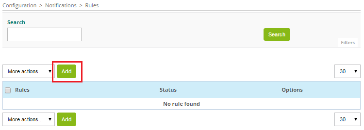
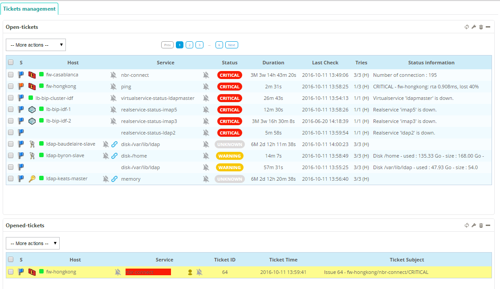
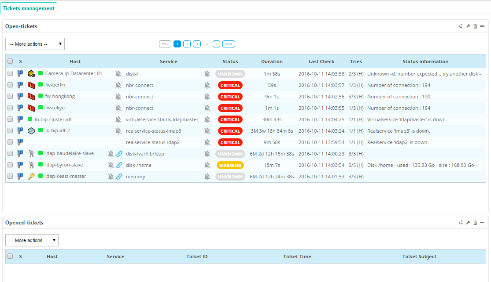

## Configuration

> Attention ! Il est possible que mettre à jour Centreon efface vos configurations personnalisées. Pour éviter ce problème, référez-vous à notre procédure de [Mise à jour de Centreon](../update/update-centreon-platform.md#Sauvegarde).

### Sélectionner un fournisseur de service

La liste des fournisseurs disponibles est actualisée dans la section de documentation
dédiée aux intégrations [ITSM](../integrations/itsm/itsm-overview.md).

Chaque fournisseur a sa propre configuration, cependant, l'ajout d'un
fournisseur dans Centreon peut se faire de la manière suivante.

Rendez-vous dans le menu
`Configuration > Notifications > Open Tickets > Rules` et cliquez sur le
bouton **Add** :

Définissez le nom de la règle **Rule name** et sélectionnez le **Provider**:

Un nouveau formulaire appraît. Configurez ce dernier en fonction de ses
spécificités.

### Hôtes et services

Pour que les ressources (hôtes et services) reçoivent un numéro de
ticket, il est nécessaire de leur ajouter une macro personnalisée à leur
configuration.

La meilleure façon est de créer ces macros dans un modèle hôte et un
modèle de service hérité par toutes les ressources.

Rendez-vous dans le menu **Configuration > Hosts > Templates** et
recherchez le modèle **generic-active-host-custom** et éditez ce
dernier. Ajouter la macro **TICKET\_ID** et cliquez sur **Save** :

Rendez-vous dans le menu **Configuration > Services > Templates** et
recherchez le modèle **generic-active-service-custom** et éditez ce
dernier. Ajouter la macro **TICKET\_ID** et cliquez sur \*\*Save\* :

### Configuration du widget

Pour utiliser le widget, vous devez l'ajouter dans une vue
personnalisée. Allez dans le menu **Home > Custom Views**, sélectionnez
votre vue et cliquez sur le bouton **Add widget**.

Définissez un titre pour votre widget (par exemple: Open-Tickets) et
sélectionnez le widget **Open Tickets**. Faites la même manipulation
pour ajouter à nouveau ce widget.

Sur le premier widget, pour ouvrir le ticket, cliquez sur le bouton de
**configuration** :

-   Sélectionnez la règle **Rule** précédemment définie
-   Ne cochez pas la case **Opened Tickets**
-   Sélectionnez d'autres filtres
-   Ne cochez pas les cases **Display Ticket ID** et **Display Ticket
    Time**

Sur le deuxième widget, pour afficher les tickets ouverts, cliquez sur
le bouton de **configuration** :

-   Sélectionnez la règle **Rule** précédemment définie
-   Cochez la case **Opened Tickets**
-   Sélectionnez d'autres filtres
-   Cochez les cases **Display Ticket ID** et **Display Ticket Time**

## Guide utilisateur

### Créer un ticket

Pour ouvrir un ticket, sélectionnez le ressources à l'aide de la case à
cocher et dans le menu **– More actions –** sélectionnez l'action
requise :

Une fenêtre s'ouvre pour saisir un commentaire. Une fois saisin cliquez sur
le bouton **Open** pour créer le ticket :

Une fois le ticket créé, l'ID de ce dernier appraît :

Les ressources précédemment sélectionnées disparaissent du widget
d'ouverture de tickets :

### Fermer un ticket

Pour fermer un ticket, sélectionnez le ressources à l'aide de la case à
cocher et dans le menu **-- More actions --** sélectionnez l'action requise :

Le ticket est fermé (pour Centreon seulement) :

Les ressources précédemment sélectionnées disparaissent du widget des
tickets ouverts :

## Configuration avancée

Ce module propose des fournisseurs prêts à l'emploi. Cependant, selon la
configuration de votre ITSM, il peut être nécessaire de modifiez-les
pour les adapter à votre environnement.

### Définition de liste

Avant d'ouvrir un ticket, un utilisateur peut choisir certaines options
dans une fenêtre. Une option peut être une liste de sélection. Dans la
configuration fournisseur, vous pouvez les configurer dans `Lists` and
`Custom list definition`. Pour chaque entrée dans `Lists`, vous pouvez
définir :

-   **Id** : valeur alphanumeric value (doit être unique)
-   **Label** : affiché dans la fenêtre
-   **Type** : type de liste. Il existe 3 types de listes
    -   Liste du fournisseur (données du logiciel de gestion de tickets)
    -   Liste Centreon (comme `Host group`)
    -   Liste personnalisées (provenant de la configuration
        `Custom list definition`. Les champs **Id** doivent être
        identiques)
-   **Mandatory** : l'utilisateur doit définir l'option obligatoirement

Le module stocke la sélection de la liste d'utilisateurs dans un tableau
(peut être utilisé dans la section smarty comme `body` ou
`mapping ticket arguments`). Il y a 3 champs (**LIST\_ID** doit être
remplacé):

-   {$select.LIST\_ID.id}
-   {$select.LIST\_ID.value}
-   {$select.LIST\_ID.label}

### Règles de chaînage

Après avoir ouvert un ticket, vous souhaitez peut-être envoyer un
e-mail. Le système de règles de chaînage est conçu pour le faire :

-   Créez une règle avec le nom `emailme` et le fourisseur `Mail`
-   Configurez `emailme` pour le champ **Chain rules**

### Commandes

Après avoir ouvert un ticket, vous souhaitez également exécuter certaines
commandes :

