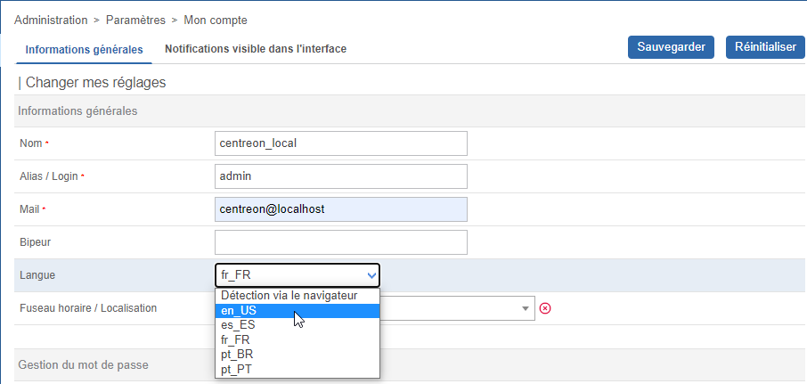

import Tabs from '@theme/Tabs';
import TabItem from '@theme/TabItem';

Si vous voulez contribuer à traduire Centreon, ce tutoriel est pour vous ! Découvrez comment traduire l’interface web de Centreon et comment nous aider à ajouter de nouvelles langues dans Centreon.

## Installer l’environnement de traduction

Contactez-nous afin d'obtenir une archive des contenus à traduire, puis copiez celle-ci sur un serveur Linux.

Exécutez les commandes suivantes :

```shell
unzip centreon-translation.zip
cd centreon-translation
```

Votre environnement pour traduire Centreon est maintenant prêt.

## Première génération

Lors de la première génération, le script clonera les sources de Centreon depuis GitHub sur votre serveur.

Exécutez la commande suivante :

```shell
sh make-translation.sh
```

À la fin de l’exécution, deux fichiers sont disponibles :

* messages.pot pour traduire le menu et les formulaires de l’interface web Centreon
* help.pot pour traduire les infobulles d’aide dans les formulaires de configuration

Renommer messages.pot en messages.po et help.pot en help.po

Vous pouvez maintenant commencer la traduction de Centreon en modifiant les fichiers avec un éditeur de fichiers PO comme poedit.

> Conservez toujours vos fichiers \*.po pour la prochaine traduction.

## Utiliser votre traduction

Sur votre serveur Centreon, installez gettext.

Créez le répertoire **locale** pour votre Centreon :

```shell
sudo mkdir -p /usr/share/centreon/www/locale/`locale | grep LC_MESSAGES | cut -d \" -f 2`/LC_MESSAGES
```

> **/usr/share/centreon** est le répertoire d’installation de Centreon.

Si vous souhaitez traduire Centreon dans une autre langue que celle utilisée par votre serveur Centreon, vous devez définir manuellement la locale.

Par exemple, pour les utilisateurs brésiliens, exécutez la commande suivante :

```Shell
sudo mkdir -p /usr/share/centreon/www/locale/pt_BR.UTF-8/LC_MESSAGES
```

Compilez les fichiers traduits :

```shell
msgfmt messages.po -o messages.mo
msgfmt help.pot -o help.mo
php ./centreon-github/bin/centreon-translations.php pt centreon-github/lang/pt_BR.UTF-8/LC_MESSAGES/messages.po centreon-github/lang/pt_BR.UTF-8/LC_MESSAGES/messages.ser
```

Copiez les fichiers traduits compilés :

```shell
sudo cp *.mo /usr/share/centreon/www/locale/`locale | grep LC_MESSAGES | cut -d \" -f 2`/LC_MESSAGES
sudo cp messages.ser /usr/share/centreon/www/locale/`locale | grep LC_MESSAGES | cut -d \" -f 2`/LC_MESSAGES
```

Modifiez les droits sur le répertoire :

```shell
sudo chown -R apache.apache /usr/share/centreon/www/locale/`locale | grep LC_MESSAGES | cut -d \" -f 2`
```

Redémarrez Apache :

<Tabs groupId="sync">
<TabItem value="Alma/ RHEL / Oracle Linux 8" label="Alma/ RHEL / Oracle Linux 8">

Restart Apache:
```shell
systemctl restart httpd
```

</TabItem>
<TabItem value="Alma / RHEL / Oracle Linux 9" label="Alma / RHEL / Oracle Linux 9">

Restart Apache:
```shell
systemctl restart httpd
```

</TabItem>
</Tabs>

Connectez-vous à votre interface web Centreon, modifiez votre profil et sélectionnez une nouvelle langue :



Sauvegardez le formulaire et accédez à un autre menu, votre interface sera traduite.

## Mise à niveau de la traduction

Les développeurs de Centreon publient chaque mois une nouvelle version de Centreon Web. La traduction pourrait donc être modifiée à chaque nouvelle version.

Pour maintenir la traduction à jour, procédez comme suit :

```shell
sh make-translation.sh
```

À la fin de l’exécution, deux fichiers à jour sont disponibles :

* messages.pot pour traduire le menu et les formulaires de l’interface Web Centreon
* help.pot pour traduire les infobulles d’aide dans les formulaires de configuration

Fusionnez ces fichiers avec les traductions précédentes (messages.po et help.po) :

```shell
msgmerge help.po help.pot -o new_help.po
msgmerge messages.po messages.pot -o new_messages.po
```

Reportez-vous au chapitre « Utiliser votre traduction » pour mettre à niveau la traduction pour Centreon.

## Participer au projet Centreon

Une fois que votre traduction est à jour, vous pouvez demander à l’équipe Centreon d’ajouter votre traduction au projet Centreon. Cela permettra à toutes les personnes utilisant Centreon d’avoir accès à votre traduction sur leur plateforme Centreon.

* Créez un compte sur GitHub
* Forkez le projet centreon/centreon sur GitHub
* Ajoutez vos fichiers traduits \*.mo et \*.po au répertoire lang/\<votre\_lang>/LC\_MESSAGES
* Soumettez votre modification sur votre projet
* Créez une demande de contribution sur le projet centreon/centreon
* Nous ajouterons votre traduction à Centreon.

Merci pour votre aide !