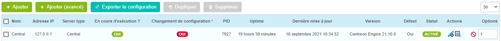

Ce topic vous propose d'installer les modèles de supervision fournis gratuitement avec la solution Centreon, puis de les implémenter afin de mettre votre premier équipement en supervision.

> Si vous disposez d'une licence adéquate, vous pouvez utiliser notre [module d'autodécouverte](../monitoring/discovery/introduction.md) afin de trouver et de configurer vos hôtes facilement. Voir aussi notre tutoriel [sur la détection d'instances AWS EC2](autodisco-aws.md).

### Installation des modèles de supervision de base

Rendez-vous dans le menu **Configuration > Gestionnaire de connecteurs de supervision**.

> Avant toute chose, appliquez la procédure de [configuration du proxy](../administration/parameters/centreon-ui.md#configuration-du-proxy)
> pour configurer et vérifier la connexion de votre serveur Centreon à internet.

Commencez par installer le connecteur de supervision **Base Pack** (s'il n'est pas déjà installé) en déplaçant votre curseur sur ce dernier et en cliquant sur
l'icône **+** (il s'agit d'un pré-requis à l'installation de tout autre connecteur de supervision) :

Vous pouvez aussi cliquer sur le connecteur de supervision afin d'en connaître son contenu avant de l'installer :

Installez ensuite les connecteurs de supervision inclus gratuitement avec la solution, par exemple **Linux SNMP** et **Windows SNMP** :

Vous disposez maintenant des modèles de base pour configurer votre supervision !

## Déployer une configuration

Lorsque vous créerez des hôtes, vous devrez déployer la configuration pour que la supervision démarre.

1. Rendez-vous dans le menu **Configuration > Collecteurs > Collecteurs**.
2. Choisissez les collecteurs sur lesquels exporter la configuration.
3. Cliquez sur **Exporter la configuration**.

    

4. Cochez les cases suivantes :
  - **Générer les fichiers de configuration**
  - **Lancer le débogage du moteur de supervision (-v)**
  - **Déplacer les fichiers générés**
  - **Redémarrer l'ordonnanceur**.

5. Cliquez sur **Exporter**.

    

6. Vérifiez qu'aucune erreur n'apparaît lors de la génération.
