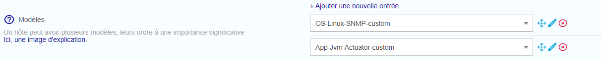
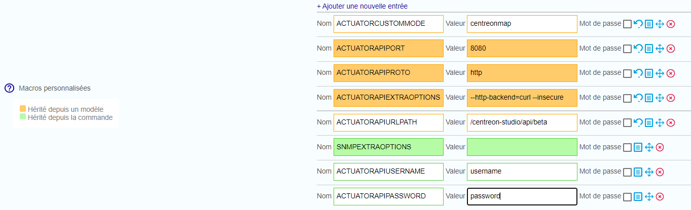
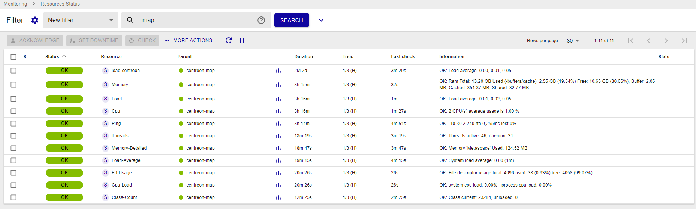

import Tabs from '@theme/Tabs';
import TabItem from '@theme/TabItem';

Ce chapitre décrit les procédures avancées de configuration de votre système Centreon MAP.

## Superviser votre serveur Centreon MAP après installation

Centreon fournit un connecteur de supervision et un plugin pour superviser votre serveur Centreon MAP.

### Installer les packs

Sur le serveur central, installez les Packs requis à l'aide des commandes suivantes :

```shell
yum install centreon-pack-operatingsystems-linux-snmp centreon-pack-applications-jvm-actuator
```

À partir du Gestionnaire de connecteurs de supervision, installez les packs.

### Installer les plugins

Utilisez SSH pour accéder au Poller qui supervisera votre serveur Centreon MAP.

Installez tous les plugins requis à l'aide des commandes suivantes :

```shell
yum install centreon-plugin-Operatingsystems-Linux-Snmp centreon-plugin-Applications-Jvm-Actuator
```

### Configurer vos services

Accédez à votre interface Web Centreon. Allez à la page **Configuration > Hôtes > Hôtes**, puis cliquer sur **Ajouter**.

Remplissez les informations de base sur votre hôte et ajoutez les modèles d'hôte suivants :

- OS-Linux-SNMP-custom
- App-Jvm-actuator-custom




Pour surveiller la JVM centreon-map, veuillez utiliser les valeurs de macro suivantes :

| Nom                     | Valeur                                    |
| :---------------------- | :---------------------------------------- |
| ACTUATORCUSTOMMODE      | ```centreonmap```                         |
| ACTUATORAPIURLPATH      | ```/centreon-studio/api/beta```           |
| ACTUATORAPIUSERNAME     | Le nom d'utilisateur Api doit être défini |
| ACTUATORAPIPASSWORD     | Le mot de passe Api doit être défini      |

> N'oubliez pas de cocher la case "Créer aussi les services liés aux modèles".

Vous pouvez maintenant exporter votre configuration, et votre serveur Centreon MAP sera supervisé.



Vous pouvez également vérifier l'URL suivante, qui indique si le serveur est opérationnel ou non :

<Tabs groupId="sync">
<TabItem value="HTTP" label="HTTP">

```shell
http://<MAP_IP>:8080/centreon-studio/api/beta/actuator/health.
```

</TabItem>
<TabItem value="HTTPS" label="HTTPS">

```shell
https://<MAP_IP>:8443/centreon-studio/api/beta/actuator/health.
```

</TabItem>
</Tabs>

## Fichiers de configuration de Centreon MAP

> Nous vous déconseillons de modifier manuellement les fichiers de configuration, sauf si vous êtes un utilisateur expérimenté.

Les quatre fichiers de configuration sont situés dans **/etc/centreon-studio/**. Leurs modèles se trouvent dans **/etc/centreon-studio/templates/**.

Le script de configuration remplace les macros de ces modèles et les copie dans le dossier **/etc/centreon-studio**.

Si ces fichiers sont modifiés, le serveur doit être redémarré avec la commande :

```shell
systemctl restart centreon-map
```

> Ne supprimez aucune variable dans ces fichiers ! Cela pourrait entraîner un dysfonctionnement du serveur, ou l'empêcher de démarrer.

### Sauvegarder le serveur Centreon MAP

### Éléments sauvegardés

Les éléments sauvegardés sont :

- Les fichiers de configuration (**/etc/centreon-studio**).
- La base de données (**centreon\_studio**)

### Comment ça marche ?

Le script de sauvegarde est exécuté quotidiennement (2 heures du matin) avec une tâche cron située dans **/etc/cron.d/centreon-map-server-backup** :

```text
#
# Cron to backup Centreon MAP server
#
PATH=/sbin:/bin:/usr/sbin:/usr/bin

# rewrite file with new cron line
CRONTAB_EXEC_USER=""

0 2 * * * root bash /usr/share/centreon-map-server/bin/centreon-map-server-backup.sh >> /var/log/centreon-studio/backup.log 2>&1
```

La sauvegarde **centreon-map-server-yyyy-mm-dd.tar.gz** est stockée dans **BACKUP\_DIR**, qui est défini dans le fichier de configuration.

### Paramètres de sauvegarde

Les paramètres de sauvegarde sont enregistrés dans **/etc/centreon-studio/backup.conf**.

- ENABLE : activer/désactiver le mécanisme de sauvegarde (valeur par défaut : 0)
- BACKUP\_DIR : emplacement où la sauvegarde est stockée (valeur par défaut : **/var/backup**)
- RETENTION\_AGE : rétention de la sauvegarde en jours (valeur par défaut : 8)

> Nous conseillons d'exporter les sauvegardes vers un autre serveur que votre serveur Centreon afin de les sécuriser.

### Restaurer les données du serveur Centreon MAP

Le processus de restauration est divisé en plusieurs étapes :

- Extraction de la sauvegarde
- Restauration des fichiers de configuration
- Restauration de la base de données

> Nous supposons que vous avez suivi la procédure d'installation du serveur Centreon MAP pour obtenir une nouvelle installation.

### Extraire la sauvegarde

Récupérez la dernière sauvegarde **centreon-map-server-yyyy-mm-dd.tar.gz** et extrayez-la dans le répertoire **/tmp** :

```shell
cd /tmp
tar xzf centreon-map-server-yyyy-mm-dd.tar.gz
```

### Restaurer les fichiers de configuration

Pour restaurer les fichiers de configuration, exécutez la commande suivante :

```shell
cp -R etc/centreon-studio/* /etc/centreon-studio/
```

### Restaurer la base de données

Pour restaurer la base de données **centreon\_studio**, exécutez la commande suivante :

```shell
systemctl stop centreon-map
mysql -h <db_host> -u <db_user> -p<db_password> <db_name> < centreon-map-server.dump
systemctl start centreon-map
```

## Changer le port du serveur Centreon MAP

> Des erreurs de modification de fichiers de configuration peuvent entraîner des dysfonctionnements du logiciel. Nous vous recommandons de faire une sauvegarde du fichier avant de le modifier et de ne changer que les paramètres conseillés par Centreon.

Par défaut, le serveur Centreon MAP écoute et envoie des informations via le port 8080. 
Si vous avez configuré le SSL (voir [Configuration HTTPS/TLS](secure-your-map-platform.md#configure-httpstls-on-the-web-server), utilisez le port 8443.

Vous pouvez modifier ce port (par exemple, si un pare-feu sur votre réseau bloque ces ports).

> Si le nouveau port est inférieur à 1024, utilisez plutôt la procédure ci-dessous "Définir un port inférieur à 1024".

Sur votre serveur Centreon MAP, arrêtez le serveur Centreon MAP :

```shell
systemctl stop centreon-map
```

Modifiez le fichier de paramètres **studio-config.properties** situé dans **/etc/centreon-studio** :

```shell
vi /etc/centreon-studio/studio-config.properties
```

Ajoutez la ligne suivante à la section MAP SERVER :

```text
centreon-map.port=XXXX
```

> Remplacez *XXXX* par le port que vous souhaitez.

Redémarrez ensuite le serveur MAP de Centreon :

```shell
systemctl start centreon-map
```

Attendez que le service Centreon MAP ait fini de démarrer (~30 secondes à une minute).

Vérifiez que votre serveur est opérationnel et accessible sur le nouveau port que vous avez défini, en entrant l'URL suivante dans votre navigateur web :

```shell
http://<MAP_IP>:<NEW_PORT>/centreon-studio/api/beta/actuator/health
```

## Définir un port inférieur à 1024

Vous pouvez configurer votre serveur pour qu'il écoute et envoie des données via des ports inférieurs à 1024, tels que les ports 80 ou 443 (ces ports étant rarement bloqués par un pare-feu).

Si vous souhaitez définir un port inférieur à 1024, la méthode est différente de celle décrite ci-dessus puisque tous les ports inférieurs à 1024 sont restreints et uniquement accessibles par des applications spéciales.

Il existe plusieurs solutions de contournement pour ce problème. L'une d'entre elles est la "redirection de port" à travers le pare-feu.

> Pour cet exemple, configurez le serveur MAP pour qu'il écoute et envoie des données via le port 80.
> Remplacez chaque occurrence de *80* par le port que vous souhaitez utiliser.

1. Vérifiez votre pare-feu.

   Sur votre serveur MAP, exécutez la commande suivante pour vérifier que le pare-feu fonctionne :

   ```shell
   systemctl status iptables
   ```

   Si votre pare-feu est en cours d'exécution, vous verrez la sortie suivante :

   ```shell
   Table: raw
   Chain PREROUTING (policy ACCEPT)
   num  target     prot opt source               destination

   Chain OUTPUT (policy ACCEPT)
   num  target     prot opt source               destination

   Table: mangle
   Chain PREROUTING (policy ACCEPT)
   num  target     prot opt source               destination
   ...
   ...
   ...
   ```

   Si votre pare-feu est arrêté, vous verrez la sortie suivante :

   ```shell
   iptables: Firewall is not running.
   ```

   Démarrez le pare-feu :

   ```shell
   systemctl start iptables
   ```

2. Activez une connexion sur le port pour MAP pour l'écoute et l'envoi.

   Exécutez les lignes suivantes sur votre console :

   ```shell
   /sbin/iptables -A OUTPUT -p tcp --dport 80 -j ACCEPT
   /sbin/iptables -A INPUT -p tcp --dport 80 -j ACCEPT
   ```

3. Ajoutez la redirection de port.

   Exécutez la ligne suivante sur votre console :

   ```shell
   iptables -t nat -A PREROUTING -p tcp --dport 80 -j REDIRECT --to-port 8080
   ```

4. Redémarrez et enregistrez.

   Redémarrez votre pare-feu :

   ```shell
   systemctl restart iptables
   ```

   Enregistrez cette configuration afin qu'elle soit appliquée à chaque redémarrage de votre serveur :

   ```shell
   /sbin/iptables save
   ```

Votre serveur Centreon MAP est maintenant accessible sur le port 80. Vérifiez-le en entrant l'URL suivante dans votre navigateur :

```shell
http://<MAP_IP>/centreon-studio/api/beta/actuator/health
```

Vous devriez voir l'état suivant pour votre serveur :

```json
{"status":"UP"}
```

> N'oubliez pas de mettre à jour la configuration de votre client lourd et celle de votre interface web.
