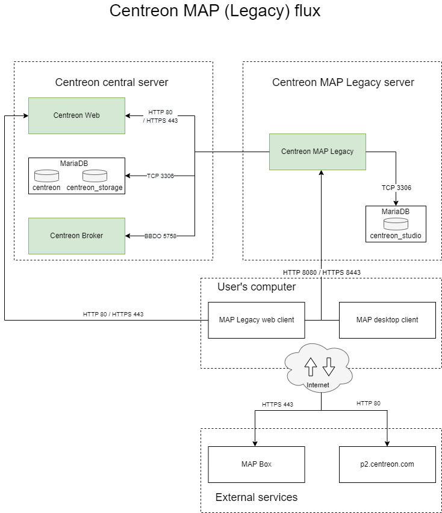
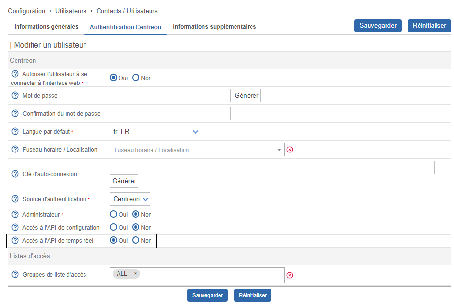
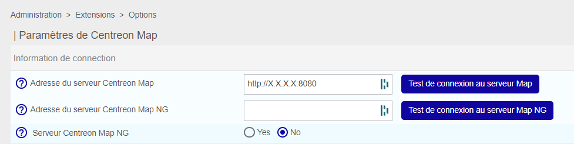
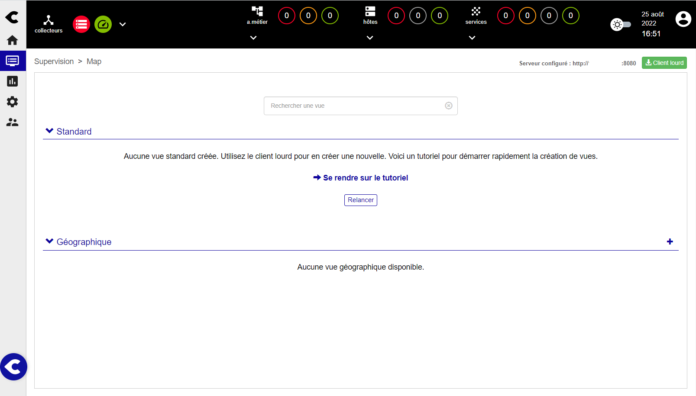
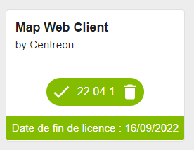

import Tabs from '@theme/Tabs';
import TabItem from '@theme/TabItem';

> Dans la mesure où MAP (Legacy) n'évoluera plus, nous vous suggérons de le remplacer par [Centreon MAP](introduction-map.md). MAP présente des avantages considérables par rapport à MAP (Legacy), notamment :
- L'éditeur web : créez et modifiez vos vues directement à partir de votre navigateur web.
- Un nouveau serveur : un tout nouveau serveur et modèle de données offrant de meilleures performances.

> Centreon MAP nécessite une clé de licence valide. Pour en acquérir une et récupérer les dépôts nécessaires, contactez [Centreon](mailto:sales@centreon.com).

Ce chapitre décrit comment installer Centreon MAP.
Le serveur doit être installé sur une machine dédiée pour permettre à Centreon MAP de fonctionner avec sa propre base de données et éviter tout conflit potentiel avec le serveur central Centreon.

Avant de procéder à l'installation, veillez à consulter le chapitre sur les prérequis pour connaître la configuration requise (CPU et mémoire).
N'oubliez pas de choisir le meilleur type d'architecture pour répondre à vos besoins.

## Architecture

Centreon MAP se compose de trois éléments :

- Le serveur Centreon MAP, développé en Java, utilisant SpringBoot, Hibernate et CXF.
- L'interface web de Centreon MAP, développée en Javascript et basée sur [Backbone.js](http://backbonejs.org/).
- Le client lourd Centreon MAP, développé en Java, basé sur [Eclipse RCP 4](https://wiki.eclipse.org/Eclipse4/RCP).

Le schéma ci-dessous résume l'architecture :



**Tableau des flux du réseau**

| Application    | Source     | Destination               | Port      | Protocole  | Objet                                                       |
|----------------|------------|---------------------------|-----------|------------|------------------------------------------------------------ |
| MAP Server     | MAP server | Centreon central broker   | 5758      | TCP        | Obtenez des mises à jour du statut en temps réel            |
| MAP Server     | MAP server | Centreon MariaDB database | 3306      | TCP        | Récupérer la configuration et d'autres données de Centreon  |
| MAP Server     | MAP server | MAP server database       | 3306      | TCP        | Stocker toutes les vues et données relatives à Centreon MAP |
| Web + Desktop  | MAP server | Centreon central          | 80/443    | HTTP/HTTPS | Authentification et récupération des données                |
| Web interface  | User       | MAP server                | 8080/8443 | HTTP/HTTPS | Récupérer les vues et le contenu                            |
| Web interface  | User       | Internet\* (Mapbox)       | 443       | HTTPS      | Récupérer les données Mapbox                                |
| Desktop client | User       | MAP server                | 8080/8443 | HTTP/HTTPS | Récupérer et créer des vues et du contenu                   |
| Desktop client | User       | Internet\* (Mapbox)       | 443       | HTTPS      | Récupérer les données Mapbox                                |
| Desktop client | User       | Internet\* (p2 repo)      | 80        | HTTP       | Récupérer la mise à jour automatique du client lourd   |

\* *Avec ou sans proxy*.

## Prérequis

### Centreon

Le serveur central et Centreon MAP doivent être installés dans les mêmes versions majeures (c'est-à-dire tous deux en 23.04.x).

### Serveur MAP Centreon

#### Licence

Le serveur nécessite que la licence soit disponible et valide sur le serveur central de Centreon.
Pour ce faire, vous devez contacter le [support Centreon](https://support.centreon.com/) pour obtenir et installer votre clé de licence.

#### Matériel

La configuration matérielle requise pour votre serveur dédié Centreon MAP est la suivante :

| *Services supervisés*          | < 10 000                | < 20 000             |  < 40 000            |  > 40 000                    |
| ------------------------------ | ----------------------- | -------------------- | -------------------- | ---------------------------- |
| *CPU*                          | 2 vCPU ( 3Ghz ) minimum | 4 CPU (3GHz) Minimum | 4 CPU (3GHz) Minimum | Demandez au support Centreon |
| *Mémoire dédiée*               | 2GB                     | 4GB                  | 8GB                  | Demandez au support Centreon |
| *Partition de données MariaDB* | 2GB                     | 5GB                  | 10GB                 | Demandez au support Centreon |

Pour implémenter correctement la mémoire dédiée, vous devez modifier le paramètre *JAVA\_OPTS* dans le fichier de configuration Centreon MAP `/etc/centreon-studio/centreon-map.conf` et redémarrer le service :

```text
JAVA_OPTS="-Xms512m -Xmx4G"
```

> La valeur Xmx dépend de la quantité de mémoire indiquée dans le tableau ci-dessus.

Redémarrez ensuite le service :

```shell
systemctl restart centreon-map
```

L'espace utilisé par le serveur Centreon MAP est directement déterminé par le nombre d'éléments que vous ajoutez dans vos vues.
Un élément est tout objet graphique dans Centreon MAP. La plupart des éléments (comme les hôtes, les groupes, etc.) ont des enfants qui doivent être inclus dans le comptage.

> Ces valeurs sont appliquées après l'optimisation des tables Centreon MAP.

#### Logiciel

Voir les [prérequis logiciels](../installation/prerequisites.md#logiciels).

#### Informations requises lors de la configuration

- Connexion à Centreon Web avec des droits d'administrateur.

> Même avec un serveur correctement dimensionné, vous devez garder à l'esprit les meilleures pratiques et recommandations lors de la création de vues afin de ne pas rencontrer de problèmes de performance.

> Si le serveur central est configuré en HTTPS, vous devez appliquer la configuration SSL sur le serveur MAP. Suivez cette [procédure](../graph-views/secure-your-map-platform.md) pour sécuriser votre serveur MAP.

### Interface Web de Centreon MAP

#### Licence

L'interface web nécessite que la licence soit disponible et valide sur le serveur central de Centreon.
Pour ce faire, vous devez contacter le [support Centreon](https://support.centreon.com/) pour obtenir et installer votre clé de licence.

**Compatibilité**

L'interface web MAP de Centreon est compatible avec les navigateurs web suivants :

* Google Chrome (dernière version au moment de la sortie du logiciel Centreon et supérieure).
  Veuillez consulter la [FAQ Google Chrome](https://support.google.com/chrome/a/answer/188447?hl=en) pour une description de la politique de support de Chrome. 
* Mozilla Firefox (dernière version au moment de la sortie du logiciel Centreon et supérieure).
  Veuillez consulter la [FAQ Mozilla](https://www.mozilla.org/en-US/firefox/organizations/faq/) pour obtenir une description de la politique d'assistance de Firefox.
* Apple Safari (dernière version au moment de la sortie du logiciel Centreon et supérieure).
* Microsoft Edge Chromium (dernière version au moment de la sortie du logiciel Centreon et supérieure).

Si une mise à jour de ces navigateurs pris en charge devait entraîner une incompatibilité, Centreon travaillerait sur un correctif dans les plus brefs délais (pour les versions de Centreon supportées).
Bien que d'autres navigateurs puissent fonctionner, Centreon ne tentera pas de résoudre les problèmes liés aux navigateurs autres que ceux énumérés ci-dessus.

La résolution de votre écran doit être d'au moins 1280 x 768.

### Centreon MAP Desktop Client

- 4 GB de RAM minimum, 8 GB conseillés (obligatoire pour 10 000 services ou plus)
- **Java 64 bits version 8**
- La résolution doit être d'au moins 1280 x 768.
- Debian 7, 8 ou 9

> Le client lourd n'est pas compatible avec Microsoft Windows Server. Si une version de Java autre que 8 est installée, installez Java 8 et modifiez le fichier Centreon-Map4.ini pour ajouter la ligne suivante : `-vm $path_to_java8$` AVANT `-vmwargs`.

Pour optimiser le client lourd, vous devez lui allouer plus de mémoire que la valeur par défaut. Modifiez le fichier suivant :

<Tabs groupId="sync">
<TabItem value="Windows" label="Windows">

```shell
C:\Users\<YOUR_USERNAME>\AppData\Local\Centreon-Map4\Centreon-Map4.ini
```

</TabItem>
<TabItem value="Linux" label="Linux">

```shell
/opt/centreon-map4-desktop-client/Centreon-Map4.ini
```

</TabItem>
</Tabs>

Et ajoutez les lignes suivantes à la fin du fichier, sur une nouvelle ligne :

```text
-Xms512m
-Xmx4g
```

### Configuration réseau

Le serveur Centreon MAP doit accéder :

- au Broker du serveur central, généralement sur la machine Centreon central, en utilisant le port TCP 5758
- à la base de données Centreon, généralement sur la machine Centreon central, en utilisant le port TCP 3306.
- à la base de données MAP Centreon, généralement sur l'hôte local, en utilisant le port TCP 3306.

Tous les ports ci-dessus sont des valeurs par défaut et peuvent être modifiés si nécessaire.

- Centreon Web Central, en utilisant le port HTTP 80 ou le port HTTPS 443

Les machines clientes Centreon MAP Desktop doivent accéder :

- au serveur Centreon MAP, en utilisant le port HTTP 8080 ou 8443 lorsque HTTPS/TLS est activé.
- à internet avec ou sans proxy.

Les ports 8080 et 8443 sont des valeurs par défaut recommandées, mais d'autres configurations sont possibles.

## Installation du serveur

### Interface web de Centreon

Vous devez fournir au serveur Centreon MAP un utilisateur dédié **qui a accès à toutes les ressources** par le biais des [groupes de listes d'accès](../administration/access-control-lists.md).
Étant donné que le mot de passe sera stocké sous une forme lisible par l'homme dans un fichier de configuration, vous ne devez pas utiliser un compte utilisateur Centreon admin.

- Allez dans **Configuration > Utilisateurs > Contacts/Utilisateurs**. Puis cliquez sur l'onglet **Authentification Centreon**.
- Définir le paramètre **Accès à l'API de temps réel** sur **Oui**.



Excluez l'utilisateur de la politique d'expiration du mot de passe sur la page **Administration > Authentification** : son mot de passe n'expirera jamais.


### Serveur central Centreon

Créez un utilisateur dans l'instance mysql hébergeant les bases de données 'centreon' et 'centreon_storage' :

```sql
CREATE USER 'centreon_map'@'<IP_SERVER_MAP>' IDENTIFIED BY 'centreon_map';
GRANT SELECT ON centreon_storage.* TO 'centreon_map'@'<IP_SERVER_MAP>';
GRANT SELECT, INSERT ON centreon.* TO 'centreon_map'@'<IP_SERVER_MAP>';
```

Le privilège INSERT ne sera utilisé que pendant le processus d'installation afin de créer une nouvelle sortie Centreon Broker. Il sera révoqué ultérieurement.

### Serveur MAP Centreon

#### Prérequis de la version Java
  > Assurez-vous qu'une version de Java 17 (ou 18) est installée avant de commencer la procédure.
  
  - Pour vérifier quelle version de Java est installée, entrez la commande suivante :
  
  ```shell
  java -version
  ```
  
  - Pour une mise à jour de Java en version 17 (ou 18), allez sur la [page officielle de téléchargement d'Oracle](https://www.oracle.com/java/technologies/downloads/#java17).

  - Si plusieurs versions de Java sont installées, vous devez activer la bonne version. Affichez les versions installées avec la commande suivante puis sélectionnez la version 17 (ou 18) :
  ```shell
  sudo update-alternatives --config java
  ```

  - Si vous souhaitez configurer votre plateforme en HTTPS, vous aurez besoin de générer un fichier keystore pour la version 17 de Java (ou 18) ([voir procédure](./secure-your-map-platform.md#configuration-httpstls-avec-une-clé-auto-signée)).

#### Procédure

Si vous avez installé votre serveur Centreon MAP à partir d'une "installation fraîche", vous devez installer le paquet `centreon-release` :

<Tabs groupId="sync">
<TabItem value="Alma / RHEL / Oracle Linux 8" label="Alma / RHEL / Oracle Linux 8">

Vous devez d'abord installer le dépôt EPEL :

```shell
dnf install -y https://dl.fedoraproject.org/pub/epel/epel-release-latest-8.noarch.rpm
```

La commande doit retourner des résultats comme suit :

```shell
Installed:
  epel-release-8-17.el8.noarch

Complete!
```

Ensuite installez le paquet **centreon-release** :

```shell
dnf config-manager --add-repo https://packages.centreon.com/rpm-standard/23.04/el8/centreon-23.04.repo
```

</TabItem>
<TabItem value="Alma / RHEL / Oracle Linux 9" label="Alma / RHEL / Oracle Linux 9">

Vous devez d'abord installer le dépôt EPEL :

```shell
dnf install -y https://dl.fedoraproject.org/pub/epel/epel-release-latest-9.noarch.rpm
```

La commande doit retourner des résultats comme suit :

```shell
Installed:
  epel-release-9-2.el9.noarch

Complete!
```

Ensuite installez le paquet **centreon-release** :

```shell
dnf config-manager --add-repo https://packages.centreon.com/rpm-standard/23.04/el9/centreon-23.04.repo
```

</TabItem>
<TabItem value="Debian 11" label="Debian 11">

Installez les dépendances suivantes :

```shell
apt update && apt install lsb-release ca-certificates apt-transport-https software-properties-common wget gnupg2
```

Pour installer le dépôt Centreon, exécutez la commande suivante :

```shell
echo "deb https://packages.centreon.com/apt-standard-23.04-stable/ $(lsb_release -sc) main" | tee /etc/apt/sources.list.d/centreon.list
echo "deb https://packages.centreon.com/apt-plugins-stable/ $(lsb_release -sc) main" | tee /etc/apt/sources.list.d/centreon-plugins.list
```

Ensuite, importez la clé du dépôt :

```shell
wget -O- https://apt-key.centreon.com | gpg --dearmor | tee /etc/apt/trusted.gpg.d/centreon.gpg > /dev/null 2>&1
```

</TabItem>
</Tabs>

> Si l'URL ne fonctionne pas, vous pouvez trouver manuellement ce paquet dans le dossier.

Installez le dépôt Centreon Business, vous pouvez le trouver sur le [portail du support](https://support.centreon.com/hc/fr/categories/10341239833105-D%C3%A9p%C3%B4ts).

Installez ensuite le serveur Centreon MAP à l'aide de la commande suivante :

<Tabs groupId="sync">
<TabItem value="Alma / RHEL / Oracle Linux 8" label="Alma / RHEL / Oracle Linux 8">

```shell
dnf install centreon-map-server
```

</TabItem>
<TabItem value="Alma / RHEL / Oracle Linux 9" label="Alma / RHEL / Oracle Linux 9">

```shell
dnf install centreon-map-server
```

</TabItem>
<TabItem value="Debian 11" label="Debian 11">

```shell
apt update
apt install centreon-map-server
```

</TabItem>
</Tabs>

Lors de l'installation du serveur Centreon MAP, java (OpenJDK 11) sera automatiquement installé, si nécessaire.

> Vous devez disposer d'une base de données MariaDB pour stocker les données de Centreon MAP, qu'elle soit sur localhost ou ailleurs.

Pour installer MariaDB, exécutez la commande suivante :

<Tabs groupId="sync">
<TabItem value="Alma / RHEL / Oracle Linux 8" label="Alma / RHEL / Oracle Linux 8">

```shell
dnf install MariaDB-client MariaDB-server
```

</TabItem>
<TabItem value="Alma / RHEL / Oracle Linux 9" label="Alma / RHEL / Oracle Linux 9">

```shell
dnf install MariaDB-client MariaDB-server
```

</TabItem>
<TabItem value="Debian 11" label="Debian 11">

```shell
apt install MariaDB-client MariaDB-server
```

</TabItem>
</Tabs>

### Configuration

Assurez-vous que la base de données qui stocke les données MAP de Centreon est optimisée (automatiquement ajoutée par le RPM dans `/etc/my.cnf.d/map.cnf`) :

```text
max_allowed_packet = 20M
innodb_log_file_size = 200M
```

Ensuite, redémarrez MariaDB :

```shell
systemctl restart mariadb
```

#### Sécuriser la base de données

Depuis MariaDB 10.5, il est obligatoire de sécuriser l'accès root de la base de données avant d'installer Centreon. Si vous utilisez une base de données locale, exécutez la commande suivante sur le serveur central :

```shell
mysql_secure_installation
```

* Répondez **oui** à toutes les questions, sauf à "Disallow root login remotely ?
* Il est obligatoire de définir un mot de passe pour l'utilisateur **root** de la base de données. Vous aurez besoin de ce mot de passe pendant l'[installation web](../installation/web-and-post-installation.md).

> Pour plus d'informations, veuillez consulter la [documentation officielle de MariaDB](https://mariadb.com/kb/en/mysql_secure_installation/).

#### Script Configure.sh

Exécutez le script de configuration du serveur MAP de Centreon. Deux modes sont disponibles : interactif ou automatique.

- interactif *(aucune option/mode par défaut)* : Plusieurs questions seront posées pour remplir de manière interactive les variables d'installation.
- automatique *(--automatic ou -a)* : L'installation se fera automatiquement à partir des valeurs définies dans le fichier `/etc/centreon-studio/vars.sh`.

Si c'est votre première installation, nous vous conseillons d'utiliser le mode standard (interactif) et de choisir **Non** lorsqu'on vous demande le mode d'installation avancé :

```shell
/etc/centreon-studio/configure.sh
```

Puis redémarrez le service **centreon-map** :

```shell
systemctl restart centreon-map
```

### Serveur central

> Avant de redémarrer Broker, vous devez exporter la configuration à partir de l'interface web de Centreon.

Redémarrez Centreon Broker sur le serveur central :

```shell
systemctl restart cbd
```

Supprimer le privilège INSERT de l'utilisateur **centreon_map** :

```sql
REVOKE INSERT ON centreon.* FROM 'centreon_map'@'<IP_SERVER_MAP>';
```

### Serveur Centreon MAP

Vérifiez votre configuration :

```shell
/etc/centreon-studio/diagnostic.sh
```

Si la configuration est correcte, le service **centreon-map** peut être lancé à partir du serveur Centreon MAP :

```shell
systemctl restart centreon-map
```

Permettez au service de démarrer automatiquement au démarrage du serveur :

```shell
systemctl enable centreon-map
```

Le serveur Centreon MAP est maintenant démarré et activé : installons la partie interface de l'extension.

## Installation de l'interface web

### Serveur central

Installez le dépôt Centreon Business : vous pouvez le trouver sur le [portail du support](https://support.centreon.com/hc/fr/categories/10341239833105-D%C3%A9p%C3%B4ts).

Ensuite, exécutez la commande suivante :

<Tabs groupId="sync">
<TabItem value="Alma / RHEL / Oracle Linux 8" label="Alma / RHEL / Oracle Linux 8">

```shell
dnf install centreon-map-web-client
```

</TabItem>
<TabItem value="Alma / RHEL / Oracle Linux 9" label="Alma / RHEL / Oracle Linux 9">

```shell
dnf install centreon-map-web-client
```

</TabItem>
<TabItem value="Debian 11" label="Debian 11">

```shell
apt update
apt install centreon-map-web-client
```

</TabItem>
</Tabs>

### Web

Allez dans **Centreon > Administration > Extensions** et cliquez sur le bouton d'installation :

- License Manager (*si pas encore installé*)
- Client Web MAP

Téléchargez la licence **map.license** donnée par l'équipe de support. Rafraîchissez la page : la bannière doit être verte et afficher la date de validité de la licence.


Cliquez sur **Back** pour revenir à la page **Extensions**. Maintenant que le module est installé, nous allons le configurer.

### Configuration

Allez à la page **Administration > Extensions > Options**, et dans le menu **Centreon MAP** mettez à jour le champ **Adresse du serveur MAP** :

> Utilisez l'adresse IP/le nom d'hôte réels de votre serveur Centreon MAP.



### Utilisation du client

L'interface Web Centreon MAP est désormais disponible dans **Monitoring > MAP**.



>Si le contenu ne s'affiche pas, vous pouvez vider le cache de votre navigateur.

Vous pouvez voir à quelle IP le client est connecté.


### Widget MAP de Centreon

En installant l'interface Web, vous ajoutez automatiquement le Widget Centreon MAP, mais vous devez effectuer une dernière tâche.
Allez dans **Administration > Extensions** et cliquez sur le bouton **Installer** du widget. Voici le résultat après installation :



## Desktop Client

### Exécutables

Le client lourd est actuellement disponible uniquement pour les plateformes **64-bit** Windows, Mac et Linux (Debian et Ubuntu).

Vous pouvez trouver les installateurs dans **Supervision > Map > Desktop Client** ou
[ici](https://download.centreon.com/?action=product&product=centreon-map&version=23.04&secKey=9ae03a4457fa0ce578379a4e0c8b51f2).

> Pour des raisons de performance, nous recommandons fortement d'avoir moins de 5 à 10 utilisateurs maximum connectés en même temps pour manipuler les vues.

### Installation

#### Sur l'ordinateur de l'utilisateur

Le client lourd nécessite **Java 8**. Vous pouvez télécharger et installer la dernière version de Java depuis [ici](https://java.com/fr/download/manual.jsp).

> Veillez à télécharger la version 64 bits. Les navigateurs sont généralement 32 bits et le site Web d'Oracle propose généralement Java 32 bits au lieu de la version 64 bits.
> Si Java est déjà installé, utilisez la commande java -version pour vérifier l'architecture. Si le 64 bits n'apparaît pas, la version est 32 bits.

> Sur une plate-forme Mac, notez que vous devez installer Oracle JDK au lieu du JRE habituellement requis.

Pour vérifier la version de Java, exécutez la commande :

```shell
java -version
```

<Tabs groupId="sync">
<TabItem value="Windows" label="Windows">

Exécutez **centreon-map4-desktop-client-xxxx.exe** :

> Vous n'avez pas besoin d'être l'administrateur de votre ordinateur pour effectuer l'installation. Tous les fichiers seront installés dans vos dossiers personnels.

Le dossier d'installation par défaut est `C:\Users\$user$\AppData\LocalCentreon-Map4`.

Vous pouvez installer le logiciel à cet emplacement sans droits d'administrateur, mais vous pouvez changer la destination en **Program files** si vous avez les droits suffisants.

Utilisez le programme d'installation pour installer correctement le logiciel et l'intégrer dans l'environnement Windows. Le programme d'installation peut également être utilisé pour le désinstaller à partir de la page de configuration dédiée de Windows.


</TabItem>
<TabItem value="Debian" label="Debian">

Téléchargez le fichier DEB fourni et exécutez la commande depuis le répertoire racine :

```shell
sudo dpkg -i centreon-map4-desktop-client*.deb
```

Vous pouvez également ouvrir le fichier DEB à l'aide du centre logiciel Ubuntu.

Vous devriez maintenant être en mesure d'exécuter Centreon-Map4.

```shell
centreon-map4
```

Vous le trouverez également dans la liste des applications installées.


</TabItem>
</Tabs>

### Mises à jour

Une fois installé, le client lourd est automatiquement maintenu à jour grâce à un système de mise à jour en ligne.
Lorsqu'il se connecte à un serveur Centreon MAP, il télécharge et installe automatiquement la dernière version compatible avec le serveur.
La mise à jour automatique nécessite que votre ordinateur ait un accès à internet.

## Sécurisez votre plateforme

N'oubliez pas de sécuriser votre plateforme Centreon en suivant nos [recommandations](secure-your-map-platform.md).
