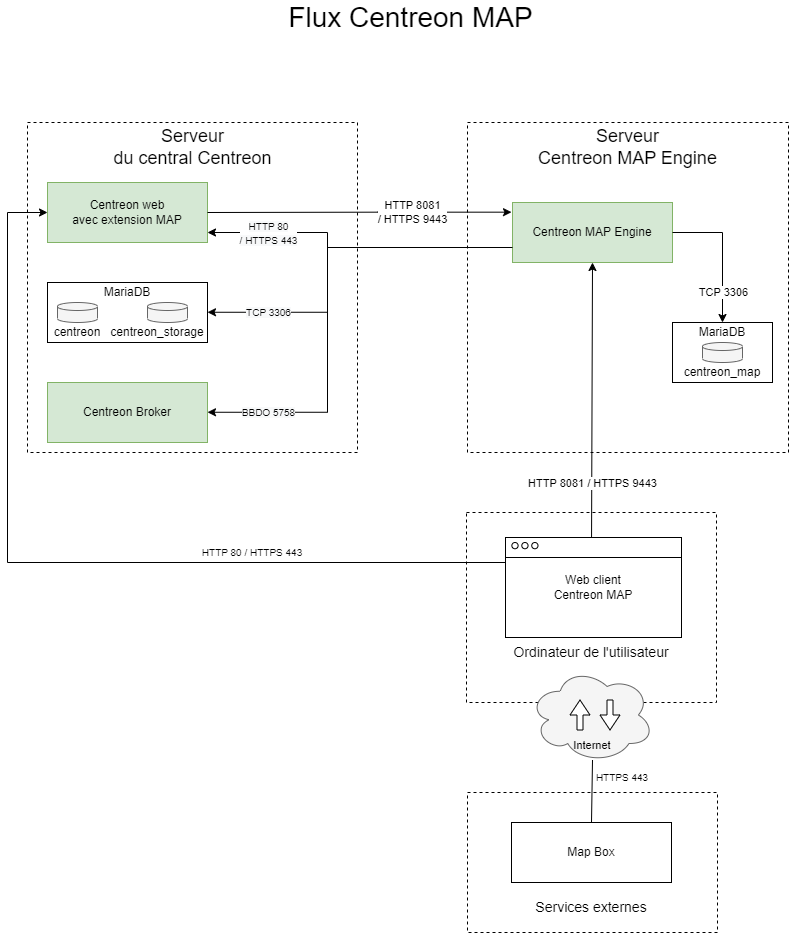
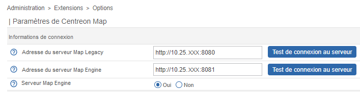

import Tabs from '@theme/Tabs';
import TabItem from '@theme/TabItem';

Cette page décrit comment installer Centreon MAP. Il est recommandé d'installer MAP sur un serveur dédié. Toutefois, si vous ne disposez pas de gros volumes de données, vous pouvez l'installer sur le serveur central.

> Note aux utilisateurs de la version MAP (Legacy) : le module MAP ne nécessite pas la base de données **centreon_studio** (utilisée pour un serveur MAP Legacy). Cette base de données peut être supprimée après la [migration de vos anciennes cartes (Legacy) vers MAP](./import-into-map-web.md). Attention, il n'est pas possible de migrer de MAP vers MAP (Legacy).

## Licence

Si vous avez besoin d'une [licence](../administration/licenses.md) supplémentaire pour Centreon MAP, veuillez contacter l'[équipe support de Centreon](https://support.centreon.com/) pour obtenir et installer votre clé de licence.

## Architecture

Le schéma ci-dessous décrit l'architecture de MAP.

- Vous pouvez installer Centreon MAP soit sur un serveur dédié, soit sur le serveur central.
- Centreon MAP ne nécessite aucune installation sur votre machine : cette solution est entièrement disponible dans l'interface web Centreon.



**Tableau des flux du réseau**


| Application    | Source     | Destination               | Port      | Protocole  | Objet                                                       |
|----------------|------------|---------------------------|-----------|------------|------------------------------------------------------------ |
| MAP Server     | MAP server | Centreon central broker   | 5758      | TCP        | Obtenez des mises à jour du statut en temps réel            |
| MAP Server     | MAP server | Centreon MariaDB database | 3306      | TCP        | Récupérer la configuration et d'autres données de Centreon  |
| MAP Server     | MAP server | MAP server database       | 3306      | TCP        | Stocker toutes les vues et données relatives à Centreon MAP |
| Web            | MAP server | Centreon central          | 80/443    | HTTP/HTTPS | Authentification et récupération des données                |
| Web interface  | User       | MAP server                | 8081/9443 | HTTP/HTTPS | Récupérer les vues et le contenu                            |
| Web interface  | User       | Internet\* (Mapbox)       | 443       | HTTPS      | Récupérer les données Mapbox                                |

\**Avec ou sans proxy*

## Prérequis

### Serveur Centreon MAP Engine

#### Licence

Le serveur nécessite que la licence soit disponible et valide sur le serveur central de Centreon. Pour ce faire, vous devez contacter le [support Centreon](https://support.centreon.com/) pour obtenir et installer votre clé de licence.

#### Logiciel

Voir les [prérequis logiciels](../installation/prerequisites.md#logiciels).

#### Matériel

<Tabs groupId="sync">
<TabItem value="Jusqu'à 500 hôtes" label="Jusqu'à 500 hôtes">

| Élément                     | Valeur    |
| ----------------------------| --------- |
| CPU    | 2 vCPU    |
| RAM                         | 4 Go      |

Votre serveur MAP doit être partitionné de la manière suivante :

| Groupe de volumes (LVM) | Partition               | Description | Taille                                                     |
|-| ----------------------------|-------------|----------------------------------------------------------|
| | /boot | images de boot | 1 Go |
|  vg_root | /                          | racine du système            | 20 Go                                |
| vg_root | swap                       | swap | 4 Go                               |
| vg_root | /var/log                   | contient tous les fichiers de log | 10 Go                                |
| vg_data | /var/lib/mysql  | base de données | 5 Go                              |
| vg_data |   | Espace libre (non alloué) | 2 Go                              |

</TabItem>
<TabItem value="Jusqu'à 1 000 hôtes" label="Jusqu'à 1 000 hôtes">

| Élément                     | Valeur    |
| ----------------------------| --------- |
| CPU    | 4 vCPU    |
| RAM                         | 4 Go      |

Votre serveur MAP doit être partitionné de la manière suivante :

| Groupe de volumes (LVM) | Partition               | Description | Taille                                                     |
|-| ----------------------------|-------------|----------------------------------------------------------|
| | /boot | images de boot | 1 Go |
|  vg_root | /                          | racine du système            | 20 Go                                |
| vg_root | swap                       | swap | 4 Go                               |
| vg_root | /var/log                   | contient tous les fichiers de log | 10 Go                                |
| vg_data | /var/lib/mysql  | base de données | 5 Go                              |
| vg_data |   | Espace libre (non alloué) | 2 Go                              |


</TabItem>
<TabItem value="Jusqu'à 2 500 hôtes" label="Jusqu'à 2 500 hôtes">

| Élément                     | Valeur    |
| ----------------------------| --------- |
| CPU    | 4 vCPU    |
| RAM                         | 10 Go      |

Votre serveur MAP doit être partitionné de la manière suivante :

| Groupe de volumes (LVM) | Partition               | Description | Taille                                                     |
|-| ----------------------------|-------------|----------------------------------------------------------|
| | /boot | images de boot | 1 Go |
|  vg_root | /                          | racine du système            | 20 Go                                |
| vg_root | swap                       | swap | 4 Go                               |
| vg_root | /var/log                   | contient tous les fichiers de log | 10 Go                                |
| vg_data | /var/lib/mysql  | base de données | 5 Go                              |
| vg_data |   | Espace libre (non alloué) | 2 Go                              |


</TabItem>
<TabItem value="Jusqu'à 5 000 hôtes" label="Jusqu'à 5 000 hôtes">

| Élément                     | Valeur    |
| ----------------------------| --------- |
| CPU    | 4 vCPU    |
| RAM                         | 18 Go      |

Votre serveur MAP doit être partitionné de la manière suivante :

| Groupe de volumes (LVM) | Partition               | Description | Taille                                                     |
|-| ----------------------------|-------------|----------------------------------------------------------|
| | /boot | images de boot | 1 Go |
|  vg_root | /                          | racine du système            | 20 Go                                |
| vg_root | swap                       | swap | 4 Go                               |
| vg_root | /var/log                   | contient tous les fichiers de log | 10 Go                                |
| vg_data | /var/lib/mysql  | base de données | 5 Go                              |
| vg_data |   | Espace libre (non alloué) | 2 Go                              |

</TabItem>
<TabItem value="Jusqu'à 10 000 hôtes" label="Jusqu'à 10 000 hôtes">

| Élément                     | Valeur    |
| ----------------------------| --------- |
| CPU    | 6 vCPU    |
| RAM                         | 18 Go      |

Votre serveur MAP doit être partitionné de la manière suivante :

| Groupe de volumes (LVM) | Partition               | Description | Taille                                                     |
|-| ----------------------------|-------------|----------------------------------------------------------|
| | /boot | images de boot | 1 Go |
|  vg_root | /                          | racine du système            | 20 Go                                |
| vg_root | swap                       | swap | 4 Go                               |
| vg_root | /var/log                   | contient tous les fichiers de log | 10 Go                                |
| vg_data | /var/lib/mysql  | base de données | 5 Go                              |
| vg_data |   | Espace libre (non alloué) | 2 Go                              |

</TabItem>
<TabItem value="Plus de 10 000 hôtes" label="Plus de 10 000 hôtes">

Pour de grosses volumétries de données, contactez votre commercial Centreon.

</TabItem>
</Tabs>

#### Mémoire pour Java

Pour implémenter correctement la mémoire dédiée :

1. Modifiez le paramètre **JAVA_OPTS** dans le fichier de configuration Centreon MAP
`/etc/centreon-map/centreon-map.conf`:

   ```text
   JAVA_OPTS="-Xms512m -Xmx4G"
   ```

   > La valeur Xmx dépend de la quantité de mémoire indiquée dans les tableaux dans la section [Matériel](#matériel).

2. Redémarrez le service :

   ```shell
   systemctl restart centreon-map-engine
   ```

#### Informations requises lors de la configuration

- Connexion à Centreon Web avec des droits d'administrateur.

> Même avec un serveur correctement dimensionné, vous devez garder à l'esprit les meilleures pratiques et recommandations lors de la création de vues afin de ne pas rencontrer de problèmes de performance.

> Si le serveur central est configuré en HTTPS, vous devez appliquer la configuration SSL sur le serveur MAP. Suivez cette [procédure](../graph-views/secure-your-map-platform.md) pour sécuriser votre serveur MAP.

### Client web de Centreon MAP

#### Licence

Le serveur nécessite que la licence soit disponible et valide sur le serveur central de Centreon. Pour ce faire, vous devez contacter le [support Centreon](https://support.centreon.com/) pour obtenir et installer votre clé de licence.

#### Compatibilité

Notez que l'interface web de MAP a les mêmes prérequis que l'interface web Centreon. Voir les prérequis pour la compatibilité des navigateurs web [ici](../installation/prerequisites.md).

## Installation du serveur MAP Engine

### Étape 1 : définir les paramètres d'authentification

Vous devez fournir au serveur Centreon MAP Engine un utilisateur dédié **qui a accès à toutes les ressources** par le biais des [groupes de listes d'accès](../administration/access-control-lists.md).
Étant donné que le mot de passe sera stocké sous une forme lisible par l'homme dans un fichier de configuration, vous ne devez pas utiliser un compte utilisateur Centreon admin.

- Connectez-vous à Centreon et allez dans **Configuration > Utilisateurs > Contacts/Utilisateurs**. Puis cliquez sur l'onglet **Authentification Centreon**.
- Définir le paramètre **Accès à l'API de temps réel** sur **Oui**.


Excluez l'utilisateur de la politique d'expiration du mot de passe sur la page **Administration > Authentification** : son mot de passe n'expirera jamais.


### Étape 2 : créer un utilisateur MySQL

Créez un utilisateur dans l'instance mysql hébergeant les bases de données **centreon** et **centreon_storage** :

```sql
CREATE USER 'centreon_map'@'<IP_SERVER_MAP>' IDENTIFIED BY 'centreon_map';
GRANT SELECT ON centreon_storage.* TO 'centreon_map'@'<IP_SERVER_MAP>';
GRANT SELECT, INSERT ON centreon.* TO 'centreon_map'@'<IP_SERVER_MAP>';
```

Le privilège INSERT ne sera utilisé que pendant le processus d'installation afin de créer une nouvelle sortie Centreon Broker. Il sera révoqué ultérieurement.

### Étape 3 : installer le serveur MAP Engine

#### Prérequis de la version Java
  > Assurez-vous qu'une version de Java 17 (ou 18) est installée avant de commencer la procédure.
  
  - Pour vérifier quelle version de Java est installée, entrez la commande suivante :
  
  ```shell
  java -version
  ```
  
  - Pour une mise à jour de Java en version 17 (ou 18), allez sur la [page officielle de téléchargement d'Oracle](https://www.oracle.com/java/technologies/downloads/#java17).

  - Si plusieurs versions de Java sont installées, vous devez activer la bonne version. Affichez les versions installées avec la commande suivante puis sélectionnez la version 17 (ou 18) :
  ```shell
  sudo update-alternatives --config java
  ```

  - Si vous souhaitez configurer votre plateforme en HTTPS, vous aurez besoin de générer un fichier keystore pour la version 17 de Java (ou 18) ([voir procédure](./secure-your-map-platform.md#configuration-httpstls-avec-une-clé-auto-signée)).

#### Procédure

Si vous installez votre serveur Centreon MAP à partir d'une "installation CentOS fraîche", vous devez installer le paquet **centreon-release** :

<Tabs groupId="sync">
<TabItem value="Alma / RHEL / Oracle Linux 8" label="Alma / RHEL / Oracle Linux 8">

Vous devez d'abord installer le dépôt EPEL :

```shell
dnf install -y https://dl.fedoraproject.org/pub/epel/epel-release-latest-8.noarch.rpm
```

La commande doit retourner des résultats comme suit :

```shell
Installed:
  epel-release-8-17.el8.noarch

Complete!
```

Ensuite installez le paquet **centreon-release** :

```shell
dnf config-manager --add-repo https://packages.centreon.com/rpm-standard/23.04/el8/centreon-23.04.repo
```

</TabItem>
<TabItem value="Alma / RHEL / Oracle Linux 9" label="Alma / RHEL / Oracle Linux 9">

Vous devez d'abord installer le dépôt EPEL :

```shell
dnf install -y https://dl.fedoraproject.org/pub/epel/epel-release-latest-9.noarch.rpm
```

La commande doit retourner des résultats comme suit :

```shell
Installed:
  epel-release-9-2.el9.noarch

Complete!
```

Ensuite installez le paquet **centreon-release** :

```shell
dnf config-manager --add-repo https://packages.centreon.com/rpm-standard/23.04/el9/centreon-23.04.repo
```

</TabItem>
<TabItem value="Debian 11" label="Debian 11">

Installez les dépendances suivantes :

```shell
apt update && apt install lsb-release ca-certificates apt-transport-https software-properties-common wget gnupg2
```

Pour installer le dépôt Centreon, exécutez la commande suivante :

```shell
echo "deb https://packages.centreon.com/apt-standard-23.04-stable/ $(lsb_release -sc) main" | tee /etc/apt/sources.list.d/centreon.list
```

Ensuite, importez la clé du dépôt :

```shell
wget -O- https://apt-key.centreon.com | gpg --dearmor | tee /etc/apt/trusted.gpg.d/centreon.gpg > /dev/null 2>&1
```

</TabItem>
</Tabs>

> Si l'URL ne fonctionne pas, vous pouvez trouver manuellement ce paquet dans le dossier.

Installez le dépôt Centreon MAP, vous pouvez le trouver sur le [portail du support](https://support.centreon.com/s/repositories).

Installez ensuite le serveur Centreon MAP Engine à l'aide de la commande suivante :

<Tabs groupId="sync">
<TabItem value="Alma / RHEL / Oracle Linux 8" label="Alma / RHEL / Oracle Linux 8">

```shell
dnf install centreon-map-engine
```

</TabItem>
<TabItem value="Alma / RHEL / Oracle Linux 9" label="Alma / RHEL / Oracle Linux 9">

```shell
dnf install centreon-map-engine
```

</TabItem>
<TabItem value="Debian 11" label="Debian 11">

```shell
apt update
apt install centreon-map-engine
```

</TabItem>
</Tabs>

Lors de l'installation du serveur Centreon MAP Engine, java (OpenJDK 11) sera automatiquement installé, si nécessaire.

> Vous devez disposer d'une base de données MariaDB pour stocker les données de Centreon MAP, sauf si elle a déjà été créée côté central.

Pour installer MariaDB, exécutez la commande suivante :

<Tabs groupId="sync">
<TabItem value="Alma / RHEL / Oracle Linux 8" label="Alma / RHEL / Oracle Linux 8">

```shell
dnf install MariaDB-client MariaDB-server
```

</TabItem>
<TabItem value="Alma / RHEL / Oracle Linux 9" label="Alma / RHEL / Oracle Linux 9">

```shell
dnf install MariaDB-client MariaDB-server
```

</TabItem>
<TabItem value="Debian 11" label="Debian 11">

```shell
apt install MariaDB-client MariaDB-server
```

</TabItem>
</Tabs>

### Étape 4 : vérifier la configuration de la base de données

Assurez-vous que la base de données qui stocke les données MAP de Centreon est optimisée (automatiquement ajoutée par le RPM dans `/etc/my.cnf.d/map.cnf`) :

```text
max_allowed_packet = 20M
innodb_log_file_size = 200M
```

Ensuite, redémarrez MariaDB :

```shell
systemctl restart mariadb
```

Depuis MariaDB 10.5, il est obligatoire de sécuriser l'accès root de la base de données avant d'installer Centreon. Si vous utilisez une base de données locale, exécutez la commande suivante sur le serveur central :

```shell
mysql_secure_installation
```

* Répondez **oui** à toutes les questions, sauf à "Disallow root login remotely?
* Il est obligatoire de définir un mot de passe pour l'utilisateur **root** de la base de données. Vous aurez besoin de ce mot de passe pendant l'[installation web](../installation/web-and-post-installation.md).

> Pour plus d'informations, veuillez consulter la [documentation officielle de MariaDB](https://mariadb.com/kb/en/mysql_secure_installation/).

### Étape 5 - optionnelle : si MAP Engine et MAP Legacy sont installés sur le même serveur

> Si vous disposez déjà de MAP Legacy et que vous installez MAP Engine sur le même serveur, vous devez exécuter la procédure suivante. Sinon, passez à l'étape [Exécuter le script configure.sh](#étape-6--exécuter-le-script-configuresh).

Cette procédure permet de s'assurer que le fichier de configuration peut être utilisé à la fois pour MAP Engine et MAP Legacy.

<Tabs groupId="sync">
<TabItem value="Alma / RHEL / Oracle Linux 8" label="Alma / RHEL / Oracle Linux 8">

1. Faites une sauvegarde du fichier **/etc/my.cnf.d/map.cnf** :

  ```shell
  cp map.cnf map.cnf.bk
  ```

2. Exécutez le script de configuration du serveur Centreon MAP Engine.

  Deux modes sont disponibles :
   - Interactif *(aucune option/mode par défaut)* : plusieurs questions seront posées pour remplir de manière interactive les variables d'installation.
   - Automatique *(--automatic ou -a)* : l'installation se fera automatiquement à partir des valeurs définies dans le fichier `/etc/centreon-map/vars.sh`.
  
  Si c'est votre première installation, nous vous conseillons d'utiliser le mode standard (interactif) et de choisir **Non** lorsqu'on vous demande le mode d'installation avancé :
    
   ```shell
   /etc/centreon-map/configure.sh
  ```

3. Récupérez la sauvegarde du fichier de configuration :
  
  ```shell
  cp map.cnf.bk map.cnf
  ```
  
  Répondez **Y**. Ensuite redémarrez MySQL:

  ```shell
  systemctl restart mysql
  ```

</TabItem>
<TabItem value="Alma / RHEL / Oracle Linux 9" label="Alma / RHEL / Oracle Linux 9">

1. Faites une sauvegarde du fichier **/etc/my.cnf.d/map.cnf** :

  ```shell
  cp map.cnf map.cnf.bk
  ```

2. Exécutez le script de configuration du serveur Centreon MAP Engine.

  Deux modes sont disponibles :
   - Interactif *(aucune option/mode par défaut)* : plusieurs questions seront posées pour remplir de manière interactive les variables d'installation.
   - Automatique *(--automatic ou -a)* : l'installation se fera automatiquement à partir des valeurs définies dans le fichier `/etc/centreon-map/vars.sh`.
  
  Si c'est votre première installation, nous vous conseillons d'utiliser le mode standard (interactif) et de choisir **Non** lorsqu'on vous demande le mode d'installation avancé :
    
   ```shell
   /etc/centreon-map/configure.sh
  ```

3. Récupérez la sauvegarde du fichier de configuration :
  
  ```shell
  cp map.cnf.bk map.cnf
  ```
  
  Répondez **Y**. Ensuite redémarrez MySQL:

  ```shell
  systemctl restart mysql
  ```

</TabItem>
<TabItem value="Debian 11" label="Debian 11">

1. Faites une sauvegarde du fichier **/etc/mysql/my.cnf** :

  ```shell
  cp my.cnf my.cnf.bk
  ```

2. Exécutez le script d'installation :
  
  ```shell
  apt-get -o Dpkg::Options::="--force-overwrite" install centreon-map-engine
  ```

3. Récupérez la sauvegarde du fichier de configuration :
  
  ```shell
  cp my.cnf.bk my.cnf
  ```
  
  Répondez **Y**. Ensuite redémarrez MySQL :

  ```shell
  systemctl restart mysql
  ```

4. Puis redémarrez le service **centreon-map-engine** :
  
  ```shell
  systemctl restart centreon-map-engine
  ```
  
</TabItem>
</Tabs>

> Vous pouvez maintenant passer à l'étape [Redémarrer Centreon Broker](#étape-7--redémarrer-centreon-broker).

### Étape 6 : exécuter le script configure.sh

Exécutez le script de configuration du serveur MAP de Centreon. Deux modes sont disponibles : interactif ou automatique.

- Interactif *(aucune option/mode par défaut)* : plusieurs questions seront posées pour remplir de manière interactive les variables d'installation.
- Automatique *(--automatic ou -a)* : l'installation se fera automatiquement à partir des valeurs définies dans le fichier `/etc/centreon-map/vars.sh`.

Si c'est votre première installation, nous vous conseillons d'utiliser le mode standard (interactif) et de choisir **Non** lorsqu'on vous demande le mode d'installation avancé :

```shell
/etc/centreon-map/configure.sh
```

Puis redémarrez le service **centreon-map-engine** :

```shell
systemctl restart centreon-map-engine
```

### Étape 7 : redémarrer Centreon Broker

> Avant de redémarrer Broker, vous devez exporter la configuration à partir de l'interface web de Centreon.

Redémarrez Centreon Broker sur le serveur central :

```shell
systemctl restart cbd
```

Supprimer le privilège INSERT de l'utilisateur **centreon_map** :

```sql
REVOKE INSERT ON centreon.* FROM 'centreon_map'@'<IP_SERVER_MAP>';
```

### Étape 8 : vérifier la configuration

Vérifiez la configuration du serveur MAP Engine avec cette commande :

```shell
/etc/centreon-map/diagnostic.sh
```

> En cas d'erreur, consultez la section **Lancement de l'outil de diagnostic** à la page [Dépannage de MAP](map-web-troubleshooting.md#exécuter-notre-outil-de-diagnostic).

Si la configuration est correcte, le service **centreon-map-engine** peut être lancé à partir du serveur Centreon MAP (Legacy) :

```shell
systemctl restart centreon-map-engine
```

Permettez au service de démarrer automatiquement au démarrage du serveur :

```shell
systemctl enable centreon-map-engine
```

Le serveur Centreon MAP est maintenant démarré et activé : installons la partie interface de l'extension.

## Installation du client web MAP

### Étape 1 : installer le dépôt Business

Installez le dépôt de Centreon MAP : vous pouvez le trouver sur le [portail du support](https://support.centreon.com/s/repositories).

### Étape 2 : installer le module MAP

1. Depuis votre terminal, entrez la commande suivante :

  <Tabs groupId="sync">
  <TabItem value="Alma / RHEL / Oracle Linux 8" label="Alma / RHEL / Oracle Linux 8">

  ```shell
  sudo dnf install centreon-map-web-client
  ```

  </TabItem>
  <TabItem value="Alma / RHEL / Oracle Linux 9" label="Alma / RHEL / Oracle Linux 9">

  ```shell
  sudo dnf install centreon-map-web-client
  ```

  </TabItem>
  <TabItem value="Debian" label="Debian">

  ```shell
  sudo apt install centreon-map-web-client
  ```

  </TabItem>
  </Tabs>

2. Vous devez ensuite vous connecter à l'interface web Centreon.

3. Allez dans **Administration > Extensions > Gestionnaire** et installez le module **Map Web Client**.

### Étape 3 : activer le module MAP

Par défaut, le module MAP n'est pas activé. Suivez cette procédure pour l'activer.

1. Connectez-vous à l'interface Centreon et allez à la page **Administration > Extensions > Map > Options**.
  

2. Dans la section **Informations de connexion**, définissez **Serveur Map Engine** sur **Oui**.

3. Saisissez l'adresse IP de votre serveur MAP dans le champ **Adresse du serveur Map Engine**. Si vous avez installé MAP sur le serveur central, il s'agit de l'adresse IP du serveur central. Utilisez son adresse IP complète, et non l'adresse locale (localhost). Le port par défaut est 8081. Par exemple : ``http://10.25.xxx:8081``.

4. Cliquez sur le bouton **Test de connexion au serveur** pour tester la connexion. Ce test doit retourner le message **Test de connexion réussi**.

5. Cliquez sur **Sauvegarder**.

6. Allez dans **Configuration > Collecteurs > Collecteurs**. [Déployez la configuration](../monitoring/monitoring-servers/deploying-a-configuration.md) du serveur central (en utilisant la méthode **Recharger**).

7. Depuis le terminal, redémarrez le service cbd :

  ```shell
  systemctl restart cbd
  ```

8. Maintenant que la configuration est correcte, vous pouvez démarrer le serveur en exécutant cette commande :

  ```shell
  systemctl start centreon-map-engine
  ```

9. Exécutez la commande suivante pour vérifier que le service **centreon-map-engine** est correctement démarré :
  
  ```shell
  systemctl status centreon-map-engine
  ```
  
  Voici un exemple de résultat :
  
  ```shell
  ● centreon-map-engine.service - Centreon Studio map server
   Loaded: loaded (/usr/lib/systemd/system/centreon-map-engine.service; disabled; vendor preset: disabled)
   Active: active (running) since Thu 2022-11-24 09:10:58 UTC; 6h ago
 Main PID: 39103 (centreon-map-en)
    Tasks: 50 (limit: 23465)
   Memory: 598.1M
   CGroup: /system.slice/centreon-map-engine.service
           ├─39103 /bin/bash /usr/share/centreon-map-engine/bin/centreon-map-engine
           └─39119 /usr/bin/java -Dsun.misc.URLClassPath.disableJarChecking=true -XX:+HeapDumpOnOutOfMemoryError -XX:HeapDumpPath=/var/log/centreon-map
  ```

Vous pouvez maintenant utiliser le module MAP en accédant à la page **Supervision > Map**.

- Suivez cette [procédure](../administration/secure-platform.md) pour sécuriser votre plateforme Centreon.
- Suivez cette [procédure](../graph-views/secure-your-map-platform.md) pour sécuriser MAP.
