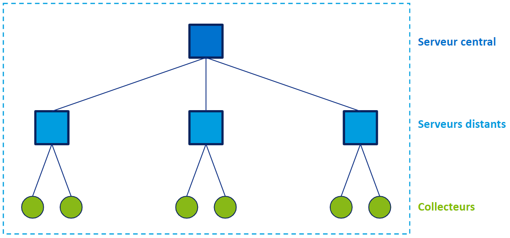

import Tabs from '@theme/Tabs';
import TabItem from '@theme/TabItem';

Si vous ne supervisez qu'un petit nombre d'hôtes et de services, un serveur central est suffisant. Cependant, si vous supervisez un grand nombre d'hôtes et de services, vous devrez distribuer la charge sur plusieurs serveurs.

> Si vous ne connaissez pas les termes "serveur distant" et "collecteur", voyez [Éléments d'une plateforme Centreon](../getting-started/platform.md).

## Architectures disponibles

### Serveur central seul

Si vous ne supervisez que peu d'hôtes, vous n'aurez besoin que d'un serveur central. Le serveur central effectuera toute la supervision lui-même.

### Architecture distribuée

Une architecture distribuée consiste en :

* Un serveur central qui permet de configurer la supervision, d'afficher les données collectées et d'agir dessus.
* Un ou plusieurs collecteurs qui permettent d'afficher les données collectées et d'agir dessus.

et/ou

* Un ou plusieurs collecteurs, qui collectent les données

Exemple d'architecture distribuée avec 3 serveurs distants et 6 collecteurs. Notez qu'un collecteur peut aussi être rattaché directement à un serveur central.

### SGBD déporté

Votre serveur central peut avoir une base de données déportée. Une architecture avec base de données déportée consiste en :

* Un serveur central qui permet de configurer la supervision, d'afficher les données collectées et d'agir dessus.
* Un serveur de base de données chargé de stocker toutes les données collectées
* En option, un ou plusieurs serveurs distants/collecteurs qui collectent des données.

## De quel type d'architecture avez-vous besoin ?

Lorsque vous construirez votre plateforme Centreon, gardez les points suivants à l'esprit :

* Le nombre d'hôtes à superviser n'est pas suffisant pour déterminer la taille de votre plateforme. Vous devrez également prendre en compte le nombre de services par hôtes, ainsi que le nombre de métriques par service.
* Un autre critère à prendre en compte est si vous devez utiliser des collecteurs ou des serveurs distants pour séparer vos ressources suivant des critères géographiques ou logiques. Exemple : Si votre plateforme doit superviser une DMZ, il est plus simple (et plus sûr) de placer un serveur distant dans le réseau de la DMZ.
* Un serveur central ne doit superviser qu'un petit nombre d'hôtes et de services, car son CPU doit d'abord gérer les données en provenance des serveurs distants et des collecteurs (la remarque est également vraie pour des serveurs distants). Plus vous supervisez d'hôtes et de services sur votre serveur central, plus il existe de risque que l'interface soit ralentie, car le moteur de supervision utilisera plus de ressources.
* Le serveur central doit superviser tous les serveurs distants et les collecteurs de votre architecture.
* Le serveur central doit être supervisé par un collecteur ou un serveur distant.
* Utilisez un serveur distant au lieu d'un collecteur si vous avez besoin de visulaser des données sur un site autre que celui du serveur central.
